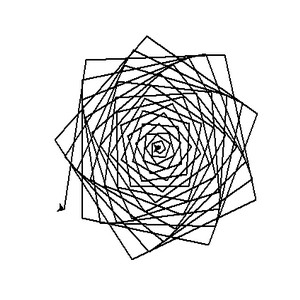
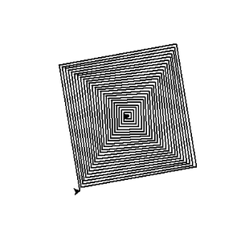
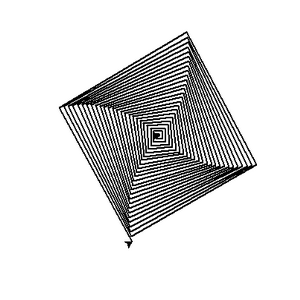

```
Created on Thu May  9 22:24:01 2019

@author: molychin@qq.com
```

### Moly-NaturePatterns 001

基本的生成规则，一个人，从他站的地方开始步行，第一次，向前走2步，然后停下，向左(left)转身，转过一个固定的角度（N度，例如89度）；然后重复上述过程，即向前走2*2=4步，然后停下，向左转身，转过N度（依然89度）；然后再重复上述过程化...唯一有变化的是每次走过的长度（距离）都是转身数的2倍。从第一次开始算，即2、4、6、8、10...

|left=71|left=72|left=72.5|
|:---:|:---:|:---:|
||||
|left=73|left=74|left=79|
||||
|left=80|left=81|left=85|
||||
|left=88|left=89|left=90|
||||
|left=90.1|left=90.2|left=90.3|
||||
|left=90.5|left=91|left=92|
||||
|left=93|left=95|left=100|
||||
|left=110|left=115|left=117|
||||
|left=118|left=119|left=119.5|
||||
|left=120|left=121|left=130|
||||


最初的几步：  
left=89  


##### 生成上述图像的python源代码
```python
print("Working...")
import turtle
t = turtle.Pen()
#turtle.Turtle().screen.delay(0)   #绘画没有延迟
t.width(2)
for x in range(100):
    t.forward(x*2)
    t.left(89)        
```
