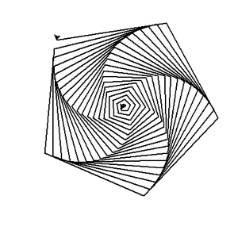
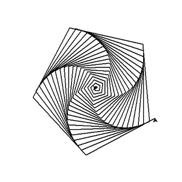
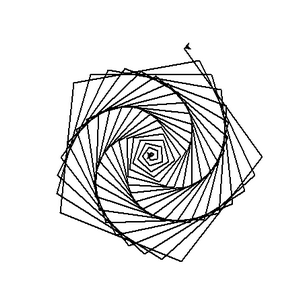
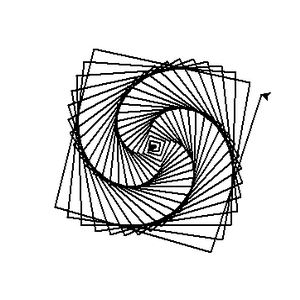
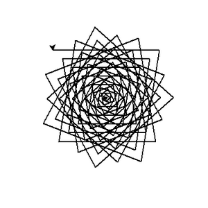
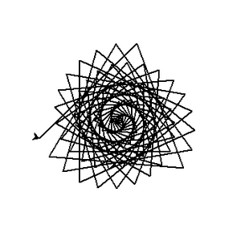
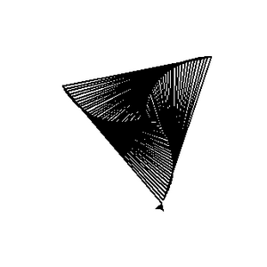

```
Created on Thu May  9 22:24:01 2019
pattern in nature
Moly_NaturePatterns_footmark
@author: molychin@qq.com
```

### 沙漠迷途者的足迹

我们听说，当一个人行走在一片没有任何方向标志物的沙漠（无人区）时，他为了最快（最短路径）地走出这片荒芜的危险地带，他会选择对准一个方向一直（直线）前行。但因为没有标识物的引导并且由于人类双足生理的原因，他走路的重心会偏向某个脚。他留下的足迹会自然形成一个图形。那么，可能是怎样的图形呢？也许有人会猜测，最有可能是圆形或者椭圆形或者。。。

我们可以利用计算机来模拟一下可能的足迹图形，设定的简单模型规则是：一个人，从他站的地方开始步行，第一次，向前走20步，然后停下，向左(left)转身，转过一个固定的角度（A度，例如89度）；第二次，继续向前走20步，然后停下，向左(left)转身，转过一个固定的角度（A度，例如89度）；然后再重复上述过程，直到你想让它停下为止（一般都要设定重复的次数，否则会造成无限循环）。

那么，可能是图形会是如下的图形：

|||
|:---:|:---:|
|||
|||
|||
|||


也许我们可以稍微修改一下游戏规则。


我们在这里可以做一个简单的假设模型，基本的生成规则是：一个人，从他站的地方开始步行，第一次，向前走20步，然后停下，向左(left)转身，转过一个固定的角度（A度，例如89度）；第二次，向前走20×2=4步，然后停下，再向左(left)转身，转过一个固定的角度（A度，例如89度）；然后继续重复上述过程，第N次，即向前走2×N步，然后停下，向左转身，转过A度（依然89度）；然后再重复上述过程化...唯一有变化的是每次走过的长度（距离）都是2乘以转身数。从第一次开始算，即20、40、60、80、100...

**最初的几轮重复：**

转身的角度：left=89  


初看起来也是平淡无奇，但我总感觉一般人类的智力水平是比较低的，虽然不至于说数字超过3的就不会计算（据说有个原始部落，凡是物体数量超过3个的，就只会说“很多”，“很多很多”。但你也不用嘲笑他们，对于你来说，如果看到一群鸭子，数量超过多少，你会说很多，很多很多？）。所以，我们不能简单假设可以预知一个沙漠的迷途者，在他生死存亡间，可以走出什么样的轨迹。当然，我们这里只是假设，理想化游戏的规则。这种简化，主要还是处于可以明晰问题的答案，而并非出于懒惰。

逻辑推理（计算）的深度，会直接影响我们对事物在反复运行一段规则后出现的结果的判断，新近出现的（围棋）AI正在证实这个结论，即我们永远不要低估施加于简单规则之上的最终结果到底会是什么。下面，我们就来看看当N=100时，（即迷途者在转身100次后），他的轨迹会是什么形状。其中的left参数表示每次转身的固定角度。

|left=71|left=72|left=72.5|
|:---:|:---:|:---:|
||||
|left=73|left=74|left=79|
||||
|left=80|left=81|left=85|
||||
|left=88|left=89|left=90|
||||
|left=90.1|left=90.2|left=90.3|
||||
|left=90.5|left=91|left=92|
||||
|left=93|left=95|left=100|
||||
|left=110|left=115|left=117|
||||
|left=118|left=119|left=119.5|
||||
|left=120|left=121|left=130|
||||

对于以上呈现的图案，你的第一反映也许这是某个设计师精心策划的结果，而非来自于大自然一个很简单的徘徊过程化。为了打消你的疑虑，我们可以来看一个实际的来自于大自然的例子（花瓣的形态）。


自然界中真实的案例（大致接近的原理）  


我们虽然不能说，上述的花瓣图案和“沙漠迷途者的足迹”是同一套生成规则，即使不完全相同，但也是基本相同。

为了给大家更可靠的证据和自我演示的方便，这里提供了生成“足迹”的PYTHON语言代码，只要你有足够的兴趣，你都可以根据我提供的参数，完美的重演上述的图案。

##### 生成上述图像的python源代码
```python
"""
Created on Wed Jun  5 13:59:28 2019
code/footprint.py
@author: molychin
"""
print("Working...")
import turtle
t = turtle.Pen()
#turtle.Turtle().screen.delay(0)   #绘画没有延迟
t.width(2)
for x in range(100):
    t.forward(x*2)
    t.left(89)   #left=89     
```


>end.
