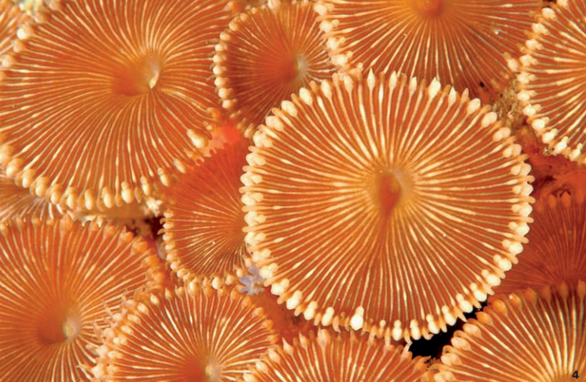
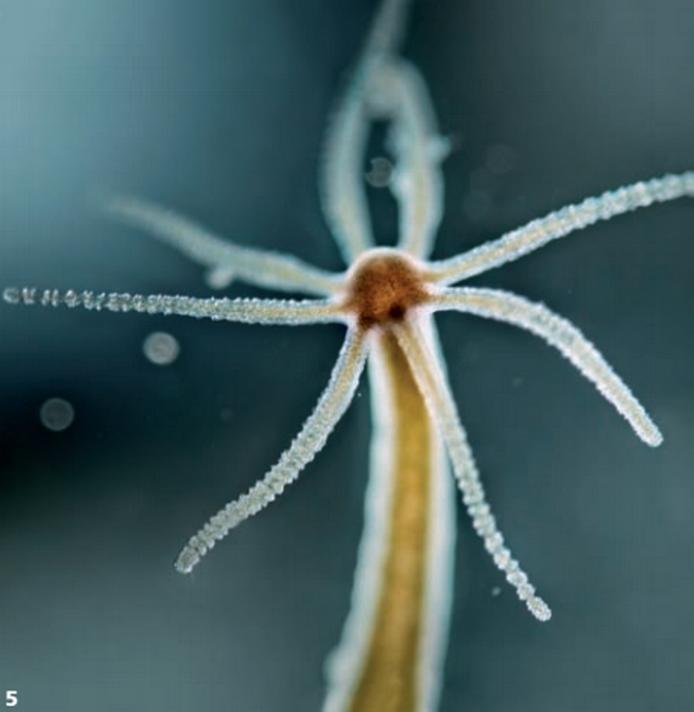

```
Created on Thu May  9 22:24:01 2019
Pattern in Nature Author：Philip Ball
自然模式 编译：Moly Chin
@author: molychin@qq.com
```


People dreamed of an ordered universe even in ancient times—perhaps especially then, when they were more vulnerable to the random whims of nature. “God, wishing that all things should be good, and so far as possible nothing be imperfect,” wrote the Greek philosopher Plato in the fourth century BCE, “reduced the visible universe from disorder to order, as he judged that order was in every way better.” Plato imagined a universe created using geometric principles, based on ideas about harmony, proportion, and symmetry. It is a vision that has resonated strongly ever since. Symmetry is one of the key concepts that modern physicists use to understand the world, and they believe its deepest laws will show this feature.

即使在古代，人们也梦想能够有一个有序的宇宙，尤其是当他们在自然的随意无常面前表现出更为脆弱的时候。“上帝，希望一切都将美好，尽可能没有不完美的东西。”希腊哲学家Plato在公元前四世纪写道，“他把可见的宇宙从无序变为有序，因为他认为秩序在让各个方面都变得更好。”Plato运用几何原理，基于 **和谐、比例和对称性** 设想了一个宇宙。这是一个从那时起就引起强烈共鸣的愿景。**对称性是现代物理学家用来理解世界的关键概念之一，他们相信最艰深的规律将显示出这一特征**。

What exactly are these properties of symmetry and pattern that we find in nature, and where do they come from? The best way to understand symmetry is as a property of an object or structure that allows us to change it in some way while leaving it looking just the same as it was before. Think of a sphere: you can rotate it any way you like, and you’d never know: it appears unchanged.
Or think of the grid of lines on a piece of graph paper. If you move the paper exactly one grid square’s width in a direction parallel to the lines, the grid is superimposed on how it looked at the outset. These are both symmetries, but of different kinds. The sphere has so-called rotational symmetry, meaning that its appearance is unchanged by rotation. The graph paper has (ignoring the edges) translational symmetry:
a “translation” here means a movement in a particular direction. The sphere in fact has perfect rotational symmetry, meaning that it is symmetrical for any angle of rotation. Imagine instead a soccer ball made from hexagonal and pentagonal patches sewn together: only certain rotation angles will superimpose the hexagons and pentagons exactly on their initial positions.

|||
|:---:|:---|
|正五边形|正三角形|

我们在自然界中发现的对称性和模式究竟是什么性质，它们是从哪里来的？理解对称性的最好方法是作为一个物体或结构的属性，它允许我们以某种方式改变它，同时使它看起来和原来一样（**对称的不变性**）。想象一个球体：你可以随心所欲地旋转它，你永远不会知道，它已经发生改变了，它似乎一直没有变化（**辐射对称的旋转不变性**）

或者想象一张方格纸纸上的线条。如果你平行于横线向上移动一个方格的宽度，那么网格重叠在原来的格子线上，使它开起来和开始时一样（**轴对称的平移不变性**）。**这些都属于不同类型的对称性**。球体具有所谓的 **旋转对称性**，这意味着它的外观是旋转不变的。图纸（忽略边）具有 **平移对称性**：这里的“变化”指的是一个特定方向的运动。球体实际上具有完美的旋转对称性，这意味着它对于任何旋转角度都是对称的。想象一下，一个由六角形和五角形补丁拼成的足球：只有一定的旋转角才能将六边形和五边形精确地叠加在它们的初始位置上。

---

SUBTLE SYMMETRY
The sand dollar, a kind of sea urchin, seems to pretend that it has fivefold symmetry, like a pentagon—but the oval slots undermine it.

微妙的对称  
沙子美元，一种海胆，假设它有五倍对称性，像五角大楼，但那些椭圆形槽破坏它的完美。

---

ARE ALL PEBBLES ALIKE?
Even pebbles have, on average, a characteristic shape that can be written in mathematical terms,which describes the range of different amounts of curvature they have over their surfaces.

所有卵石都像吗？  
即使卵石，平均而言，也可以用数学术语来描述，它们描述了它们表面上不同曲率的范围。

---
Another kind of symmetry is reflection, which is really just what it sounds like. If you put a mirror upright on the graph paper, the reflection in the mirror looks just like the piece of the sheet that lies behind it. This is exactly true only if the plane of the mirror is placed in just the right position:
it has to run either along one of the grid lines or exactly at the halfway point of a square, so that  the half-squares you can see and the other halves in the mirror reflection look like a full square.

另一种对称性是反射，这正是它听起来的样子。如果你把镜子直立在图表纸上，镜子里的反射就好像它背后的那张纸。只有在平面上，镜子放置在正确的位置是才是真的：它必须沿着一条网格线或者正好在一个正方形的中点上运行，这样你可以看到半正方形，而镜面反射中的另一半看起来像一个完整的正方形。

---
另一种对称是反射，这就是它听起来的样子。如果你把一面镜子竖着放在相纸上，镜中的反射就和它后面的那块纸一样。只有将镜子的平面放置在正确的位置时，这才是正确的：

它必须沿着一条网格线运行，或者恰好在一个正方形的中间点运行，这样你能看到的半个正方形和镜子反射中的另一半看起来像一个完整的正方形。

There’s another place you can put the mirror, too: exactly along the diagonals【对角线】 of the squares, at an angle of 45˚ to the grid lines. So this is another of the pattern’s “planes of symmetry【平面对称】.” If the angle is any different from 45˚, the reflection doesn’t superimpose exactly on the original grid that it hides: that isn’t a true plane of symmetry.
Mathematicians call these rotations,reflections, and translations “symmetry operations”—movements that don’t alter the appearance of the object. A plus sign and a square have the same symmetry: they have an identical set of operations that leaves them looking unchanged. A square grid, meanwhile, has a different set of operations from a hexagonal grid such as a bee’s honeycomb or chicken wire.

还有一个地方，你可以把镜子也：正好沿着对角线的正方形，在一个45角的网格线。这是另一种模式的“对称面”，如果角度与45°不同，反射就不存在。
精确地叠加在它隐藏的原始网格上：这不是一个真正的对称平面。  
数学家把这些旋转、反射和翻译称为“对称操作”——不改变物体外观的运动。加号和正方形具有相同的对称性：它们有一组相同的操作，使它们看起来不变。方形网格，同时，有一组不同的操作从六边形网格，如蜜蜂的蜂巢或鸡丝。

---
还有一个地方你也可以放镜子：正好沿着正方形的对角线，与网格线成45度角。这是另一个图案的“对称面”【平面名称】，如果角度与45˚有任何不同，反射就不会完全叠加在它隐藏的原始网格上：那不是真正的对称面。

数学家称这些旋转、反射和翻译为“对称操作”，即不改变物体外观的运动。加号和正方形具有相同的对称性：它们有一组相同的操作，使它们看起来保持不变。与此同时，方格网与六边形格网（如蜜蜂的蜂巢或鸡线）有着不同的操作集。


#### Bodies  
One of the most common kinds of symmetry that we see in the natural world is called bilateral symmetry. An object with this symmetry looks unchanged if a mirror passes cleanly through its middle. To put it another way, the object has a left side and a right side that are mirror images of each other. This, of course, is a characteristic of the human body, although little random quirks and accidents of our life history make the symmetry imperfect. There’s some evidence that people whose faces are more symmetrical are deemed more attractive on average, and it has also been claimed that other animals with bilaterally symmetrical bodies have more mates the more symmetrical they are.
Bilateral symmetry seems almost to be the default shape for animals. Fish, mammals, insects, and birds all share this attribute.

身体  
自然界中最常见的对称体之一称为双侧对称。如果一个镜子通过它的中间部分，这个对称的物体看起来是不变的。换一种说法，物体的左侧和右侧是镜像。当然，这是人体的一个特征，虽然我们生活史上很少的随机怪癖和事故使对称性不完美。有证据表明，脸部更匀称的人在平均情况下更具吸引力，并且还声称，其他具有双侧对称体的动物有更多的配偶，他们更对称。  
双侧对称似乎几乎是动物的默认形状。鱼类、哺乳动物、昆虫和鸟类都具有这种特性。

---
我们在自然界中看到的最常见的对称形式之一被称为双边对称。一个具有这种对称性的物体，如果一个镜子干净地穿过它的中间，看起来是不变的。换一种说法，物体的左侧和右侧是彼此的镜像。当然，这是人体的一个特征，尽管我们生活史上很少有随机的怪癖和意外事件使对称性不完美。有证据表明，脸更对称的人平均被认为更有吸引力，而且也有人声称，身体两侧对称的其他动物的配偶越对称。

双边对称似乎几乎是动物的默认形状。鱼、哺乳动物、昆虫和鸟类都具有这一属性。

#### Why is that?

One possibility is that bilateral symmetry makes it easier to move in a specific direction: think of the streamlined gliding of a fish, compared with the awkward wriggling of a starfish. Or perhaps a bilateral body meant that such creatures could develop a spine and central nervous system, which has advantages in terms of organizing nerves into a brain. Even starfish have evolved from bilateral ancestors, and in fact their larvae are still bilateral:  
starfish only develop their fivefold symmetrical bodies as they mature into adults. This kind of shape, which can be superimposed on itself by rotating through a particular angle around one axis, is said to be “radially symmetrical.” Animals first acquired bilaterally symmetrical body designs at least half a billion years ago, and branches of the animal kingdom that don’t share  this form show that the alternatives tend to have more permissive symmetries, or none at all. There are, for example, the sponges and corals, which, with their tubular, branched, or crinkly funguslike shapes, might easily be mistaken for sea plants.  
There are tentacled anemones, which often have an approximate radial symmetry: they have an obvious top and bottom, but from the side they look the same from any angle.

为什么会这样？  
一种可能是，双边对称性使得它更容易在特定的方向上移动：想到鱼的流线型滑动，与海星的笨拙扭动相比。或者一个双侧身体意味着这样的生物可以发展脊柱和中枢神经系统，这在组织神经进入大脑方面具有优势。即使海星已经从两个祖先进化而来，事实上它们的幼虫仍然是双侧的：  
海星在成年后只发育五倍对称的身体。这种形状可以通过一个轴围绕一个特定角度旋转而叠加在一起，据说是“径向对称的”。动物至少在十亿年前首次获得了双侧对称的身体设计，而动物界的分支则不属于SH。这种形式表明，替代品倾向于具有更多的许可对称性，或者根本没有。例如，海绵和珊瑚，它们的管状、分枝状或皱缩的真菌状，很容易被误认为是海洋植物。  
有触角的海葵，通常具有近似的径向对称性：它们有明显的顶部和底部，但从侧面看，它们从任何角度看都是相同的。

---
一种可能性是，双边对称使得向特定方向移动更容易：想想鱼的流线型滑行，而不是海星笨拙的扭动。或者说，一个双边的身体意味着这种生物可以发展出一个脊椎和中枢神经系统，这在把神经组织成大脑方面有优势。甚至海星也从双边祖先进化而来，实际上它们的幼虫仍然是双边的：

海星只有在成年后才发育出5倍对称的身体。这种形状可以通过绕一个轴旋转一个特定的角度叠加在自身上，据说是“径向对称的”。至少50亿年前，动物首先获得了双边对称的身体设计，而动物王国中不共享这种形状的分支表明，替代品倾向于拥有更多的自由对称，或者根本没有。例如，海绵和珊瑚，它们的管状、分枝或卷曲的真菌状形状，很容易被误认为是海洋植物。

有触须状的海葵，它们通常具有近似的径向对称性：它们有明显的顶部和底部，但从侧面看，它们在任何角度上都是一样的。

**“Symmetry is one of the main concepts that modern physicists use to understand the world.”**

**对称性是现代物理学家用来理解世界的主要概念之一。**

---

1 JELLYFISH
“Endless forms most beautiful”: this is how Charles Darwin described the shapes made by evolution.

1水母  
“无尽的形式最美丽”：这就是Charles Darwin如何描述进化所形成的形状。


2 LOW TIDE  
Patterns in sand appear spontaneously, engraved by nature’s forces.

2次低潮  
沙子中的图案自然地被大自然的力量所雕刻。


3 BILATERALISM  
A tale of two halves: the atlas moth. PATTERNS IN NATURE

3双边主义  
两半的故事：阿特拉斯蛾。

---
“Bilateral symmetry seems almost to be the default for animals. Fish,mammals, insects, and birds all share this attribute.”

双边对称似乎几乎是默认的动物。鱼类、哺乳动物、昆虫和鸟类都具有这种特性。

---
#### Symmetry-breaking and patterning

All kinds of systems and processes, involving both living and non-living objects, can spontaneously find their way into more or less orderly and patterned states: they can self-organize. There is no longer any reason to appeal to some divine plan to explain this, and there is nothing mysterious about it—but that need not diminish our sense of wonder and appreciation when we see it happen. Without any blueprint or guidance, molecules, particles, grains, rocks, fluids, and living tissues can arrange themselves into regular, sometimes geometrical patterns. The laws of nature seem capable of delivering “order for free.”

对称破缺与图案化  
包括活体和非活体在内的各种系统和过程，可以自发地找到它们进入或多或少有序和图案化状态的方式：它们可以自我组织。不再有任何理由去求助于一些神圣的计划来解释这一点，它没有什么神秘的，但是当我们看到它发生时，它不需要减少我们的惊奇和欣赏的感觉。没有任何蓝图或指导，分子、粒子、谷物、岩石、流体和活体组织可以排列成规则的，有时是几何图案。自然法则似乎能够提供“自由秩序”。

---
各种各样的系统和过程，包括有生命的和无生命的物体，都能自发地进入或多或少有序和模式化的状态：它们能自我组织。再也没有任何理由诉诸于某种神圣的计划来解释这一点了，也没有什么神秘可言，但当我们看到它发生的时候，这不需要削弱我们的惊奇感和欣赏感。没有任何蓝图或指导，分子、粒子、颗粒、岩石、液体和活组织可以将自己排列成规则的，有时是几何图形。自然法则似乎能够传递“自由秩序”。

Patterns appear in systems even though we can’t find any prescription for them in the fundamental rules that govern how their individual components behave. In this case, the patterns and ordering are said to be emergent: they are a property of the whole system, not deducible by looking reductively at the separate parts.
Symmetry is at the root of understanding how such patterns appear. Because in everyday terms we associate patterns with symmetry—think of the designs on wallpaper or Persian rugs, for example—we might be inclined to imagine that the spontaneous appearance of a pattern in nature involves the spontaneous generation of symmetry. In fact, the opposite is true. Pattern comes from the (partial) destruction of symmetry.

模式出现在系统中，即使我们找不到任何处方，他们的基本规则，管理他们的各个组成部分的行为。在这种情况下，模式和排序被称为是紧急的：它们是整个系统的一个属性，而不是通过在各个部分上还原地进行推断而推断出来的。  
对称性是理解这些模式如何出现的根源。因为在日常生活中，我们把图案与对称设计壁纸或波斯地毯的想法联系起来，例如，我们可能倾向于想象自然界中图案的自发出现涉及对称的自发生成。事实上，事实正好相反。模式来自对称性的（部分的）破坏。

---
模式出现在系统中，即使我们在控制其各个组件行为的基本规则中找不到它们的任何处方。在这种情况下，模式和顺序被认为是紧急的：它们是整个系统的一个属性，不能通过简单地观察各个部分来推断。

对称性是理解这种模式如何出现的根源。因为在日常生活中，我们把图案与对称联系在一起——例如，我们可能倾向于想象，一个图案在自然界中的自发出现涉及到对称的自发生成。事实上，恰恰相反。模式来自对称性的（部分）破坏。

The most symmetrical thing you can imagine is something that you can rotate, reflect, or translate any which way and yet it still looks the same. That’s true if the thing is perfectly uniform. So to get pattern from something that is initially unpatterned and uniform involves reducing the symmetry: it is what scientists call a process of symmetry-breaking, which is nature’s way of turning things that are initially the same into things that are different. The more symmetry that gets broken, the more subtle and elaborate the pattern.

你能想象到的最对称的东西是可以旋转、反射或翻译的任何东西，但它看起来还是一样的。如果事情是完全一致的，那是真的。因此，从最初没有图案化和均匀性的物体中获得图案，包括减少对称性：这就是科学家称之为对称破缺的过程，这是自然界将最初相同的事物转变成不同事物的方式。越对称越容易打破，更微妙和精细的模式。

---
你能想象的最对称的东西是你可以以任何方式旋转、反射或翻译的东西，但是它看起来还是一样的。如果这东西是完全统一的，那是真的。因此，要从最初没有图案和统一的事物中获得图案，就需要减少对称性：这就是科学家所说的对称性破坏过程，这是自然将最初相同的事物转变为不同的事物的方式。破坏的对称性越强，图案就越精细。

---

4 A GOOD TURN
A coral with radial symmetry: rotate it, and every few degrees it looks identical.

4个好的转变  
一个具有放射对称性的珊瑚：旋转它，而且每几度看起来都是一样的。



5 SEEING THE POINT  
The starlike radial symmetry of a  freshwater hydra.

5见要点  
淡水水螅的星状放射对称性。

---


Randomness might seem the opposite of uniformity, but the two can be equivalent: a random structure is perfectly symmetrical and uniform on average, which means that it too recognizes no “special” directions in space. In the natural world, perfect uniformity or randomness are surprisingly hard to find, at least at the everyday scale. Put yourself on a seashore. The sky is scattered with clouds, perhaps patterned into rows or feathery cirrus. The sea’s surface is wrinkled into waves that arrive on the shore with a distinctive pulse. There are plants around the shore, each with its own characteristic shape of flower and leaf. The sand at the water’s edge is grooved with ripples, and strewn with the delicate whorls of shells. All around there is shape and form: diverse, yes, but far from random, far from uniform. Symmetry is being broken, again and again.

随机性似乎与均匀性相反，但二者可以是等价的：随机结构是完全对称和均匀的，这意味着它也识别不到空间中的“特殊”方向。在自然界中，完美的均匀性或随机性是很难找到的，至少在日常尺度上是如此。设身处地。天空散布着乌云，也许是成排或羽状卷云。海面的褶皱成波浪状，以独特的脉冲到达岸边。岸边有植物，每个植物都有自己特有的花和叶的形状。水边的沙子有波纹，有细密的贝壳。周围都有形状和形式：多样性，是的，但远离随机，远离均匀。对称正在被打破，一次又一次。

---
随机性似乎与均匀性相反，但两者是等效的：一个随机结构是完全对称的，平均上是均匀的，这意味着它也不识别空间中的“特殊”方向。在自然世界中，完美的一致性或随机性令人惊讶地难以发现，至少在日常规模上是如此。把自己放在海边。天空中散布着云朵，也许是成排的，或者是带羽毛的卷云。海面上起皱成波浪，波浪以独特的脉冲到达岸边。岸边有植物，每种植物都有自己特有的花叶形状。水边的沙子上刻着波纹，上面散布着精致的螺纹贝壳。周围都有形状和形式：多样，是的，但远不是随机的，远不是统一的。对称性一次又一次地被打破。
