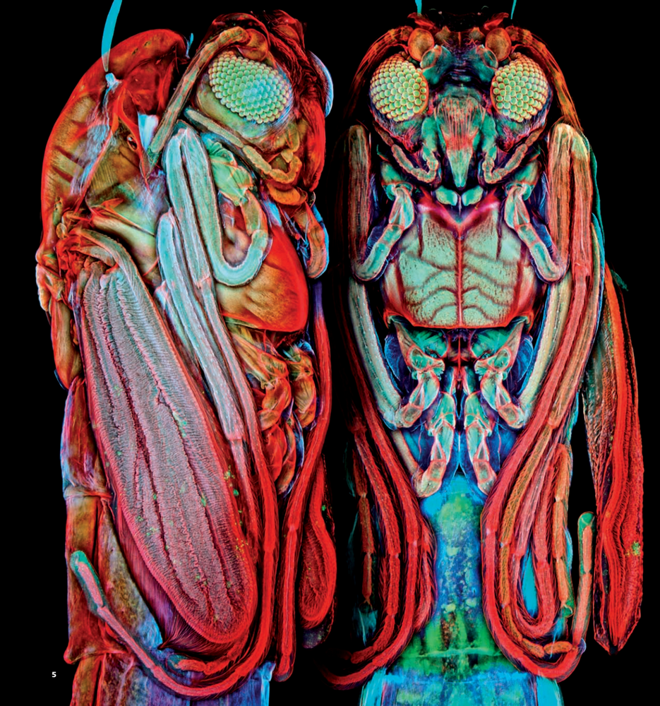

```
Created on Thu May  9 22:24:01 2019
Pattern in Nature Author：Philip Ball
自然模式 编译：Moly Chin
@author: molychin@qq.com
```
### 自然模式：自然艺术形态


#### ART FORMS IN NATURE
The ornate symmetries and striking colors of marine invertebrate animals such as tunicates (1) and echinoderms (2) were depicted, sometimes with a little overelaboration, by the German biologist Ernst Haeckel at the start of the twentieth century.


#### 自然中的艺术形态
在20世纪初，德国生物学家恩斯特·海克尔（Ernst Haeckel）描绘了海洋无脊椎动物如被囊动物（1）和棘皮动物（2）华丽的对称性和引人注目的颜色，有时甚至有些过于详尽。

#### Cause and effect  
In the natural world, when symmetry breaks we often have no cause to have anticipated it. Here’s what I mean. If we turn a random pile of bricks into the regular pattern of a wall, it’s because we have laid each brick in place. The uniform symmetry of a sheet of paper is broken in making a paper airplane because we folded it that way. In other words, the symmetry gets broken by some force—our moving hand—that compels it to break that way. It’s obvious where the symmetrybreaking came from: we put it there.

#### 因果关系  
在自然界中，当对称打破时，我们往往没有理由预料到它。我的意思是，如果我们把一堆随机的砖块变成一个规则的墙，那是因为我们把每个砖块都按图纸放好了。在制作纸飞机时，一张纸的均匀对称性被破坏了，因为我们把它反复折叠起来。换句话说，对称性被我们移动的手迫使它打破。显然对称破缺的原因是：我们强迫把它这样做。

Compare this to a droplet falling onto the still surface of water. At the start it is perfectly circularly symmetrical: it looks the same in any direction parallel to the surface. But then the splash develops a rim that breaks up into a series of little points, a crown that spits out little droplets from its tips. The rim no longer has its circular symmetry, but has acquired a lower grade of radial symmetry, like a starfish, in which some directions are distinct from others. The process of splashing spontaneously lowered the droplet’s own symmetry.

In this book we will see many more examples of such symmetry-breaking. A smooth layer of water breaks up into cells of top-to-bottom circulation when it is uniformly heated from below. A block of material that is shrinking in all directions splits into a network of cracks.

把它比作落在静止水面上的水滴。从一开始，它是完全圆形对称的：它在任何平行于表面的方向上看起来都是一样的。但随后溅起的水花形成了一个边缘，分裂成一系列的小点，一个从顶部吐出小滴的王冠。边缘不再具有圆形对称性，而是获得了较低级别的径向对称性，如海星，其中某些方向与其他方向不同。飞溅的过程自然地降低了液滴的对称性。

在这本书里，我们将看到更多这样的对称破缺的例子。当水从下面均匀加热时，一层光滑的水就会分解成自上而下循环的蜂窝状单元；一块向各个方向收缩的材料分裂出一个裂纹网络。


Spiraling patterns form in a perfectly mixed solution of chemicals. This is how so many natural patterns form: as if by magic out of a featureless landscape.  
We can see it happen, too, on a spider’s web.  
The web itself is a gorgeous natural pattern, but it’s not a spontaneous one: the spider makes it the hard way, as we would, by stringing each thread in its place. However, catch the web while the early morning dew is still out and you’ll find it beautifully decorated with tiny beads of water hung out like rows of pearls. Did the spider put them there? Not at all—they have been self-organized as dew condensed to coat the silk threads. A thin column of water like this is unstable: it will develop a waviness that pinches it off into little beads, each one regularly spaced where the peaks of the wave were.

螺旋形图案会形成于完全混合的化学溶液中，这就是如此多的自然图案形成的原因，仿佛从一片毫无特色的风景中被魔法释放出来。我们也可以在蜘蛛网上看到这种情况。


蛛网本身就是一个华丽的自然图案，但它不是自发的：蜘蛛艰难地把它织成，就像我们把每根线绑在合适的位置一样。然而，当清晨的露水还没消散的时候，你可以看到它被挂在上面的小水珠装饰得很漂亮。是蜘蛛把它们放在那里的吗？当然不是，它们是自组织的，凝结成丝线的露珠。像这样的细水柱是不稳定的：它会汇聚成波纹状，最终成为小水珠，每一个都有规律地在波峰处隔开。


NATURAL CURVES  
The proboscis of the geometer moth curls into an elegant spiral, decorated with a regular array of tiny hairs.

自然曲线  
测温蛾的喙卷曲成一个优雅的螺旋状，装饰着一排整齐的小绒毛。

Symmetry offers a useful way of thinking about pattern and shape, but even apparently irregular, totally unsymmetrical objects can have a hidden order that mathematics can reveal. Take a pebble. How would you describe its shape? It is sort of round, like a sphere but not quite. A perfect sphere is easy to define mathematically:  
it has the same amount of curvature everywhere on its surface. But for a pebble, the curvature differs slightly from place to place, and from pebble to pebble. There is a range of curvatures, and the general “pebble shape” can be described by a graph showing the relative amounts of different degrees of curvature in a selection of many pebbles.

关于模式和形状，对称性提供了一种有用的思考方法，即使是明显不规则的，完全不对称的物体也可能有数学所能揭示的隐藏秩序。拿块鹅卵石来，你如何描述它的形状？它有点圆，像一个球体，但又不完全是。完美的球体在数学上很容易定义：它的表面到处都有相同的曲率。但是对于一个卵石来说，不同的位置曲率都略有不同。有一系列的曲率，一般的“鹅卵石形状”可以用一个图表来描述，该图表显示了在许多鹅卵石中选择中，不同曲率的相对数量。

Unlike a sphere, pebbles often have some parts that are concave rather than convex:  
dimples, not bulges. (Potatoes have similar shapes, and the concave parts are the bits that are hard to peel.) Mathematically, these parts are said to have negative curvature. So the graph showing the distribution of curvature of a pebble reaches into negative as well as positive values. But for any collection of pebbles, the overall graphs of curvature have the same shape! Each individual shape differs, but on average there is a single “pebble shape” described by the curvature distribution. Math reveals the common forms underlying the apparent diversity.

与球体不同，鹅卵石的某些部分通常是凹形而非凸形的：酒窝，不是凸起（土豆的形状相似，凹形部分是很难剥皮的地方）。从数学上讲，这些部分被称为负曲率。因此，显示圆石曲率分布的曲线图表达了负值和正值。但是对于任何一组鹅卵石来说，整个曲线图的形状都是一样的！每个形状都不同，但平均来说，有一个由曲率分布描述的“鹅卵石形状”。数学揭示了表面多样性背后的共同形式。

---
**“Even apparently irregular, totally unsymmetrical objects can have a hidden order that mathematics can reveal.”**

**即使是表面上不规则的，完全不对称的物体，也可能有数学所能揭示的隐藏顺序。**

---
|||
|:---:|:---:|
|ACCIDENTAL MIMICRY:The emperor moth and the barn owl.|偶然拟态:天蛾和谷仓猫头鹰。|


花粉粒（1）


花.Enkianthus（2）

POLLEN  
We can intuit order in patterns, such as pollen grains (1) or flowers such as this Enkianthus (2),even if they lack formal mathematical symmetry.

花粉和花，我们可以在上述形态中，看到它们缺乏完全的数学对称性。


ELEGANT VARIATION ON THE RADIAL THEME  
Five jellyfish display the inventiveness of nature.

径向主题的优雅变奏  
水母展示了大自然的创造力。


TAKE FIVE  
Fivefold symmetry is often favored by echinoderms such as starfish and sea urchins. Oddly, these evolved from creatures with only bilateral (twofold) symmetry

五重对称    
五重对称常被棘皮动物如海星和海胆所青睐。奇怪的是，它们是由只有两侧对称的生物进化而来的。


BILATERAL INSECTS  
It may look like an alien, but the damselfly’s bilateral head (1) still gives it a weirdly humanoid feel. The markings of the striped shield bug (2), the metallic wood borer beetle (3), and the monarch butterfly (4) scrupulously observe their mirror symmetry. Even the emergence of a body plan in the midge pupa (5) is a progressive elaboration of its bilateral symmetry.

||
|:---:|
|蜻蜓的左右对称头部（1）、条纹盾蝽（2）、金属蛀虫（3）、帝王蝶（4）|
||
|蠓蛹（5）|

两侧对称昆虫  
它看起来像一个外星人，但是蜻蜓的左右对称头部（1）仍然给它一种奇怪的人形感觉。细观察条纹盾蝽（2）、金属蛀虫（3）和帝王蝶（4）的特征呈现镜像对称性。即使在蠓蛹（5）的身体展现也是一个逐步演进的两侧对称性。

||
|:---:|
||

AS LEFT, SO RIGHT  
Symmetry is intricately preserved in the features and markings of the buckeye butterfly (1),Eastern tiger swallowtail butterfly (2), Indian moon moth (3), Southeast Asian atlas moth (4), and monarch butterfly (5).

左、右对称  
对称性被巧妙地存留在七叶树蝴蝶（1）、东方虎燕尾蝶（2）、印度月蛾（3）、东南亚阿特拉斯蛾（4）和帝王蝶（5）的特征和标记中。


BILATERAL SYMMETRY ACROSS THE ANIMAL KINGDOM  
Tiger (1), peacock (2), serpent eagle (3), Grevy’s zebra (4), and Argentine horned frog (5).

动物王国的双边对称性  
虎（1），孔雀（2），蛇鹰（3），Grevy斑马（4），阿根廷角蛙（5）。

BILATERAL SYMMETRY IN FISH   
Balloonfish (1) and sand diver (2).

|||
|:---:|:---:|
|气球鱼1（河豚）|挖沙鱼2|

MARINE DESIGNS  
Anemones and corals show a wide range of textures and patterns, in none of which is there an exact symmetry in a mathematical sense.

海洋设计  
银莲花和珊瑚显示出广泛的纹理和图案，在数学意义上没有一个完全对称。


THE EDGE OF ORDER  
Intricately patterned sea anemones.

秩序的边缘  
错综复杂的海葵图案。


SPLASHES  
The circular symmetry of the corona of ejected water gets broken in ornate ways as the rim breaks up into droplets.

飞溅  
当边缘破裂成水滴时，喷出水的日冕的圆形对称性会以华丽的方式被破坏。


----
