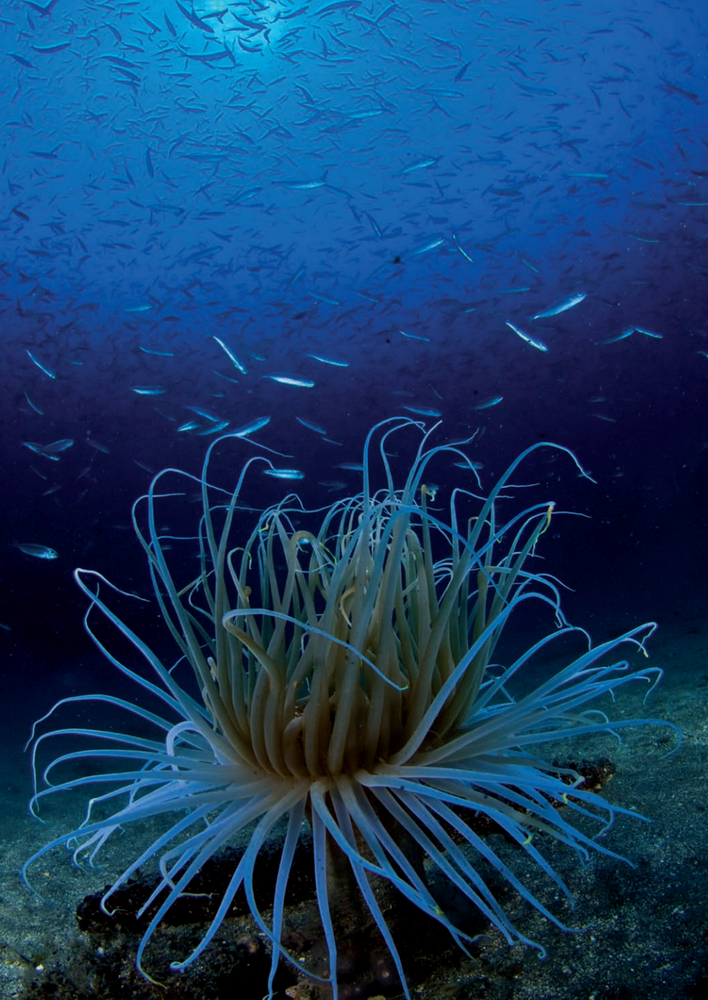

```
Created on Thu May  9 22:24:01 2019
Pattern in Nature Author：Philip Ball
自然模式 编译：Moly Chin
@author: molychin@qq.com
```


ART FORMS IN NATURE

The ornate symmetries and striking colors of marine invertebrate animals such as tunicates (1) and echinoderms (2) were depicted, sometimes with a little overelaboration, by the German biologist Ernst Haeckel at the start of the twentieth century.


自然中的艺术形式  
在二十世纪初德国生物学家艾伦斯特描述了海洋无脊椎动物如鳞类动物（1）和棘皮动物（2）的华丽对称和鲜明的颜色，有时有点过于详尽。

自然的艺术形式
20世纪初，德国生物学家恩斯特·海克尔（Ernst Haeckel）描绘了海洋无脊椎动物（如被囊动物（1）和棘皮动物（2））华丽的对称性和引人注目的颜色，有时有点劳累过度。


Cause and effect  
In the natural world, when symmetry breaks we often have no cause to have anticipated it. Here’s what I mean. If we turn a random pile of bricks into the regular pattern of a wall, it’s because we have laid each brick in place. The uniform symmetry of a sheet of paper is broken in making a paper airplane because we folded it that way. In other words, the symmetry gets broken by some force—our moving hand—that compels it to break that way. It’s obvious where the symmetrybreaking came from: we put it there.

因果关系  
在自然界中，当对称打破时，我们往往没有理由预料到它。这就是我的意思。如果我们把一堆随机的砖块变成一个墙的规则图案，那是因为我们把每个砖块都放好了。纸飞机的对称性在制作纸质飞机时被打破了，因为我们把它折叠起来。换句话说，对称性被我们移动的手的某种力量打破，迫使它打破这种方式。显然对称破缺的原因是：我们把它放在那里。

因果关系

在自然世界中，当对称性破坏时，我们通常没有理由去预料它。这就是我的意思。如果我们把一堆随机的砖变成一堵规则的墙，那是因为我们已经把每一块砖都铺好了。在制造纸飞机时，一张纸的均匀对称性被破坏了，因为我们是这样折叠的。换言之，对称性被某种力量破坏，我们的移动的手迫使它以这种方式破坏。很明显对称性是从哪里来的：我们把它放在那里。

Compare this to a droplet falling onto the still surface of water. At the start it is perfectly circularly symmetrical: it looks the same in any direction parallel to the surface. But then the splash develops a rim that breaks up into a series of little points, a crown that spits out little droplets from its tips. The rim no longer has its circular symmetry, but has acquired a lower grade of radial symmetry, like a starfish, in which some directions are distinct from others. The process of splashing spontaneously lowered the droplet’s own symmetry.  
In this book we will see many more examples of such symmetry-breaking. A smooth layer of water breaks up into cells of top-to-bottom circulation when it is uniformly heated from below. A block of material that is shrinking in all directions splits into a network of cracks.

将其与落在水面上的液滴进行比较。在开始时，它是完全圆对称的：在平行于表面的任何方向上看起来都是相同的。但是，飞溅形成一个边缘，形成一系列小的点，一个从顶端喷出小水滴的树冠。轮辋不再具有圆形对称，而是获得了较低等级的径向对称性，如海星，其中一些方向与其他方向不同。飞溅过程自发地降低了液滴自身的对称性。  
在这本书里，我们将看到更多这样的对称破缺的例子。光滑的水层在从底部均匀加热时分解成上下循环的细胞。在所有方向上收缩的一块材料分裂成一个裂缝网络。

把它比作落在静止水面上的水滴。从一开始，它是完全圆形对称的：它在任何平行于表面的方向上看起来都是一样的。但随后溅起的水花形成了一个边缘，分裂成一系列的小点，一个从顶部吐出小滴的王冠。边缘不再具有圆形对称性，而是获得了较低级别的径向对称性，如海星，其中某些方向与其他方向不同。飞溅的过程自然地降低了液滴的对称性。

在这本书中，我们将看到更多这种对称破坏的例子。当水从下面均匀加热时，一层光滑的水就会分解成自上而下循环的细胞。一块向各个方向收缩的材料分裂成一个裂纹网络。

Spiraling patterns form in a perfectly mixed solution of chemicals. This is how so many natural patterns form: as if by magic out of a featureless landscape.  
We can see it happen, too, on a spider’s web.  
The web itself is a gorgeous natural pattern, but it’s not a spontaneous one: the spider makes it the hard way, as we would, by stringing each thread in its place. However, catch the web while the early morning dew is still out and you’ll find it beautifully decorated with tiny beads of water hung out like rows of pearls. Did the spider put them there? Not at all—they have been self-organized as dew condensed to coat the silk threads. A thin column of water like this is unstable: it will develop a waviness that pinches it off into little beads, each one regularly spaced where the peaks of the wave were.

螺旋模式在化学品的完美混合溶液中形成。这就是如此多的自然模式的形成：仿佛是从一个无特色的风景中的魔法。  
我们也能看到它发生在蜘蛛网上。  
网络本身是一个华丽的自然模式，但它不是自发的：蜘蛛把它变成硬路，就像我们把每根线绑在它的位置一样。然而，当清晨的露水还在外面时，抓住鱼网，你会发现它装饰得很漂亮，上面挂着一排排珍珠般的小水珠。蜘蛛把它们放在那里了吗？一点也没有，它们是自组织的，凝结成丝线的露珠。像这样的薄水柱是不稳定的：它会发展成一个波纹，把它捏成小珠，每一个都有规律地在波峰处隔开。


螺旋形图案形成于完全混合的化学溶液中。这就是如此多的自然图案形成的原因：仿佛被魔法从一片毫无特色的风景中释放出来。
我们也可以在蜘蛛网上看到这种情况。
网络本身是一个华丽的自然图案，但它不是一个自发的图案：蜘蛛会像我们一样，通过把每一根线串在它的位置上，使它成为一种艰难的方式。然而，当清晨的露水还没出来的时候，你就可以看到它被挂在外面的小水珠装饰得很漂亮。蜘蛛把它们放在那里了吗？一点也没有，它们是像露水一样自我组织的，凝结后覆盖在丝线上。像这样的细水柱是不稳定的：它会产生一种波浪状，把它捏成小水珠，每个水珠在波峰所在的位置有规律的间隔。

Symmetry offers a useful way of thinking about pattern and shape, b ut even apparently irregular, totally unsymmetrical objects can have a hidden order that mathematics can reveal. Take a pebble. How would you describe its shape? It is sort of round, like a sphere but not quite. A perfect sphere is easy to define mathematically:
it has the same amount of curvature everywhere on its surface. But for a pebble, the curvature differs slightly from place to place, and from pebble to pebble. There is a range of curvatures, and the general “pebble shape” can be described by a graph showing the relative amounts of different degrees of curvature in a selection of many pebbles.

对称性提供了一种思考模式和形状的有效方式，即使显然是不规则的，完全不对称的对象也可以有一个隐藏的顺序，数学可以揭示。吃一块鹅卵石。你会如何描述它的形状？它是圆的，像球体，但不完全。完美的球面很容易在数学上定义：  
它的表面上到处都有相同的曲率。但是对于卵石，曲率从一个地方到另一个地方，从卵石到鹅卵石略有不同。有一系列的曲率，一般的“卵石形状”可以用一个图表来描述，在许多卵石的选择中，不同曲率的相对量。

对称提供了一种有用的思考模式和形状的方法，但是即使是明显不规则的，完全不对称的物体也可能有数学所能揭示的隐藏顺序。拿块鹅卵石。你如何描述它的形状？它有点圆，像一个球体，但不完全是。完美的球体在数学上很容易定义：

它的表面到处都有相同的曲率。但是对于一个卵石来说，不同的地方和不同的卵石的曲率略有不同。有一系列的曲率，一般的“鹅卵石形状”可以用一个图表来描述，该图表显示了在许多鹅卵石中选择的不同曲率的相对数量。

Unlike a sphere, pebbles often have some parts that are concave rather than convex:  
dimples, not bulges. (Potatoes have similar shapes, and the concave parts are the bits that are hard to peel.) Mathematically, these parts are said to have negative curvature. So the graph showing the distribution of curvature of a pebble reaches into negative as well as positive values. But for any collection of pebbles, the overall graphs of curvature have the same shape! Each individual shape differs, but on average there is a single “pebble shape” described by the curvature distribution. Math reveals the common forms underlying the apparent diversity.

与球体不同，卵石通常有一些凹面而不是凸起的部分：  
酒窝，不是凸起。（土豆有相似的形状，而凹部是难以剥落的部分）数学上说，这些部分具有负曲率。因此，卵石的曲率分布图显示为负值和正值。但是对于任何鹅卵石的集合，曲率的整体曲线具有相同的形状！每个形状不同，但平均有一个单一的“鹅卵石形状”所描述的曲率分布。数学揭示了明显多样性的共同形式。

与球体不同的是，鹅卵石的某些部分通常是凹形而非凸形的：

酒窝，不是凸起。（土豆的形状相似，凹形部分是很难剥皮的小块。）从数学上讲，这些部分被称为负曲率。因此，显示圆石曲率分布的曲线图达到了负值和正值。但是对于任何一组鹅卵石来说，整个曲线图的形状都是一样的！每个形状都不同，但平均来说，有一个由曲率分布描述的“鹅卵石形状”。数学揭示了表面多样性背后的共同形式。

“Even apparently irregular, totally unsymmetrical objects can have a hidden order that mathematics can reveal.”

“即使是不规则的，非对称的对象有一个全阶数学CAN CAN是揭示隐藏的。”

“即使是不规则的，非对称的对象有一个全阶数学CAN CAN是揭示隐藏的。”


NATURAL CURVES  
The proboscis of the geometer moth curls into an elegant spiral, decorated with a regular array of tiny hairs.

自然曲线  
测温蛾的喙卷曲成一个优雅的螺旋状，装饰着一排整齐的小毛发。

自然曲线

几何飞蛾的长鼻卷曲成一个优雅的螺旋状，上面装饰着规则排列的细毛。


ACCIDENTAL MIMICRY  
The emperor moth and the barn owl.

偶然拟态  
天蛾和谷仓猫头鹰。


POLLEN  
We can intuit order in patterns, such as pollen grains (1) or flowers such as this Enkianthus (2),even if they lack formal mathematical symmetry.

花粉  
我们可以在模式中，如花粉粒（1）或花，如Enkianthus（2），即使它们缺乏正式的数学对称性。


ELEGANT VARIATION ON THE RADIAL THEME  
Five jellyfish display the inventiveness of nature.

径向主题的优雅变奏  
五水母展示了大自然的创造力。


TAKE FIVE  
Fivefold symmetry is often favored by echinoderms such as starfish and sea urchins. Oddly, these evolved from creatures with only bilateral (twofold) symmetry

取五  
五重对称常被棘皮动物如海星和海胆所青睐。奇怪的是，它们是由只有两个对称的生物进化而来的。

吃五个

棘皮动物（如海星和海胆）通常喜欢五倍对称。奇怪的是，它们是从只有双侧对称的生物进化而来的。


BILATERAL INSECTS  
It may look like an alien, but the damselfly’s bilateral head (1) still gives it a weirdly humanoid feel. The markings of the striped shield bug (2), the metallic wood borer beetle (3), and the monarch butterfly (4) scrupulously observe their mirror symmetry. Even the emergence of a body plan in the midge pupa (5) is a progressive elaboration of its bilateral symmetry.

双边昆虫  
它看起来像一个外星人，但是蜻蜓的双头（1）仍然给它一种奇怪的人形感觉。条纹盾蝽（2）、金属蛀虫（3）和帝王蝶（4）的标记仔细观察它们的镜像对称性。即使出现在蠓蛹（5）的身体计划是一个渐进的阐述其双边对称性。

双边昆虫

它可能看起来像外星人，但少女的双侧头（1）仍然给人一种奇怪的感觉。条纹盾牌虫（2只）、金属木蛀虫甲虫（3只）和帝王蝶（4只）的标记仔细观察它们的镜子对称性。即使是出现在侏儒蛹（5）的身体计划是一个渐进的阐述其双边对称性。


AS LEFT, SO RIGHT  
Symmetry is intricately preserved in the features and markings of the buckeye butterfly (1),Eastern tiger swallowtail butterfly (2), Indian moon moth (3), Southeast Asian atlas moth (4), and monarch butterfly (5).

如左，右  
对称性被巧妙地保存在七叶树蝴蝶（1）、东方虎燕尾蝶（2）、印度月蛾（3）、东南亚阿特拉斯蛾（4）和帝王蝶（5）的特征和标记中。


BILATERAL SYMMETRY ACROSS THE ANIMAL KINGDOM  
Tiger (1), peacock (2), serpent eagle (3), Grevy’s zebra (4), and Argentine horned frog (5).

动物王国的双边对称性  
虎（1），孔雀（2），蛇鹰（3），Grevy斑马（4），阿根廷角蛙（5）。


BILATERAL SYMMETRY IN FISH Balloonfish (1) and sand diver (2).

双鱼对称（1）和沙潜水员（2）。


MARINE DESIGNS  
Anemones and corals show a wide range of textures and patterns, in none of which is there an exact symmetry in a mathematical sense.

海洋设计  
银莲花和珊瑚显示出广泛的纹理和图案，在数学意义上没有一个完全对称。




THE EDGE OF ORDER  
Intricately patterned sea anemones.

秩序的边缘  
错综复杂的海葵图案。


SPLASHES  
The circular symmetry of the corona of ejected water gets broken in ornate ways as the rim breaks up into droplets.

飞溅  
当边缘破裂成液滴时，喷射水的电晕的圆形对称性以华丽方式破裂。


----
