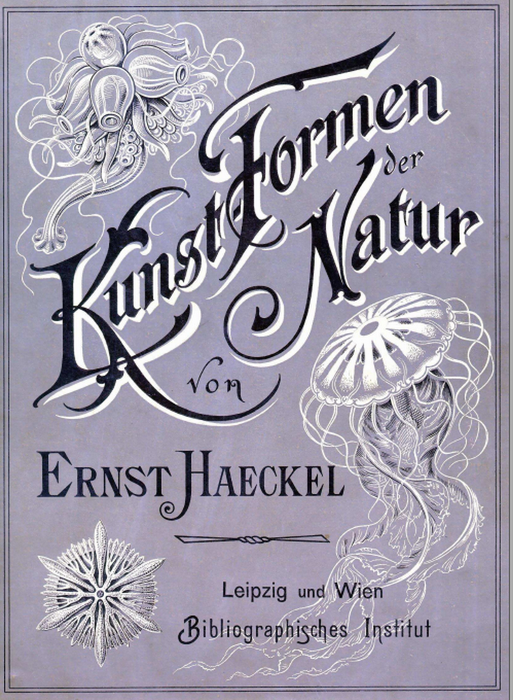
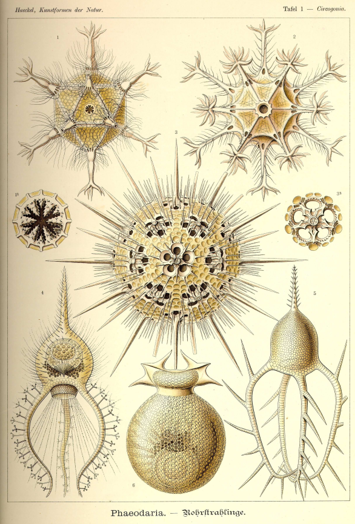

```
Created on Thu May  9 22:24:01 2019
Pattern in Nature Author：Philip Ball
自然模式 编译：Moly Chin
@author: molychin@qq.com
```

自然的艺术形态




《自然的艺术形态》，这是德国著名生物学家恩斯特·海克尔所绘制的自然科学插画集，收录了100幅图版，既有对原始微生物的刻画，也有对高等动植物的描绘，其所描绘的自然生物形式异常精准，其准确性已借由现代的高倍显微镜得到了证实。作者还分别对每幅图版所展现的生物作了深入细致的讲述，以使读者能更好地领略生物形态的美妙之处。本书插画兼具生物形态美及几何构图的美感，赏心悦目，令人爱不释手。

自然科学类插画兼具科学性与艺术性，具有独特的魅力，这本由德国著名生物学家恩斯特·海克尔所绘制的生物插画集正是其中的优秀之作。本书收录了海克尔所绘制的100幅生物插画，这些画生动地展现了自然界的美，兼具生物形态美及几何构图的美感，其中描绘放射虫、水母、海葵等的图版更是公认的杰作。作者还对每幅图版所展现的生物进行了深入细致的讲述，令本书成为不可多得的鉴赏之选。

恩斯特·海克尔（Ernst Haeckel），德国生物学家、博物学家、哲学家、艺术家、医生、教授。他将达尔文的进化论引入德国，是达尔文进化论的捍卫者和传播者。他引入了一些现今在生物学中非常普遍的术语，如“生态学”“门”等，并首先提出了“生态学”这一概念。他于1908年获得达尔文-华莱士奖章，该奖项由伦敦林奈学会设立，旨在奖励在进化生物学领域里做出了重要贡献的科学家。他所绘制的自然科学类插画生动地体现了自然界的美，对20世纪早期的绘画、建筑和设计产生了较大影响，并一直给予艺术家、建筑师和设计师丰富的灵感。

大自然在她的襁褓里孕育了无穷无尽、美轮美奂的形态，与之相比，人类所创造的所有艺术形式都黯然失色。众所周知，大自然在植物界和动物界里的产物，特别是人类所经常接触到的种子植物和脊椎动物，常常被人类进行模仿并从而脱胎换骨成为其造型艺术。与之相反，那些生活在大海深处或者是由于其体形微小而不为肉眼所发现的生命形态，则大多，或是全部，尚未为众人所认识。直到19世纪，随着研究的不断深入，绝大部分这些在大自然中隐藏着的美丽形态才被人类揭开神秘的面纱。
　　在形态上尤为独特和奇妙的当数最简单的有机生命体—— 原生生物。它们整个活生生的躯体仅由一个单独的细胞构成：如原生动物（Protozoa） 中的放射虫（Radiolaria）、有孔虫（Thalamophora） 和滴虫（Infusoria），原生植物（Protophyta）中的硅藻（Diatomea）、鼓藻（Cosmarieae）和甲藻（Peridinea）等等。这些原生生物中所蕴藏的令人惊叹的宝藏以及它们那富于装饰性的、奇幻无比的形态，直到新时代，才通过不断改良的显微镜、日益完善的观察方法以及有计划的海洋研究为我们所认识。而这一切，我们还得归功于一些相邻领域内的令人惊喜的发现，在那里，体形较大的低等生物体，如低等植物中的藻类（Algen）、菇类（Pilze）和苔藓（Moose），刺胞动物中的水螅（Polypen）、珊瑚（Korallen）和水母（Medusen）等等，无不向世人展现出惊人的造型魅力。这些生物体的绝美形态，却大多只被定格在一些昂贵而少见的专著中，普罗大众则与之无缘。而这本《自然界的艺术形态》则旨在将这些养在深闺人未识的珍宝奉献给更多喜欢艺术和喜欢大自然的朋友们。笔者从小就对生命体的形态之美着迷，并将半个世纪的生命都满腔热情地奉献给了形态学的研究。在这个领域里面，我不仅致力于认识生物造型和发展的规律，更通过勾勒和描绘深入到其美态的深层秘密中去。在长达45年的游历生涯中，我不但了解了欧洲的所有国家和艺术形式，而且还在非洲北部和亚洲南部那些充满无穷魅力的海岸有过长时间的工作经历。我在这些科学考察之旅中画下上千幅图稿，其中的一部分已经在我的一些大部头专著里面发表，而另一部分我想趁此机会公开。此外，我还将对浩如烟海的文献资料里面最美观、最具美学价值的生物形态进行收集和整理。如果本书的初版受到读者们欢迎，那么接下来我们还将继续以同样的方式展示其他高等动植物世界里较为罕见或尚未为人所知的美。本书将首先推出50 幅图稿（分为5 册单行本出版，每册10 幅图），每幅图将配有一页的说明文字。若市场反应良好，我们还将实施后续的出版计划。我希望能在出满10册单行本（即100幅图）的时候为本书写一个总纲，对全部形态种类进行系统的划分，并对各种生物的艺术形态进行美学的阐述，以及整理出所有涉及的文献和它们的出处。
　　现代的造型艺术和当下异军突起的艺术行业将在这本真正的《自然界的艺术形态》中获得大量崭新的、有价值的题材。在整理的过程当中，我恪守忠于自然的原则，再现了真实存在的大自然的产物，而没有对之进行主观上的再创造和装饰性价值上的评价；这些工作我都将留给造型艺术家们。
　　在此，我要衷心感谢我在耶拿忠实可靠的同事阿道夫·基尔赤（Adolf Giltsch）先生，他完成了本书图稿的艺术再现和忠于自然的雕版工作。全靠他对所托付任务的强烈兴趣，对形态学的深入理解和他的艺术天赋，我才得以把酝酿已久的计划付诸实现，如愿出版本书。
　　此外，我对我的雇主，巴塞尔的保尔·冯·里特（Paul von Ritter）博士给予的物质上和精神上的支持致以特别鸣谢。他是自然科学的忠实朋友和乐于奉献的赞助商。1886年，他在耶拿大学创立了“保尔·冯·里特动物系统发生学研究基金会”，并表示，该基金将不仅用于对学术研究和考察旅行的资助，更将用于唤起更广泛的民众对发现大自然之美和奇迹的兴趣。在大自然中随处隐藏着的美学享受和高贵认识，应该越来越多地为人所知，并成为最广泛的受教育群体的共同财富。
　　莱比锡的图书馆学学院也有着同样的见地。他们热心地承担了成本昂贵的图版定稿和出版的工作。我对他们同样致以衷心的感谢。但愿《自然界的艺术形态》能够受到广大读者的喜爱，并让大众无论是在艺术上还是在科学上，都对我们所身处的这座美不胜收的造型艺术殿堂更感兴趣。这样，我们共同的心愿便将得以实现！
　　恩斯特·海克尔
　　1899 年2 月16 日于耶拿




人类一直在极力地模仿自然，自然之物的形态也是美学的主要对象。人们不断地描摹动物的形象、植物的形态，为他们的优美（复杂）的构造所倾倒。虽然艺术史中的图像总是被掺入人的因素，但如果把人去掉，仅仅自然本身，就值得人们去膜拜了。
随着人们视野的不断扩大，进入人们视觉的不仅仅限于人们日常生活中常见的动植物，人们逐步深入到了原始丛林，洋面甚至洋底。
