```
Created on Thu May  9 22:24:01 2019
Pattern in Nature Author：Philip Ball
自然模式 编译：Moly Chin
@author: molychin@qq.com
```

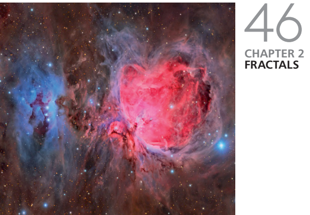

### 2 FRACTALS  
Why mountains look like molehills

### 2 分形
为什么很多山脉看起来都像鼹丘(由鼹鼠打洞扒出的泥土堆成)？

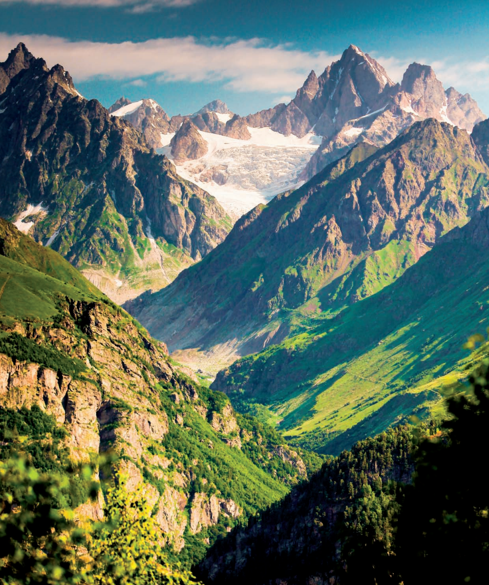

If we look at an aerial photograph of a jagged coastline, without a scale bar we can’t be sure if we’re seeing a stretch that is a mile long, or ten miles, or even a hundred.

This indistinguishable appearance at different scales of magnification is a property called fractal. It is a remarkably common feature of nature: think of the fluffy edge of a cloud, or the way a twig from a branch tip mimics the shape of the whole tree, or the repeated branching of the lung’s passageways. In fact, fractals have even been called the geometry of nature. Many natural fractals look disorderly when you first see them: there’s no exact symmetry in a tree or a mountain profile. But the fractal property discloses a kind of “hidden logic” to the pattern: there’s a hierarchical repetition of the same general form at decreasing scales. What are the processes that create this logic? And why is it useful for living organisms?

---
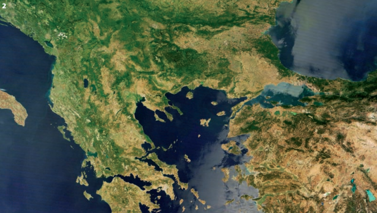
2 FRACTAL COASTLINE  
The complex boundaries of the Aegean sea.

2 分形海岸线  
爱琴海的复杂边界
---
如果我们看一幅锯齿状海岸线的航拍照片，没有比例尺，我们就不能确定我们看到的是一英里、十英里、甚至一百英里的长。 这种在不同放大倍数下无法区分的外观是一种称为分形的性质。这是自然的一个非常普遍的特征：想象云的边缘，或者树枝尖的枝条模仿整个树的形状，或者肺部肺叶的重复分支。事实上，分形甚至被称为自然的几何学。许多自然分形在你第一次看到它们时看起来是无序的：树木或山脉的轮廓没有完全的对称性。但分形属性揭示了一种“隐性逻辑”的模式：在递减的尺度上有相同的一般形式的层级重复。创建这个逻辑的过程是什么？为什么它适用于生物体？

Natural patterns with a symmetrical form, like the bee’s honeycomb, surprise and delight us precisely because they are rather rare.  
Nature doesn’t often display such strict order and regularity. Whether it is the spindly filigree of a naked tree’s silhouette in winter or the rugged jumble of a mountainous skyline, what we find in the wild seems more often to have a lot of unpredictability and disorder to it.  
Yet these structures have a hidden kind of pattern, too. The logic of the shape or form only becomes fully evident when we try to describe it mathematically, but we already intuit a sort of organization, even without this specialized knowledge. There is surely something pleasing and entrancing about the branching shape of a tree that we wouldn’t discover in a totally random arrangement of parts. It’s not hard to see where this magic ingredient lies. The shape of a tree is complicated, and we can’t easily describe it in the same way as we might describe a square or a hexagon. But we can give a very concise description if we focus instead on the process that produces the shape. A tree shape might be said to be “a trunk that keeps branching.”

|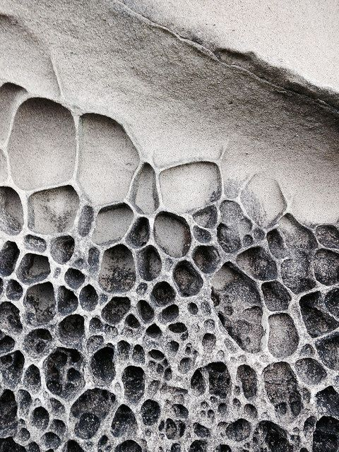|
|:---:|
|蜂窝状的岩石构造|

具有对称形状的自然形态，如蜜蜂的蜂巢，让我们惊喜和高兴，因为它们是相当罕见的。
大自然并不经常显示出如此严格的秩序和规律。无论是冬天裸露枝丫的树的剪影，还是山峦杂乱崎岖的天际线，我们在野外所发现的东西往往都有很多不可预测性和无序性。
然而，这些结构也隐藏着一种模式。形状或形式的逻辑只有在我们试图用数学来描述它时才变得完全明显，但是我们已经直觉地将其作为一种组织，即使没有这种专门的知识。树的分枝形状肯定是令人愉快和令人着迷的，我们不可能在一个完全随机的排列中发现这种美感，不难看出这种神奇的成分在哪里。树的形状很复杂，我们不能像描述正方形或六边形那样简单地描述它。但是如果我们 **把注意力放在产生形状的过程上，我们可以给出一个非常简洁的描述**。树的形状可以说是“树干生出分枝”。

This description is what scientists would call an algorithm—an instruction for making a structure or,more generally, a process that has to be carried out to get what you’re after. The reason why a tree’s shape “feels” pleasing rather than incomprehensibly complicated is, I would argue, that we sense the simplicity of the algorithm needed to make it.
Even minor changes to the algorithm will produce a wide range of different treelike shapes. If the branching angle is small and the branches stay straight, we’ll end up with a poplarlike network. If the branching angle is wider and the branches can bend and twist, the result is more like an oak.

这个描述是科学家们称之为算法的指令，用来构造一个结构，或者更一般地说，是一个必须执行的过程来获得你所想要的东西。我认为，树的形状之所以“感觉”令人愉悦而不是难以理解的复杂，是因为我们凭直觉感到了生成它所需的算法的简单性。  
即使对算法的参数作出微小的改变，就会产生各种各样的树状形状。如果分支角度很小，分支保持笔直，我们最终会得到一个类似杨树的分叉。如果分支角度更宽，树枝可以弯曲和扭曲，结果就更像一棵橡树。

|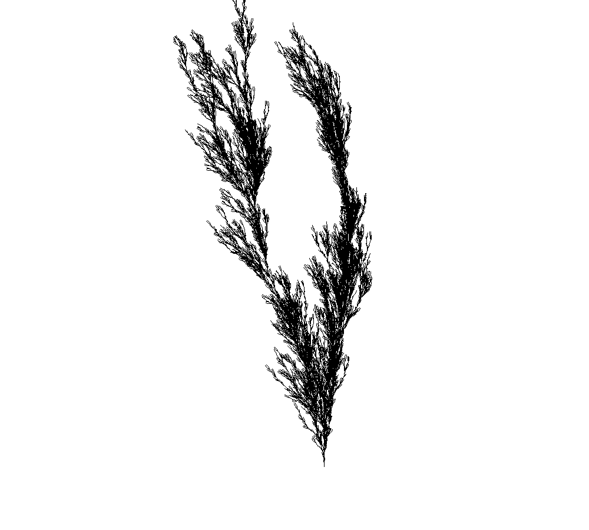|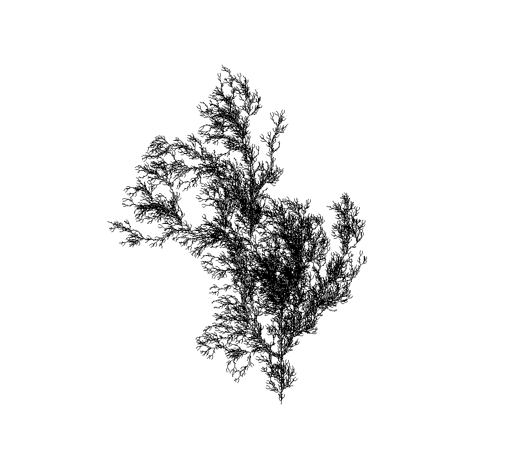|
|:---:|:---|
|angle=13.935|angle=31.845|
|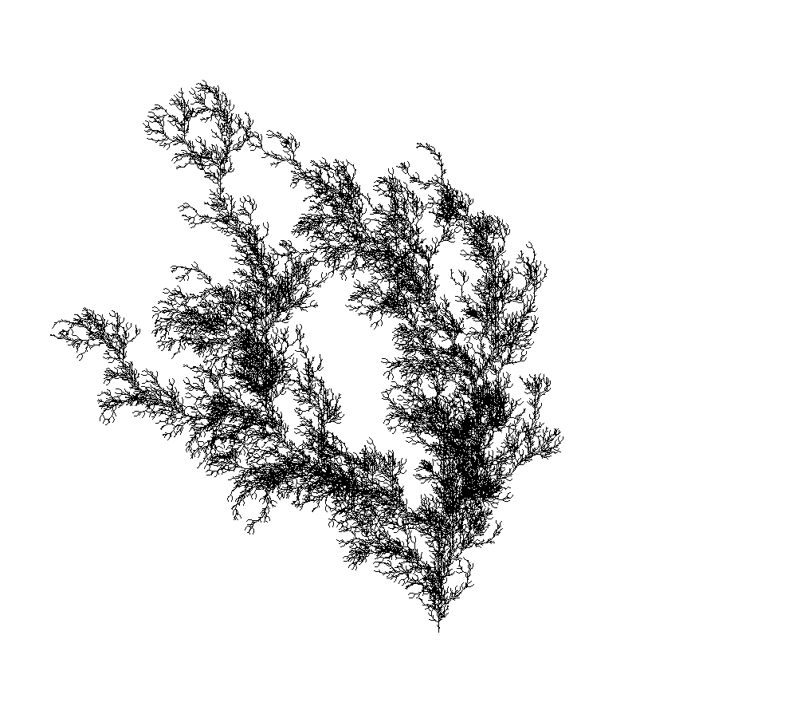|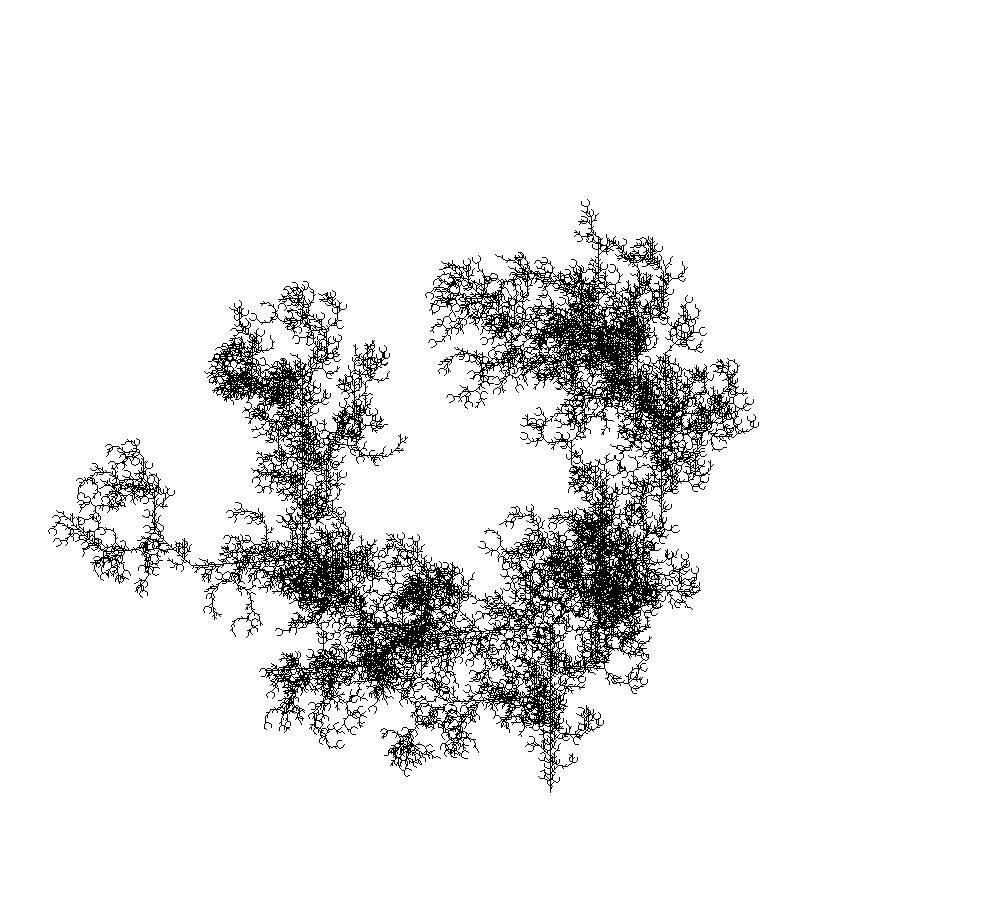|
|angle=34.83|angle=48.76|

利用L系统生成的分形树

**Looked at this way, an object that seems at first to be geometrically very complex, compared to a cone or a cube, is revealed to have an underlying simplicity.**

**以这样的方式来看，一个最初看起来在几何上非常复杂的物体，与圆锥体或立方体相比，被揭示有潜在的简单性。**

How can we describe this geometry mathematically? A tree has no real symmetry at all in the sense explained in the previous chapter: you can’t rotate or reflect it in any way to produce a shape that looks identical.  
We might be tempted to conclude that geometry has, in fact, nothing to say about this pattern. But it does. We just need a different kind of geometry. It is called fractal geometry, and it has been said to be “the geometry of nature.”

我们怎样用数学来描述这个几何体？在前一章所解释的意义上，一棵树根本没有真正的对称性：你不能以任何方式旋转或反射它来产生看起来完全相同的形状。  
我们可能会得出这样的结论：传统几何学实际上根本没有研究过这个模式。确实如此。我们现在需要一种不同的几何学，它被称为 **分形几何学**，它被称为“ **自然界的几何学**”。

---
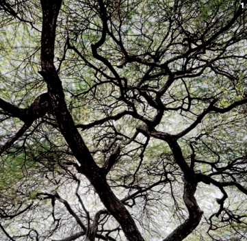

1 BRANCHING FRACTALS  
Tree branches in Lake Manyara National Park, Tanzania.

1 分支分形  
坦桑尼亚曼雅拉湖国家公园的树枝。

---
The key to fractal geometry lies with the algorithmic approach to the forms it produces. What the “tree algorithm” is really saying is:  
keep making the same kind of structure (in this case, a branching junction) again and again at ever-smaller scales. Because of this repetition at different scales, a small part of a tree can resemble the whole thing. Break off the end of a branch and you have something that looks rather like a miniature tree. If you imagine continuing the branching steps without end, then you’d not really be able to tell, simply by looking at a fragment of the shape, how big it was: whether you were seeing the whole tree, or a yard-long branch segment, or a tip no longer than your thumb.

|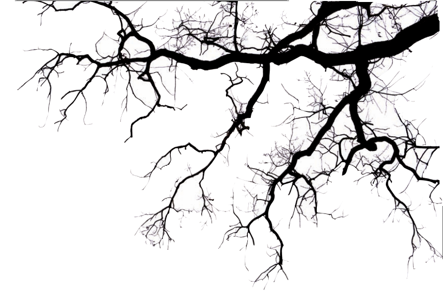|
|:---:|
|树枝的剪影|

分形几何的关键在于它产生的图形的计算算法。“树算法”的描述是这样的：  
不断地以越来越小的规模生成同样的结构（在这种情况下，是一个分支连接）。因为这种重复在不同的尺度上，一棵树的一小部分可以类似于整体。把树枝的末端折断，你就得到了一棵看起来很像微型树的东西。如果你想象继续不停地分枝步骤，那么你就不可能仅仅通过观察形状的一个片段就知道它有多大：你看到的是整棵树，还是一码长的树枝，或者一个不超过拇指的尖端（ **自相似性**）。

This kind of structure that repeats again and again at smaller scales is said to be “self-similar.”Fractals are always self-similar. Their structure is“hierarchical,” which means that it is patterned over a succession of different size scales: the trunk of a tree represents one level of the hierarchy, the main branches constitute the next level, and so on.  
In some natural fractals, the self-similarity of the structure extends over a wide range of scales.A coastline may be rugged and irregular over distances ranging from a yard or so (a fractured cliff edge, say) to perhaps hundreds of miles.

这种在小尺度上反复出现的结构被称为“自相似”，分形总是自相似的。它们的结构是“层次结构”，这意味着它是在一系列不同大小的尺度上形成的：树干代表层次的一个层次，主分枝构成下一个层次，等等。  
在一些自然分形中，结构的自相似性延伸到了广泛的范围。海岸线可能崎岖不平，而且不规则，从一码左右的距离（比如断裂的悬崖边缘）到数百英里。分形理论之父Mandelbrot第一篇关于分形的专著即是“**英国的海岸线有多长？**”

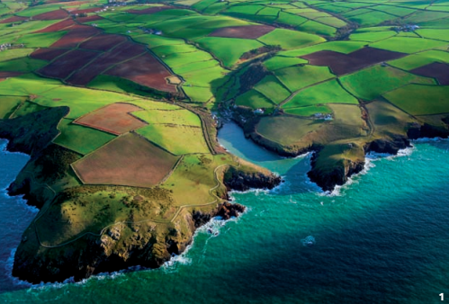

1 LAND’S END  
Erosion carves coastlines into forms with details at many scales.

1 海岸线  
侵蚀将海岸线雕刻成具有许多尺度的细节。

Without any points of reference to give us clues about the scale—such as a coastal cottage on the cliff edge—we might be quite unable to tell from an aerial photograph whether we’re looking at a bay a hundred yards across or the entire coastline of a country. It’s the same for a cloud, the wispy edge of which might also have a fractal shape: if you’re shown just a bit of it, you can’t tell how much of the whole it represents.Nature can make fractals that are more orderly than the random crenellations of a coastline.

如果没有任何参照点来给我们提供有关比例的线索，例如悬崖边的一座沿海小屋，我们可能无法从航拍照片中分辨出我们是在看一个100码宽的海湾，还是在看一个国家的整个海岸线。对云来说也是一样的，云的细小边缘也可能有分形的形状：如果你只看到一点点，你就无法分辨它代表了多少整体。大自然利用分形可以比海岸线的随机裂隙更有序。

Some plants branch in an almost regimented progression, so that each level of the hierarchy offers a rather precise echo of the last, reduced in scale. In ferns, each Christmas-tree-shaped stem sprouts a train of sub-stems, their size diminishing steadily toward the tip even as they remain almost perfect replicas of the whole stem itself. Still more captivating is the fractal head of a Romanesco cauliflower, its conical profile embellished with smaller versions of itself over three or so hierarchical levels. Equally impressive in its way is the dragon’s blood tree of the Socotra archipelago in the Indian Ocean, with branches that repeatedly divide neatly in two.

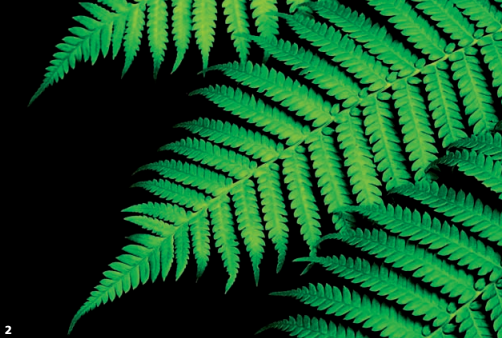
2 DIMINISHING FRACTAL  
Ferns show an orderly mirroring of form at several successively smaller levels.

2 递减分形  
蕨类植物在几个较小的层次上表现出有序的镜像。

有些植物以近乎精确有序的进程来分枝，这样层次结构的每一个层次都提供了上一个层次的相当精确的相似，只是缩小了规模。在蕨类植物中，每棵圣诞树形的茎都会长出一系列的子茎，它们的大小不断地向顶端递减，即使它们仍然是整个茎的完美复制品。更引人入胜的是罗曼尼斯科花椰菜的分形头部，它的圆锥形轮廓上点缀着三层或三层以上的较小版本。同样令人印象深刻的是印度洋索科特拉群岛的龙血树，它的枝条不断地整齐地分为两部分。

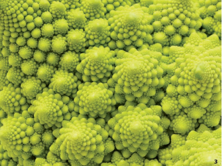

3 WHORLS WITHIN WHORLS  
The florets of Romanesco cauliflower are conical structures reproduced and elaborated on several scales.

3 螺纹内嵌着螺纹  
罗马式花椰菜的花瓣是螺旋锥形结构，在多个尺度上再现和精确重复。

There is a limit to the fractal branching of a tree, because real objects are made of a tangible substance that can’t become indefinitely fine in its details. If nothing else, the wiggles and crinkles can’t get smaller than the atoms from which the thing is made. There’s also an upper limit: you don’t get trees as big as mountains. So all natural objects that have a self-similar fractal structure do so only over a particular range of scales.  
But some mathematical fractals sustain their self-similarity no matter how finely you look, because numbers can keep getting more minutely distinct forever. In the 1970s the mathematician Benoit Mandelbrot, who gave fractals their name, discovered an equation that can generate a fractal boundary in “number space,” now known as the Mandelbrot set. The edges of this blobby “snowman” shape are covered in smaller blobs that, when looked at closely, resemble tiny versions of the same basic shape, sometimes with fine, jagged filaments extending outward.

|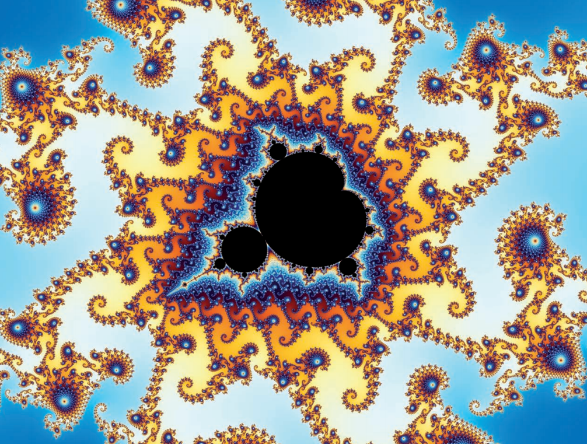|
|:---:|
|Mandelbrot集|

树的分形分支是有限度的，因为真实的物体是由有形的物质构成的，这种物质在细节上不能变得无限精细。如果没有别的东西，扭动和皱褶不能比制造物体的原子更小。还有一个上限：你不会得到像山那么大的树。因此，具有类似自相似分形结构的所有自然物体仅在特定范围的尺度上是这样的。  
但数学上的分形无论你想让它有多么精细，都能保持它们的自相似性，因为数字可以永远保持更加细微的差别。特别是当计算机普遍运用于数值计算后，这个可见的结果便可以被呈现出来了。这个时间点大概是在20世纪70年代时到来，数学家Benoit Mandelbrot给出了分形的名字，发现了一个迭代方程式，可以在“数空间”中产生分形边界，现在称为Mandelbrot集。这个胖乎乎的“雪人”形状的边缘覆盖着更小的斑点，当仔细观察时，这些斑点类似于相同基本形状的微小版本，有时有细锯齿状的细丝向外延伸。

No matter how much you magnify the shape,the same weird snowman keeps showing up.It was a shock for mathematicians, used to the calm decorum of geometric shapes, to discover that pure numbers can spawn something this elaborate, poised at the border of regularity and chaos.

|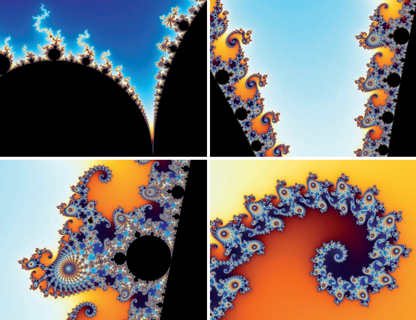|
|:---:|
|Mandelbrot集放大的局部|

不管你把形状放大多少，还是会有一个奇怪的雪人出现。对于数学家来说，这非常震惊，他们已习惯了几何图形的平静稳重。现在却发现纯粹的数字可以产生如此复杂的东西，同时在规则和混乱的边界上还保持着平衡。


4 FRACTAL NETWORKS  
The vein systems of leaves achieve efficient distribution of fluids through networks of progressively smaller elements.

4分形网络  
叶片的静脉系统通过逐渐减小的元件网络实现汁液的有效分配。


>continue.....
