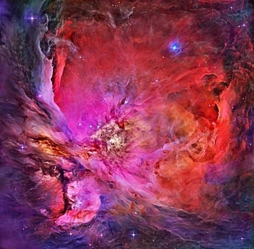

```
Created on Thu May  9 22:24:01 2019

@author: molychin@qq.com
```


■Introduction

The world is a confusing and turbulent place, but we make sense of it by finding order. We notice the regular cycles of day and night, the waxing and waning of the moon and tides, and the recurrence of the seasons. We look for similarity, predictability, regularity: those have always been the guiding principles behind the emergence of science. We try to break down the complex profusion of nature into simple rules, to find order among what might at first look like chaos. This makes us all pattern seekers.

介绍    
世界是一个混乱而令人困惑的地方，但我们总试图找出秩序来理解它。我们观察到昼夜的交替变化，，以及季节周而复始的重现。我们在寻找其中的相似性、可预测性和规律性：那些一直隐藏在（自然）现象背后的科学规律。我们试图把大量复杂的自然现象分解成简单的部分，并在最初看起来像混沌的事物中寻找秩序。这使我们都成为模式的搜寻者。`【我们试图发现复杂自然现象背后的简单模式。】`

自然界中总是存在着困惑和神秘之地，但人类总是试图从中找出秩序【规律】并理解它。人们已经注意到了昼夜的交替变化，潮汐涨落与月亮盈亏的息息相关。我们在其中寻找着 **相似性 、可预测性和规律性** 。人们习惯将 **秩序和规则** 视为上帝，而将 **混乱、无序和随机** 当做魔鬼。因为秩序，意味着事物在人类智力范围之内成为可预测物，意味着在未发生之前就可以预期结果，从而尝试避祸趋利。

It's a habit hardwired into our brains. From a baby's first inklings of repeated sounds and experiences, recognizing pattern and regularity  helps us to survive and make our way in the world. Patterns are the daily bread of scientists,but anyone can appreciate them, and respond to them with delight and wonder as well as with aesthetic and intellectual satisfaction. Just about every culture on earth, from the ancient Egyptians to Native Americans and Australian Aborigines,has decorated its artifacts with regular patterns.
It seems that we find these structures not only pleasing but also reassuring, as if they help us believe that, no matter what fate brings, there is a logic and order behind it all.

这是一种我们大脑（潜意识）的习惯。从婴儿第一次反复听到的声音和经验中，认识到模式和规律有助于我们生存并走进世界。模式是科学家们的一日三餐，但任何人也都能领会它们，并从中获取愉悦而惊奇的审美和智力快感。几乎所有地球文明，从古埃及人到美洲土著及澳大利亚土著，都用规则的图形（模式）来装饰他们的（史前）器物。    
这些图形图案似乎不仅让我们愉悦，而且令人安心，好像它们使我们相信，不管命运如何，其背后都隐藏着逻辑和秩序。  


But when we make our own patterns, it is through careful planning and construction, with each individual element cut to shape and laid in place, or woven one at a time into the fabric.
The message seems to be that making a pattern requires a patterner. That's why, when people in former times recognized patterns in nature—the bee’s honeycomb, animal markings, the spiraling of seeds in a sunflower head, the six-pointed star of a snowflake—they imagined it to be the fingerprint of intelligent design, a sign left by some omnipotent creator in his handiwork.

当我们制定自己的（图案）模式，往往需要通过仔细地规划和构造，每个独立的部件切割成形，放置在合适的位置，或及时地编织成一个整体。  
这看起来必须要有个设计师来设计这些模式。正因为如此，当人们在自然界中看到例如蜜蜂的蜂巢、动物痕迹、向日葵头部种子排列的螺旋状、雪花的六尖星时，他们认为这些是智能设计的证明，必然是有一个万能创造者（上帝）留下他的手工制品。


Today, we don’t need that hypothesis. It’s clear that pattern, regularity, and form can arise from the basic forces and principles of physics and chemistry, perhaps selected and refined by the exigencies of biological evolution. But that only deepens the mystery. How does the intricate tapestry of nature contrive to organize itself, producing a pattern without any blueprint or foresight? How do these patterns form spontaneously?

但今天，我们并不需要这个（上帝存在的）假设。很明显，（图案）模式、规律和（结构）形式都可以从物理和化学基本原理和规则中产生，也许所有这些都可以通过生物进化的迫切性来选择和提炼。但这样说只会加深神秘感，自然又如何在没有先见和蓝图的情况下，自行完成这些错综复杂的设计而呈现可见的模式？

There are clues in how they look. Perhaps the most curious thing about natural patterns is that they come from a relatively limited palette,recurring at very different size scales and in systems that might seem to have nothing at all in common with one another. We see spirals, say, and hexagons, intricate branching forms of cracks and lightning, spots and stripes. It seems that there are types of pattern-forming process that don’t depend on the detailed specifics of a system but can crop up across the board, even bridging effortlessly the living and the non-living worlds.

它们的外观中存在着线索。也许自然图案（模式）最神奇的是它们来自一个相对有限的调色盘，它们以不同大小的尺度出现，并且在系统中似乎彼此毫无共同之处。我们能观察到螺旋形、六边形、复杂分支形态的裂缝和闪电、斑点和条纹。似乎有些类型的图案（模式）形成过程并不依赖于系统的具体细节，而是可以突然出现在整个系统中`【涌现】`，甚至毫不费力地将生命世界（有机体）与非生命世界（无机体）连接起来。


In this sense, pattern formation is universal: it doesn’t respect any of the normal boundaries that we tend to draw between different sciences or different types of phenomena.

在这个意义上，模式的形成是普遍的：它不遵从于我们所倾向的在不同科学或不同类型的现象之间绘制的任何正常边界。`【这也正是它的奇妙之处，也是除了模式所能呈现的惊人的美感之外更可以让人深入探究的源头所在。】`


■Growth and form?  
Do these patterns have anything in common, or is the similarity in their appearance just coincidence? The first person to truly grapple with that question was the Scottish zoologist  D’Arcy Wentworth Thompson. In 1917 Thompson published his masterpiece, On Growth and Form, which collected together all that was then known about pattern and form in nature in a stunning synthesis of biology, natural history,mathematics, physics, and engineering. As the title indicates, Thompson pointed out that, in biology at least, and often in the non-living world, pattern formation is not a static thing but arises from growth. “Everything is what it is,” he said, “because it got that way.” The answer to the riddle of pattern lies in how it got to be that way—how the pattern grew. That’s less obvious than it sounds: a bridge or a paddy field or a microchip is “explained” by how it looks, not by how it was made.

生长和形态？  
这些模式有什么共同点，或者它们外表上的相似性只是巧合吗？  
第一个真正解决这个问题的人是苏格兰动物学家 D' Arcy Wentworth Thompson。1917  Thompson出版了他的《生长和形态（On Growth and Form）》的杰作，收集了所有在自然界中已知的有关模式和形态的惊人的综合体，综合体涉及生物学、自然史、数学、物理和工程学。正如标题所指出的， Thompson指出，至少在生物学上，并且在非生物的物质世界中，模式的形成不是静态的，而是由生长产生的。“一切都是这样的”他说，“因为它是生长得来的。”模式谜语的答案在于它是如何成长的。这听起来并不那么明显：一座桥、一片稻田或一颗微芯片会被“解释”为什么是看起来的样子，而不是它是如何被制造的。   


Part of Thompson’s agenda was to put a brake on the runaway enthusiasm that had developed at that time for explaining all form and order in the living world by invoking Charles Darwin’s theory of natural selection—to say that the pattern was there because it served some adaptive purpose in helping the organism to survive. Not necessarily,Thompson cautioned. Perhaps nature simply had no choice: the shape is decided by the dictates of physical forces, not by the convenience for biology. Even living creatures have to be soundly engineered to withstand the whims of fate. It was a timely reminder of the constraints on Darwin’s theory, but it doesn’t actually conflict with it. In the living world, pattern formation seems both to restrict the options for adaptive change and to offer new adaptive opportunities—to operate, in other words, in parallel and sometimes in sympathy with Darwinian evolution. It supplies,for example, the color markings that animals put to striking use for camouflage, or as warning signs to predators, or so that members of a species can recognize each other. These patterns might not be arbitrary, but they can be useful.

Thompson的目标是要遏制大众对Charles Darwin的“自然选择”理论失控的热情。该理论在当时已经推广开来，其试图通过生物的“适者生存”理论来解释自然界中所有的形态和秩序。Thompson警告道，也许大自然拥有的别无选择的形状是由物理力的支配决定的，并非得益于生物学。甚至生物必须得承受命运的反复无常。这是一个及时的提醒，是对达尔文理论的一个约束，但它们实际上并不冲突（矛盾）。在生命世界中，模式的形成似乎既是对生物适应变化的制约，也能提供新的适应机会。换句话说，生成模式（理论）有时与Darwin的“进化论”是平行而可以共同存在的。它提供的，例如，彩色斑纹即可以让动物伪装（躲避捕食者），也可以作为警示标志警告捕食者，或使同一个物种的成员可以互相认识。这些模式可能不是随意的，但他们可以是有用的。  
`【我个人一直对达尔文的理论持保留意见，关于生物进化的事实与动机及其形成机制，因为有很多现成的反例或过多拼凑的正例。当然这种保留的动力并非来源于需要上帝的意愿，相反，我同样认为，这个世界，即使无需上帝（的假设），它也同样也可以存在。它的存在同样不需要“适者生存”这种无谓的假设。】`


At the same time, however, Thompson’s book helped to show why it was not simply coincidence that the same patterns and forms ranged across the sciences—why, say, the arrangements made by soap bubbles might resemble  those of clusters of living cells or the meshlike skeletons of small sea creatures, why snail  shells and ram’s horns curl into mathematical spirals, why animal backbones are shaped like cantilever bridges.

然而，与此同时，汤普森的书有助于说明为什么在科学【自然】领域中反复出现相同的模式和形态并非巧合，为什么说肥皂泡的排列可能类似于活细胞群或小海绵体的网状骨架。另外，为什么蜗牛壳和公羊的角蜷缩成（数学意义上的）螺旋，为什么动物脊骨的形状像悬臂式吊桥等等。


*MATHEMATICAL ORDER  
Regular geometric designs of great sophistication are common in traditional Islamic architectural
decoration, expressing a sense of an orderly cosmos. Some of these Islamic artists seemed particularly drawn to pattern elements that cannot in themselves be packed into identically repeating arrays—such as pentagons and octagons.*

*数学秩序  
极其复杂的规则的几何图案在传统的伊斯兰建筑装饰中是非常常见的，其表达了一种井然有序的宇宙观。这些伊斯兰艺术家看起来非常善于绘制这些规则图形元素，而仅靠这些图形元素本身并不能被拼装成相同的重复序列，例如五边形和八边形。*


PATTERN EVERYWHERE
Regularity and order pervade the natural world, both living and non-living. Sometimes it takes a microscope (or a telescope) to see it,as in the case of these pollen grains.

随处存在的（图形）模式
无论是生物还是非生物，规律和秩序遍布于自然界。有时需要依赖显微镜（或望远镜）才能观察到它，就像这些花粉颗粒的图像一样。
`【正因为借助于人类制造的仪器设备（显微镜、望远镜等），在近一个世纪以来，使人类大大扩展了对可见自然的视野，同时也产生了很多原来不曾有的视觉经验。这些新鲜的视觉景象，不仅停留在科学研究，同样也潜在地影响着艺术领域的创作。】`

In the midst of wonders  
He didn’t get everything right, by any means, but Thompson was on the right track. In the century that has elapsed since On Growth and Form was published, many new natural patterns have been identified and explained, and today there are scientists who specialize in studying these things, aided by conceptual, experimental, and computational tools that Thompson lacked. The questions are fascinating and challenging, but it’s hard not to suspect that a big part of the allure is aesthetic: these forms and arrangements are also beautiful.

在奇观中  
Thompson并没有把所有的事情都搞定，但他走在了正确的道路上。自《生长和形态》出版以来的世纪里，有更多新的自然模式已经被识别和解释，今天有科学家专门研究这些东西，并得到了新的概念、实验条件和计算工具的帮助，而当年Thompson 缺乏这些东西。这些问题很吸引人，也很有挑战性，但是很难不去怀疑这种吸引力的很大部分来自于美学的：这些形式和排列状态是非常漂亮的。  
`【这里特别要指出的是各类观察仪器的诞生，使人类的眼界从奈米级到光年级的尺度上都能得到自然界的图像（模式）。另外，由于拥有了超级计算速度和容量的计算机，人们可以人为地绘制（仿真、模拟）由复杂系统或非线性系统所产生的图像（模式）。这些新型的图像（模式）大大拓展了眼界，也重新引起美学上的思考。】`


由计算机绘制的分形图像


玫瑰星云

These patterns affirm, too, what the American physicist Richard Feynman said about the workings of the universe: “Nature uses only the longest threads to weave her patterns, so each small piece of her fabric reveals the organization of the entire tapestry.” The principles that operate in the world are general ones, and you can sometimes read them as clearly in a small corner as in a big vista: in a saucepan on the stove, you might see an intimation of the convection patterns that arrange the clouds across the sky, for example, while the network of veins in your body echoes (for good reason) the great river networks that cross continents and shape mountain ranges.

这些图案（模式）也印证了美国物理学家理 Richard Feynman关于宇宙运行的说法：“自然界只用最长的丝线来编织图案，所以她的每一小块织物都隐含了整个挂毯的结构。”这些支配世界运作的原则是普遍适用的，有时你可以在一个小角落里见到清晰地见证到远景：在火炉上烧烤一个（盛水的）平底锅，你就可以看到一种对流模式呈现出来，同样的模式也适用于云在天空中翻滚；而你身体中的静脉网络也（很有理由）等同于河流跨越大陆和山脉。

  
高空拍摄的河流入海口

  
人体血管

This doesn’t mean to say that one grand theory explains all these things, although some scientists have dreamed, and still dream, of such a thing. But it does make many patterns variations on a theme, and reflects the fact that they often arise from broadly similar processes—ones in which some driving force, be it gravity or heat or evolution, prevents the system from ever settling into a steady, unchanging state; in which various influences interact with each other, sometimes reinforcing and sometimes competing; in which patterns and forms might switch abruptly to a new shape and appearance when the driving force exceeds some threshold value; in which small events can have big consequences and what goes on here can influence what transpires at a distant point there; and in which accidents may get frozen into place and determine what unfolds thereafter. There is no Law of Pattern Formation, but there is perhaps a recipe book.

这并不意味着一个宏伟的理论解释了所有事情，尽管一些科学家曾经梦想过，并仍然梦想着这样的好事。但是确实会在一个主题上产生许多模式的变化，并且反映了这样一个事实：它们通常是从大致相似的过程中产生的，其中一些驱动力，无论是重力还是热，还是进化，都防止了系统趋向稳定，趋向不变的状态。各种影响相互作用，有时加强和有时对抗；当驱动力超过某个阈值时，模式和形态可能突然转变为新的形状和外观【突现、自组织】。一个很小的事件可以有产生巨大的后果（影响），在此处发生的事情可以（遥远的）别处产生影响。或者一个事件会被暂时冻结（潜伏），但在（未知的）才再产生影响。这些模式没有固定的生成法则，但又或许其完全是依照烹饪书籍在制作。`【意味着我们对具体的模式形成机制并没有完全掌握。】`  
`【没有变化状态，亦是没有活力的状态。无论是从中国哲学（易学）还是印度哲学，不变即将意味着死寂甚至趋向灭亡。生命的活力或世界进化的动力都是来源于阴阳的交合和变化。】`  
`【这里涉及的现象和论点其实都属于复杂性系统理论（混沌理论或非线性理论）的范畴。】`

This book will certainly not explain all or even most of those prescriptions That’s been done elsewhere (see Further Reading, page 283, for examples). The aim here is to offer a flavor of the recipes, but most importantly, to display the results in all their glory. This, perhaps more than any other field of scientific study, is a topic driven by wonder. I confess that some of the images in these pages are ones that science can’t yet fully explain; perhaps the general principles are clear, but not the details and nuances. There are also some images that are included not because they illustrate a clear or single scientific process but because of their sheer splendor. We need that too. We need to marvel and admire as well as to analyze and calculate. Natural patterns offer raw delights, but they also point to something deep, as Feynman intimated. They show that, sometimes, to understand the world we need not only to dissect it into its component parts but also to build it back up again. Forms and effects emerge from the rich interplay of components in a way that you would—indeed could—never guess by looking at them individually. It is not mere mysticism or anthropomorphism to suggest that this emergence of new form reveals a kind of spontaneous creativity in nature. The world uses simple principles to bring forth variety and riches, Darwin’s “endless forms most beautiful.” Some of that beauty is captured here.

这本书当然不会解释（讨论）所有或大部分的自然模式。这些论述已经在我的其他著作中完成了（更多内容参见第283页）。这里的只是先提及这些食谱（图案）的味道，但最重要的是，展示其所有绚丽荣耀视觉感受。这也许比任何其他科学研究领域都更为神奇。我承认这些页面中的一些图像是科学无法完全解释的，也许一般原则是清楚的，但不能解释的也不仅仅只是细节和细微差别。这里还包括一些图像，不是因为它们说明了一个清晰或单一的科学过程，而是因为它们的辉煌（惊艳）。我们也需要这样图像。我们需要惊奇和钦佩，还要分析和计算。自然图案提供了原始的乐趣，但它们也指向了某种深邃的东西，正如Feynman所暗示的。它们表明，有时候，我们不仅需要了解它的组成部分，而且需要重新构建它。形式和效果会从（局部）组件的丰富相互作用中产生出来，这样你就永远无法仅通过观察它们的个体来猜测相互作用的后果。它不能仅仅归结于神秘主义或拟人主义（人格化），当这种新形式的出现揭示了自然界中一种自发的创造性。世界用简单的原则来创造多样性和丰富性，达尔文所谓的“无休止的形式最美丽”。   
`【简单规则下的相互作用会创造丰富的成果或者复杂的现象背后隐藏着简单的事实，这是复杂性理论的一个基本认识和观点。正是这样简单而深刻的认识，明了地解释了多姿多态的自然为何会如此。同样将这个原理运用于艺术创作，过去，人们一直抱着直接模拟观察到的对象的外观所见而进行描绘。如果懂得了自然创生的原理，则可以采用新的创作手段，以更接近自然的创作方式。说得更明白一些，可以是，以流动表现流动，以干裂表现干裂，以起泡表现起泡......】`

  
NATURAL EXUBERANCE   
The glorious plumage of the vulturine guinea fowl, native to northeastern Africa.   

丰富的自然  
辉煌艳丽的珍珠鸡的羽毛，原产于非洲东北部。

  
THE PATTERN PALETTE  
Certain forms, shapes, and patterns recur again and again in the natural world, in systems that seem to have nothing to do with one another.Waves of growth are one of them, as can be seen in this piece of agate.

图案（模式）调色板  
特定的样式、形状和图案在自然界中反复出现，而且是在看似彼此毫无联系的系统中重现。生长波纹就是其中之一，正如在这片玛瑙中可以看到的那样。`【作为无机物的晶体形成，我们一般也使用“生长”一词，不仅指生命体。】`
