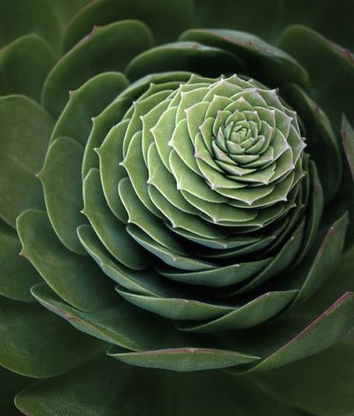
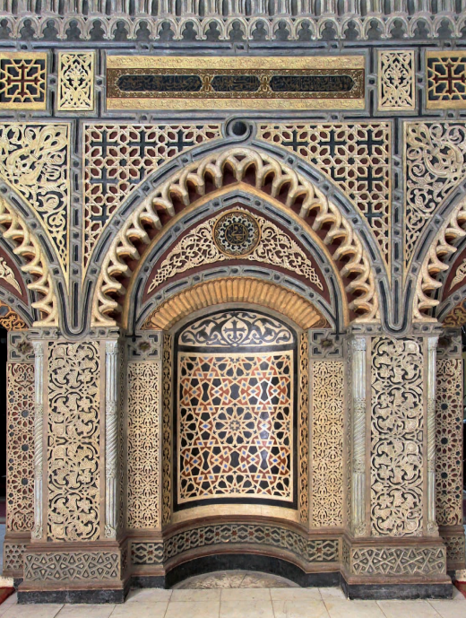
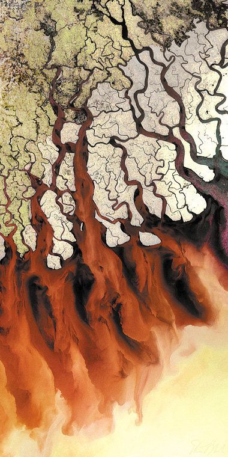
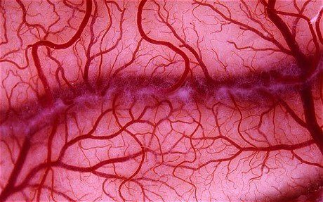

```
Created on Thu May  9 22:24:01 2019
Pattern in Nature Author：Philip Ball
自然模式 编译：Moly Chin
@author: molychin@qq.com
```
---

#### ■生长和形态
这些模式有什么共同点，或者它们外表上的相似性只是巧合吗？  
第一个真正解决这个问题的人是苏格兰动物学家 D' Arcy Wentworth Thompson。1917  **Thompson** 出版了他的《**生长和形态（On Growth and Form）**》的杰作，收集了所有在自然界中已知的有关模式和形态的惊人的综合体，综合体涉及生物学、自然史、数学、物理和工程学。正如标题所指出的， Thompson指出，至少在生物学上，并且在非生物的物质世界中，**模式的形成不是静态的，而是由生长产生的**。“一切都是这样的”他说，“因为它是生长得来的。”模式谜语的答案在于 **它是如何成长的**。这听起来并不那么明显：一座桥、一片稻田或一颗微芯片会被“解释”为什么是看起来的样子，而不是它是如何被制造的。也就是说，形态不能理解为是由一个静态模板复制而成的，而是一种动态过程的结果，例如生成过程的结果，像树的形态、花的形态，很多生物的形态，都是一个生长过程化的结果。




||
|:---:|
|《生长和形态》|

关于一种形态是如何形成的，这里给大家准备了一个很好理解的例子，我把它称为 **[“沙漠迷途者的足迹”](./Moly_NaturePatterns_footmark.md)**。这个模式形成的原理非常简单，我想即使是小学水平的智力也能看懂。

Thompson的目标是要遏制大众对Charles Darwin的“**自然选择**”理论失控的热情。该理论在当时已经推广开来，其试图通过生物的“**适者生存**”理论来解释自然界中所有的形态和秩序。Thompson警告道，也许大自然拥有的别无选择的形状是由物理力来支配决定的，并非得益于生物学（遗传学）。甚至生物必须得承受命运的反复无常。这是一个及时的提醒，是对Darwin理论的一个约束，但它们实际上并不冲突（矛盾）。在生命世界中，模式的形成似乎既是对生物适应变化的制约，也能提供新的适应机会。换句话说，生成模式（理论）有时与Darwin的“进化论”是平行而可以共同存在的。它提供的，例如彩色斑纹即可以让动物伪装（躲避捕食者），也可以作为警示标志警告捕食者，或使同一个物种的成员可以互相识别。这些模式可能不是随意的，但他们可以是有用的。  

我个人一直对 Darwin 的理论持保留意见，关于生物进化的事实与动机及其形成机制，因为有很多现成的反例或过多拼凑的正例。当然这种保留意见的动力并非来源于需要上帝的意愿，相反，我同样认为，这个世界，即使无需上帝（的假设），它也同样也可以存在。它的存在同样不需要“适者生存”这种 **无谓的假设**。


然而，与此同时，Thompson的书有助于说明为什么在（自然）科学领域中反复出现相同的模式和形态并非巧合，为什么说肥皂泡的排列可能类似于活细胞群或小海绵体的网状骨架。另外，为什么蜗牛壳和公羊的角蜷缩成（数学意义上的）螺旋，为什么动物脊骨的形状像悬臂式吊桥等等。

||
|---|
|*数学秩序：极其复杂的规则的几何图案在传统的伊斯兰建筑装饰中是非常常见的，其表达了一种井然有序的宇宙观。这些伊斯兰艺术家看起来非常善于绘制这些规则图形元素，而仅靠这些图形元素本身并不能被拼装成相同的重复序列，例如五边形和八边形。*|

||
|---|
|到处存在的（图形）模式 <br>无论是生物还是非生物，规律和秩序遍布于自然界。有时需要依赖显微镜（或望远镜）才能观察到它，就像这些花粉颗粒的图像一样。 <br><b>正因为借助于人类制造的用于观察世界的仪器设备（显微镜、望远镜等），在近一个世纪以来， **使人类大大扩展了对可见自然的视野，同时也产生了很多原来不曾有的视觉经验。这些新鲜的视觉景象，不仅停留在科学研究，同样也潜在地影响着艺术领域的创作。**|

在奇观中  
Thompson并没有把所有的事情都搞定，但他走在了正确的道路上。自《生长和形态》出版以来的世纪里，有更多新的自然模式已经被识别和解释，今天有科学家专门研究这些东西，并得到了新的概念、实验条件和计算工具的帮助，而当年Thompson 缺乏这些东西。这些问题很吸引人，也很有挑战性，**但是很难不去怀疑这种吸引力的很大部分来自于美学的：这些形式和排列状态是非常漂亮的**。  
这里特别要指出的是各类观察仪器的诞生，使人类的眼界从奈米级到光年级的尺度上都能得到自然界的图像（模式）。另外，由于拥有了超级计算速度和容量的计算机，人们可以人为地绘制（仿真、模拟）由复杂系统或非线性系统所产生的图像（模式）。这些新型的图像（模式）大大拓展了眼界，**也重新引起美学上的思考**。

||
|:---:|
|由计算机绘制的分形图像|

||
|:--:|
|玫瑰星云|

这些图案（模式）也印证了美国物理学家理 Richard Feynman 关于宇宙运行的说法：“自然界只用最长的丝线来编织图案，所以她的每一小块织物都隐含了整个挂毯的结构。”这些支配世界运作的原则是普遍适用的，有时你可以在一个小角落里见到清晰地见证到远景：在火炉上烧烤一个（盛水的）平底锅，你就可以看到一种对流模式呈现出来，同样的模式也适用于云在天空中翻滚；而你身体中的静脉网络也（很有理由）等同于河流跨越大陆和山脉。

||
|:---:|
|高空拍摄的河流入海口|

||
|:---:|
|人体血管|

**这并不意味着一个宏伟的理论解释了所有事情**，尽管一些科学家曾经梦想过，并仍然梦想着这样的好事。但是确实会在一个主题上产生许多模式的变化，并且反映了这样一个事实：它们通常是从大致相似的过程中产生的，其中一些驱动力，无论是重力还是热，还是进化，都防止了系统趋向稳定，趋向不变的状态。各种影响相互作用，有时加强和有时对抗；当驱动力超过某个阈值时，模式和形态可能突然转变为新的形状和外观(**突现、自组织**)。一个很小的事件可以有产生巨大的后果（影响），在此处发生的事情可以在（遥远的）别处产生影响。或者一个事件会被暂时冻结（潜伏），但在以后一个未知的时间才产生影响。这些模式没有固定的生成法则，但又或许其完全是依照烹饪书籍在制作。这意味着我们对具体的模式形成机制并没有完全掌握。

没有变化状态（静止的状态），亦是没有活力的状态。无论是从中国哲学（易学）还是印度哲学（shiva信仰），不变即意味着趋向死寂甚至灭亡。生命的活力或世界前进的动力都是来源于阴阳的交合和变化。**这里涉及的现象和论点其实都属于复杂性系统理论（混沌理论或非线性理论）的范畴**。

这本书当然不会解释（讨论）所有或大部分的自然模式。这些论述已经在其他著作中完成了（更多内容参见附录）。这里的只是先提及这些食谱（图案）的味道，但最重要的是，展示其所有绚丽荣耀视觉感受。这也许比任何其他科学研究领域都更为神奇。**我承认本文中的一些图像是目前科学无法完全解释的**，也许一般原则是清楚的，不能解释的也不仅仅只是细节和细微差别。这里还包括一些图像，不是因为它们说明了一个清晰或单一的科学过程，而是因为它们的辉煌绚丽（惊艳）。我们也需要这样图像，**我们需要惊奇和钦佩，还要分析和计算**。**自然图案提供了原始的乐趣，但它们也指向了某种深邃的东西**，正如Feynman所暗示的。它们表明，有时候，我们不仅需要了解它的组成部分，而且需要重新构建它。**形式和效果会从（局部）组件的丰富相互作用中产生出来，这样你就永远无法仅通过观察它们的个体来猜测相互作用的后果**。当这种新形式的出现揭示了自然界中一种自发的创造性，它不能仅仅归结于某种神秘主义或拟人主义（人格化）。世界用简单的原则来创造多样性和丰富性，Darwin 所谓的“**无休止的形式最美丽**”。   

**简单规则下的相互作用会创造丰富的成果或者复杂的现象背后隐藏着简单的事实，这是复杂性理论的一个基本认识和观点**。正是这样简单而深刻的认识，明了地解释了 **多姿多态的** 自然为何会如此。**同样可以将这个原理运用于艺术创作**，过去，**人们一直抱着直接模拟观察到的对象的外观所见而进行描绘。如果懂得了自然创生的原理，则可以采用新的创作手段，以更接近自然的创作方式**。说得更明白一些，可以是，**以流动表现流动，以干裂表现干裂，以起泡表现起泡......以自然的方式模仿自然。**

||
|:---:|
|丰富的自然 : 辉煌艳丽的珍珠鸡的羽毛，原产于非洲东北部。|

||
|:---:|
|图案（模式）调色板  <br>特定的样式、形状和图案在自然界中反复出现，而且是在看似彼此毫无联系的系统中重现。 **生长波纹** 就是其中之一，正如在这片玛瑙中可以看到的那样。作为无机物的晶体形成，我们一般也使用“生长”一词，不仅指生命体。|


>待续
