```
Created on Thu May  9 22:24:01 2019
Pattern in Nature Author：Philip Ball
自然模式 编译：Moly Chin
@author: molychin@qq.com
```

### CHAPTER 1 SYMMETRY  
### 第一章 对称

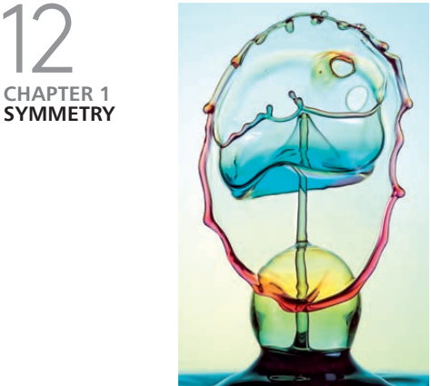

SYMMETRY  
Why your left is like your right (and why it’s different)

#### 对称  
为什么你的左半身和右半身几乎一模一样（它们为什么不能不同呢）？

What is a pattern, anyway? We usually think of it as something that repeats again and again. The math of symmetry can describe what this repetition may look like, as well as why some shapes seem more orderly and organized than others. That’s why symmetry is the fundamental scientific “language” of pattern and form. Symmetry describes how things may look unchanged when they are reflected in a mirror, or rotated, or moved.But our intuitions about symmetry can be deceptive.
In general, shape and form in nature arise not from the “building up” of symmetry, but from the breaking of perfect symmetry—that is, from the disintegration of complete, boring uniformity, where everything looks the same, everywhere. The key question is therefore: why isn’t everything uniform? How and why does symmetry break?

到底什么是模式？我们通常认为它是一种不断重复（可重复性）的东西。对称数学公式可以描述这种呈现出重复性的图像，以及为什么一些形状看起来比其他形状更加有序和有组织。这就是为什么 **对称** 是模式和形态的基本科学“语言”。对称性描述 **事物在镜面反射或旋转或移动时的不变性（对称的基本特性）**。但我们对对称性的直觉可能具有欺骗性。一般来说，**自然界的形状和形态不是来自绝对对称，而是来自对完美对称的破坏**，也就是说，**是对完全的、无聊的均匀性的瓦解**。否则的话，所有东西看起来无处不在，而且完全相同。关键问题是：为什么一切都不统一？对称性又是如何打破的？

|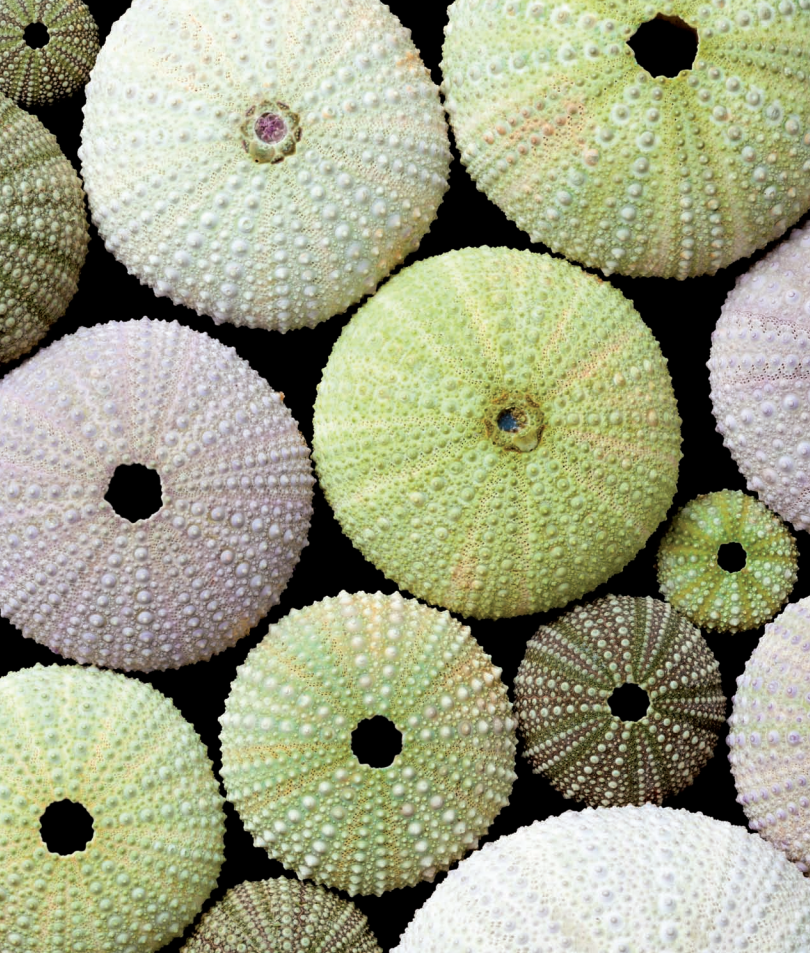|
|---|

但作为人类的制品，却偏向爱好绝对的对称（或者说，努力追求完美的对称），万花筒、中国瓷器等是我们观察对称性的可见的很好的例子。

|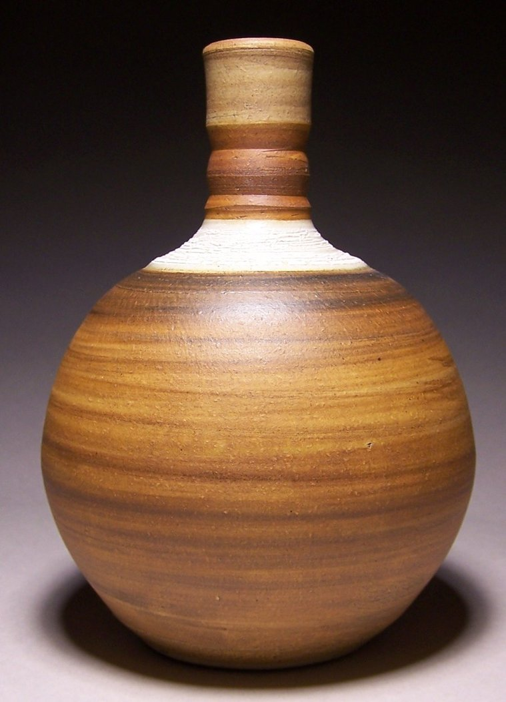|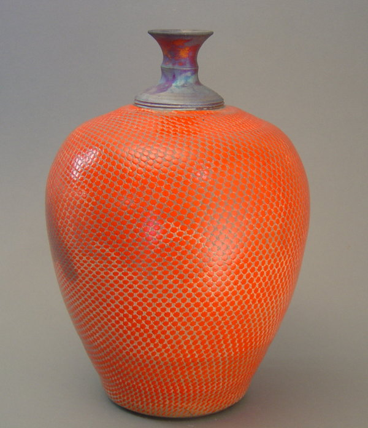|
|---|---|
|中国瓷器1|中国瓷器2|
|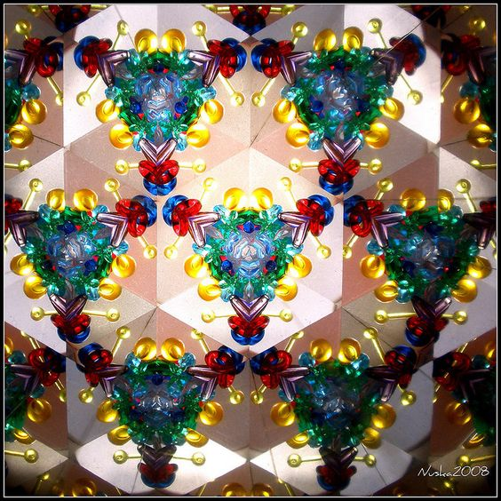|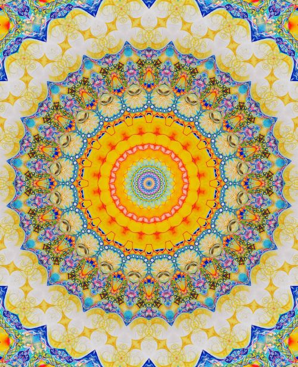|
|万花筒1|万花筒2|

所以从这点上来说，我 **并不喜欢绝对的，完美的对称，因为自然界中并不容易找到这样的范例**。而且，一般人类的完美制品，往往是借助机械设备来完成的，少了手工的味道。这也是为什么，我会更喜欢日本民间生活瓷器的原因。

|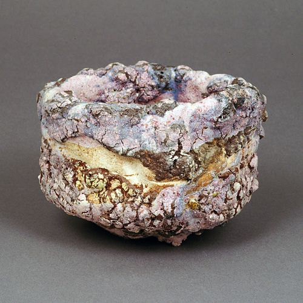|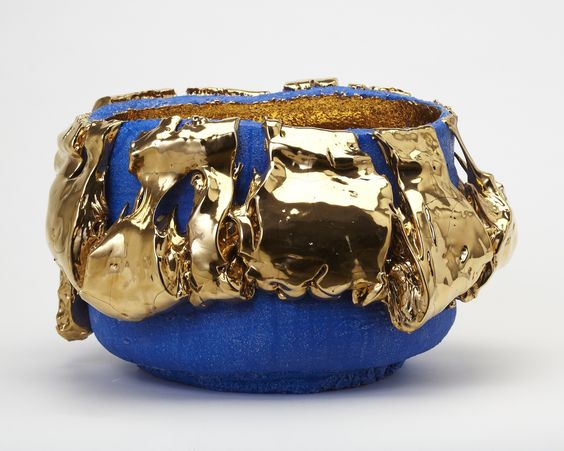|
|---|---|
|日本茶器1|日本茶器2|
|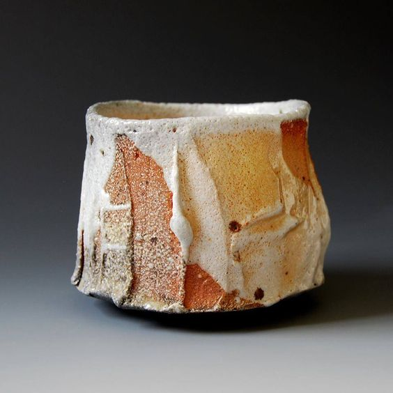|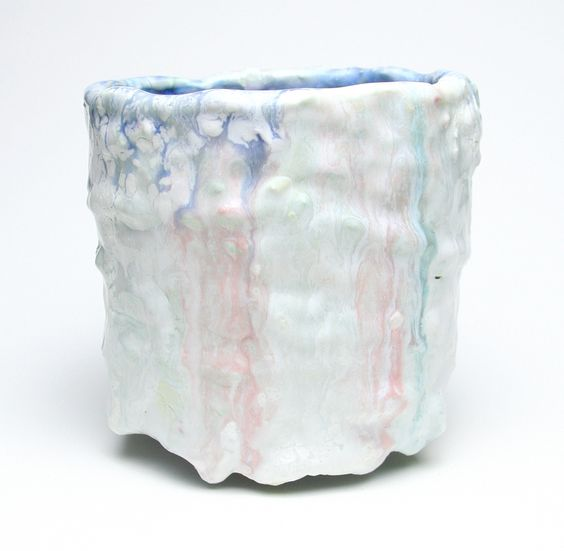|
|日本茶器3|日本茶器4|

-------------------
Pattern is an underlying structure that organizes surfaces or structures in a consistent, regular manner. Pattern can be described as a repeating unit of shape or form, but it can also be thought of as the "skeleton" that organizes the parts of a composition.

模式是一种基础结构，以一致，规则的方式组织表面或结构。 图案（模式）可以被描述为形状或形式的重复单元，但是它也可以被认为是组织构图的部分的“骨架”。

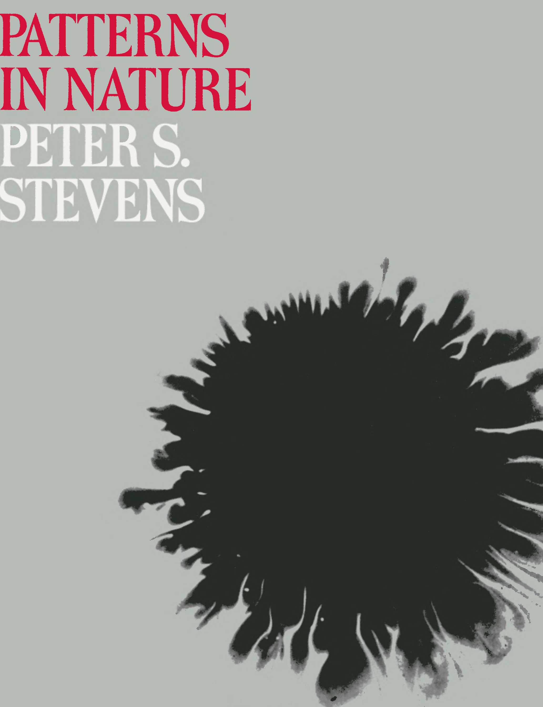

Pattern exists in nature as well as in designed objects; it is useful to look at the parallels. A Harvard biologist named Peter S. Stevens has published a book entitled "Patterns in Nature" in which he claims that there are only a finite number of ways that patterns can be structured. He starts with the idea of a grid as the foundation for any structure or image. He presents a set of ways in which the points of a grid can be connected. These modes of connection become classes of pattern, which he claims can be seen in any situation, in nature and in made images, and from the microscopic to the cosmic scale.
The modes he describes include the following which are described here in terms of examples from nature. However, each of these modes can also be seen in examples of designed objects and works of art:

模式存在于自然界和设计对象中; 看看相似之处是有用的。一位名叫Peter S. Stevens的哈佛生物学家出版了一本名为《自然的模式（Patterns in Nature）》的书，书中他声称只有有限数量的模式结构。他从网格的概念开始，作为任何结构或图像的基础， 他提出了一系列可以连接网格点的方法。这些连接模式成为模式的类别。他声称可以在任何情况下，在自然界和制作的图像中，以及从微观尺度到宇宙尺度中看到。
他描述的模式包括以下根据自然界的实例描述的模式。然而，这些模式中的每一个也可以在设计对象和艺术作品的例子中看到：

#### Flow
All things flow, following paths of least resistance. Flow can be seen in water, stone, the growth of trees. Meander patterning is related to the idea of flow, and is built on the repetition of an undulating line. In this detail from a textile hanging made up of knotted threads, the meandering color lines resulting from the technique quite naturally create this type of pattern.

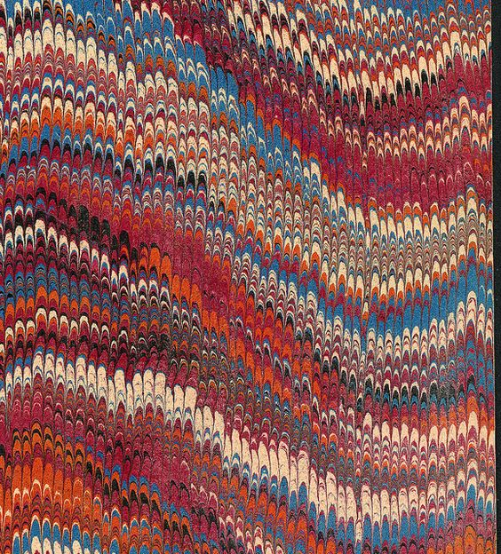

#### 流模式
所有流动的东西，都会沿着阻力最小的路径前进。流的形态可以在水、石头、树木的生长（纹理）中观察到。曲折图案与流动的概念相关，并且建立在波浪线的重复上。一件编制中的挂毯由打结的线组成，曲折的颜色线产生的所产生的细节自然地形成了流模式这种类型的图案。

Branching is an obvious form of patterning in the plant world, but it can also be seen in geological formations such as river deltas and certain crystalline formations.

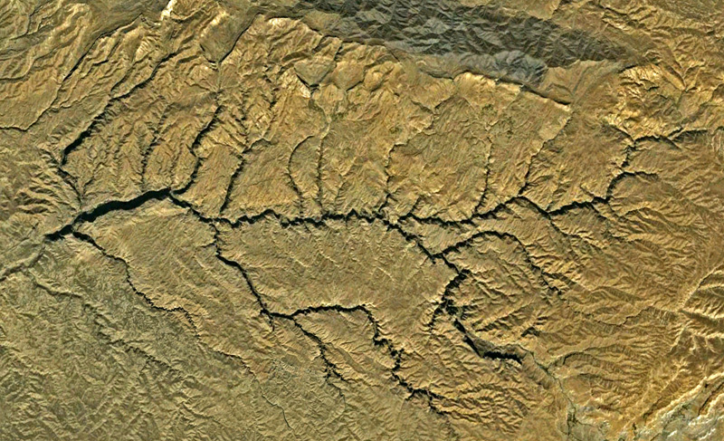

#### 分枝模式
分枝在植物界是一种最常见的图案形式，但也可以在诸如河流三角洲和某些结晶形态中看到。

Spiral patterns can be seen from the scale of galaxies to the opening "fiddlehead" buds of ferns, to the forms of microscopic animals.

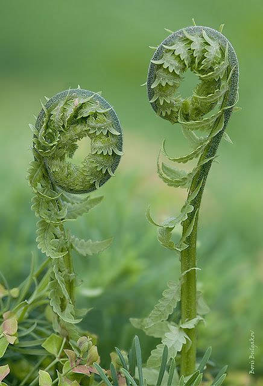

#### 螺旋模式
从星系尺度到蕨菜芽头，再到微观动物的形态，都可以看到螺旋图案。

Packing and Cracking refers to the way in which compacted cells define each others shape. A densely packed cluster of mushrooms will grow together, deforming the circular form of each cap because of crowding. In the same way a cluster of soap bubbles deforms each bubble from the perfect sphere of the isolated bubble, according to rules that govern the surface tension of soap bubbles. Surfaces (like mud or old paint) that shrink may experience cracking, resulting in similarly cellular patterning.

|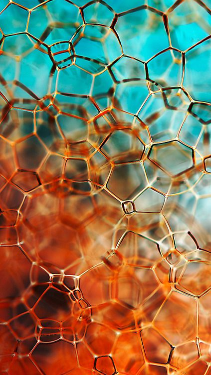|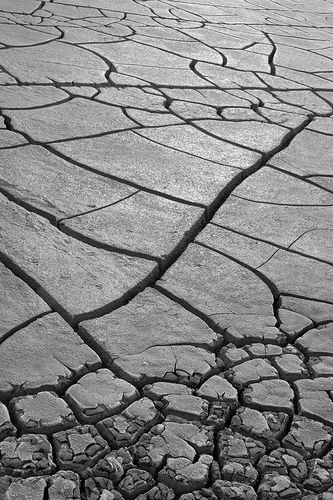|
|:---:|
|肥皂泡|干裂的土地|

#### 网格和开裂模式
填充和开裂指的是以经过压缩的元素再来构成其他形状的方式。密集的蘑菇群会一起生长，由于拥挤而使每个蘑菇头的圆形发生变形。同样，由于受肥皂泡表面张力的作用，每单个肥皂泡都会采取自身最佳的表面形状,彼此挤在一起形成一对肥皂泡。收缩的表面（例如泥土或老旧的油画）可能会发生开裂，导致类似的蜂窝图案。

Similar types of patterning can be seen in many designed objects. Even complex works of art exhibit an underlying structure or pattern grid, although the mode of patterning may vary over the surface of a complex composition. For a site that goes into the mathematics as well as the art in patterns, try this link to a site that discusses the tiling theory in Escher's prints.

类似的图案（模式）可以在许多设计品看到。甚至有些复杂的艺术作品也呈现出潜藏的结构或图案网格模式，虽然图案化的模式可以在复杂构成的表面上变化。有一个使用数学和艺术观点来看待图案（模式）的网站，大家可以试着链接去看看，这里使用平铺理论来讨论Escher的绘画。

|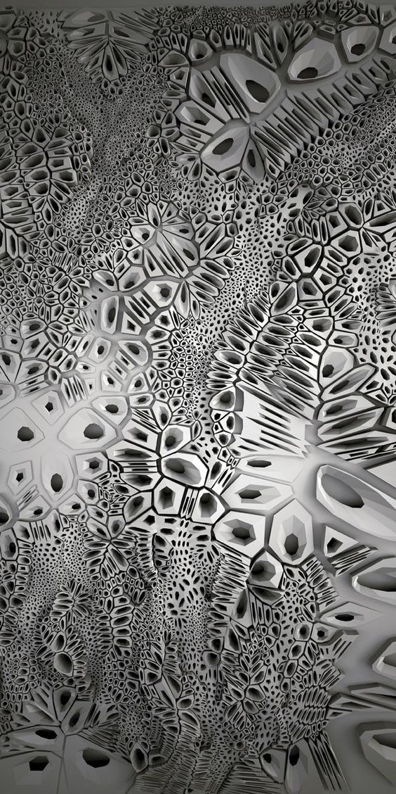|
|:---:|
|当代装置艺术|

|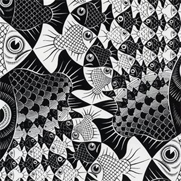|
|:---:|
|Escher的作品|


>continue...
