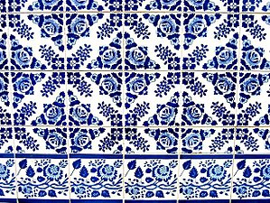
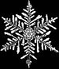

```
Created on Thu May  9 22:24:01 2019
Pattern in Nature Author：Philip Ball
自然模式 编译：Moly Chin
@author: molychin@qq.com
```

### 模式



Tilings, such as these from Igreja de Campanhã, Porto, Portugal, are visual patterns used for decoration.

瓷砖拼贴，如来自Igreja de Campanha、波尔图、葡萄牙等，都是装饰用的视觉图案。

A pattern is a discernible regularity in the world or in a manmade design. As such, the elements of a pattern repeat in a predictable manner. A geometric pattern is a kind of pattern formed of geometric shapes and typically repeated like a wallpaper design.
Any of the senses may directly observe patterns. Conversely, abstract patterns in science, mathematics, or language may be observable only by analysis. Direct observation in practice means seeing visual patterns, which are widespread in nature and in art. Visual patterns in nature are often chaotic, never exactly repeating, and often involve fractals. Natural patterns  include spirals, meanders, waves, foams, tilings, cracks, and those created by symmetries of rotation and reflection. Patterns have an underlying mathematical structure;indeed, mathematics can be seen as the search for regularities, and the output of any function is a mathematical pattern. Similarly in the sciences, theories explain and predict regularities in the world.
In art and architecture, decorations or visual motifs may be combined and repeated to form patterns designed to have a chosen effect on the viewer. In computer science, a software design pattern is a known solution to a class of problems in programming. In fashion, the pattern is a template used to create any number of similar garments.

在自然界中或人工设计中，图案模式呈现一种可辨别的规则性。因此，图案元素以可预测的方式重复。几何图形模式是由若干几何图形构成的图案，类似于墙纸设计。

任何感官都可以直接观察图案模式。相反，科学、数学或语言中的抽象模式只能通过分析来呈现。在实践中能直接观察到的视觉模式，这在自然界和艺术中是广泛存在的。自然界中的视觉模式经常是混乱的，从不完全重复，而且经常涉及 **分形**。**自然模式包括螺旋、蜿蜒、波浪、泡沫、平铺、龟裂和由旋转对称性和反射对称性产生的图案**。模式有一个基本的数学结构；事实上，数学可以看作是规律性的搜索，任何函数的输出都是一个数学模型。同样，在科学中，理论解释和预测世界的规律性。
在艺术和建筑中，装饰物或视觉图案可以被组合并重复以形成一个对观众可选择的模式。在计算机科学中，软件设计模式是编程中一类问题的已知解决方案。在时尚中，图案是用于创建任何数量的类似服装的模板。

### Nature
Nature provides examples of many kinds of pattern, including symmetries, trees and other structures with a fractal dimension, spirals, meanders, waves, foams, tilings, cracks and stripes.

### 大自然
大自然提供了多种图案的例子，包括对称性，树木和其他具有分形维数，螺旋，曲折，波浪，泡沫，平铺，裂缝和条纹的结构。


#### Symmetry

Snowflakesixfold symmetry
Symmetry is widespread in living things. Animals that move usually have bilateral or mirror symmetry as this favours movement. Plants often have radial or rotational symmetry, as do many flowers, as well as animals which are largely static as adults, such as sea anemones. Fivefold symmetry is found in the echinoderms, including starfish, sea urchins, and sea lilies.
Among non-living things, snowflakes have striking sixfold symmetry: each flake is unique, its structure recording the varying conditions during its crystallisation similarly on each of its six arms.Crystals have a highly specific set of possible crystal symmetries; they can be cubic or octahedral, but cannot have fivefold symmetry (unlike quasicrystals).

#### 对称性
对称性在生物中广泛存在。运动的动物通常具有双侧或镜像对称性，因为这有利于运动。植物通常具有径向或旋转对称性，许多花也具有这种对称性，成年时基本静止的动物也有这种对称性，如海葵。棘皮动物有五倍的对称性，包括海星、海胆和海百合。

||
|:---:|
|雪花对称性|

在非生物中，雪花具有惊人的六重对称性：每片雪花都是独一无二的，其结构记录了其结晶过程中的不同条件，在其六个臂中的每一个臂上都是类似的。晶体具有高度特定的一组可能的晶体对称性; 它们可以是立方体或八面体，但不能具有五重对称性（与准晶体不同）。

#### Spirals

Aloe polyphyllaphyllotaxis
Spiral patterns are found in the body plans of animals including molluscs such as the nautilus, and in the phyllotaxis of many plants, both of leaves spiralling around stems, and in the multiple spirals found in flowerheads such as the sunflower and fruit structures like the pineapple.
Chaos, flow, meanders[edit]

Vortex streetturbulence
Chaos theory predicts that while the laws of physics are deterministic, events and patterns in nature never exactly repeat because extremely small differences in starting conditions can lead to widely differing outcomes.[8]Many natural patterns are shaped by this apparent randomness, including vortex streets[9] and other effects of turbulent flow such as meanders in rivers.[10]
Waves, dunes[edit]

Dune ripple
Waves are disturbances that carry energy as they move. Mechanical waves propagate through a medium – air or water, making it oscillate as they pass by.[11] Wind waves are surface waves that create the chaotic patterns of the sea. As they pass over sand, such waves create patterns of ripples; similarly, as the wind passes over sand, it creates patterns of dunes.[12]
Bubbles, foam[edit]

Foam of soap bubbles
Foams obey Plateau's laws, which require films to be smooth and continuous, and to have a constant average curvature. Foam and bubble patterns occur widely in nature, for example in radiolarians, sponge spicules, and the skeletons of silicoflagellates and sea urchins.[13][14]
Cracks[edit]

Shrinkage Cracks
Cracks form in materials to relieve stress: with 120 degree joints in elastic materials, but at 90 degrees in inelastic materials. Thus the pattern of cracks indicates whether the material is elastic or not. Cracking patterns are widespread in nature, for example in rocks, mud, tree bark and the glazes of old paintings and ceramics.[15]
Spots, stripes[edit]

Giant pufferfish skin
Main article: Pattern formation
Alan Turing,[16] and later the mathematical biologist James D. Murray[17] and other scientists, described a mechanism that spontaneously creates spotted or striped patterns, for example in the skin of mammals or the plumage of birds: a reaction-diffusion system involving two counter-acting chemical mechanisms, one that activates and one that inhibits a development, such as of dark pigment in the skin.[18] These spatiotemporal patterns slowly drift, the animals' appearance changing imperceptibly as Turing predicted.
Art and architecture[edit]

Elaborate ceramic tiles at Topkapi Palace
Further information: Mathematics and art and Mathematics and architecture
Tilings[edit]
Further information: Tessellation and Tile
In visual art, pattern consists in regularity which in some way "organizes surfaces or structures in a consistent, regular manner." At its simplest, a pattern in art may be a geometric or other repeating shape in a painting, drawing, tapestry, ceramic tiling or carpet, but a pattern need not necessarily repeat exactly as long as it provides some form or organizing "skeleton" in the artwork.[19] In mathematics, a tessellation is the tiling of a plane using one or more geometric shapes (which mathematicians call tiles), with no overlaps and no gaps.[20]
In architecture[edit]

Patterns in architecture: the Virupaksha temple at Hampi has a fractal-like structure where the parts resemble the whole.
Main articles: Pattern (architecture) and Mathematics and architecture
In architecture, motifs are repeated in various ways to form patterns. Most simply, structures such as windows can be repeated horizontally and vertically (see leading picture). Architects can use and repeat decorative and structural elements such as columns, pediments, and lintels.[21] Repetitions need not be identical; for example, temples in South India have a roughly pyramidal form, where elements of the pattern repeat in a fractal-like way at different sizes.[22]
Science and mathematics[edit]

Fractal model of a fern illustrating self-similarity
Mathematics is sometimes called the "Science of Pattern", in the sense of rules that can be applied wherever needed.[23] For example, any sequence of numbers that may be modeled by a mathematical function can be considered a pattern. Mathematics can be taught as a collection of patterns.[24]
Fractals[edit]
Some mathematical rule-patterns can be visualised, and among these are those that explain patterns in nature including the mathematics of symmetry, waves, meanders, and fractals. Fractals are mathematical patterns that are scale invariant. This means that the shape of the pattern does not depend on how closely you look at it. Self-similarity is found in fractals. Examples of natural fractals are coast lines and tree shapes, which repeat their shape regardless of what magnification you view at. While self-similar patterns can appear indefinitely complex, the rules needed to describe or produce their formation can be simple (e.g. Lindenmayer systems describing tree shapes).[25]
In pattern theory, devised by Ulf Grenander, mathematicians attempt to describe the world in terms of patterns. The goal is to lay out the world in a more computationally friendly manner.[26]
In the broadest sense, any regularity that can be explained by a scientific theory is a pattern. As in mathematics, science can be taught as a set of patterns.[27]

From <https://en.wikipedia.org/wiki/Pattern>
