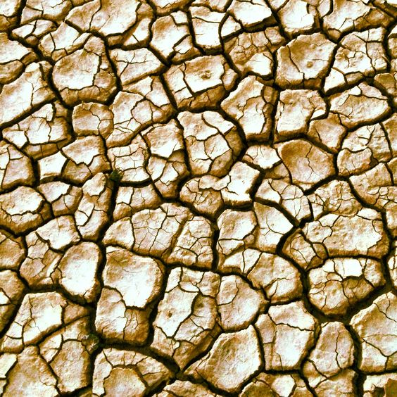

```
Created on Thu May  9 22:24:01 2019
Pattern in Nature Author：Philip Ball
自然模式 编译：Moly Chin
@author: molychin@qq.com
```

### 自然模式：模式


Tilings, such as these from Igreja de Campanhã, Porto, Portugal, are visual patterns used for decoration.

瓷砖拼贴，如来自Igreja de Campanha、波尔图、葡萄牙等，都是装饰用的视觉图案。

A pattern is a discernible regularity in the world or in a manmade design. As such, the elements of a pattern repeat in a predictable manner. A geometric pattern is a kind of pattern formed of geometric shapes and typically repeated like a wallpaper design.
Any of the senses may directly observe patterns. Conversely, abstract patterns in science, mathematics, or language may be observable only by analysis. Direct observation in practice means seeing visual patterns, which are widespread in nature and in art. Visual patterns in nature are often chaotic, never exactly repeating, and often involve fractals. Natural patterns include spirals,  meanders, waves, foams, tilings, cracks, and those created by symmetries of rotation and reflection. Patterns have an underlying mathematical structure;indeed, mathematics can be seen as the search for regularities, and the output of any function is a mathematical pattern. Similarly in the sciences, theories explain and predict regularities in the world.
In art and architecture, decorations or visual motifs may be combined and repeated to form patterns designed to have a chosen effect on the viewer. In computer science, a software design pattern is a known solution to a class of problems in programming. In fashion, the pattern is a template used to create any number of similar garments.

在自然界中或人工设计中，图案模式呈现一种可辨别的规则性。因此，图案元素以可预测的方式重复。几何图形模式是由若干几何图形构成的图案，类似于墙纸设计。

任何感官都可以直接观察图案模式。相反，科学、数学或语言中的抽象模式只能通过分析来呈现。在实践中能直接观察到的视觉模式，这在自然界和艺术中是广泛存在的。自然界中的视觉模式经常是杂乱的，从不完全重复，而且经常涉及 **分形**。**自然模式包括螺旋、蜿蜒、波浪、泡沫、平铺、龟裂和由旋转对称性和反射对称性产生的图案**。模式有一个基本的数学结构；事实上，数学可以看作是规律性的搜索，任何函数的输出都是一个数学模型。同样，在科学中，理论解释和预测世界的规律性。
在艺术和建筑中，装饰物或视觉图案可以被组合并重复以形成一个对观众可选择的模式。在计算机科学中，软件设计模式是编程中一类问题的已知解决方案。在时尚中，图案是用于创建任何数量的类似服装的模板。

### Nature
Nature provides examples of many kinds of pattern, including symmetries, trees and other structures with a fractal dimension, spirals, meanders, waves, foams, tilings, cracks and stripes.


### 大自然
大自然提供了多种图案的例子，包括对称性，树木和其他具有分形维数，螺旋，曲折，波浪，泡沫，平铺，裂缝和条纹的结构。

#### Symmetry
##### Snowflakesixfold symmetry
Symmetry is widespread in living things. Animals that move usually have bilateral or mirror symmetry as this favours movement. Plants often have radial or rotational symmetry, as do many flowers, as well as animals which are largely static as adults, such as sea anemones. Fivefold symmetry is found in the echinoderms, including starfish, sea urchins, and sea lilies.
Among non-living things, snowflakes have striking sixfold symmetry: each flake is unique, its structure recording the varying conditions during its crystallisation similarly on each of its six arms.Crystals have a highly specific set of possible crystal symmetries; they can be cubic or octahedral, but cannot have fivefold symmetry (unlike quasicrystals).

#### 对称性
##### 雪花对称性
对称性在生物中广泛存在。**运动的动物通常具有双侧或镜像对称性，因为这有利于运动。植物通常具有径向或旋转对称性**，许多花也具有这种对称性，成年时基本静止的动物也有这种对称性，如海葵。棘皮动物有五重的对称性，包括海星、海胆和海百合。

|||
|:---:|:---:|
|雪花微观影像1|雪花微观影像2|

在非生物中，雪花具有惊人的六重对称性：每片雪花都是独一无二的，其结构记录了其结晶过程中的不同条件，在其六个臂中的每一个臂上都是类似的。晶体具有高度特定的一组可能的晶体对称性; 它们可以是立方体或八面体，但不能具有五重对称性（与准晶体不同）。

#### Spirals
##### Aloe polyphyllaphyllotaxis
Spiral patterns are found in the body plans of animals including molluscs such as the nautilus, and in the phyllotaxis of many plants, both of leaves spiralling around stems, and in the multiple spirals found in flowerheads such as the sunflower and fruit structures like the pineapple.


在动物的身体的设计中可以找到螺旋图案，包括鹦鹉螺等软体动物，以及许多植物的叶序，叶子周围的叶子，以及像向日葵和菠萝等水果结构的花头中发现的多个螺旋。

#### Chaos, flow, meanders
Chaos theory predicts that while the laws of physics are deterministic, events and patterns in nature never exactly repeat because extremely small differences in starting conditions can lead to widely differing outcomes.Many natural patterns are shaped by this apparent randomness, including vortex street and other effects of turbulent flow such as meanders in rivers.

#### 混沌，流动，蜿蜒
混沌理论预言，虽然物理定律是确定性的，但自然界中的事件和模式从未完全重复，因为起始条件的极小差异可能导致广泛不同的结果（蝴蝶效应）。许多自然模式由这种明显的随机性塑造，包括涡流序列和湍流的其他影响，比如河流中的曲流。

|||
|:---:|:---:|
|木星|木星云斑|

#### Waves, dunes
Waves are disturbances that carry energy as they move. Mechanical waves propagate through a medium – air or water, making it oscillate as they pass by. Wind waves are surface waves that create the chaotic patterns of the sea. As they pass over sand, such waves create patterns of ripples; similarly, as the wind passes over sand, it creates patterns of dunes.

波是在移动时携带能量的扰动。机械波通过介质-空气或水传播，使其在经过时振荡。风浪是产生海洋混沌图案的表面波，当它们越过沙子时，这种波浪会产生涟漪图案; 同样地，当风越过沙子时，它会产生沙丘的图案。

||
|:---:|
|波浪、沙丘|

#### Bubbles, foam
Foams obey Plateau's laws, which require films to be smooth and continuous, and to have a constant average curvature. Foam and bubble patterns occur widely in nature, for example in radiolarians, sponge spicules, and the skeletons of silicoflagellates and sea urchins.

#### 肥皂泡的泡沫
泡沫材料遵循Plateau定律，要求薄膜光滑连续，且具有恒定的平均曲率。泡沫和泡沫模式在自然界中广泛存在，例如放射虫、海绵骨针和硅藻骨架和海胆的骨架中。

||
|:---:|
|泡沫,泡泡|

#### Cracks
Cracks form in materials to relieve stress: with 120 degree joints in elastic materials, but at 90 degrees in inelastic materials. Thus the pattern of cracks indicates whether the material is elastic or not. Cracking patterns are widespread in nature, for example in rocks, mud, tree bark and the glazes of old paintings and ceramics.

#### 碎裂
材料产生裂缝以释放应力：弹性材料中有120度分裂角，而非弹性材料中有90度分裂角。因此，裂纹模式表明材料是否具有弹性。裂缝样式在自然界中广泛存在，例如岩石、泥土、树皮或者老油画和陶瓷的釉面（开片）中。

||
|:---:|
|干裂的土地|
||
|陶瓷釉面开片|

#### Spots, stripes
Alan Turing,and later the mathematical biologist James D. Murray and other scientists, described a mechanism that spontaneously creates spotted or striped patterns, for example in the skin of mammals or the plumage of birds: a reaction-diffusion system involving two counter-acting chemical mechanisms, one that activates and one that inhibits a development, such as of dark pigment in the skin. These spatiotemporal patterns slowly drift, the animals' appearance changing imperceptibly as Turing predicted.

#### 斑点，条纹
Alan Turing，以及后来数学生物学家James D.Murray和其他科学家描述了一种自发产生斑点或条纹图案的机制，例如在哺乳动物的皮肤或鸟类的羽毛中：一种包含两种反作用化学物质的反应-扩散系统。反作用化学机制，一种激活和抑制发育的机制，如皮肤中的黑色色素。这些时空模式缓慢漂移，动物的外观如图灵所预测的那样在不知不觉中发生变化（可参见“细胞自动机”）。

||
|:---:|
|河豚的斑纹|

#### Tilings

In visual art, pattern consists in regularity which in some way "organizes surfaces or structures in a consistent, regular manner." At its simplest, a pattern in art may be a geometric or other repeating shape in a painting, drawing, tapestry, ceramic tiling or carpet, but a pattern need not necessarily repeat exactly as long as it provides some form or organizing "skeleton" in the artwork. In mathematics, a tessellation is the tiling of a plane using one or more geometric shapes (which mathematicians call tiles), with no overlaps and no gaps.

#### 镶嵌拼装
在视觉艺术中，图案是有规律的，在某种程度上“以一致、规则的方式组织表面或结构”。最简单的说，艺术中的图案可以是一幅油画、水彩、挂毯、瓷砖或地毯中的几何或其他重复形状，但只要图案提供某种形式或组织“骨架”，图案就不一定完全重复。在数学中，“镶嵌”是指使用一个或多个几何图形（数学家称之为“铺砖”）对平面进行平铺，没有重叠和间隙。

#### In architecture
In architecture, motifs are repeated in various ways to form patterns. Most simply, structures such as windows can be repeated horizontally and vertically (see leading picture). Architects can use and repeat decorative and structural elements such as columns, pediments, and lintels. Repetitions need not be identical; for example, temples in South India have a roughly pyramidal form, where elements of the pattern repeat in a fractal-like way at different sizes.

#### 在建筑中
在建筑中，装饰图案以各种方式重复以形成样式。最简单的是，像窗口这样的结构可以水平和垂直地重复（参见主图片）。建筑师可以使用和重复装饰和结构元素，如柱、山脚和过梁[21]重复不需要相同；例如，印度南部的寺庙有一个大致的金字塔形，图案元素以分形的方式以不同尺寸重复。

--
在建筑中
在建筑中，图案以各种方式重复以形成图案。 最简单的是，窗户等结构可以水平和垂直重复（见前图）。 建筑师可以使用和重复装饰和结构元素，如柱子，山形墙和门楣。[21] 重复不必相同; 例如，印度南部的寺庙具有大致金字塔形状，其中图案的元素以不同尺寸的分形方式重复。

建筑图案：汉普的Virupaksha神庙具有分形结构，各部分与整体相似。
[插入东南亚、印度佛教宗教塔的建筑]

Science and mathematics
Fractal model of a fern illustrating self-similarity
Mathematics is sometimes called the "Science of Pattern", in the sense of rules that can be applied wherever needed. For example, any sequence of numbers that may be modeled by a mathematical function can be considered a pattern. Mathematics can be taught as a collection of patterns.

科学与数学

蕨类植物自相似分形模型

数学有时被称为“模式科学”，在规则的意义上，可以在任何需要的地方应用。例如，任何可以由数学函数建模的序列都可以被视为模式。数学可以作为模式的集合来教授。

--
科学和数学
蕨的分形模型说明自相似性
数学有时被称为“模式科学”，在可以在任何需要的地方应用的规则意义上。 例如，可以将由数学函数建模的任何数字序列视为模式。 数学可以作为一组模式来教授。

Fractals
Some mathematical rule-patterns can be visualised, and among these are those that explain patterns in nature including the mathematics of symmetry, waves, meanders, and fractals. Fractals are mathematical patterns that are scale invariant. This means that the shape of the pattern does not depend on how closely you look at it. Self-similarity is found in fractals. Examples of natural fractals are coast lines and tree shapes, which repeat their shape regardless of what magnification you view at. While self-similar patterns can appear indefinitely complex, the rules needed to describe or produce their formation can be simple (e.g. Lindenmayer systems describing tree shapes).
In pattern theory, devised by Ulf Grenander, mathematicians attempt to describe the world in terms of patterns. The goal is to lay out the world in a more computationally friendly manner.
In the broadest sense, any regularity that can be explained by a scientific theory is a pattern. As in mathematics, science can be taught as a set of patterns.

分形

一些数学规则模式可以可视化，其中包括解释自然模式的那些模式包括对称、波浪、曲流和分形的数学。分形是比例不变的数学模式。这意味着图案的形状不取决于你看得有多近。自我相似性在分形中被发现。自然分形的例子是海岸线和树的形状，它们重复它们的形状，而不管你以什么样的放大率观看。虽然自相似模式可能会无限复杂，但描述或产生其形成所需的规则可能很简单（例如Lindenmayer系统描述树形状）。

在ulf grenander设计的模式理论中，数学家试图用模式来描述世界。目标是以一种更便于计算的方式来布局世界。

从广义上讲，任何可以用科学理论解释的规律性都是一种模式。在数学中，科学可以作为一套模式来教授。

--
分形
一些数学规则模式可以被可视化，其中包括解释自然模式的那些，包括对称性数学，波浪，曲折和分形。分形是数学模式，是规模不变的。这意味着图案的形状不取决于您对它的看法。在分形中发现自相似性。天然分形的例子是海岸线和树形，无论你看到什么样的放大倍数，都会重复它们的形状。虽然自相似模式可能看起来无限复杂，但描述或生成其形成所需的规则可以很简单（例如，描述树形状的Lindenmayer系统）。
在模式理论中，由Ulf Grenander设计，数学家试图用模式来描述世界。目标是以更加计算友好的方式布置世界。
从最广泛的意义上讲，任何可以用科学理论解释的规律性都是一种模式。与数学一样，科学可以作为一组模式来教授。
