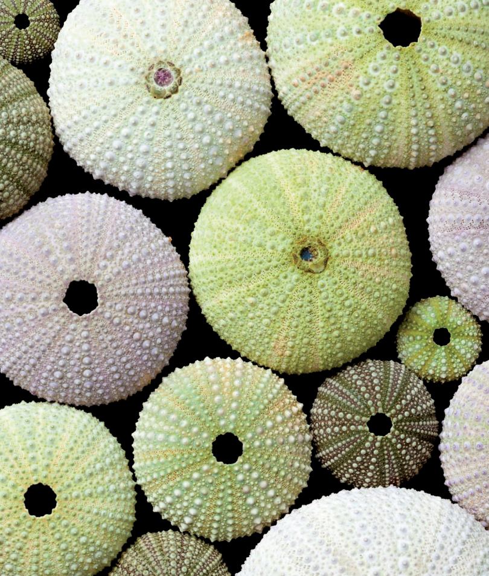

```
Created on Thu May  9 22:24:01 2019
Pattern in Nature Author：Philip Ball
自然模式 编译：Moly Chin
@author: molychin@qq.com
```

### CHAPTER 1 SYMMETRY  
### 第一章 对称


SYMMETRY  
Why your left is like your right (and why it’s different)

#### 对称  
为什么你的左半身和右半身几乎一模一样（它们为什么不能不同呢）？

What is a pattern, anyway? We usually think of it as something that repeats again and again. The math of symmetry can describe what this repetition may look like, as well as why some shapes seem more orderly and organized than others. That’s why symmetry is the fundamental scientific “language” of pattern and form. Symmetry describes how things may look unchanged when they are reflected in a mirror, or rotated, or moved.But our intuitions about symmetry can be deceptive.
In general, shape and form in nature arise not from the “building up” of symmetry, but from the breaking of perfect symmetry—that is, from the disintegration of complete, boring uniformity, where everything looks the same, everywhere. The key question is therefore: why isn’t everything uniform? How and why does symmetry break?

到底什么是模式？我们通常认为它是一种不断重复（可重复性）的东西。对称数学公式可以描述这种呈现出重复性的图像，以及为什么一些形状看起来比其他形状更加有序和有组织。这就是为什么 **对称** 是模式和形态的基本科学“语言”。对称性描述 **事物在镜面反射或旋转或移动时的不变性（对称的基本特性）**。但我们对对称性的直觉可能具有欺骗性。一般来说，**自然界的形状和形态不是来自绝对对称，而是来自对完美对称的破坏**，也就是说，**是对完全的、无聊的均匀性的瓦解**。否则的话，所有东西看起来无处不在，而且完全相同。关键问题是：为什么一切都不统一？对称性又是如何打破的？

||
|---|

但作为人类的制品，却偏向爱好绝对的对称（或者说，努力追求完美的对称），万花筒、中国瓷器等是我们观察对称性的可见的很好的例子。

|中国瓷器1|中国瓷器2|
|---|---|
|万花筒1|万花筒2|

所以从这点上来说，我并不喜欢绝对的，完美的对称，因为自然界中并不容易找到这样的范例。而且，一般人类的完美制品，往往是借助机械设备来完成的，少了手工的味道。这也是为什么，我会更喜欢日本民间生活瓷器的原因。

|日本茶器1|日本茶器2|
|---|---|
|日本茶器1|日本茶器2|
-------------------
