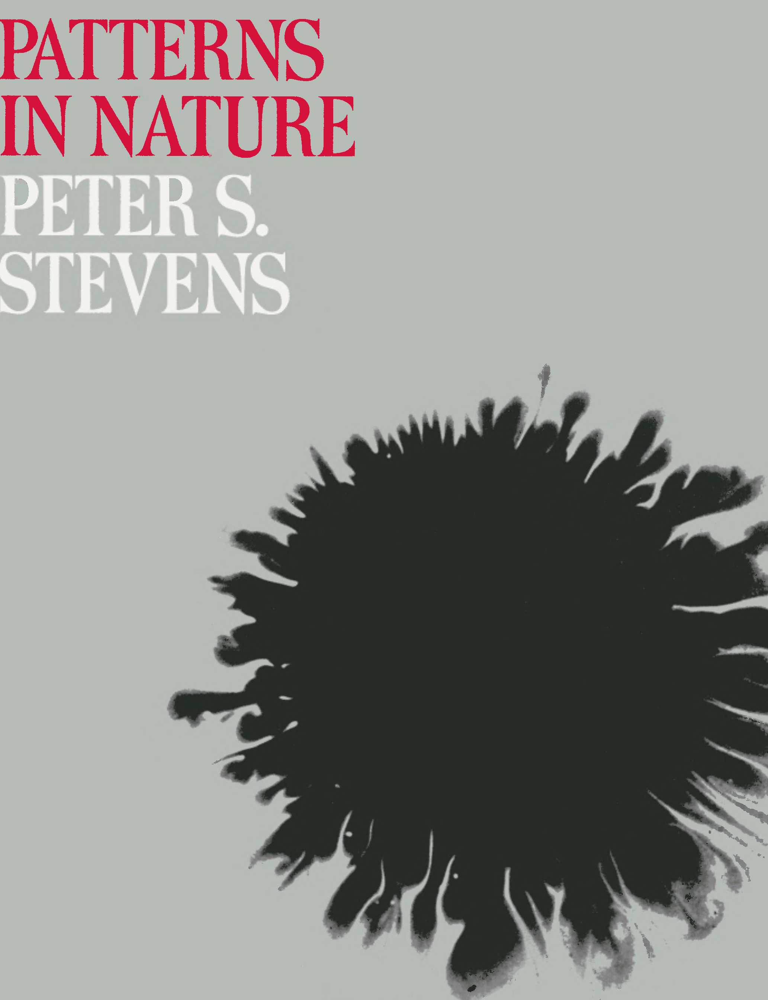
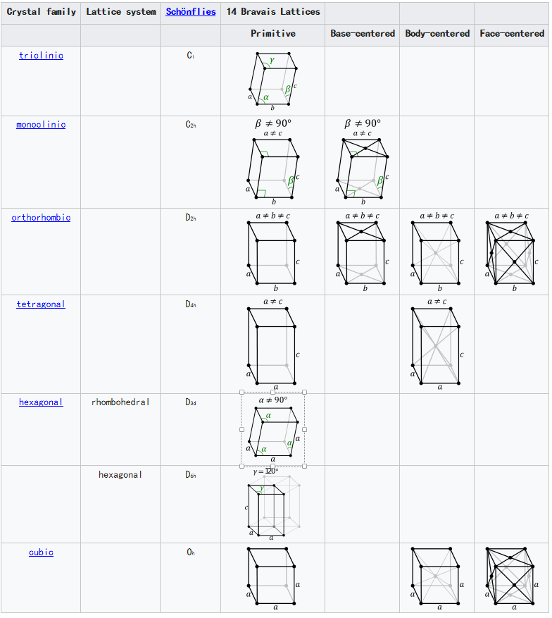

```
Created on  2019.05.20.22:40
Patterns in Nature Author:PETER S.STEVENS
编译：Moly Chin
@author: molychin@qq.com
```

## PATTERN IN NATURE-PTRER S.STEVENS
1974年



### Acknowledgments
To GENEROSITIES made this book possible - the John Simon Guggenheim Memorial Foundation granted me a fellowship, and Eduard Sekler provided me with a place to work at the Carpenter Center amid the activities of Harvard's Department of Visual and Environ-mental Studies.  
I am deeply indebted to my father, S. S. Stevens, who reviewed the entire manuscript.He has not lived to see the finished work, but his interest sustained its development. I am also indebted to Rudolf Arnheim for his careful reading and thoughtful comments and to Arthur Loeb for his suggestions.  
The discussions of a small group of teachers and students, the Philomorphs, who met at Harvard to pursue the study of form, were- a stimulus to the book. In addition to Arnheim and Loeb, the group boasted as regular members Michael Woldenberg, Stephen Gould, Ranko Bon and, from the Massachusetts Institute of Technology, Cyril Smith.  
I wish to thank Didi Stevens who saw to it that the manuscript was typed, edited, and ready for publication and Esther S. Yntema who brought the work to final fruition.

致谢  
慷慨使这本书成为可能——约翰·西蒙古根海姆纪念基金会授予我一个奖学金，Eduard Sekler在哈佛大学视觉与环境研究部的活动中为我提供了一个在木匠中心工作的地方。  
我深深地感激我父亲，S.S.史蒂文斯，他审阅了整个手稿。他没有活到看到完成的工作，但他的兴趣保持了它的发展。我还感谢鲁道夫·阿恩海姆的认真阅读和深思熟虑的评论，感谢亚瑟·勒布的建议。  
一小群教师和学生的讨论，费城人，他们在哈佛大学相会以追求形式的学习，是这本书的一个刺激因素。除了阿恩海姆和勒布之外，该组织还以常任成员迈克尔·沃登伯格、斯蒂芬·古尔德、兰科·本以及麻省理工学院的西里尔·史密斯而自豪。  
我要感谢迪迪·史蒂文斯，他看到了手稿的打印、编辑和出版准备，以及埃丝特·S·恩提玛，他使这部作品最终获得了成果。

----

空间与尺寸
Our subject concerns the visual patterns and forms in the natural world. It turns out【证明是】 that those  patterns and forms are peculiarly【异常地】 restricted【受限制的】, that the immense【极大的】 variety that nature creates emerges【浮现】 from the working and reworking of only a few formal themes. Those limitations on nature bring harmony and beauty to the natural world.

我们的主题涉及自然界中的视觉模式和形式。事实证明，这些模式和形式受到特殊限制。大自然创造的巨量的多样性是从少数几个普通框架中来构建和改造中产生的。自然的这些局限性给自然界带来了 **和谐与美**。

It may seem curious to dwell on nature's limitations when a glance out the window reveals such overwhelming diversity. Clouds and chickadees, galaxies and grasshoppers, eels and elms: one cannot help but be impressed with nature's variety. Even among things that seem superficially the same, like snowflakes, or leaves from the same tree, each differs in subtle ways from its fellows.

当窗外的景色呈现出如此丰富而多姿多彩时，人们又会好奇于大自然的局限性。云和山雀，银河和蚱蜢，鳗鱼和榆树：人们不能不被大自然的多样性所深深打动。但即使是在表面上看起来相同的东西，如雪花，或是同一棵树的叶子，在细微处总与它的同伴不同。

But then when we see how the branching of trees resembles the branching of arteries and the branching of rivers, how crystal grains look like soap bubbles and the plates of a tortoise's shell, how the fiddleheads【蕨菜】 of ferns【蕨类】, stellar galaxies, and water emptying from the bathtub spiral in a similar manner, then we cannot help but【不得不】 wonder why nature uses only a few kindred forms in so many different contexts. Why do meandering snakes, meandering rivers, and loops of string adopt the same pattern, and why do cracks in mud and markings on a giraffe【长颈鹿】 arrange themselves like films in a froth of bubbles?

但是当我们**看到树木的分枝、动脉的分支和河流的分岔如此相似；水晶晶格看起来像肥皂泡和龟甲的背壳**；蕨菜的头部、恒星星系和倒空澡盆里的水所形成的**螺旋结构**似乎遵循相似的规则。我们不禁想知道，为什么大自然在这么多不同的场景中只采用了很少的几种形式。为什么弯曲爬行的蛇，蜿蜒流淌的河流与一根弯曲的绳子采用了相同的模式。为什么干涸的泥土的裂纹与长颈鹿的斑纹和肥皂泡沫一样的排列？  
**简单与复杂**：简单的模式可以生成复杂的（图形图像）结构；反之，复杂的结构背后是简单的模式。

【给出螺旋结构形成最简要的案例说明，参见[“**沙漠中徘徊者**”](Moly_NaturePatterns_footmark.md)。】

In matters of visual form we sense that nature plays favorites. Among her darlings are spirals, meanders, branching patterns, and 120-degree joints. Those patterns occur again and again. Nature acts like a theatrical producer who brings on the same players each night in different costumes for different roles. The players perform a limited repertoire: pentagons make most of the flowers but none of the crystals; hexagons handle most of the repetitive two-dimensional patterns but never by themselves enclose three-dimensional space. On the other hand, the spiral is the height of versatility,playing roles in the replication of the smallest virus and in the arrangement of matter in the largest galaxy.

我们感觉到大自然偏爱几种特定的视觉形式。她的衷爱包括**螺旋状、蜿蜒状、分枝状和呈120度的连结**。这些模式一次又一次地产生并呈现。大自然就像一个戏剧制作人，每晚都会为不同的角色带来不同的演员。玩家们表演的剧目有限：五边形是花朵的主要组成部分，而不是晶体；六边形承担了大部分重复图案的二维图形，但从不自主封闭为一个三维空间。另一方面，螺旋是最具变化多端的，从最小病毒的复制到最大星系中物质的排列中都发挥作用。

A look behind the footlights reveals that nature has no choice in the assignment of roles to players. Her productions are shoestring operations, encumbered by the constraints of three-dimensional space, the necessary relations among the sizes of things, and an eccentric sense of frugality. In the space at nature's command, five regular polyhedrons can be produced, but no more. Seven systems of crystals can be employed, but never an eighth. Absolute size decrees that the lion will never fly nor the robin roar. Every part of every action must abide by the rules.
在脚灯（舞台前面的一排灯）后面看，大自然在为玩家分配角色方面没有选择。她的作品是一丝不苟的操作，被三维空间的约束所束缚，事物大小之间的必然联系，以及一种古怪的节约感。在自然控制的空间中，可以产生五个规则多面体（仅有的五种正多面体，即是**正四面体、正六面体、正八面体、正十二面体和正二十面体**。），但没有更多的多面体。可以使用七个晶体系统，但从不使用第八个系统。绝对大小的法令，狮子永远不会飞，知更鸟也不会咆哮。每个行动的每一部分都必须遵守规则。


七个晶体系统：
The distribution of the 14 Bravais lattices into lattice systems and crystal families is given in the following table.

下表给出了14个Bravais晶格在晶格系统和晶体族中的分布。



>待续......
