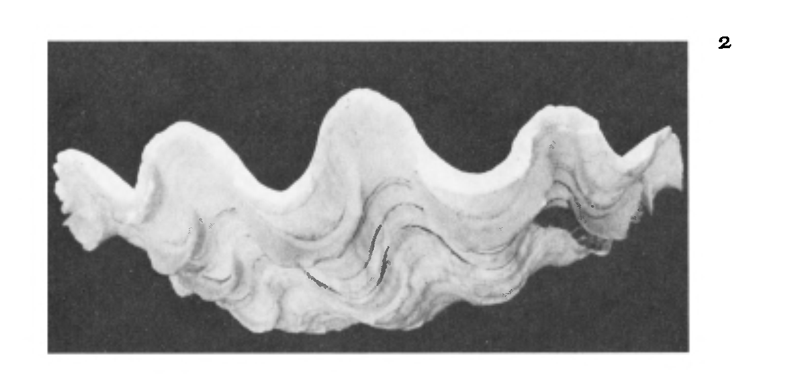

```
Created on  2019.05.20.22:40
自然模式-原著：PETER S.STEVENS 改编：Moly Chin
@author: molychin@qq.com
```


### The Nature of Space
nothing puzzles me more than time and space; and yet nothing troubles me less, as I never think about them.
-CHARLES LAMB

空间的本质
没有什么比时间和空间更让我困惑了；但是再也没有什么会令我烦恼了，因为我已不去想它们。
-CHARLES LAMB

OF ALL THE CONSTRAINTS ON NATURE, the most farreaching are imposed by space. For space itself has a structure that influences the shape of every existing thing. The idea that space has structure may sound strange, since we usually think of space as a kind of nothingness that is the absence of structure. We think of space as the emptiness within an empty container, as the passive backdrop for the lively play of all material things.

在所有对自然的限制中，最深远的影响是由空间造成的。**因为空间本身的结构影响着每一个现存事物的形状**。空间有结构的想法听起来很奇怪，**因为我们通常认为空间是一种虚无，即没有结构**。我们认为空间是一个空容器内的空虚，是所有物质事物活动的被动背景。

It turns out, however, that the backdrop, the all pervading nothingness, is not so passive. The nothingness has an architecture that makes real demands on things. Every form, every pattern, every existing thing pays a price for its existence by conforming to the structural dictates of space.

然而，事实证明，这个背景，无处不在的虚无，并不是那么被动。虚无有一种对事物作出真实要求的架构。每一种形式，每一种模式，每一件现存的事物都要为它的存在付出代价，因为它要符合空间的结构要求。

Our ignorance about the effects of space parallels the ignorance of fish about the effects of water. And just as fish would understand their environment better through studies of buoyancy, pressure, and streamlining in different liquids, so we have come to understand our own environment better through studies of transformation, extension, and curvature in different spaces. We did not recognize the special character of our space until the non-Euclidean geometers of the nineteenth century and Einstein in the twentieth century showed that there are other spaces, and that patterns and forms in those other spaces differ from the ones we see in ours. Since our brains and perceptual processes have evolved to suit our own space, we cannot visualize those other spaces, but we have devised self-consistent mathematical descriptions of them, and we have come to recognize that the spaces in the world of the very small, in the world of the fundamental particles, and in the world of the very large, at the scale of the universe as a whole, differ dramatically from the space in which we live.

我们对空间效应的无知与鱼对水的影响的无知相类似。正如鱼会通过研究浮力、压力和在不同液体中流线一样更好地了解它们的环境，所以我们通过研究不同空间中的变换、伸展和曲率来更好地了解我们自己的环境。我们没有认识到我们的空间的特殊性质，直到非欧几里得几何十九世纪和二十世纪的爱因斯坦展示了还有其他空间，那些空间中的模式和形式不同于我们在我们的空间中看到的。因为我们的大脑和知觉过程已经进化成适合我们自己的空间，所以我们无法想象这些空间，但是我们已经设计了它们的自洽的数学描述。并且我们已经认识到世界上的空间非常小，在基本粒子的世界里，在非常大的世界里，在宇宙作为一个整体的规模，与我们生活的空间有很大的不同。

What kind of stuff makes space and precisely how it affects the shape of things are pressing questions in modern physics. At the turn of the century Mendeleev, who discovered the periodicity of the elements, posed the idea that space consists of particles a million times smaller than the hydrogen atom, and that combinations of those particles produce atoms. That was a strange speculation. Mendeleev, you see, did not say that space was filled with little particles but that it was little particles. P. A. M. Dirac, John A. Wheeler, and other physicists have developed Mendeleev's idea and have likened space to a perhaps inHnite array of tiny grains or a froth of bubbles. Perhaps, somehow, the shifting of those grains or bubbles produces the fundamental particles that form the basis for all material structures.

什么样的物质创造了空间，以及空间如何精确地影响物体的形状，是现代物理学中的一个紧迫问题。在世纪之交，发现元素周期性的门捷列夫提出了这样的观点：空间由比氢原子小一百万倍的粒子组成，这些粒子的组合产生原子。这是一个奇怪的猜测。你看，门捷列夫并没有说空间里充满了小颗粒，而是说它是小颗粒。P·A·M·狄拉克、约翰·A·惠勒和其他物理学家发展了门捷列夫的理论，并将空间比作可能是一排微小的颗粒或泡沫。也许，不知何故，这些颗粒或气泡的移动产生了基本粒子，这些基本粒子构成了所有物质结构的基础。

More and more in physics, the idea seems to be taking hold that space has real material structure. That thought shocks most of us. Space is no longer considered a passive background like a set of coordinates; it is thought to be a real agent that gives rise to all the rest of the material world. It is the primeval stuff from which all else springs. Thus our commonsense idea that space is a big nothing has been replaced with the more sophisticated thought that space is a big everything. Wheeler nicely summed up Einstein's conception of the modern view:
Einstein, above his work and writing, held a long-term vision: There is nothing in the world except curved empty space. Geometry bent one way here describes gravitation. Rippled another way somewhere else it manifests all the qualities of an electromagnetic wave. Excited at still another place, the magic material that is space shows itself as a particle. There is nothing that is foreign and "physical" immersed in space.

在物理学中，越来越多的人认为空间具有真实的物质结构。这个想法让我们大多数人震惊。空间不再像一组坐标那样被视为一种被动的背景；它被认为是一种产生物质世界其余部分的真正的媒介。它是最原始的东西，其他一切都是从它而来的。因此，我们的常识，即空间是一个大的东西，已经被更复杂的思想所取代，即空间是一个大的一切。惠勒很好地总结了爱因斯坦的现代观点：
爱因斯坦，在他的作品和写作之上，有一个长期的愿景：世界上除了弯曲的空白空间之外，什么都没有。这里弯曲的几何描述了万有引力。它以另一种方式在别处波动，体现了电磁波的所有特性。在另一个地方被激发，空间这种神奇的物质显示出它自己是一个粒子。没有什么外来的和“物理的”沉浸在空间中。

#### And again
There is nothing in the world except empty curved space. Matter, charge, electromagnetism, and other fields are only manifestations of the bending of space.  
Wheeler goes still further. He supposes that the space of our universe is only one of an infinite number of spaces, that our space is only a single point in Superspace, which is the totality of all spatial possibilities. And if and when the universe, after its present expansion, contracts and then expands again for another round, it will most probably have a different spatial character, and since the one follows the other, it will contain very different forms.  
So the puzzle of space that Charles Lamb chose not to think about lies at the heart of the problems faced by contemporary physics. We will leave the exploration of that puzzle to the physicists, and, rather than delve deeper into things unseen, we will stay with the visible world, for even there we discover ourselves controlled by the properties of space.

### 轮回  
世界上除了空旷的弯曲空间之外，什么都没有。物质、电荷、电磁学和其他领域只是空间弯曲的表现。惠勒更进一步。他假设我们宇宙的空间只是无限多空间中的一个，我们的空间只是超空间中的一个点，这是所有空间可能性的总和。如果宇宙在它现在的膨胀之后收缩然后再膨胀到另一轮，它很可能会有一个不同的空间特征，因为一个紧随着另一个，它会包含非常不同的形式。  
因此，查尔斯·兰姆选择不去思考的**空间之谜，这是当代物理学所面临问题的核心所在**。我们将把探索这个谜留给物理学家，而不是深入探究那些看不见的东西，我们将留在可见的世界里，因为即使在那里，我们也发现自己被空间的属性所控制。

Curvature 【弯曲】
"... And nature must obey necessity."
-SHAKESPEARE,Julius Caesar, Act IV, SC.3
弯曲  
自然必须服从必然性

SPACE IS UNIFORMLY SPREAD OUT. It is the same here and there as everywhere else. We become aware of how that spreading of space affects shape when we play with a piece of modeling clay.
Suppose you make a small disk of clay like that in the first frame of Figure 1. It is obvious that with a rolling pin you can spread the clay into a larger disk.
Under the action of the rolling pin, the clay spreads evenly in all directions - just like the space in which it lies. Now, suppose you press or flatten only the center of the disk. You can do that by manipulating the clay with your fingers. Flattening the center causes the center to spread and grow faster than the perimeter, and the disk naturally takes the shape of a bowl, as shown in the second frame.
You can also squeeze the perimeter of the disk so that it grows faster than the center. Again the disk will not lie flat. Instead, it thrusts itself simultaneously both forward and back to make a saddle. The saddle comes about just as naturally as the bowl. The clay is not molded into those forms but the forms arise naturally, depending upon where you press the clay.
From playing with the clay, we are led to the discovery of a fundamental rule: if the center and perimeter both grow at the same rate, the material spreads in a plane; if the center grows faster than the perimeter, or the perimeter grows faster than the center, a bowl or a saddle results.

空间是均匀分布的，到处都是一样的。当我们玩一块模型粘土时，我们会意识到空间的扩展是如何影响形状的。假设您在下图的第一个框架中制作一个这样的小粘土盘。很明显，用擀面杖可以把粘土铺成一个更大的圆盘。在擀面杖的作用下，粘土向各个方向均匀分布，就像它所在的空间一样。现在，假设您只碾压或扩展黏土盘的中心（你可以用手指捻压粘土来做到这一点）。中心变平会，使中心比周长扩展和增长得更快，并且圆盘自然地呈碗状，如第二幅中所示。  
您还可以挤压黏土盘的周边，使其增长速度快于中心。同样，黏土盘不会水平展开。相反，它同时向前和向后推动自己，形成一个马鞍。马鞍和碗一样自然。粘土不是人为被塑造成这些形式，形式是自然产生，这取决于你压粘土的地方。  
从玩粘土开始，我们发现了一个基本规律：如果中心和周长都以相同的速度增长，材料就会在一个平面上扩散；如果中心比周长增长得更快，或者周长比中心增长得更快，就会形成碗状或马鞍状。

**物质与空间，空间与结构，形状不是设计的结果，是空间与力的结果。车削金属棒，形成螺旋形状的废屑。**


Here is another manifestation of the same principle.
这是同样原理的另一种表现形式。

When you play with equilateral triangles, you find that you can arrange six triangles neatly around a central point so that all the triangles lie Hat, as shown again in Figure 1. Five triangles around a central point, however, take the form of a tent or an inverted bowl (frame e). And seven triangles around a point make an undulating saddle (frame f). The result is the same as for the clay: varying the extension of the perimeter with respect to the center transforms planes into bowls and saddles, The reason for those transformations lies in the nature of space. The transformations have nothing to do with our intentions to make one form or another.

当你使用等边三角形时，你会发现你可以在一个中心点周围整齐地排列六个三角形，这样所有的三角形都是帽子状的，如上图所示。然而，围绕一个中心点的五个三角形呈帐篷或倒碗状（框架E）。一个点周围的七个三角形构成了一个波状的鞍座（框架F）。其结果与粘土相同：改变中心周长的延伸，将平面转变为碗状和鞍状，这些转变的原因在于空间的性质。这些转换与我们创建一种或另一种形式的意图无关。

No matter how we try, we cannot make a saddle from five equilateral triangles or a simple cup from seven.
Nature too is similarly constrained. She makes cups and saddles not as she pleases but as she must, as the distribution of material dictates. Observe the shell in Figure 2, for example. Since the perimeter of the shell grows at a faster rate than the center, the perimeter curls and wrinkles. No genes carry an image of how to place the wrinkles; no genes remember the shape of the shell; they only permit or encourage faster growth at the perimeter than at the center.

无论我们怎样尝试，我们都不能用五个等边三角形做一个马鞍，也不能用七个等边三角形做一个简单的碗。自然也同样受到限制。她把杯子和马鞍当成她所喜欢的，但正如她必须的那样，因为物质的分配决定了。例如，观察图2中贝壳的外壳。**由于外壳的周长以比中心更快的速度增长，所以周长会卷曲和起皱。没有基因携带如何放置皱纹的图像；没有基因记得外壳的形状；它们只允许或鼓励周边比中心更快的生长。**



Similar differences of growth lead to the development of more complicated structures, like the outer shell of the human ear, shown in Figure 3. The convolutions of the outer ear arise like the convolutions in a piece of paper that has been sprinkled with water.
The living tissue and the paper both bend and warp in accord with the differential expansion of their surfaces.
The cups and saddles tell us even more about the nature of space. Suppose we wish to make the cup lie flat. We can do either of two things: we can stretch the perimeter of the cup so that it expands as much as the center, or we can tear the perimeter to make serrated pieces that can be forced to lie flat. That stretching or tearing, or both together, illustrate the age-old difficulty of drawing a map of the spherical earth on a flat sheet of paper. The surface of the earth must be distorted or torn (Figure 4). The reason we cannot map the earth on a piece of paper is that fonns are more closely bunched around the perimeter of a given area when they are distributed on a sphere than when they are distributed on a plane: the perimeter of a spherical area is too tight to lie flat. If the surface of the earth were shaped like a saddle, we would face the opposite problem. When we force a saddle to lie in a plane, the perimeter curls and folds because it is too loose.

类似的生长差异导致了更复杂的结构的发展，如图3所示的人类耳朵的外耳廓。外耳的卷曲就像在被水洒过的一张纸上卷曲。
活体组织和纸张的弯曲和翘曲都符合其表面的差异膨胀。


碗和马鞍更能告诉我们空间的本质。假设我们想把碗平放。我们可以做两件事中的任何一件：我们可以拉伸碗的周长，使其尽可能扩大到中心；或者我们可以撕裂周长，使锯齿状的碎片被迫平放。这种拉伸或撕裂，或两者兼而有之，**说明了在一张扁平的纸上绘制一张球形地球地图的古老困难。地球表面必须变形或撕裂（图4）**。我们不能把地球映射到一张纸上的原因是，当它们分布在一个球体上时，它们在一个给定区域上的周界更紧密地聚集在一起，而不是当它们分布在一个平面上时：球形区域的周长太紧而不能平躺。如果地球表面的形状像一个马鞍，我们将面临相反的问题。当我们强迫一个马鞍躺在一个平面上时，由于它太松了，周长就会卷曲和折叠。


What we observe in those examples is that differential growth determines the shape or the curvature of a surface. We can directly observe the effects of differences in growth for two-dimensional surfaces because we can see those surfaces embedded in or surrounded by three-dimensional space. The principle by which differences in growth produce curvature applies to three-dimensional space as well. But to see the curvature of three-dimensional space, we would have to see it embedded in four-dimensional space. Unfortunately, that visualization is beyond our perceptual capacity.

我们在这些例子中观察到的是微分生长决定了一个表面的形状或曲率。我们可以直接观察二维表面生长差异的影响，因为我们可以看到这些表面嵌入或被三维空间包围。生长差异产生曲率的原理也适用于三维空间。但是要看到三维空间的曲率，我们必须看到它嵌入到四维空间中。不幸的是，这种可视化超出了我们的感知能力。

Mathematically, however, we can describe curvature of three-dimensional space very well We can even describe curvatures of four-dimensional spacetime. For example, Einstein conceived that the universe has a four-dimensional space-time curvature that is something like the curvature of a sphere. Other conceptions see the univcrse as shaped like a saddle.
Either way, the structure of space and the makeup of the visible world are indivisibly united.

然而，在数学上，我们可以很好地描述三维空间的曲率，甚至可以描述四维时空的曲率。例如，爱因斯坦设想宇宙有一个四维时空曲率，类似于球体的曲率。其他的概念把宇宙看作一个马鞍形。不管怎样，空间结构和可见世界的构成都是不可分割的统一。


>待续.....
