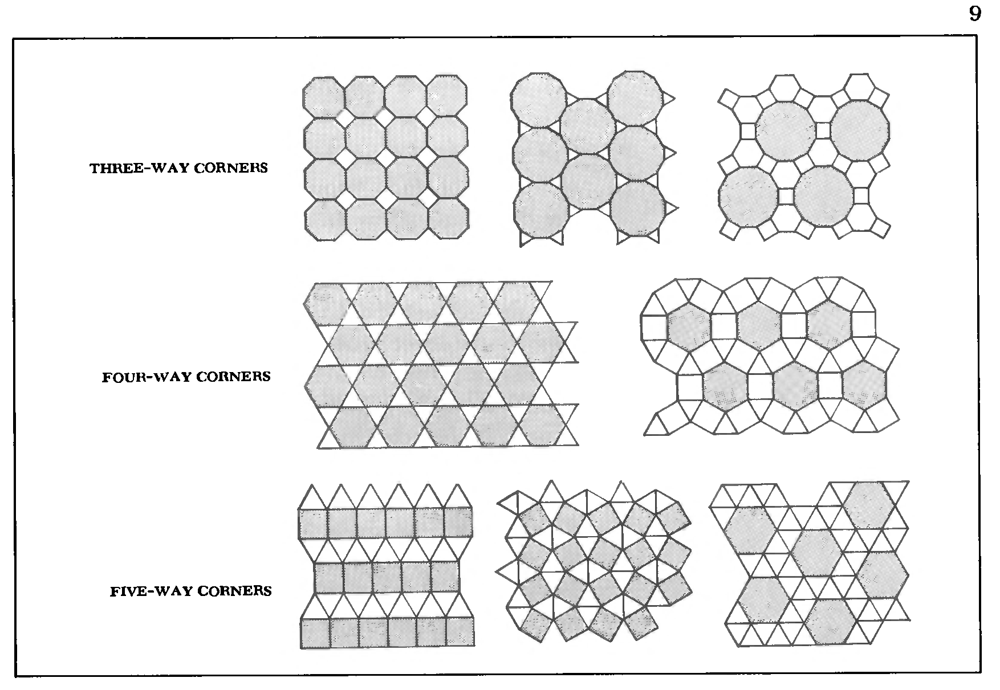

```
Created on  2019.05.20.22:40
自然模式-原著：PETER S.STEVENS 改编：Moly Chin
@author: molychin@qq.com
```


### Polyhedrons and Mosaics
多面体和镶嵌图

THE MAKING OF AN OPEN CUP from five equilateral triangles poses an interesting question. If you continue to add triangles to the rim, will the cup wrap back on itself to make a complete enclosure? The answer is yes. Fifteen additional triangles, joined five at a time at the corners, will automatically make a closed container - a regular polyhedron with twenty triangular faces" It is pictured in the top right-hand frame of Figure 5. When you make that polyhedron, you cannot help but be impressed by the way all the triangles fall into place. They fit perfectly. You do not have to trim any edges, defonn any corners, or force the fit in any way. Such a polyhedron is beautifully unequivocal; it either comes out perfectly or not at all. The conditions for its existe"nce have been determined since the world began.

用五个等边三角形做一个开口碗提出了一个有趣的问题。如果你继续在边缘添加三角形，杯子会自动包裹起来形成一个完整的外壳吗？答案是肯定的。另外15个三角形，在角落处一次连接5个，将自动形成一个封闭的容器——一个有20个三角形面的正多面体”，如图5右上框所示。当你做多面体的时候，你会不由自主地对所有三角形的落点印象深刻。它们很合身。您不必修剪任何边缘、修剪任何角或以任何方式强制粘合。这样一个多面体是美丽而明确的；它要么完美地出现，要么根本不出现。它的存在条件自世界开始以来就已确定。


In addition to joining triangles five at a time, you can join them three at a time and four at a time to get a four-sided tetrahedron and an eight-sided octahedron. Similarly, too, you can join squares three at a time to get a cube, and regular five-sided pentagons three at a time to get a dodecahedron. Altogether, you can make five regular convex polyhedrons. They are pictured in Figure 5. Each of them has regular faces and regular corners. They were known to the ancient Greeks and from that day to this no one has added to their number. And no one ever will. No one will ever make a regular enclosure out of six-, seven-, or eightsided polygons, or out of any other regular plane figures. Space allows the construction of only the five regular forms. As shown in the figure, three of the forms have lines that meet three at a time to make three-way corners, while one form has four-way and one form five-way corners. None have corners at which more than five elements join. None have faces with more/-than five edges.

除了一次连接五个三角形之外，还可以一次连接三个三角形，一次连接四个三角形，得到四面体和八面体。同样，你也可以一次连接三个正方形得到一个立方体，一次连接三个规则的五边五角体得到一个十二面体。一共可以制作五个正凸面多面体。它们如图5所示。它们每个都有规则的面和规则的角。古希腊人都知道他们，从那一天到现在，没有人再增加他们的数目。没有人愿意。没有人会用六边、七边或八边的多边形或任何其他规则的平面图形做一个规则的封闭。空间只允许建造五种规则形式。如图所示，三个窗体有一次三个相交的线条形成三个角，而一个窗体有四个角，一个窗体有五个角。没有一个角的连接超过五个元素。没有一个面的边数超过五条。


By joining regular plane figures of more than one type, while keeping the corners or vertexes the same, you can, of course, make other polyhedrons, the semiregular ones. But here again, the possibilities are limited. Excluding prisms, you can make only the fourteen semiregular polyhedrons shown in Figure 6. No more will be discovered.

通过加入多个平面的平面图形，在保持角或顶点相同的情况下，当然，也可以生成其他的多面体，即半规则的多面体。但在这里，可能性是有限的。除了棱镜，你只能制作图6所示的十四个半规则多面体。再也找不到了。


Here are some of the limitations on those polyhedrons. Every form has three-, four-, or five-way corners, and every form has some faces with three, four, or five edges. If triangles or hexagons occur, they come in multiples of four: they number either four, eight, twenty, thirty-two, or eighty. Squares and octagons come in multiples of six: they number six, twelve, eighteen, or thirty. If pentagons or decagons occur there must be twelve of them. No form has faces with seven, nine, eleven, or a higher number of edges.

下面是对这些多面体的一些限制。每个窗体都有三个、四个或五个角，每个窗体都有一些面，有三个、四个或五个边。如果三角形或六边形出现，它们是四的倍数：四、八、二十、三十二或八十。正方形和八边形有六的倍数：六、十二、十八或三十。如果出现五边形或十边形，必须有十二个。任何形式都没有七、九、十一或更多边的面。

Further limitations on how elements can join show up when we combine the regular and semiregular polyhedrons to fill space without leaving gaps or holes.
Including combinations that use regular prisms (a form that has a regular polygonal top and bottom joined by a belt of squares), we find only twenty-two space-filling clusters. Only polyhedrons with some triangular or square faces can join in such combinations.

当我们将规则多面体和半规则多面体组合起来填充空间而不留空隙或孔洞时，元素如何连接的进一步限制就显现出来了。包括使用规则棱柱的组合（有规则多边形顶部和底部由一条正方形带连接的形式），我们只找到22个充满空间的簇。只有具有一些三角形或方形面的多面体才能加入这种组合。

Polyhedrons with pentagonal faces cannot be used. A portion of one of those clusters is shown in Figure 7. It is a group of truncated octahedrons which picture the molecular geometry of the aluminosilicates and the statistically "ideal" soap froth which we will investigate further.
Analogous to the limited number of regular and semiregular three-dimensional polyhedrons is the limited number of regular and semiregular twodimensional mosaics. A portion of one of those mosaics was shown in the group of six equilateral triangles of Figure 1 (d). The triangles lie flat and if we add more triangles, still keeping six around each point, we can extend the array as much as we please in any direction. A little experimentation reveals the existence of only two other mosaics that have regular and identical pieces and that can be extended indefinitely. All three mosaics are pictured in Figure 8. We also find eight and only eight semiregular mosaics that combine regular polygons of more than one type while maintaining identical joints. They are pictured in Figure g. Each of those mosaics combines triangles or squares or both together. Only three-, four-, or five-way joints are allowed.
Note the absence of pentagons in the groups of rcgular and semiregular mosaics. Pentagons do not combine with themselves or with other regular figures to fill space. Polyhedrons that have pentagonal faces also do not combine with one another to fill space.

不能使用五边形面多面体。这些簇中的一部分显示在图7中。它是一组截短的八面体，描绘了铝硅酸盐的分子几何结构和统计上的“理想”肥皂泡，我们将进一步研究。


类似于有限数量的正规和半正规三维多面体是有限数量的正规和半正规二维镶嵌。其中一个马赛克的一部分显示在图1（d）的六个等边三角形组中。三角形是平的，如果我们增加更多的三角形，在每个点周围保持6个，我们可以在任意方向上扩展数组。一个小小的实验揭示了只有另外两个镶嵌物的存在，它们有规则的和相同的部分，并且可以无限期地扩展。所有三个马赛克如图8所示。我们还发现了八个并且只有八个半规则的镶嵌，它们结合了不止一种类型的规则多边形，同时保持相同的关节。它们如图G所示。每一个马赛克将三角形或正方形或两者结合在一起。仅允许三通、四通或五通接头。

注意在古罗马和半规则马赛克中没有五边形。五边形不与自身或其他规则的人物结合来填充空间。具有五边形面的多面体也不会相互结合来填充空间。


Thus we find that crystals, which are repetitive assemblages of molecules, never have regular five-sided faces. In fact, no inanimate form exhibits pentagonal symmetry. No regularly pentagonal snowflake has ever fallen from the sky. Only animate forms, complicated forms, structures beyond the interminable stacking of identical molecules, have shapes with five equal sides.
The regular and semi regular mosaics and polyhedrons provide the most explicit demonstration that nature's forms are limited. Seldom, however, must nature create such perfectly regular shapes. Seldom is she constrained to work with equilateral triangles or to make forms with identical corners. More often she can introduce variations. She can push and pull and add and take away. But in all her manipulations, she must bend and warp in accord with the amount of material at hand. Her planes, bowls, and saddles may not extend to infinity, make perfect polyhedrons, or curve with absolute precision, but they must lie flat, bend around on themselves, and undulate forward and back, in keeping with the limited ways in which material can be distributed in space.

因此我们发现，晶体是分子的重复组合，从来没有规则的五边形面。事实上，没有一种无生命的形式表现出五角对称。从来没有一片五边形的雪花从天空落下。只有生命形式、复杂形式、超越了相同分子无休止叠加的结构，才有五条等边的形状。

规则和半规则的镶嵌和多面体提供了最明确的证明，**自然的形式是有限的**。然而，大自然很少能创造出如此完美规则的形状。她很少被限制使用等边三角形或用相同的角制作形状。她可以更频繁地引入变种。她可以推、拉、加、取。但在她所有的操作中，她必须根据手头的材料数量弯曲和弯曲。她的平面、碗和鞍座可能不会延伸到无穷远，不会形成完美的多面体，或者曲线具有绝对精度，但它们必须平躺，围绕自身弯曲，并向前和向后起伏，以保持材料在空间中分布的有限方式。




>待续...
