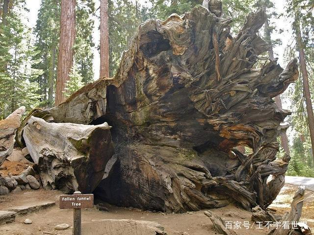
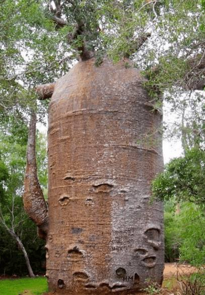
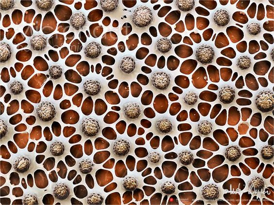
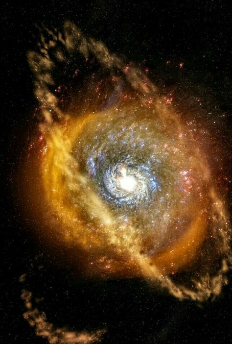
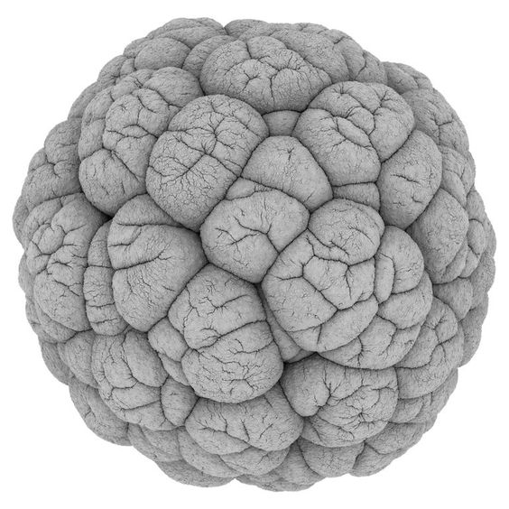
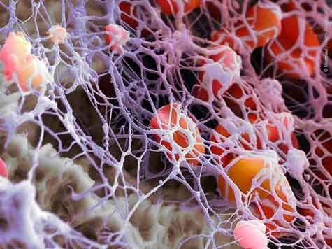
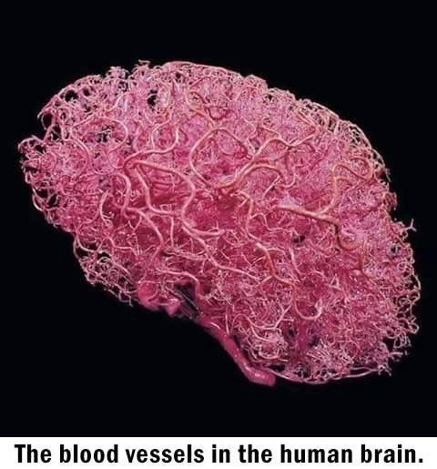
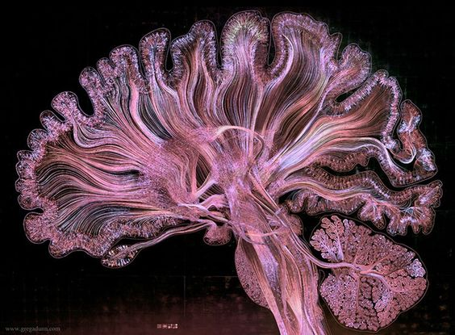

```
Created on  2019.05.20.22:40
Patterns in Nature Author:PETER S.STEVENS
自然模式 编译：Moly Chin
@author: molychin@qq.com
```



#### The Effect of Scale
From what has already been demonstrated, you can plainly see the impossibility of increasing the size of structures to vast dimensions either in art or in nature; likewise the impossibility of building ships, palaces, or temples of enormous size in such a way that their oars, yards, beams, iron-bolts, and, in short, all their other parts will hold together; nor can nature produce trees of extraordinary size because the branches would break down under their own weight; so also it would be impossible to build up the bony structures of men, horses, or other animals so as to hold together and perform their normal functions if these animals were to be increased enormously in height; for this increase in height can be accomplished only by employing a material which is harder and stronger than usual, or by enlarging the size of the bones, thus changing their shape until the form and appearance of the animals suggest a monstrosity,
-Calileo

#### 规模效应

事实上，无论是在艺术上还是在自然上，你都能清楚地看到不可能将结构的尺寸不断构造到巨型尺寸；同样，不可能建造大型的船只、宫殿或寺庙，其建造方式使它们的桨、院子、横梁、铁栓。总之，它们的所有其他部分都能容纳在一起。自然也不能生长出非常大的树，因为树枝会在它们自身的重量下分解；因此，如果这些动物的高度要大幅度增加的话，也不可能建立起人、马或其他动物的骨骼结构，以使它们结合在一起并发挥它们的正常功能；因为在只有使用比平时更硬、更结实的材料，或者扩大骨骼的尺寸，从而改变它们的形状，直到动物的形状和外观显示出一种畸形，才能完成高度的增加。  
-Calileo

THE EFFECT OF MAGNITUDE or absolute size as a determinant of form shows again how space shapes the things around us. In studying polyhedrons we are unconcerned with magnitude. We assume that a cube is a cube no matter what its size. We find, however, that the geometric relations that arise from a difference in size affect structural behavior, and that a large cube is relatively weaker than a small cube. We also find, as a corollary, that in order to maintain the same structural characteristics a difference in size must be accompanied by a difference in shape.



**大小或绝对大小作为形式决定因素的影响再次显示了空间如何塑造我们周围的事物**。在研究多面体时，我们与数量无关。我们假设一个立方体不管大小都是一个立方体。然而，我们发现，尺寸差异引起的几何关系影响结构行为，大立方体比小立方体相对较弱。我们还发现，作为推论，**为了保持相同的结构特征，尺寸上的差异必须伴随着形状上的差异**。

To understand the effects of size and how they are derived from the spreading of space, consider again the regular polyhedrons pictured in Figure 5. The following table shows the surface areas and volumes of those solids, based on a dimension d taken to be the length of an edge. The tetrahedron, octahedron, and icosahedron are the solids with four, eight, and twenty triangular faces; the cube and dodecahedron have six square and twelve pentagonal faces.

为了了解大小的影响以及它们是如何从空间的扩展中衍生出来的，请再次考虑图5中所示的规则多面体。下表显示了这些实体的表面积和体积，基于作为边缘长度的尺寸D。四面体、八面体和二十面体是具有四个、八个和二十个三角形面的实体；立方体和十二面体有六个正方形和十二个五角面。


作为形状决定因素的大小或绝对大小的影响再次显示了空间如何塑造我们周围的事物。在研究多面体时，我们不关心大小。我们假设立方体是一个立方体，不管它的大小。然而，我们发现，由尺寸差异引起的几何关系影响结构行为，并且大的。
立方体比小方块相对较弱。我们还发现，作为一个推论，为了保持相同的结构特征，尺寸的差异必须伴随着形状上的差异。
为了理解尺寸的影响以及它们是如何从空间的扩展中得到的，再次考虑图5中所示的规则多面体。下表显示了这些固体的表面积和体积，基于被视为边缘长度的尺寸D。四面体、八面体和二十面体是具有四个、八个和二十个三角形面的立体体；立方体和十二面体有六个正方形和十二个五边形面。

The table shows that the surface area of each solid is some number times d2 , whereas the volume of each solid is some number times d3 . The number preceding the term d2 or d3 is different for the five different solids. It happens as well that the numbers would be different if the curvature of space was different. But the general rules, which are true for all spaces of constant curvature, are that surface area is proportional to d2 , Le., to the square of the linear dimension, whereas volume is proportional to d3, the cube of the linear dimension.

该表显示每个固体的表面积是若干倍d2，而每个固体的体积是一些次数d3。术语D2或D3之前的数字对于五种不同的固体是不同的。如果空间曲率不同，数字也会不同。但是对于所有曲率恒定的空间来说，一般的规则是，表面积与D2，LE，成线性尺寸的平方成正比，而体积与D3，线性维数的立方成正比。

The rules give us a measure of how space spreads. And thus they describe the outward spread of anything that distributes itself in space. Consider, for example, the spread of energy. The energy flowing through each unit area diminishes with the square of the distance from the source.
Thus the light grows dimmer, the sound softer, and the gravitational, magnetic, and electrical fields weaker the farther from the source you place your eye, ear, weighing scale, magnetometer, or potentiometer.



这些规则给我们一个衡量空间传播的尺度。因此，它们描述了在空间中分布的任何东西的向外扩散。例如，考虑能量的传播。流经各单位面积的能量随着距源的距离的平方而减小。因此，光线变暗，声音柔和，并且重力、磁场和电场越弱，你放置眼睛、耳朵、秤、磁力仪或电位器的源就越远。

Measuring the propagation of energy is similar to measuring the expanding surface of a balloon. When you measure close to the energy source, you measure a compact halo of energy that is like the constricted surface of a small balloon. The energy is dense and the signal is loud and clear. When you measure far from the source, you measure an expanded halo that is like the expanded surface of an inflated balloon. The energy is spread and dissipated. The same amount of energy, or elastic surface, surrounds the source at every distance from the source, but the density of the energy, or the surface, diminishes with increasing distance.



测量能量的传播类似于测量气球的膨胀表面。当你在靠近能量源的地方测量时，你会测量一个紧凑的能量晕，就像一个小气球的收缩表面。能量密集，信号清晰。当你在远离光源的地方测量时，你会测量一个展开的光晕，它就像一个膨胀的气球的展开表面。能量扩散和消散。同样数量的能量，或弹性表面，围绕着震源在距震源的每一个距离，但能量的密度，或表面，随着距离的增加而减小。

Putting the matter more directly, the inverse square law, the statement that energy diminishes, or varies inversely, as the square of its distance from the source, is not so much a description of energy as it is of the spatial arena in which the energy advances. The occurrence of the term d2 in formulas for the propagation of light, sound, gravitational and electromagnetic fields is synonymous with the occurrence of d2 in our table. It is an area term; it describes the size of the spherical surface around an energy source.
In the same way that many phenomena vary in proportion to surface, to d2 , many others vary in proportion to volume, to IF. Chief among the properties dependent upon volume is weight. Little things are light, big things heavy. A fly is so light it can cling to the ceiling, like a piece of dust. The prowess of the fly is not so much a function of its sticky feet as of its small size. In fact, the point has been justly made that man too could walk on the ceiling, if he were small enough.



更直接地说，平方反比定律，能量减少的说法，或是相反地变化，作为它与源的距离的平方，与其说是能量的描述，不如说是能量的空间竞技场的描述。在光、声、重力和电磁场传播公式中，D2的出现与我们表中D2的发生是同义的。它是一个区域术语，它描述了围绕能量源的球面的大小。
以同样的方式，许多现象与表面成比例地变化，对于D2，许多其它的与体积成比例地变化，如果是。取决于体积的属性主要是重量。小事情轻，大事重。苍蝇是如此轻，它可以粘在天花板上，像一片灰尘。苍蝇的威力与其粘性足的大小无关。事实上，如果他足够小的话，这一点已经被正确地证明了，人也可以在天花板上行走。

And flight would pose no problem either. At the size of a fly, man's concern would rather be to stay on the ground. As J. B. S. Haldane observed, weight, or the pull of gravity, presents no problem to an animal even the size of a mouse:
You can drop a mouse down a thousand-yard mine shaft; and, on arriving at the bottom, it gets a slight shock and walks away. A rat would probably be killed, though it can fall safely from the eleventh story of a building; a man is killed, a horse splashes.
A beached whale does not even have to fall to die; it can suffocate under its own weight stranded in shallow water.
We infer from our table of surfaces and volumes that as an object increases in size, its area and volume increase at strikingly different rates, the one as d2 the other as IF. The next table shows the significance of that difference.

飞行也不会造成任何问题。像一只苍蝇那么大，人们关心的是呆在地上。正如J.B.S.Haldane所观察到的，体重或重力的拉力对动物来说都没有问题，即使是老鼠的大小：
你可以把一只老鼠放在一千码的矿井里，当它到达底部时，会受到轻微的震动，然后走开。一只老鼠很可能会被杀死，尽管它可以从一座建筑物的第十一层安全地掉下来；一个人被杀了，一匹马被溅落了。
**搁浅的鲸鱼甚至不必摔死，它可以在自己的重量下窒息而死，搁浅在浅水中**。超级强大的生物会死于自身的体重。  
我们从表面和体积的表中推断，当一个物体的尺寸增加时，它的面积和体积以惊人的速度增加，一个像d2，另一个像d2。下表显示了这种差异的重要性。


An object with a linear dimension 32 times that of another has 1,024 times as much surface area and a staggering 32,768 times as much volume. A large object, therefore, has more volume in relation to its surface than a small object. In living fonns, a large organism weighs more, as we have seen, and generates more heat than a small one. Those functions depend on the volume or mass of its tissues. The large organism is also weaker and has more difficulty dissipating heat and assimilating food and oxygen. Those functions depend on its surface area.
If the large organism is to function like its small cousin, it must compensate for its preponderance of volume by selectively increasing its critical surfaces.



一个物体的线性尺寸是另一个物体的32倍，它的表面积是另一个物体的1024倍，体积是另一个物体的32768倍。因此，大物体相对于其表面的体积比小物体大。正如我们所见，在活体中，一个大的有机体比一个小的有机体更重，产生更多的热量。这些功能取决于组织的体积或质量。大型生物体也较弱，更难散热和吸收食物和氧气。这些功能取决于它的表面积。
如果大型有机体要像它的小表亲那样运作，它必须通过选择性地增加其临界表面来补偿其体积优势。

The general method of increasing surface area is to introduce complications: to Hatten, grow hairs, branch, wrinkle, elongate, and hollow out. We see examples of those adaptations all about us.
In Figure 10, a young shoot extends Hat leaves to the sun. As growth continues, the stem will branch and put out more leaves, and then finally thicken into a tough bough to carry still more leaves and branches.
The proliferation of branches and leaves will enable the large spray to function like the small shoot.
In Figure 11 the stem of the celandine flattens into webs and leaves (a), and the enclosing sheath of the cornstalk folds outward into a long blade (b). We see that the celandine (c), as well as the grass (d), grows hairs, which, like thorns, cilia, fur, antennae, spines, and all the other prickly appendages of living things, keep surface commensurate with volume.



**增加表面积的一般方法是引入一些生理特征：生长毛发、树枝、皱纹、拉长和凹陷**。我们看到了这些适应的例子。
在图10中，一个幼芽将帽子叶子伸向太阳。随着生长的继续，茎会分枝，长出更多的叶子，然后最后变厚成为坚硬的树枝，以承载更多的叶子和树枝。
树枝和树叶的扩散将使大喷雾剂起到像小枝一样的作用。


在图11中，白屈菜的茎扁平成网和叶（a），玉米茎的包围鞘向外折叠成长的叶片（b）。我们看到白细胞（c）和草（d）都长出毛发，像刺、纤毛、毛发、触角、刺和所有其他生物的多刺附属物一样，使表面与体积相称。


Networks of branches and roots increase surface area still further. According to Howard J. Dittmer at the University of Iowa, in only four months a single plant of rye grows 387 miles of root. When the root hairs are included, the length is 7,000 miles. Furthermore, large plants branch proportionately more than small ones. By way of example, Figure 12 shows the sprouting pod of the red mangrove with its few dmple leaves and unbranched stem, in comparison with a thicket of mature trees. To keep their surface commensurate with their greatly increased volume, the large trees branch prolifically and put out a multitude of leaves. All their branching enables them to function like the little sprout. All their branching comes about because they have increased in size.

**树枝和根系的网络进一步增加了表面积**。爱荷华大学的霍华德·J·迪特米尔说，仅仅四个月，一株黑麦就可以长出387英里的根。当包含根毛时，长度为7000英里。此外，大型植物比小型植物的分枝比例更大。举例来说，图12显示了红树林的萌芽荚，与成熟树丛相比，红色红树林的萌芽荚只有很少的几片叶子和不分枝的茎。为了使它们的表面与体积的大幅度增加相称，大树枝条繁茂，长出许多叶子。它们所有的分支使它们能够像小嫩芽一样工作。它们所有的分支都是因为它们的大小增加了。

|||
|---|---|
|a|b|

In Figure 13 increase in surface area is exemplified by branching. Shown there are the blood and air pathways of the human lung revealed by a latex casting (a), a mangrove thicket (b), arteries of a dog, again revealed in latex (c), and the bloom of the common smoke tree, Cotinus coggygria (d).
The branching of the circulatory systems in the human lung and in the dog are especially interesting as attempts to increase surface area. A small singlecelled organism has no need for such complications. It does not require lungs or hearts or any system of circulation. It can breathe and absorb food directly through its cell wall, there being relatively more wall than interior tissue. When the single-celled organism grows, or when almost any cell grows for that matter, and the functions that depend upon surface can no longer sustain the inner tissue, the organism does not develop wrinkles, veins, or branches; it simply divides.
It makes itself small again and starts over with a double identity and a comparatively greater surface for each of its parts. Thus we are not surprised to learn that cells exist within a limited range of size. They can be neither too big nor too small. Otherwise the functions dependent upon surface would not match those dependent upon volume.

在图13中，表面积的增加以分支为例。图中显示了由乳胶铸模（A）、红树林树丛（B）、狗的动脉（C）以及普通烟树cotinus coggygria（D）的开花所揭示的人肺的血液和空气通道。


当试图增加肺表面积时，人肺和狗循环系统的分支尤其有趣。小的单细胞生物不需要这种复杂化构造。它不需要肺部、心脏或任何循环系统。它可以通过细胞壁直接呼吸和吸收食物，细胞壁比内部组织要多。当单细胞有机体生长时，或者当几乎任何一个细胞为此而生长时，依赖于表面的功能不能再维持内部组织时，该有机体不会产生皱纹、静脉或分支；它只是分裂。
它使自己再次变小，并以一个双重身份和一个相对较大的表面为每个部分重新开始。因此，当我们得知细胞存在于有限的大小范围内时，我们并不感到惊讶。它们既不能太大也不能太小。否则依赖于表面的函数将与依赖于体积的函数不匹配。

A nice analogy to cell division is shown in Figure 14, in which a small stream of water has been "stopped" with a stroboscopic light to reveal its constituent drops. The tension in the skin of a drop can enclose only so much liquid. If the volume of water is too great the little skin will burst. The volume must remain commensurate with the strength of the surface.
And thus, as with cells, we find an upper limit of size. No drops are as big as baseballs or watennelons. The point that things are restricted in size is, of course, the fundamental lesson. Different things are confined to different latitudes of dimension. Nucleons bind together to make nuclei of relatively fixed size, electrons join nuclei to make atoms of a well-defined magnitude, atoms unite to fonn molecules, molecules combine to make cells, and cells make organisms. You never find a nucleus, an atom, a molecule, or a cell as big as a man. Each fonn has its own dimensional realm, its upper and lower bounds. But each fonn combines and works together with others like itself to make larger structures and organizations.



细胞分裂的一个很好的类比如图14所示，在图中，一小股水流被频闪灯“停止”以显示其组成的水滴。水滴表面的张力只能容纳这么多液体。如果水的体积太大，小皮肤就会破裂。体积必须与表面强度相称。
因此，与细胞一样，我们发现大小的上限。没有一滴像棒球或瓦灯一样大。当然，事情在规模上受到限制这一点是最基本的教训。不同的事物局限于不同纬度的维度。核子结合在一起形成相对固定大小的原子核，电子结合原子核使原子具有明确的大小，原子结合成分子，分子结合成细胞，细胞形成有机体。你永远找不到一个原子核，一个原子，一个分子，或者一个像人一样大的细胞。每一方都有自己的维度领域，上下限。但是，每一个基金会结合起来，并与其他像自己这样的机构合作，形成更大的结构和组织。


Even within a given class of form, the properties of the small differ from those of the large. And, at least in the animal kingdom, those properties vary in a uniform and predictable manner. Small creatures breathe faster than large creatures. Their hearts beat faster, their voices are higher, and their wings or limbs move more rapidly. They consume more food in relation to their body weight, reproduce faster, and have shorter lifetimes.
As D'Arcy Thompson pointed out, the reason for those variations is that the small muscle, be it heart, lung, wing, or vocal cord, oscillates faster than the large muscle, just as a short thin string, when it is plucked, vibrates more rapidly than a long thick one.
We see the principle confirmed when we tabulate heartbeats of different animals:

即使在给定类型的形式中，小的性质也与大的性质不同。而且，至少在动物王国，这些特性以均匀和可预测的方式变化。**小动物呼吸比大型生物快。他们的心跳加快，嗓音更高，翅膀或四肢运动得更快。他们消耗更多的食物与体重有关，繁殖更快，寿命更短**。
正如汤普森所指出的，这些变化的原因是小的肌肉，如心脏、肺、翅膀或声带，比大的肌肉振动得快，就像一根短的细绳，当它被拔起的时候，比长的粗的振动得快。
我们看到当我们列出不同动物心跳的原理时：


Since respiration is coupled with heartbeat - usually one breath is taken for every four heartbeats - the rate of breathing also decreases with increasing size. And so do wingbeats and the movement of limbs.

由于呼吸与心跳耦合——通常每四次心跳一次呼吸-呼吸的速度也随着尺寸的增加而减小。翅膀的动作和肢体的运动也是如此。


>待续...
