```
Created on  2019.05.20.22:40
Patterns in Nature Author:PETER S.STEVENS
编译：Moly Chin
@author: molychin@qq.com
```


### The Effect of Scale
From what has already been demonstrated, you can plainly see the impossibility of increasing the size of structures to vast dimensions either in art or in nature; likewise the impossibility of building ships, palaces, or temples of enormous size in such a way that their oars, yards, beams, iron-bolts, and, in short, all their other parts will hold together; nor can nature produce trees of extraordinary size because the branches would break down under their own weight; so also it would be impossible to build up the bony structures of men, horses, or other animals so as to hold together and perform their normal functions if these animals were to be increased enormously in height; for this increase in height can be accomplished only by employing a material which is harder and stronger than usual, or by enlarging the size of the bones, thus changing their shape until the form and appearance of the animals suggest a monstrosity,
-Calileo

规模效应

从已经证明的情况来看，无论是在艺术上还是在自然上，你都能清楚地看到不可能将结构的尺寸增加到巨大的尺寸；同样，不可能建造大型的船只、宫殿或寺庙，其建造方式使它们的桨、院子、横梁、铁栓，总之，它们的所有其他部分都能容纳在一起；自然也不能产生非常大的树，因为树枝会在它们自身的重量下分解；因此，如果这些动物的高度要大幅度增加的话，也不可能建立起人、马或其他动物的骨骼结构，以使它们结合在一起并发挥它们的正常功能；因为在只有使用比平时更硬、更结实的材料，或者扩大骨骼的尺寸，从而改变它们的形状，直到动物的形状和外观显示出一种畸形，才能完成高度的增加。
-Calileo

THE EFFECT OF MAGNITUDE or absolute size as a determinant of form shows again how space shapes the things around us. In studying polyhedrons we are unconcerned with magnitude. We assume that a cube is a cube no matter what its size. We find, however, that the geometric relations that arise from a difference in size affect structural behavior, and that a large cube is relatively weaker than a small cube. We also find, as a corollary, that in order to maintain the same structural characteristics a difference in size must be accompanied by a difference in shape.

大小或绝对大小作为形式决定因素的影响再次显示了空间如何塑造我们周围的事物。在研究多面体时，我们与数量无关。我们假设一个立方体不管大小都是一个立方体。然而，我们发现，尺寸差异引起的几何关系影响结构行为，大立方体比小立方体相对较弱。我们还发现，作为推论，**为了保持相同的结构特征，尺寸上的差异必须伴随着形状上的差异**。

To understand the effects of size and how they are derived from the spreading of space, consider again the regular polyhedrons pictured in Figure 5. The following table shows the surface areas and volumes of those solids, based on a dimension d taken to be the length of an edge. The tetrahedron, octahedron, and icosahedron are the solids with four, eight, and twenty triangular faces; the cube and dodecahedron have six square and twelve pentagonal faces.

为了了解大小的影响以及它们是如何从空间的扩展中衍生出来的，请再次考虑图5中所示的规则多面体。下表显示了这些实体的表面积和体积，基于作为边缘长度的尺寸D。四面体、八面体和二十面体是具有四个、八个和二十个三角形面的实体；立方体和十二面体有六个正方形和十二个五角面。

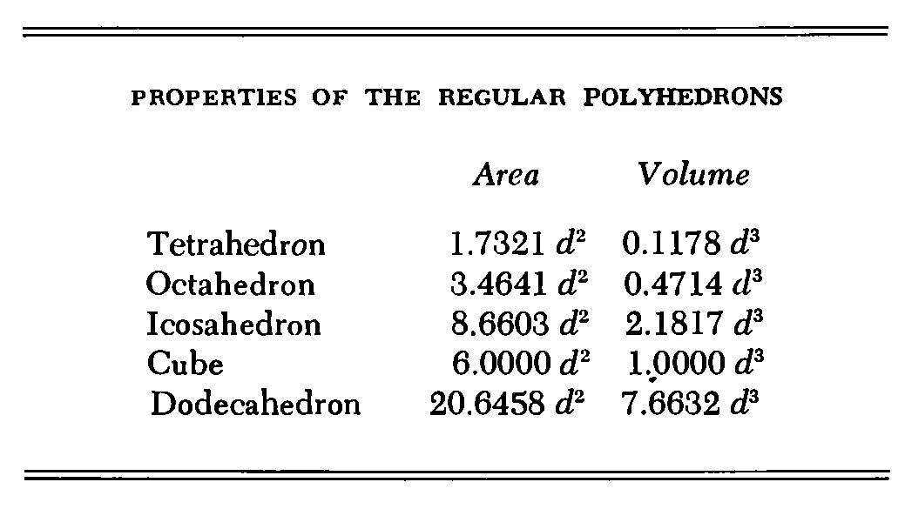

作为形状决定因素的大小或绝对大小的影响再次显示了空间如何塑造我们周围的事物。在研究多面体时，我们不关心大小。我们假设立方体是一个立方体，不管它的大小。然而，我们发现，由尺寸差异引起的几何关系影响结构行为，并且大的。
立方体比小方块相对较弱。我们还发现，作为一个推论，为了保持相同的结构特征，尺寸的差异必须伴随着形状上的差异。
为了理解尺寸的影响以及它们是如何从空间的扩展中得到的，再次考虑图5中所示的规则多面体。下表显示了这些固体的表面积和体积，基于被视为边缘长度的尺寸D。四面体、八面体和二十面体是具有四个、八个和二十个三角形面的立体体；立方体和十二面体有六个正方形和十二个五边形面。


The table shows that the surface area of each solid is some number times d2 , whereas the volume of each solid is some number times d3 . The number preceding the term d2 or d3 is different for the five different solids. It happens as well that the numbers would be different if the curvature of space was different. But the general rules, which are true for all spaces of constant curvature, are that surface area is proportional to d2 , Le., to the square of the linear dimension, whereas volume is proportional to d3, the cube of the linear dimension.
该表显示每个固体的表面积是若干倍d2，而每个固体的体积是一些次数d3。术语D2或D3之前的数字对于五种不同的固体是不同的。如果空间曲率不同，数字也会不同。但是对于所有曲率恒定的空间来说，一般的规则是，表面积与D2，LE，成线性尺寸的平方成正比，而体积与D3，线性维数的立方成正比。

The rules give us a measure of how space spreads. And thus they describe the outward spread of anything that distributes itself in space. Consider, for example, the spread of energy. The energy flowing through each unit area diminishes with the square of the distance from the source.
Thus the light grows dimmer, the sound softer, and the gravitational, magnetic, and electrical fields weaker the farther from the source you place your eye, ear, weighing scale, magnetometer, or potentiometer.

这些规则给我们一个衡量空间传播的尺度。因此，它们描述了在空间中分布的任何东西的向外扩散。例如，考虑能量的传播。流经各单位面积的能量随着距源的距离的平方而减小。
因此，光线变暗，声音柔和，并且重力、磁场和电场越弱，你放置眼睛、耳朵、秤、磁力仪或电位器的源就越远。

Measuring the propagation of energy is similar to measuring the expanding surface of a balloon. When you measure close to the energy source, you measure a compact halo of energy that is like the constricted surface of a small balloon. The energy is dense and the signal is loud and clear. When you measure far from the source, you measure an expanded halo that is like the expanded surface of an inflated balloon. The energy is spread and dissipated. The same amount of energy, or elastic surface, surrounds the source at every distance from the source, but the density of the energy, or the surface, diminishes with increasing distance.
测量能量的传播类似于测量气球的膨胀表面。当你在靠近能量源的地方测量时，你会测量一个紧凑的能量晕，就像一个小气球的收缩表面。能量密集，信号清晰。当你在远离光源的地方测量时，你会测量一个展开的光晕，它就像一个膨胀的气球的展开表面。能量扩散和消散。同样数量的能量，或弹性表面，围绕着震源在距震源的每一个距离，但能量的密度，或表面，随着距离的增加而减小。

Putting the matter more directly, the inverse square law, the statement that energy diminishes, or varies inversely, as the square of its distance from the source, is not so much a description of energy as it is of the spatial arena in which the energy advances. The occurrence of the term d2 in formulas for the propagation of light, sound, gravitational and electromagnetic fields is synonymous with the occurrence of d2 in our table. It is an area term; it describes the size of the spherical surface around an energy source.
In the same way that many phenomena vary in proportion to surface, to d2 , many others vary in proportion to volume, to IF. Chief among the properties dependent upon volume is weight. Little things are light, big things heavy. A fly is so light it can cling to the ceiling, like a piece of dust. The prowess of the fly is not so much a function of its sticky feet as of its small size. In fact, the point has been justly made that man too could walk on the ceiling, if he were small enough.

更直接地说，平方反比定律，能量减少的说法，或是相反地变化，作为它与源的距离的平方，与其说是能量的描述，不如说是能量的空间竞技场的描述。在光、声、重力和电磁场传播公式中，D2的出现与我们表中D2的发生是同义的。它是一个区域术语，它描述了围绕能量源的球面的大小。
以同样的方式，许多现象与表面成比例地变化，对于D2，许多其它的与体积成比例地变化，如果是。取决于体积的属性主要是重量。小事情轻，大事重。苍蝇是如此轻，它可以粘在天花板上，像一片灰尘。苍蝇的威力与其粘性足的大小无关。事实上，如果他足够小的话，这一点已经被正确地证明了，人也可以在天花板上行走。

And flight would pose no problem either. At the size of a fly, man's concern would rather be to stay on the ground. As J. B. S. Haldane observed, weight, or the pull of gravity, presents no problem to an animal even the size of a mouse:
You can drop a mouse down a thousand-yard mine shaft; and, on arriving at the bottom, it gets a slight shock and walks away. A rat would probably be killed, though it can fall safely from the eleventh story of a building; a man is killed, a horse splashes.
A beached whale does not even have to fall to die; it can suffocate under its own weight stranded in shallow water.
We infer from our table of surfaces and volumes that as an object increases in size, its area and volume increase at strikingly different rates, the one as d2 the other as IF. The next table shows the significance of that difference.

飞行也不会造成任何问题。像一只苍蝇那么大，人们关心的是呆在地上。正如J.B.S.Haldane所观察到的，体重或重力的拉力对动物来说都没有问题，即使是老鼠的大小：
你可以把一只老鼠放在一千码的矿井里，当它到达底部时，会受到轻微的震动，然后走开。一只老鼠很可能会被杀死，尽管它可以从一座建筑物的第十一层安全地掉下来；一个人被杀了，一匹马被溅落了。
搁浅的鲸鱼甚至不必摔死，它可以在自己的重量下窒息而死，搁浅在浅水中。
我们从表面和体积的表中推断，当一个物体的尺寸增加时，它的面积和体积以惊人的速度增加，一个像d2，另一个像d2。下表显示了这种差异的重要性。

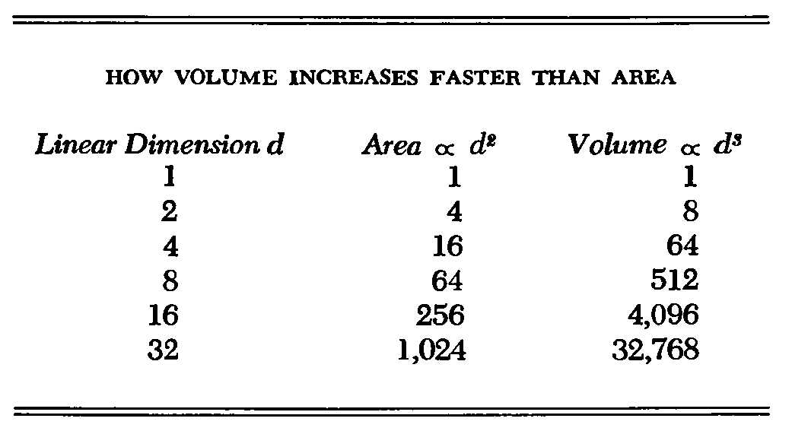

An object with a linear dimension 32 times that of another has 1,024 times as much surface area and a staggering 32,768 times as much volume. A large object, therefore, has more volume in relation to its surface than a small object. In living fonns, a large organism weighs more, as we have seen, and generates more heat than a small one. Those functions depend on the volume or mass of its tissues. The large organism is also weaker and has more difficulty dissipating heat and assimilating food and oxygen. Those functions depend on its surface area.
If the large organism is to function like its small cousin, it must compensate for its preponderance of volume by selectively increasing its critical surfaces.

一个物体的线性尺寸是另一个物体的32倍，它的表面积是另一个物体的1024倍，体积是另一个物体的32768倍。因此，大物体相对于其表面的体积比小物体大。正如我们所见，在活体中，一个大的有机体比一个小的有机体更重，产生更多的热量。这些功能取决于组织的体积或质量。大型生物体也较弱，更难散热和吸收食物和氧气。这些功能取决于它的表面积。
如果大型有机体要像它的小表亲那样运作，它必须通过选择性地增加其临界表面来补偿其体积优势。

The general method of increasing surface area is to introduce complications: to Hatten, grow hairs, branch, wrinkle, elongate, and hollow out. We see examples of those adaptations all about us.
In Figure 10, a young shoot extends Hat leaves to the sun. As growth continues, the stem will branch and put out more leaves, and then finally thicken into a tough bough to carry still more leaves and branches.
The proliferation of branches and leaves will enable the large spray to function like the small shoot.
In Figure 11 the stem of the celandine flattens into webs and leaves (a), and the enclosing sheath of the cornstalk folds outward into a long blade (b). We see that the celandine (c), as well as the grass (d), grows hairs, which, like thorns, cilia, fur, antennae, spines, and all the other prickly appendages of living things, keep surface commensurate with volume.

增加表面积的一般方法是引入并发症：生长毛发、树枝、皱纹、拉长和凹陷。我们看到了这些适应的例子。
在图10中，一个幼芽将帽子叶子伸向太阳。随着生长的继续，茎会分枝，长出更多的叶子，然后最后变厚成为坚硬的树枝，以承载更多的叶子和树枝。
树枝和树叶的扩散将使大喷雾剂起到像小枝一样的作用。


在图11中，白屈菜的茎扁平成网和叶（a），玉米茎的包围鞘向外折叠成长的叶片（b）。我们看到白细胞（c）和草（d）都长出毛发，像刺、纤毛、毛发、触角、刺和所有其他生物的多刺附属物一样，使表面与体积相称。

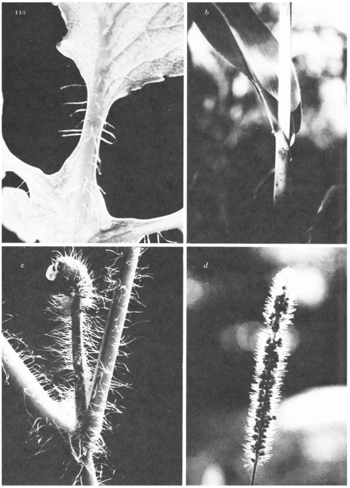

Networks of branches and roots increase surface area still further. According to Howard J. Dittmer at the University of Iowa, in only four months a single plant of rye grows 387 miles of root. When the root hairs are included, the length is 7,000 miles. Furthermore, large plants branch proportionately more than small ones. By way of example, Figure 12 shows the sprouting pod of the red mangrove with its few dmple leaves and unbranched stem, in comparison with a thicket of mature trees. To keep their surface commensurate with their greatly increased volume, the large trees branch prolifically and put out a multitude of leaves. All their branching enables them to function like the little sprout. All their branching comes about because they have increased in size.

树枝和根系的网络进一步增加了表面积。爱荷华大学的霍华德·J·迪特米尔说，仅仅四个月，一株黑麦就可以长出387英里的根。当包含根毛时，长度为7000英里。此外，大型植物比小型植物的分枝比例更大。举例来说，图12显示了红树林的萌芽荚，与成熟树丛相比，红色红树林的萌芽荚只有很少的几片叶子和不分枝的茎。为了使它们的表面与体积的大幅度增加相称，大树枝条繁茂，长出许多叶子。它们所有的分支使它们能够像小嫩芽一样工作。它们所有的分支都是因为它们的大小增加了。

|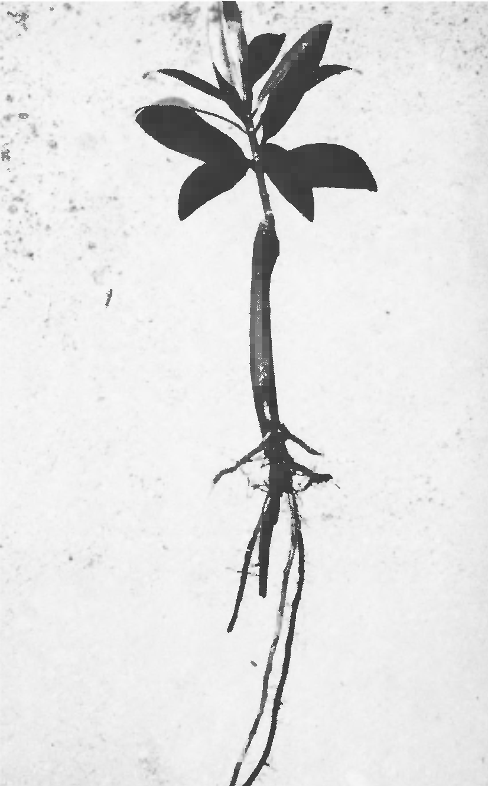|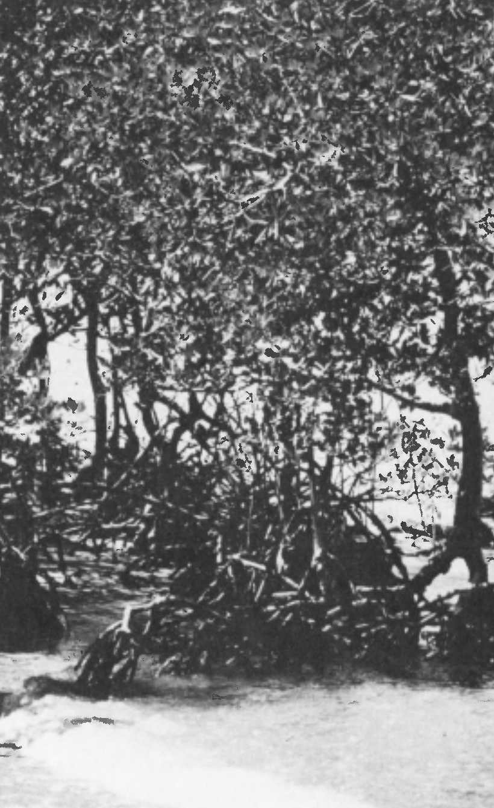|
|---|---|
|a|b|

In Figure 13 increase in surface area is exemplified by branching. Shown there are the blood and air pathways of the human lung revealed by a latex casting (a), a mangrove thicket (b), arteries of a dog, again revealed in latex (c), and the bloom of the common smoke tree, Cotinus coggygria (d).
The branching of the circulatory systems in the human lung and in the dog are especially interesting as attempts to increase surface area. A small singlecelled organism has no need for such complications. It does not require lungs or hearts or any system of circulation. It can breathe and absorb food directly through its cell wall, there being relatively more wall than interior tissue. When the single-celled organism grows, or when almost any cell grows for that matter, and the functions that depend upon surface can no longer sustain the inner tissue, the organism does not develop wrinkles, veins, or branches; it simply divides.
It makes itself small again and starts over with a double identity and a comparatively greater surface for each of its parts. Thus we are not surprised to learn that cells exist within a limited range of size. They can be neither too big nor too small. Otherwise the functions dependent upon surface would not match those dependent upon volume.

在图13中，表面积的增加以分支为例。图中显示了由乳胶铸模（A）、红树林树丛（B）、狗的动脉（C）以及普通烟树cotinus coggygria（D）的开花所揭示的人肺的血液和空气通道。

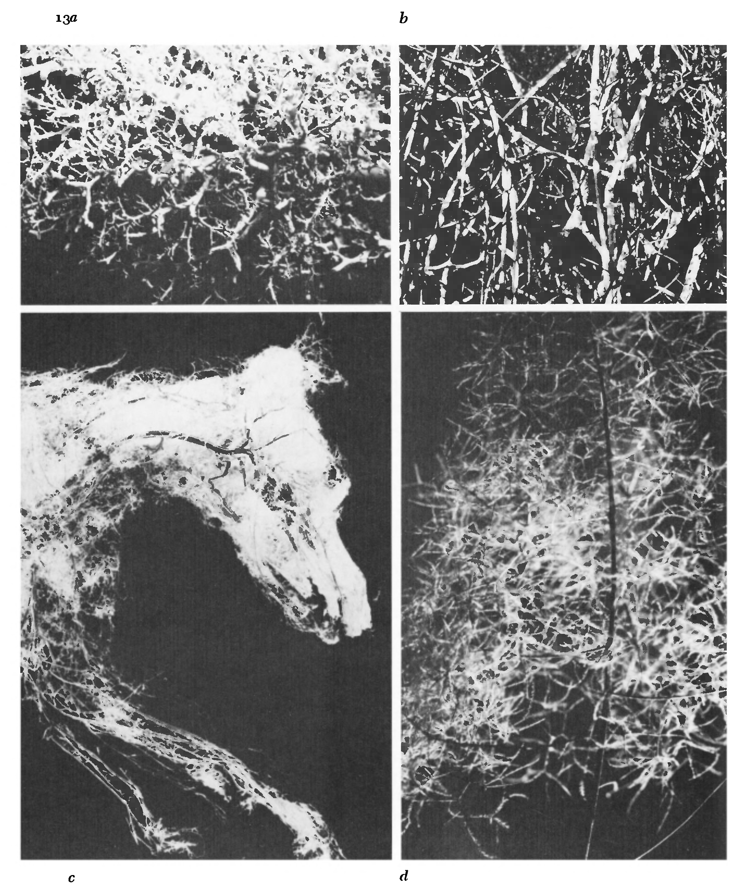

当试图增加肺表面积时，人肺和狗循环系统的分支尤其有趣。小的单细胞生物不需要这种并发症。它不需要肺部、心脏或任何循环系统。它可以通过细胞壁直接呼吸和吸收食物，细胞壁比内部组织要多。当单细胞有机体生长时，或者当几乎任何一个细胞为此而生长时，依赖于表面的功能不能再维持内部组织时，该有机体不会产生皱纹、静脉或分支；它只是分裂。
它使自己再次变小，并以一个双重身份和一个相对较大的表面为每个部分重新开始。因此，当我们得知细胞存在于有限的大小范围内时，我们并不感到惊讶。它们既不能太大也不能太小。否则依赖于表面的函数将与依赖于体积的函数不匹配。

P36

A nice analogy to cell division is shown in Figure 14, in which a small stream of water has been "stopped" with a stroboscopic light to reveal its constituent drops. The tension in the skin of a drop can enclose only so much liquid. If the volume of water is too great the little skin will burst. The volume must remain commensurate with the strength of the surface.
And thus, as with cells, we find an upper limit of size. No drops are as big as baseballs or watennelons. The point that things are restricted in size is, of course, the fundamental lesson. Different things are confined to different latitudes of dimension. Nucleons bind together to make nuclei of relatively fixed size, electrons join nuclei to make atoms of a well-defined magnitude, atoms unite to fonn molecules, molecules combine to make cells, and cells make organisms. You never find a nucleus, an atom, a molecule, or a cell as big as a man. Each fonn has its own dimensional realm, its upper and lower bounds. But each fonn combines and works together with others like itself to make larger structures and organizations.

细胞分裂的一个很好的类比如图14所示，在图中，一小股水流被频闪灯“停止”以显示其组成的水滴。水滴表面的张力只能容纳这么多液体。如果水的体积太大，小皮肤就会破裂。体积必须与表面强度相称。
因此，与细胞一样，我们发现大小的上限。没有一滴像棒球或瓦灯一样大。当然，事情在规模上受到限制这一点是最基本的教训。不同的事物局限于不同纬度的维度。核子结合在一起形成相对固定大小的原子核，电子结合原子核使原子具有明确的大小，原子结合成分子，分子结合成细胞，细胞形成有机体。你永远找不到一个原子核，一个原子，一个分子，或者一个像人一样大的细胞。每一方都有自己的维度领域，上下限。但是，每一个基金会结合起来，并与其他像自己这样的机构合作，形成更大的结构和组织。

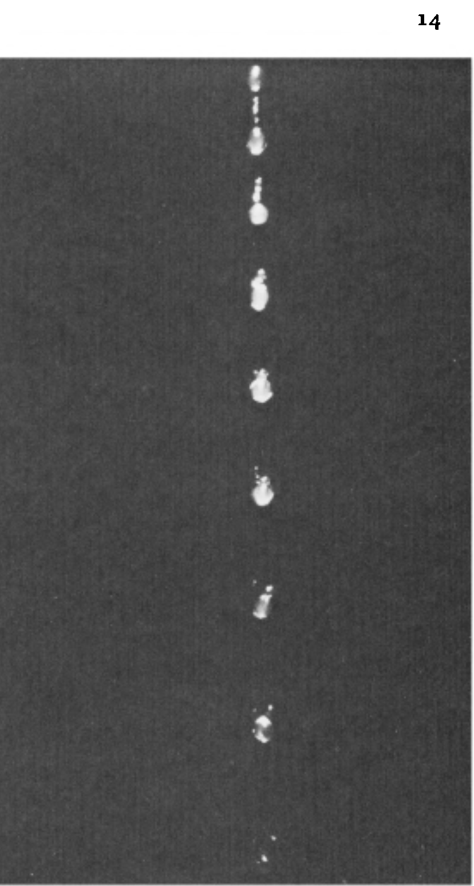

Even within a given class of form, the properties of the small differ from those of the large. And, at least in the animal kingdom, those properties vary in a uniform and predictable manner. Small creatures breathe faster than large creatures. Their hearts beat faster, their voices are higher, and their wings or limbs move more rapidly. They consume more food in relation to their body weight, reproduce faster, and have shorter lifetimes.
As D'Arcy Thompson pointed out, the reason for those variations is that the small muscle, be it heart, lung, wing, or vocal cord, oscillates faster than the large muscle, just as a short thin string, when it is plucked, vibrates more rapidly than a long thick one.
We see the principle confirmed when we tabulate heartbeats of different animals:

即使在给定类型的形式中，小的性质也与大的性质不同。而且，至少在动物王国，这些特性以均匀和可预测的方式变化。小动物呼吸比大型生物快。他们的心跳加快，嗓音更高，翅膀或四肢运动得更快。他们消耗更多的食物与体重有关，繁殖更快，寿命更短。
正如汤普森所指出的，这些变化的原因是小的肌肉，如心脏、肺、翅膀或声带，比大的肌肉振动得快，就像一根短的细绳，当它被拔起的时候，比长的粗的振动得快。
我们看到当我们列出不同动物心跳的原理时：

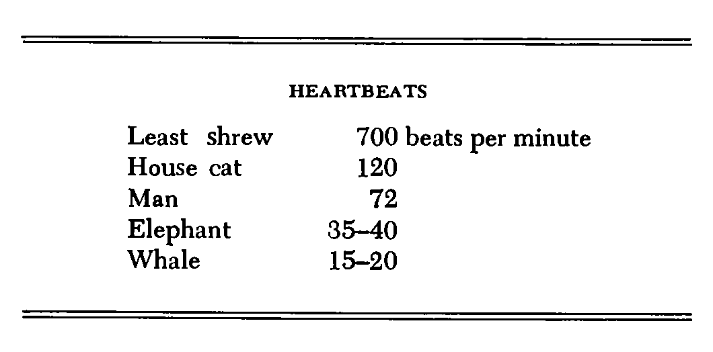

Since respiration is coupled with heartbeat - usually one breath is taken for every four heartbeats - the rate of breathing also decreases with increasing size. And so do wingbeats and the movement of limbs.

由于呼吸与心跳耦合——通常每四次心跳一次呼吸-呼吸的速度也随着尺寸的增加而减小。翅膀的动作和肢体的运动也是如此。

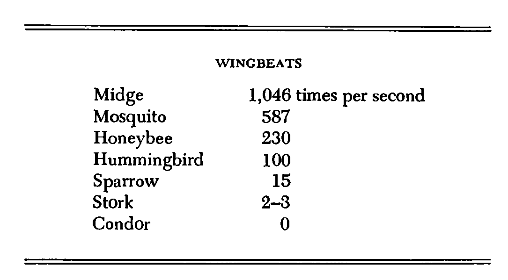

Apparently, the small creature lives on a shorter time scale than the large. Its life passes more quickly. With twenty-five million heartbeats per life as the rule of thumb, we find that the rat lives for only three years, the rabbit seven, man seventy, and the elephant and whale even longer. By the same token, the small creature reproduces faster than the large - in a mere twenty minutes for some of the smallest bacteria.
We come to realize that both the small and the large have their advantages. The small creature has an edge over the large because it eats less food, in absolute amounts, because it is less complex and therefore harder to kill, and because with its high rate of reproduction it can easily breed its way out of environmental difficulty. A queen termite, for example, lays over eighty thousand eggs in a day, and in the time a single human embryo develops, a codling moth can produce over four hundred trillion descendants.

显然，小生物的寿命比大生物短。它的生命通过得更快。以每只生命的二千五百万个心跳作为经验法则，我们发现老鼠只活了三年，兔子七、人七十、大象和鲸鱼甚至更长。同样，小动物繁殖的速度要比大动物快二十分钟。
我们认识到，小的和大的都有优势。这个小动物比大动物有优势，因为它吃的食物少，绝对量，因为它不那么复杂，因此更难杀死，而且因为繁殖率高，它可以很容易地繁殖出摆脱环境困境的方法。例如，一只白蚁皇后一天产下八万个卵，在一个人类胚胎发育的时间内，一个鳕鱼蛾可以产下超过四百兆个后代。


On the other side of the ledger, the larger animal is favored because it loses less heat through its relatively reduced surface. Thus it survives better in cold climates. In terms of its own body weight, the large animal consumes less food. A man, for example, eats one-fiftieth of his weight in three daily meals, whereas the pigmy shrew, which weighs less than a dime, eats continuously and devours several times its weight in a day. The large animal is a superior predator - especially man, who is big enough to wield a club effectively. Yet a man is not so big that he breaks his own bones when he falls. The large creature has more cells with which to make a brain and it has, as well, a longer life in which to use that brain. Man, with his remarkable brain, developed the use of fire, but, even apart from considerations of brain power, as F. W. Went has pointed out, only a creature of man's size could effectively control that fire. It happens that a small campfire is the smallest fire that is reliable and controllable. A still smaller flame is too easily snuffed out and a larger one too easily gets out of control. Prometheus was just large enough to feed the flames and to keep from getting burnt.

在分类帐的另一边，较大的动物受到青睐，因为它通过相对减少的表面损失较少的热量。因此，它在寒冷的气候下生存得更好。就其体重而言，大动物消耗较少的食物。例如，一个人在三天的膳食中吃五十分之一的体重，而体重不到一分钱的猪鼩则连续进食，一天吃几次体重。大型动物是一种优越的捕食者——尤其是人，它足够大，可以有效地挥舞棍棒。然而，一个人没有那么大，当他跌倒时，他自己的骨头断了。大的生物有更多的细胞来制造大脑，它也有更长的生命来使用大脑。人类以其非凡的大脑发展了火的使用，但是，除了F. W. Went的大脑能力的考虑之外，只有人类大小的生物才能有效地控制这场火灾。碰巧一个小篝火是最小的火是可靠的和可控的。一个更小的火焰很容易被熄灭，而一个更大的火焰很容易失控。普罗米修斯足够大，可以给火添火，防止烧焦。

Similarly, points out Went, man was smart enough to develop speech, but first, in order to make sound, he had to be large enough to require lungs and to drive a forced stream of air.
In this review of the effects of size, we have touched on Calileo's idea that the larger of two similar forms is the weaker. Let us conclude by giving Calileo's statement a little more attention.
Suppose, as shown in Figure 15, two apples are suspended, one with twice the diameter of the other. We know that the volume and the weight of the large apple is 2 3 or 8 times the volume and weight of the small one. If we also suppose the large stem to have twice the diameter of the small stem, we find that the strength of the stem, as given by the area of its cross section, is 2 2 or 4 times the strength of the small stem.

同样地，他指出，人类足够聪明来发展语言能力，但首先，为了发出声音，他必须足够大来需要肺部和驱动气流。在这篇关于大小的影响的评论中，我们提到了卡利欧的观点，即两种相似形式中较大的是较弱的。最后，让我们多关注一下卡利欧的声明。
假设，如图15所示，两个苹果悬空，一个直径是另一个的两倍。我们知道大苹果的体积和重量是小苹果体积和重量的2.3或8倍。如果我们还假设大茎的直径是小茎的两倍，我们发现，根据其横截面面积，茎的强度是小茎强度的2-4倍。

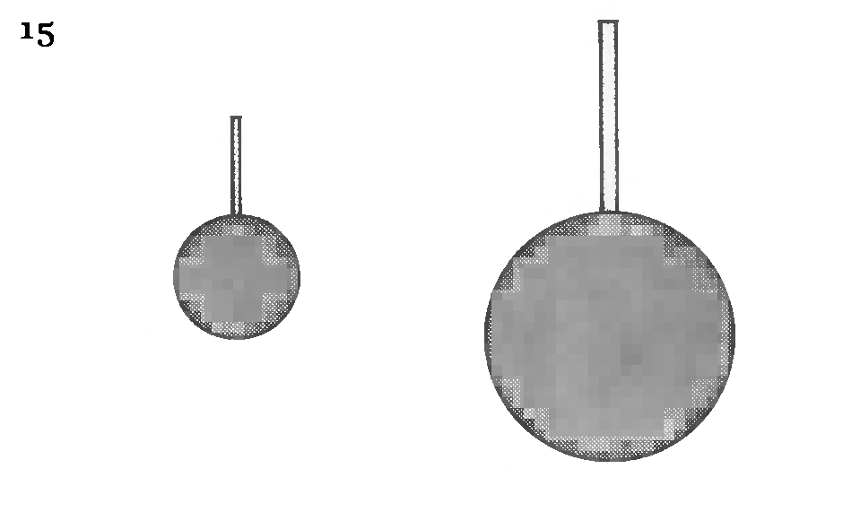

Thus the weight of the apple - the load the stem must support - is eight times as much for the large apple as for the small, whereas the strength of the stem is only four times as much. Four times as much strength to resist eight times as much load: at some point, as the apple increases in size, it must fall from the tree.
Thus we are not surprised to see that the blossoms of the apple first stand erect on the branch; but as the apple develops, the stem is drawn to the side and down (Figure 16); and finally, when the apple is fully grown, the stem is pulled from the tree. We also observe that large fruits, like melons, squash, and pumpkins, do not hang from their stems at all but rest instead on the ground.

因此，苹果的重量——茎必须支撑的重量——是大苹果的八倍，小的是苹果的四倍。四倍的强度来抵抗八倍的负荷：在某一点上，随着苹果的增加，它必须从树上掉下来。因此，我们不会惊讶地看到，苹果的第一朵花立在枝条上，但随着苹果的发展，茎被拉向一边和向下（图16）；最后，当苹果完全生长时，茎从树上拔下来。我们还观察到大的水果，如瓜、南瓜和南瓜，根本不悬挂在它们的茎上，而是在地上休息。

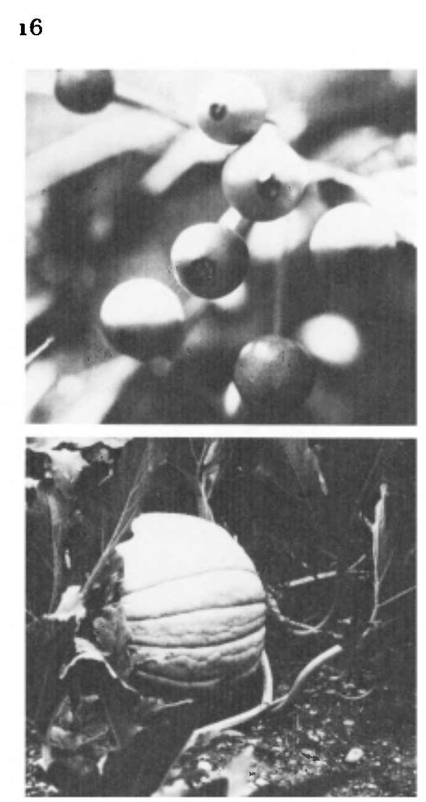

We can turn upside down our diagram of the apples hanging from stems and suppose them to sit on little pedestals. Our analysis of the strength of the pedestal is essentially the same as for the stem, except that the pedestal is pushed down and put in compression rather than pulled down and put into tension. In both cases the cross-sectional area of the support goes up by a factor of four and the load to be supported by a factor of eight.

我们可以把苹果挂在茎上的图颠倒过来，假设它们坐在小底座上。我们对底座的强度的分析与阀杆的基本相同，只是底座被压下并被压缩，而不是被拉下并拉紧。在这两种情况下，支撑的横截面积增加了四倍，负载的支撑系数为八。

From considerations of how pedestals become relatively weaker as they and the bodies they support increase in size, we see why the trunk of a tree is proportionally thicker than the stem of a slender sapling, and the legs of an elephant are thicker and straighter too than those of a butterfly (Figure 17). We are assured, despite Gulliver's tale, that no giants have ever stalked the land. The sixty-foot Brobdingnagian that Gulliver described would have weighed ninety tonsfar too much for legs of flesh and bone. And even though steel and concrete are stronger than bone and living tissue, we observe that the Empire State Building is not as slender as a stalk of wheat - if it were, it would be only six feet wide at the base - another fact neatly observed by F. W. Went.

考虑到底座和它们所支撑的物体的尺寸相比，底座的尺寸变得越来越弱，我们可以看到为什么树干的厚度比细长树苗的树干厚，而且大象的腿比蝴蝶的腿更粗更直。（图 17）。我们相信，尽管Gulliver的故事，没有巨人曾跟踪土地。Gulliver描述的六十英尺长的Brbnnngangi体重九十吨对于骨骼和骨骼的腿来说太多了。尽管钢和混凝土比骨和活组织强，但我们观察到帝国大厦并不像麦秆那么细长——如果是，它的底部只有六英尺宽——F. W. Went所观察到的另一个事实。

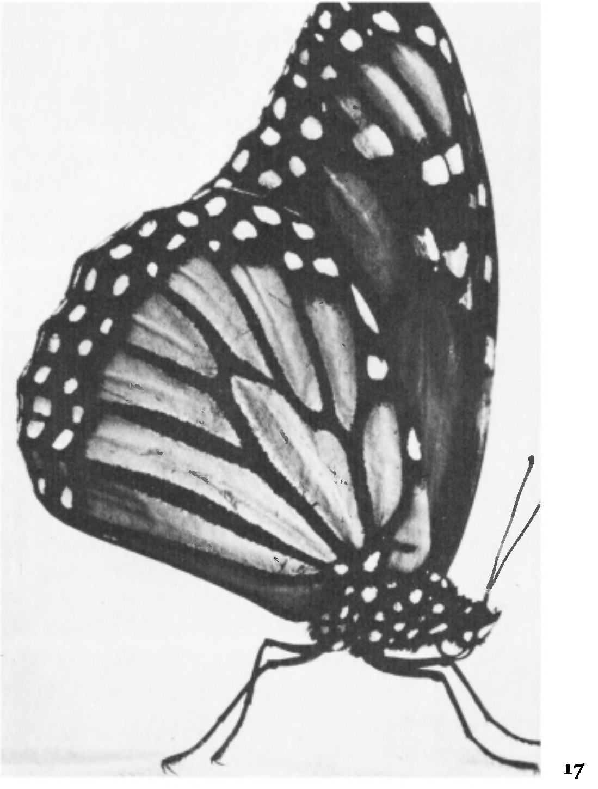

Another way in which a little pedestal may break is by bending or buckling. It can crimp and kick out to the side. In the analysis of bending in Figure 18, we see a beam that is pushed down in the center and up at the ends. The beam is bent so that the bottom is stretched, or put into tensIon, while at the same time the top is shortened, or put into compression. We might theorize therefrom that bending is the combination of tension and compression and that, as the beam increases in size, its resistance to bending grows more slowly than the force of the bending. Indeed, that is true. for, to put the matter precisely, a beam with twice the dimensions of another has only 2 3 or 8 times the section modulus or strength to overcome 2 4 or 16 times the bending moment introduced by its own weight. Thus any beam will break under its own weight if it is increased enough in size. So with regard to tension, compression, and bending too, Galileo was right: given an identity of shape and material. the larger of two fonns is inevitably the weaker.

一个小底座可能断裂的另一种方式是弯曲或屈曲。它可以卷曲并踢到一边。在图18中的弯曲分析中，我们看到了一个在中心被推下并在末端上的梁。梁被弯曲，使得底部被拉伸，或使其处于张紧状态，同时顶部被缩短，或被压缩。从理论上讲，弯曲是拉伸和压缩的结合，随着梁尺寸的增大，其弯曲阻力比弯曲力的增长慢得多。的确，这是真的。为了精确地考虑，一个具有两倍于另一个尺寸的梁的截面模量或强度只有2倍3倍或8倍，以克服由其自身重量引入的弯矩的2或4倍或16倍。因此，如果其尺寸足够大，任何梁将在其自身重量下断裂。因此，关于张力、压缩和弯曲，伽利略是正确的：给予形状和材料的身份。两个字体越大，不可避免的越弱。

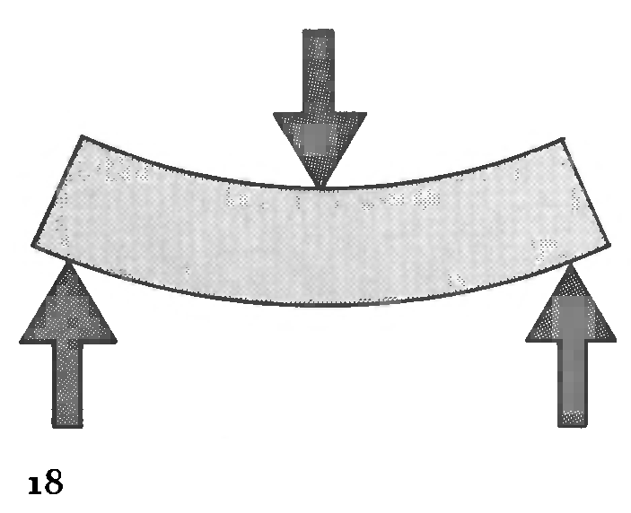

Galileo's observation has not been lost on today's engineers. When the behavior of a small model is used to simulate the behavior of a large structure, the most important consideration is to make the model weak enough, or, what amounts to the same thing, to make the loads on the model heavy enough. The engineer loads the structural members in the small model of the suspension bridge with sandbags to simulate the weight of those members when they are increased in size. Similarly, the engineer packs bags of mercury (which weighs nearly fourteen times as much as water), rather than water itself, against a small model of a dam in order to represent better the pressure of water against the real dam.
The two stratagems used by both nature and man to overcome the effects of increasing size are either to use a stronger material or to make the structure hollow and reduce its weight. Changing the material works only up to a point. Any material will eventually break under its own weight. A free-hanging chain of pure silica glass or steel, for example, can be longer than one of aluminum, and longer still can be a freehanging length of boron - some 189.4 miles. But each material has its upper limit of size, and at some magnitude it will be unable to support itself.

伽利略对当今工程师的观察并没有丢失。当使用小型模型的行为来模拟大型结构的行为时，最重要的考虑是使模型足够弱，或者使模型上的负载足够重，这相当于相同的事情。工程师在悬索桥的小模型中用沙袋装载结构构件，以模拟这些构件在尺寸增加时的重量。同样，为了更好地代表水对实际大坝的压力，工程师将一袋袋水银（其重量几乎是水的14倍），而不是水本身与一个小型水坝模型进行对比。

自然和人类为克服尺寸增大的影响而采取的两种策略是要么使用更坚固的材料，要么使结构空心并减轻重量。更改材质只能在一定程度上起作用。任何材料最终都会在自身重量的作用下断裂。例如，由纯硅玻璃或钢制成的自由悬挂链可以比铝长，而更长的自由悬挂链可以是硼的自由悬挂长度——大约189.4英里。但每种材料都有其尺寸上限，在某种程度上，它将无法支撑自身。

The other way to overcome the effects of scale is to arrange material in a more effective configuration, to cut it away where it is not needed and to add it where it is required. That is perhaps the more frequent stratagem. It is the stratagem of design. We see in Figure 19 that with an interior cavity, an intact exterior, and a simple triangulation of ribs, the hollow pepper (a) and the seedpod (b) have less weight than they would if solid - but that they have an equivalent strength.
The vertebra of the fish and the corrugated pith of the grass (c and d) also display hollowness, lightness, and ribbed strength. Between the top and bottom shells in both the horseshoe crab and the sea biscuit (e and f) the reinforcement is irregular, as if fonned by the solidification of a sticky fluid. Frame g shows a magnified section of bone in the human tibia, photographed by Carl Struve, while h is a photograph of a structural study by Frei Otto in collaboration with Koch and Minke. Both are variations on the same theme - the reduction of mass in order to increase strength.

克服规模效应的另一种方法是将材料安排在更有效的配置中，将其切去不需要的地方，并将其添加到需要的地方。这也许是更为常见的策略。这是设计的策略。我们在图19中看到，一个内部的空腔，一个完整的外部，和一个简单的三角形的肋骨，空心胡椒（A）和种子荚（B）的重量比它们结实时要小，但它们具有同等的强度。
鱼的脊椎和草的波纹髓（C和D）也表现出中空、轻盈和有棱的强度。在马蹄蟹和海饼干（E和F）的顶壳和底壳之间，加强筋是不规则的，就像黏性流体凝固所形成的。框架G显示了人类胫骨中骨骼的放大部分，由Carl Struve拍摄，而H是弗雷·奥托的结构研究的照片。
科赫和明克。两者都是同一主题的变化，即为了增加力量而减少质量。

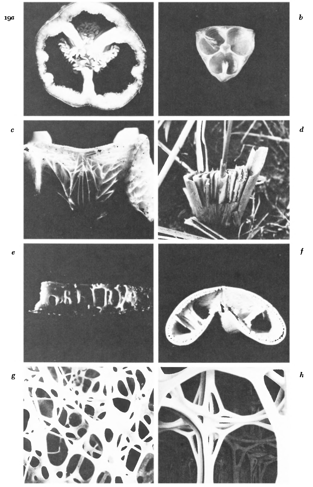

The ancient Romans used the same stratagem of design when they put light pumice aggregate and hollow earthenware pots in the concrete of the dome of the Pantheon. Their use of sunken panels or coffers on the interior of the dome reduced the weight of the structure still further. The modern-day use of ribbed construction, box sections, space frames, T beams, folded plates, and trusses are likewise attempts to reduce weight while leaving enough material intact to preserve strength.
Figure 20 shows the theme pavilions designed by AfHeck, Desbarats, Dimakopoulos, Lebensold and Sise (top three photographs) and the United States Pavilion designed by Buckminster Fuller for Montreal's Expo '67 (next three photographs). Those structures are some of man's more recent attempts to build triangulated and open networks of steel Their openness is a necessary concomitant of their size. Less material means less weight to support.

古代罗马人在万神殿圆顶的混凝土中放置轻质浮石和空心陶罐时，采用了相同的设计策略。 他们在圆顶内部使用凹陷板或金库进一步减轻了结构的重量。 现代使用的罗纹结构，箱形截面，空间框架，T形梁，折叠板和桁架同样试图减轻重量，同时保留足够的材料以保持强度。
图20显示了由AfHeck，Desbarats，Dimakopoulos，Lebensold和Sise（前三张照片）设计的主题馆和由Buckminster Fuller为蒙特利尔67'世博会设计的美国馆（接下来的三张照片）。 这些结构是人类最近建立三角形和开放式钢网络的一些尝试。它们的开放性是其规模的必要伴随。 材料越少意味着支撑的重量越轻。

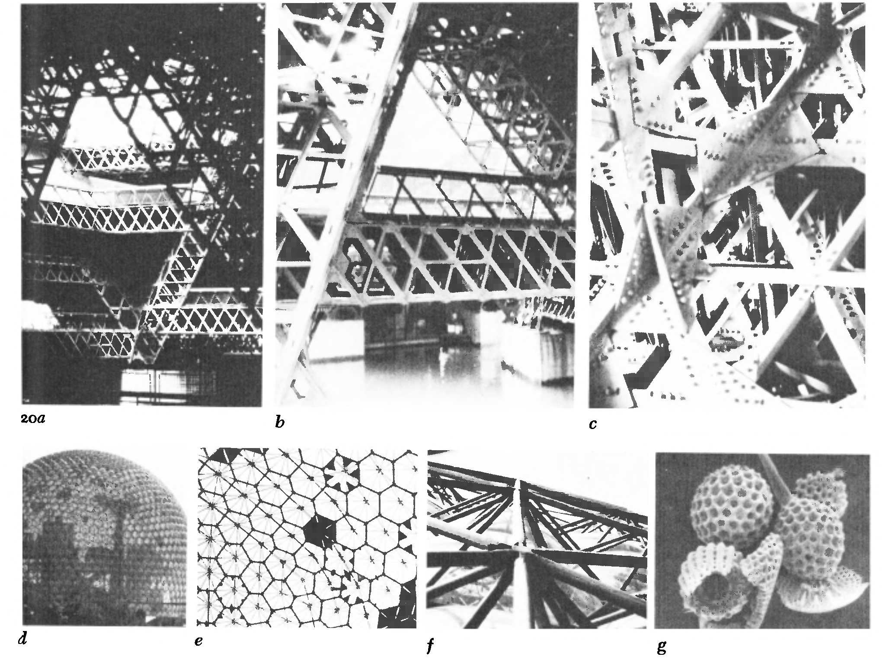

It is interesting to observe that like any of the regular or semiregular polyhedrons that contain pentagons, Fuller's dome, if made as a complete sphere, must contain twelve and only twelve pentagons. We see one of them in the center of frame e.

有趣的是，像任何包含五边形的规则或半规则多面体一样，Fuller的圆顶，如果是一个完整的球体，必须包含十二个并且只有十二个五边形。我们看到其中一个在框架E的中心。

Also of interest is that the overall geometry of the dome is similar to the structure of certain microscopic viruses and radiolaria. Frame g shows some skeletal fragments of radiolaria magnified about one hundred times. Despite a sometimes similar geometry, the difference in absolute size between the radiolarian and the dome dictates important differences in their structure. Since the tubes at the bottom of the dome carry more load than the tubes at the top, they have greater wall thicknesses and greater strength. You cannot see that difference in tube thickness, since the outside diameters have been kept the same in order to facilitate the making of standard joints. But those differences exist, and, unlike the radiolarian - with its true spherical symmetry, able to spin, float, and bob in the waves unconcerned with which side is up or down, with such a small mass that it is uninfluenced by gravity - the dome is spherically symmetrical only in outward appearance; it cannot be flipped on its back like a radiolarian, but rather it is compelled to sit forever upright, with its weaker members at the top and its stronger members at the bottom, each specifically tailored to carry its assigned load.
同样令人感兴趣的是圆顶的整体几何形状类似于某些微观病毒和放射虫的结构。框架g显示放射线的一些骨架碎片放大约一百倍。尽管有时几何形状相似，但放射虫和圆顶之间的绝对尺寸差异决定了它们结构的重要差异。由于圆顶底部的管子比顶部的管子承受更多的负荷，因此它们具有更大的壁厚和更大的强度。您无法看到管厚度的差异，因为外径保持不变，以便于制作标准接头。但是这些差异存在，而且，与放射虫不同 - 具有真正的球形对称性，能够在波浪中旋转，漂浮和摆动，不关心哪一侧向上或向下，具有如此小的质量，以至于它不受重力的影响 - 圆顶只在外观上呈球形对称;它不能像放射虫一样翻转在背上，而是被迫永远直立坐着，其顶部较弱的成员和底部较强的成员，每个都专门定制以承载其指定的负载。

The structural difference between the radiolarian and the dome is like that between the feather and the leaflets of the frond of the coconut palm (Figure 21.)
Although both the feather and the frond have a central rib that gives rise to an even distribution of secondary filaments, the parts of the feather, being small, are relatively smooth and undiHerentiated, whereas those of the frond are folded and more complex so as to support better their greater weight. The central mast of the frond is triangular and is joined in triangular intersections by folded leaflets which themselves are marked with central ribs.
One final example of the effect of scale in architecture is the plain but largely unnoticed fact that large buildings are taller and slenderer in their proportions than small buildings. The Empire State Building, although not as slender, comparatively speaking, as a reed, is still more slender than a one-story office building, and the apartment tower is still a tower rather than a cubical box like the single-family house.

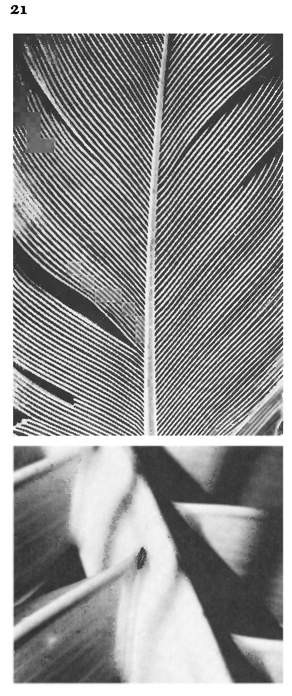

放射虫和圆顶之间的结构差异就像羽毛和椰子树叶的小叶之间的结构差异（图21）。虽然羽毛和叶子都有一个中央肋条，可以使二次长丝均匀分布，但是羽毛的部分很小，相对平滑且没有分离，而叶子的那些部分是折叠的，而且更加复杂，以至于支持更好的重量。叶状体的中央桅杆是三角形的，并通过折叠的小叶连接在三角形的交叉点上，小叶本身标有中央肋。
建筑规模效应的最后一个例子是普通但很大程度上未被注意到的事实，即大型建筑物的比例比小型建筑物更高，更细长。帝国大厦虽然不像一个芦苇那样细长，但比单层办公大楼还要细长，而且公寓大楼仍然是一座塔而不是像单户住宅一样的立方体箱。

Banko Bon, who has made statistical studies of building fonus, points out that the differences in shape between large buildings and small do not arise because of structural considerations but because rooms in houses and apartments are about the same size, and in both building types it is desirable to have as many rooms as possible exposed to the exterior. Thus, when the large building with its greater number of rooms increases its critical surface - its exterior - it elongates its form. Just as with a living organism then, its absolute size determines its shape.

已经对建筑物进行统计研究的Banko Bon指出，由于结构方面的考虑，大型建筑物和小型建筑物之间的形状差异不会出现，但是因为房屋和公寓的房间大小相同，而且在两种建筑类型中都是如此。 希望尽可能多的房间暴露在外面。 因此，当具有更多房间的大型建筑物增加其临界表面——它的外部——它就伸长了它的形式。就像活的有机体一样，它的绝对大小决定了它的形状。


>待续...
