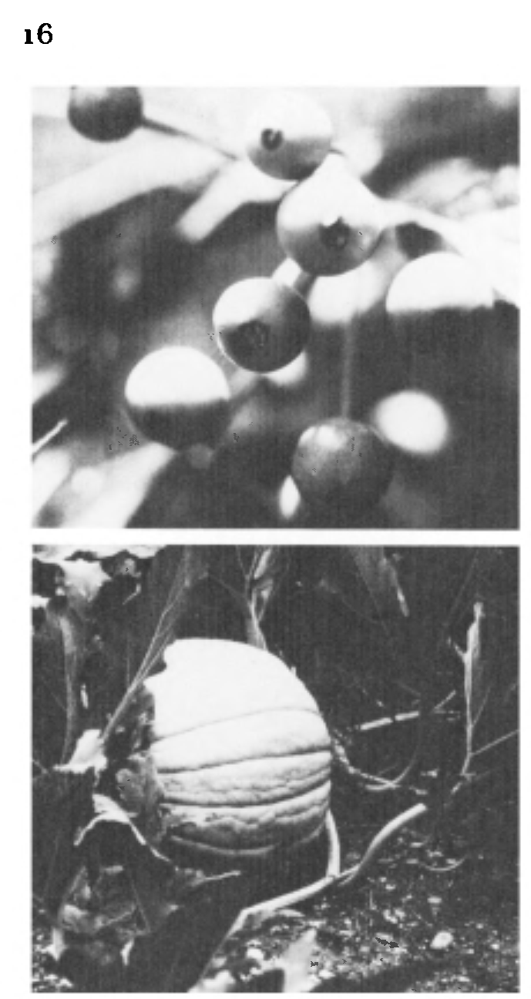
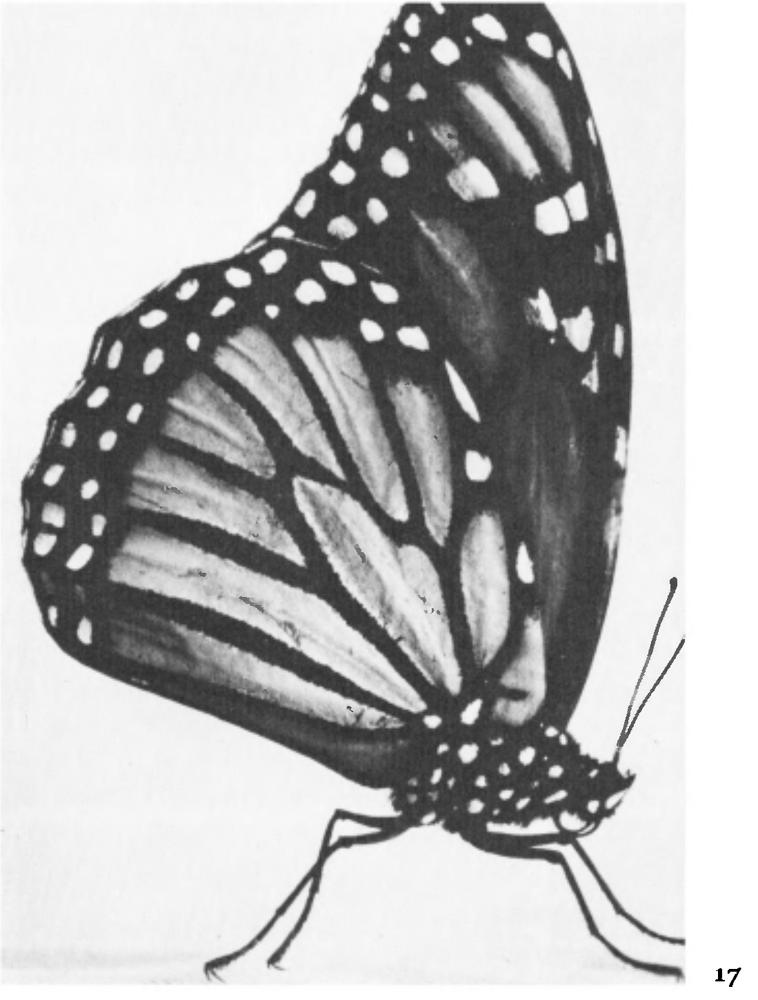
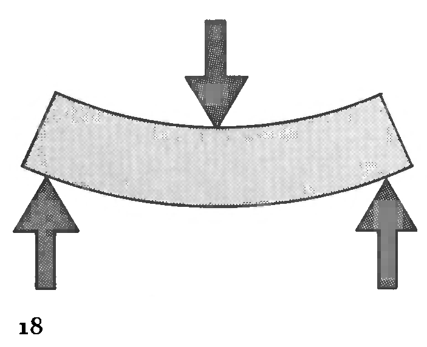
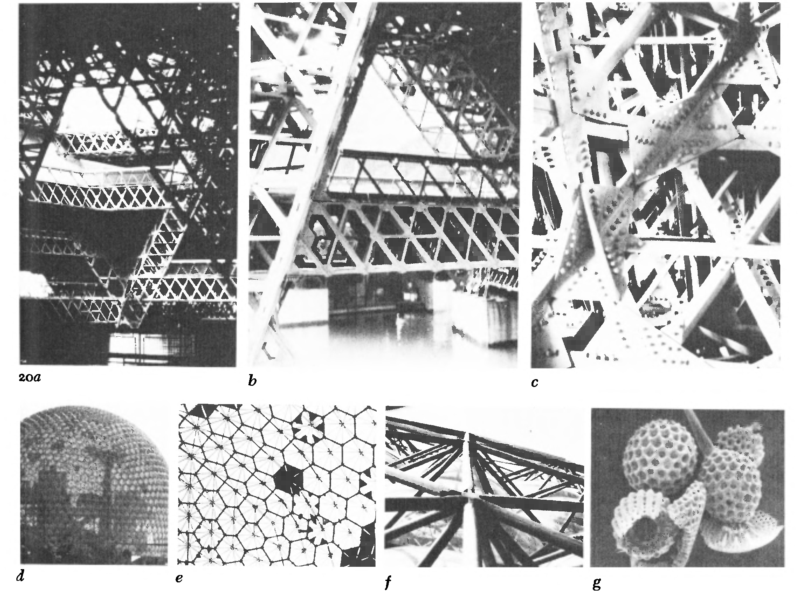
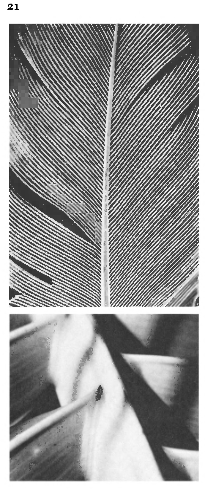

```
Created on  2019.05.20.22:40
Patterns in Nature Author:PETER S.STEVENS
自然模式 编译：Moly Chin
```


#### 规模效应（二）

Apparently, the small creature lives on a shorter time scale than the large. Its life passes more quickly. With twenty-five million heartbeats per life as the rule of thumb, we find that the rat lives for only three years, the rabbit seven, man seventy, and the elephant and whale even longer. By the same token, the small creature reproduces faster than the large - in a mere twenty minutes for some of the smallest bacteria.
We come to realize that both the small and the large have their advantages. The small creature has an edge over the large because it eats less food, in absolute amounts, because it is less complex and therefore harder to kill, and because with its high rate of reproduction it can easily breed its way out of environmental difficulty. A queen termite, for example, lays over eighty thousand eggs in a day, and in the time a single human embryo develops, a codling moth can produce over four hundred trillion descendants.

显然，小生物的寿命比大生物短。它的生命通过得更快。**以每只生命的二千五百万个心跳作为经验法则**，我们发现老鼠只活了三年，兔子七、人七十、大象和鲸鱼甚至更长。同样，小动物繁殖的速度要比大动物快二十分钟。
我们认识到，小的和大的都有优势。这个小动物比大动物有优势，因为它吃的食物少，绝对量，因为它不那么复杂，因此更难杀死，而且因为繁殖率高，它可以很容易地繁殖出摆脱环境困境的方法。例如，一只白蚁皇后一天产下八万个卵，在一个人类胚胎发育的时间内，一个鳕鱼蛾可以产下超过四百兆个后代。

On the other side of the ledger, the larger animal is favored because it loses less heat through its relatively reduced surface. Thus it survives better in cold climates. In terms of its own body weight, the large animal consumes less food. A man, for example, eats one-fiftieth of his weight in three daily meals, whereas the pigmy shrew, which weighs less than a dime, eats continuously and devours several times its weight in a day. The large animal is a superior predator - especially man, who is big enough to wield a club effectively. Yet a man is not so big that he breaks his own bones when he falls. The large creature has more cells with which to make a brain and it has, as well, a longer life in which to use that brain. Man, with his remarkable brain, developed the use of fire, but, even apart from considerations of brain power, as F. W. Went has pointed out, only a creature of man's size could effectively control that fire. It happens that a small campfire is the smallest fire that is reliable and controllable. A still smaller flame is too easily snuffed out and a larger one too easily gets out of control. Prometheus was just large enough to feed the flames and to keep from getting burnt.

在分类帐的另一边，较大的动物受到青睐，因为它通过相对减少的表面损失较少的热量。因此，它在寒冷的气候下生存得更好。就其体重而言，大动物消耗较少的食物。例如，一个人在三天的膳食中吃五十分之一的体重，而体重不到壹角面值硬币的重量的猪鼩则连续进食，一天吃几次体重。大型动物是一种优越的捕食者——尤其是人，它足够大，可以有效地挥舞棍棒。然而，一个男人并不是那么大，他摔倒时会折断自己的骨头。这种大型生物有更多的细胞用来制造大脑，而且它也有更长的寿命来使用大脑。人类以其非凡的大脑发展了火的使用，
但是，正如F.W.Got指出的那样，人类凭借其非凡的大脑，发现了火的使用，只有人类大小的生物才能有效地控制火。小营火是最小的、可靠的、可控的火。较小的火焰很容易熄灭，较大的火焰很容易失控。普罗米修斯的个头刚好够大，可以生火，不至于被烧焦。

Similarly, points out Went, man was smart enough to develop speech, but first, in order to make sound, he had to be large enough to require lungs and to drive a forced stream of air.
In this review of the effects of size, we have touched on Calileo's idea that the larger of two similar forms is the weaker. Let us conclude by giving Calileo's statement a little more attention.
Suppose, as shown in Figure 15, two apples are suspended, one with twice the diameter of the other. We know that the volume and the weight of the large apple is 2 3 or 8 times the volume and weight of the small one. If we also suppose the large stem to have twice the diameter of the small stem, we find that the strength of the stem, as given by the area of its cross section, is 2 2 or 4 times the strength of the small stem.

同样地，他指出，人类足够聪明来发展语言能力，但首先，为了发出声音，他必须足够大来需要肺部和驱动气流。
在这篇关于大小的影响的评论中，我们提到了卡利欧的观点，**即两种相似形式中较大的是较弱的**。最后，让我们多关注一下卡利欧的声明。
假设，如图15所示，两个苹果悬空，一个直径是另一个的两倍。我们知道大苹果的体积和重量是小苹果体积和重量的2的3次方即8倍。如果我们还假设大茎的直径是小茎的两倍，我们发现，根据其横截面面积，茎的强度是小茎强度的2-4倍。


Thus the weight of the apple - the load the stem must support - is eight times as much for the large apple as for the small, whereas the strength of the stem is only four times as much. Four times as much strength to resist eight times as much load: at some point, as the apple increases in size, it must fall from the tree.
Thus we are not surprised to see that the blossoms of the apple first stand erect on the branch; but as the apple develops, the stem is drawn to the side and down (Figure 16); and finally, when the apple is fully grown, the stem is pulled from the tree. We also observe that large fruits, like melons, squash, and pumpkins, do not hang from their stems at all but rest instead on the ground.

因此，苹果的重量——茎必须支撑的重量——是大苹果的八倍，小的是苹果的四倍。四倍的强度来抵抗八倍的负荷：在某一点上，随着苹果的增加，它必须从树上掉下来。因此，我们不会惊讶地看到，苹果的第一朵花立在枝条上，但随着苹果的发展，茎被拉向一边和向下（图16）；最后，当苹果完全生长时，茎从树上拔下来。我们还观察到大的水果，如瓜、南瓜和南瓜，根本不悬挂在它们的茎上，而是在地上休息。



We can turn upside down our diagram of the apples hanging from stems and suppose them to sit on little pedestals. Our analysis of the strength of the pedestal is essentially the same as for the stem, except that the pedestal is pushed down and put in compression rather than pulled down and put into tension. In both cases the cross-sectional area of the support goes up by a factor of four and the load to be supported by a factor of eight.

我们可以把苹果挂在茎上的图颠倒过来，假设它们坐在小底座上。我们对底座的强度的分析与阀杆的基本相同，只是底座被压下并被压缩，而不是被拉下并拉紧。在这两种情况下，支撑的横截面积增加了四倍，负载的支撑系数为八。

From considerations of how pedestals become relatively weaker as they and the bodies they support increase in size, we see why the trunk of a tree is proportionally thicker than the stem of a slender sapling, and the legs of an elephant are thicker and straighter too than those of a butterfly (Figure 17). We are assured, despite Gulliver's tale, that no giants have ever stalked the land. The sixty-foot Brobdingnagian that Gulliver described would have weighed ninety tonsfar too much for legs of flesh and bone. And even though steel and concrete are stronger than bone and living tissue, we observe that the Empire State Building is not as slender as a stalk of wheat - if it were, it would be only six feet wide at the base - another fact neatly observed by F. W. Went.
从考虑到当它们和它们支撑的身体尺寸增加时，底座变得相对较弱，我们可以看出为什么树的树干比细长树苗的树干更粗，大象的腿比蝴蝶的腿更粗更直（图17）。我们确信，尽管格列佛的故事，没有巨人跟踪过这片土地。格列佛所描述的60英尺长的Brobdingnagian，对于肉和骨头的腿来说，可能有90吨重。尽管钢和混凝土比骨头和活组织更坚固，但我们观察到帝国大厦并不像麦杆那么细——如果是的话，它的底部只有6英尺宽——这是F.W.巧妙观察到的另一个事实。



Another way in which a little pedestal may break is by bending or buckling. It can crimp and kick out to the side. In the analysis of bending in Figure 18, we see a beam that is pushed down in the center and up at the ends. The beam is bent so that the bottom is stretched, or put into tensIon, while at the same time the top is shortened, or put into compression. We might theorize therefrom that bending is the combination of tension and compression and that, as the beam increases in size, its resistance to bending grows more slowly than the force of the bending. Indeed, that is true. for, to put the matter precisely, a beam with twice the dimensions of another has only 2 3 or 8 times the section modulus or strength to overcome 2 4 or 16 times the bending moment introduced by its own weight. Thus any beam will break under its own weight if it is increased enough in size. So with regard to tension, compression, and bending too, Galileo was right: given an identity of shape and material. the larger of two fonns is inevitably the weaker.



另一种小基座可能会被弯曲或弯曲破坏的方法。它可以卷曲并碰到一边。在图18中的弯曲分析中，我们看到一个梁在中心向下推，在末端向上托。梁弯曲，使底部拉伸或拉紧，同时顶部缩短或压缩。从理论上讲，弯曲是张力和压缩的结合，而且，随着梁的尺寸增加，其抗弯曲能力的增长速度比弯曲力的增长速度慢。的确如此。准确地说，一根梁的尺寸是另一根梁的两倍，其截面模量或强度仅为8倍，以克服由自身重量引起的16倍的弯曲力矩。因此，**如果梁的尺寸增加到足够大，任何梁都会在自身重量的作用下断裂**。所以伽利略对于拉伸、压缩和弯曲也是正确的：给出了形状和材料的一致性。两方中较大的一方必然较弱。

Galileo's observation has not been lost on today's engineers. When the behavior of a small model is used to simulate the behavior of a large structure, the most important consideration is to make the model weak enough, or, what amounts to the same thing, to make the loads on the model heavy enough. The engineer loads the structural members in the small model of the suspension bridge with sandbags to simulate the weight of those members when they are increased in size. Similarly, the engineer packs bags of mercury (which weighs nearly fourteen times as much as water), rather than water itself, against a small model of a dam in order to represent better the pressure of water against the real dam.
The two stratagems used by both nature and man to overcome the effects of increasing size are either to use a stronger material or to make the structure hollow and reduce its weight. Changing the material works only up to a point. Any material will eventually break under its own weight. A free-hanging chain of pure silica glass or steel, for example, can be longer than one of aluminum, and longer still can be a freehanging length of boron - some 189.4 miles. But each material has its upper limit of size, and at some magnitude it will be unable to support itself.

当今工程师的观察并没有丢失伽利略的认识。当使用小型模型的行为来模拟大型结构的行为时，最重要的考虑是使模型足够弱，或者使模型上的负载足够重，这相当于相同的事情。工程师在悬索桥的小模型中用沙袋装载结构构件，以模拟这些构件在尺寸增加时的重量。同样，为了更好地代表水对实际大坝的压力，工程师将一袋袋水银（其重量几乎是水的14倍），而不是水本身与一个小型水坝模型进行对比。
自然和人类为克服尺寸增大的影响而采取的两种策略是 **要么使用更坚固的材料，要么使结构空心并减轻重量**。更改材质只能在一定程度上起作用。任何材料最终都会在自身重量的作用下断裂。例如，由纯硅玻璃或钢制成的自由悬挂链可以比铝长，而更长的自由悬挂链可以是硼的自由悬挂长度——大约189.4英里。但每种材料都有其尺寸上限，在某种程度上，它将无法支撑自身。

The other way to overcome the effects of scale is to arrange material in a more effective configuration, to cut it away where it is not needed and to add it where it is required. That is perhaps the more frequent stratagem. It is the stratagem of design. We see in Figure 19 that with an interior cavity, an intact exterior, and a simple triangulation of ribs, the hollow pepper (a) and the seedpod (b) have less weight than they would if solid - but that they have an equivalent strength.
The vertebra of the fish and the corrugated pith of the grass (c and d) also display hollowness, lightness, and ribbed strength. Between the top and bottom shells in both the horseshoe crab and the sea biscuit (e and f) the reinforcement is irregular, as if fonned by the solidification of a sticky fluid. Frame g shows a magnified section of bone in the human tibia, photographed by Carl Struve, while h is a photograph of a structural study by Frei Otto in collaboration with Koch and Minke. Both are variations on the same theme - the reduction of mass in order to increase strength.

另一种克服规模效应的方法是将材料安排在一个更有效的配置中，在不需要的地方将其切割掉，并在需要的地方添加。这也许是更频繁的策略。这是设计的战略。我们在图19中看到，有一个内腔，一个完整的外部，和一个简单的肋骨三角测量，空心胡椒（A）和种子荚（B）的重量比它们的固体要轻，但它们具有同等的强度。
鱼的脊椎和草的波纹髓（C和D）也显示出中空、轻盈和肋状的力量。在马蹄蟹和海饼干（E和F）的上下壳之间，钢筋是不规则的，好像是由粘性液体凝固而成。图G显示了卡尔·斯特鲁夫拍摄的人胫骨的放大部分，而图H是弗雷·奥托与科赫和明克合作进行的结构研究的照片。两者都是在同一个主题上的变化——为了增加强度而减少质量。

克服规模效应的另一种方法是将材料安排在更有效的配置中，将其切去不需要的地方，并将其添加到需要的地方。这也许是更为常见的策略。这是设计的策略。我们在图19中看到，一个内部的空腔，一个完整的外部，和一个简单的三角形的肋骨，空心胡椒（A）和种子荚（B）的重量比它们结实时要小，但它们具有同等的强度。
鱼的脊椎和草的波纹髓（C和D）也表现出中空、轻盈和有棱的强度。在马蹄蟹和海饼干（E和F）的顶壳和底壳之间，加强筋是不规则的，就像黏性流体凝固所形成的。框架G显示了人类胫骨中骨骼的放大部分，由Carl Struve拍摄，而H是弗雷·奥托的结构研究的照片。
科赫和明克。两者都是同一主题的变化，即为了增加力量而减少质量。


The ancient Romans used the same stratagem of design when they put light pumice aggregate and hollow earthenware pots in the concrete of the dome of the Pantheon. Their use of sunken panels or coffers on the interior of the dome reduced the weight of the structure still further. The modern-day use of ribbed construction, box sections, space frames, T beams, folded plates, and trusses are likewise attempts to reduce weight while leaving enough material intact to preserve strength.
Figure 20 shows the theme pavilions designed by AfHeck, Desbarats, Dimakopoulos, Lebensold and Sise (top three photographs) and the United States Pavilion designed by Buckminster Fuller for Montreal's Expo '67 (next three photographs). Those structures are some of man's more recent attempts to build triangulated and open networks of steel Their openness is a necessary concomitant of their size. Less material means less weight to support.

古代罗马人在万神殿圆顶的混凝土中放置轻质浮石和空心陶罐时，采用了相同的设计策略。 他们在圆顶内部使用凹陷板或金库进一步减轻了结构的重量。 现代使用的罗纹结构，箱形截面，空间框架，T形梁，折叠板和桁架同样试图减轻重量，同时保留足够的材料以保持强度。
图20显示了由AfHeck，Desbarats，Dimakopoulos，Lebensold和Sise（前三张照片）设计的主题馆和由Buckminster Fuller为蒙特利尔67'世博会设计的美国馆（接下来的三张照片）。 这些结构是人类最近建立三角形和开放式钢网络的一些尝试。它们的开放性是其规模的必要伴随。 材料越少意味着支撑的重量越轻。



It is interesting to observe that like any of the regular or semiregular polyhedrons that contain pentagons, Fuller's dome, if made as a complete sphere, must contain twelve and only twelve pentagons. We see one of them in the center of frame e.

有趣的是，像任何包含五边形的规则或半规则多面体一样，Fuller的圆顶，如果是一个完整的球体，必须包含十二个并且只有十二个五边形。我们看到其中一个在框架E的中心。

Also of interest is that the overall geometry of the dome is similar to the structure of certain microscopic viruses and radiolaria. Frame g shows some skeletal fragments of radiolaria magnified about one hundred times. Despite a sometimes similar geometry, the difference in absolute size between the radiolarian and the dome dictates important differences in their structure. Since the tubes at the bottom of the dome carry more load than the tubes at the top, they have greater wall thicknesses and greater strength. You cannot see that difference in tube thickness, since the outside diameters have been kept the same in order to facilitate the making of standard joints. But those differences exist, and, unlike the radiolarian - with its true spherical symmetry, able to spin, float, and bob in the waves unconcerned with which side is up or down, with such a small mass that it is uninfluenced by gravity - the dome is spherically symmetrical only in outward appearance; it cannot be flipped on its back like a radiolarian, but rather it is compelled to sit forever upright, with its weaker members at the top and its stronger members at the bottom, each specifically tailored to carry its assigned load.
同样令人感兴趣的是圆顶的整体几何形状类似于某些微观病毒和放射虫的结构。框架g显示放射线的一些骨架碎片放大约一百倍。尽管有时几何形状相似，但放射虫和圆顶之间的绝对尺寸差异决定了它们结构的重要差异。由于圆顶底部的管子比顶部的管子承受更多的负荷，因此它们具有更大的壁厚和更大的强度。您无法看到管厚度的差异，因为外径保持不变，以便于制作标准接头。但是这些差异存在，而且，与放射虫不同 - 具有真正的球形对称性，能够在波浪中旋转，漂浮和摆动，不关心哪一侧向上或向下，具有如此小的质量，以至于它不受重力的影响 - 圆顶只在外观上呈球形对称;它不能像放射虫一样翻转在背上，而是被迫永远直立坐着，其顶部较弱的成员和底部较强的成员，每个都专门定制以承载其指定的负载。

The structural difference between the radiolarian and the dome is like that between the feather and the leaflets of the frond of the coconut palm (Figure 21.)
Although both the feather and the frond have a central rib that gives rise to an even distribution of secondary filaments, the parts of the feather, being small, are relatively smooth and undiHerentiated, whereas those of the frond are folded and more complex so as to support better their greater weight. The central mast of the frond is triangular and is joined in triangular intersections by folded leaflets which themselves are marked with central ribs.
One final example of the effect of scale in architecture is the plain but largely unnoticed fact that large buildings are taller and slenderer in their proportions than small buildings. The Empire State Building, although not as slender, comparatively speaking, as a reed, is still more slender than a one-story office building, and the apartment tower is still a tower rather than a cubical box like the single-family house.



放射虫和圆顶之间的结构差异就像羽毛和椰子树叶的小叶之间的结构差异（图21）。虽然羽毛和叶子都有一个中央肋条，可以使二次长丝均匀分布，但是羽毛的部分很小，相对平滑且没有分离，而叶子的那些部分是折叠的，而且更加复杂，以至于支持更好的重量。叶状体的中央桅杆是三角形的，并通过折叠的小叶连接在三角形的交叉点上，小叶本身标有中央肋。
建筑规模效应的最后一个例子是普通但很大程度上未被注意到的事实，即大型建筑物的比例比小型建筑物更高，更细长。帝国大厦虽然不像一个芦苇那样细长，但比单层办公大楼还要细长，而且公寓大楼仍然是一座塔而不是像单户住宅一样的立方体箱。

Banko Bon, who has made statistical studies of building fonus, points out that the differences in shape between large buildings and small do not arise because of structural considerations but because rooms in houses and apartments are about the same size, and in both building types it is desirable to have as many rooms as possible exposed to the exterior. Thus, when the large building with its greater number of rooms increases its critical surface - its exterior - it elongates its form. Just as with a living organism then, its absolute size determines its shape.

已经对建筑物进行统计研究的Banko Bon指出，由于结构方面的考虑，大型建筑物和小型建筑物之间的形状差异不会出现，但是因为房屋和公寓的房间大小相同，而且在两种建筑类型中都是如此。 希望尽可能多的房间暴露在外面。 因此，当具有更多房间的大型建筑物增加其临界表面——它的外部——它就伸长了它的形式。就像活的有机体一样，它的绝对大小决定了它的形状。


>待续......
