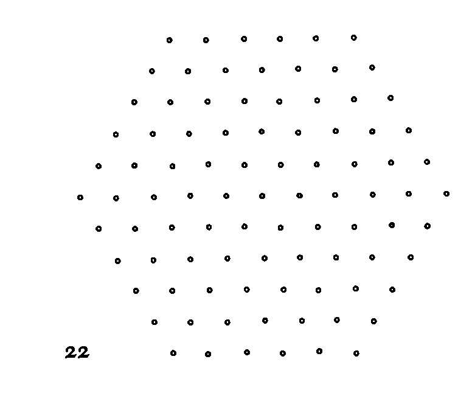
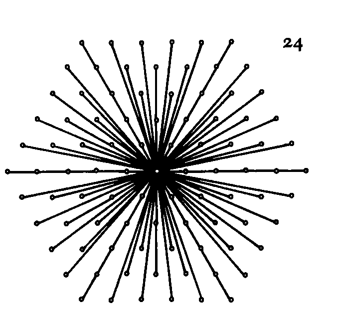
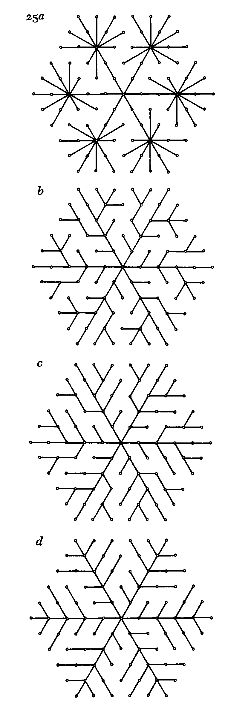
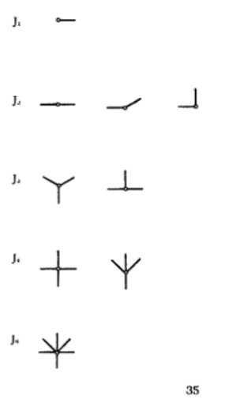

```
Created on  2019.05.20.22:40
Patterns in Nature Author:PETER S.STEVENS
编译：Moly Chin
@author: molychin@qq.com
```


## 2 Basic Patterns
So then always that knowledge is worthiest . . .
which considereth the simple forms or differences of things, which are few in number, and the degrees and coordinations whereof make all this variety.
- FRANCIS BACON

2 基本模式
因此，知识永远是最有价值的。。。
考虑到事物的简单形式或差异，这些形式或差异的数量很少，其程度和协调使这一切变得多样化。
-弗朗西斯·培根

Basic Patterns

WE HAVE SEEN that space permits the existence of only a few regular polyhedrons and mosaics. In this chapter we will examine some less regular patterns. The chapter is short, the figures being the most important part, but it provides the key to all that follows, for by examining the geometric properties of quasi-regular patterns we can gain some insight into why nature prefers one over another. We can learn why spirals, meanders, and certain arrangements of branching patterns are so prevalent and why one thing looks so often like something else that is fundamentally different.
With regard to how patterns and shapes come into being, we can readily accept the fundamental idea of the theory of evolution, that things evolve to their fittest form; we can accept the principle that things tend toward a configuration with the least energy, that is to say, with the tightest fit, the lowest altitude, or the least motion; we can even accept the theory that the existing forms of nature are exactly those that are most likely to exist - taking into account all possible possibilities. But what forms, we wonder, are the fittest, the least energetic, and the most probable? Can we spell them out in advance? Can we define them other than by asserting redundantly that they are the end products of the struggle to survive, the dissipation of energy, and blind luck? By just looking at the geometrical properties of the possible distributions of material in space, can we predict what distributions will be favored in what context?

我们已经看到，空间只允许存在少数正多面体和马赛克。在本章中，我们将研究一些不太常规的模式。这一章很简短，数字是最重要的部分，但它提供了随后所有内容的关键，因为通过检查准规则模式的几何属性，我们可以了解为什么自然喜欢一个超过另一个。我们可以了解为什么螺旋，曲折和分支模式的某些排列是如此普遍，以及为什么有一件事看起来像其他根本不同的东西。
关于模式和形状是如何形成的，我们可以很容易地接受进化论的基本思想，即事物发展到最适合的形式;我们可以接受这样的原则：物体倾向于能量最少的配置，也就是说，最紧密的配合，最低的高度或最小的运动;我们甚至可以接受这样的理论：现有的自然形式正是那些最有可能存在的形式 - 考虑到所有可能的可能性。但我们想知道，哪种形式最适合，最不活跃，最可能？我们可以提前拼出来吗？我们能否定义它们，而不是通过冗余地断言它们是生存斗争，能量消耗和盲目运气的最终产物？通过观察空间中可能的材料分布的几何属性，我们能预测哪种分布在什么情境下会受到青睐？

Perhaps we can. In plane geometry, for instance, we learn that a straight line is the direct path between two fixed points, and that the line of a circle is a collection of points equidistant from one fixed point. In nature we see the combination of the straight path and the circle when water flows more-or-Iess straight in a stream and then comes to rest in a more or less circular pond. Knowing both the properties of water and the properties of lines and circles, we can predict that water will flow and come to rest in those particular geometric shapes. We can predict a priori the outlines of streams and ponds, just as, once again on the basis of the geometry of lines and circles, we can predict that celestial bodies travel straight in empty space and in circular or elliptical orbits when captured by the gravitational fields of still larger bodies.
We might note in passing that the lines and circles adopted by natural forms are never perfect. Neither the stream nor the meteor runs perfectly straight, nor is the pond or orbital trajectory a perfect circle.
Straight lines and circles are only the pure forms. They occur under only the simplest conditions. In nature, however, conditions are never entirely simple, and any "elementary" or "isolated" part is embedded in a larger system that operates in turn within other still larger systems. To some extent, then, the part is acted upon by the whole - by the totality of all the systemsand it nevet exactly fits an easily definable pattern.
The warning is clear: nature never conforms precisely to our simple models; she introduces modifications as dictated by her lawful response to a multiplicity of demands.

也许我们可以。例如，在平面几何中，我们知道直线是两个固定点之间的直接路径，并且圆的线是与一个固定点等距的点的集合。在自然界中，我们看到直线路径和圆形的组合，当水在水流中直接流动，然后在一个或多或少的圆形池塘中停留。了解水的特性以及线和圆的特性，我们可以预测水会流动并停留在那些特定的几何形状中。我们可以先验地预测溪流和池塘的轮廓，就像在线和圆的几何形状的基础上一样，我们可以预测天体在空间中以直线行进，并且在被更大的天体的引力场捕获时，在圆形或椭圆形轨道中。
我们可以顺便指出，自然形式所采用的线条和圆圈永远不会完美。溪流和流星都没有完全平直，池塘或轨道轨迹也不是完美的圆形。直线和圆圈只是纯粹的形式。它们只在最简单的条件下发生。然而，在本质上，条件永远不会完全简单，任何“基本”或“隔离”部分都嵌入在更大的系统中，该系统在其他更大的系统中依次运行。那么，在某种程度上，整个部分受到整体的影响 - 所有系统的整体，它完全符合一个易于定义的模式。
警告很明确：大自然永远不会完全符合我们的简单模型;她引入了修改，这是由她对多种要求的合法回应所决定的。

Knowing that we deal only with oversimplified cases, let us continue. Let us generate some simple patterns by means of a straightforward exercise. Let us connect the dots in the array shown in Figure 22 so that all the dots link up with the center dot, either directly or indirectly, but so that any two dots connect along only one path. In that exercise we can think of the center dot as a center of growth, and that the growth radiates outward directly or indirectly so as to reach each one of the outlying dots. It turns out that we can draw a number of different patterns that meet those requirements and that the different patterns have different geometrical attributes.
First, with regard to the array of points, we observe that every point is surrounded by six others in a regular manner, so as to maintain the same distance between nearest neighbors. It is at least of passing interest to learn that such an arrangement of points is possible only in a plane. If a constant distance is maintained between adjacent points on a sphere, for instance, every point can be surrounded by three, four, or five points - but not six. That analysis takes us back to considerations of regular forms, and a quick check reveals indeed that each of the regular polyhedrons of Figure 5 has its points or corners arranged on the surface of an imaginary sphere so that every corner is surrounded identically by three, four, or five others.
Attending to our regular arrangement of points, we find it an easy matter, as shown in Figure 23lL, to start in the center of the array and spiral outward so as to sweep up all the points. Alternatively, as shown in frame b, we can start in the center and jog this way and that so as to join the dots with a long meandering line. The spiral and meander have exactly the same length. If we set the distance between adjacent dots equal to one unit, they both have a length of 90 units.

知道我们只处理过度简化的案例，让我们继续。让我们通过简单的练习产生一些简单的模式。让我们连接图22所示阵列中的点，使所有点直接或间接地与中心点连接，但是任何两个点只沿一条路径连接。在该练习中，我们可以将中心点视为生长中心，并且增长直接或间接向外辐射，以便到达每个外围点。事实证明，我们可以绘制满足这些要求的许多不同模式，并且不同的模式具有不同的几何属性。
首先，关于点阵列，我们观察到每个点以常规方式被其他六个点包围，以便保持最近邻居之间的相同距离。至少有兴趣了解这种点的排列只能在平面上进行。例如，如果在球体上的相邻点之间保持恒定距离，则每个点可以被三个，四个或五个点包围 - 但不是六个。该分析将我们带回到常规形式的考虑，并且快速检查确实显示图5有一个点或角布置在假想球面的表面上，使得每个角都被三、四或五个相同的包围。

参加我们定期安排的点，我们发现如图23L所示，从阵列的中心开始并向外螺旋以便扫除所有点是一件容易的事。或者，如框架b所示，我们可以从中心开始并以这种方式慢跑，以便用长曲折线连接点。螺旋和曲折的长度完全相同。如果我们将相邻点之间的距离设置为等于一个单位，则它们都具有90个单位的长度。



注意到我们经常安排的点，我们发现这是一件容易的事情，如图23所示，从阵列的中心开始向外螺旋，以便扫除所有的点。或者，如框架B所示，我们可以从中心开始，这样慢跑，以便以一条蜿蜒曲折的直线连接这些点。螺旋和曲流具有完全相同的长度。如果我们将相邻点之间的距离设为一个单位，那么它们的长度都是90个单位。


Furthermore, if, in counting distances, we consider the path from the center point to the first point, the path from the center point through the first point to the second point, and the path from the center point through the first and second points to the third point, etc., as separate paths, then the average of all such paths, in both the meander and the spiral, is 45.5 units.
We will find that number useful when we compare other patterns.

此外，如果在计算距离时，我们考虑从中心点到第一点的路径，从中心点到第一点到第二点的路径，以及从中心点到第一点和第二点的路径 第三点等作为单独的路径，那么曲折和螺旋中所有这些路径的平均值是45.5单位。当我们比较其他模式时，我们会发现这个数字很有用。


Figure 24 shows an entirely different way to connect the dots. The center is connected directly to each of the outlying dots in the pattern of an explosion. The total of all the separate radiating lines turns out to be 233.1 units, considerably more than the 90 units of the spiral and the meander; and the average path, computed as before by finding the mean of the distances from all outlying points to the center, turns out to be only 3.37 units, considerably less than 45.5 units for the spiral and meander. The explosion thus has a much larger total length of path but a much shorter average length than the first two patterns. It uses a greater length of line to connect the dots, but it makes the connections more directly. Now consider branching patterns. Once again, in Figure 25lZ, the center point connects with all the other points, but each of the six arms of the figure terminates in a cluster of simple branches. The total length of path is 107.6 units, less than half the total length in the explosion. The average length is 4-25 units.
图24显示了一种完全不同的连接点的方法。中心直接连接到爆炸模式中的每个外围点。所有单独的辐射线总数为233.1单位，远远超过螺旋和曲折的90个单位;通过找到从所有外围点到中心的距离的平均值，如前所计算的平均路径仅为3.37单位，远小于螺旋和曲折的45.5单位。因此，爆炸具有更大的路径总长度，但是比前两个模式的平均长度短得多。它使用更长的线来连接点，但它使连接更直接。现在考虑分支模式。再一次，在图251Z中，中心点与所有其他点连接，但是图中六个臂中的每一个终止于一组简单的分支。路径总长度为107.6个单位，不到爆炸总长度的一半。平均长度为4-25个单位。



Figure 25h shows a pattern in which the secondary as well as the main branches have branched. The total length of path is only go units, the same as for the spiral, and the average path is only 3.73 units, not much more than the 3.37 of the explosion. A still shorter length of average path is found in the branching patterns of frames c and d. There the total length of path is again go units, but the average length is only 3.67 units.

图25H显示了一个模式，其中次级和主要分支都有分支。路径的总长度仅为单位，与螺旋相同，平均路径仅为3.73单位，不大于爆炸的3.37。在C和D的分支模式中发现平均路径的长度较短，路径的总长度又是GO单位，但平均长度仅为3.67个单位。



What do those patterns tell us? They reveal, among other things, that spirals and explosions represent two extremes. The spiral is short, but it connects the points in an extremely circuitous manner. It might be a good path for a foraging worm or a visitor at a museum. It is interesting that both Frank Lloyd Wright and Le Corbusier designed spiral museums. Wright's was a circular spiral, the Solomon R. Guggenheim Museum in New York City, and Le Corbusier's a square spiral, the "Museum of Unlimited Expansion," a prototypical model that had several variants. Clearly, however, a spiral is not at all a suitable form for a tree which must transport nutrients between its central trunk and outermost leaves along a reasonably direct path. The pattern of the explosion, on the other hand, minimizes travel distance between the center and each outlying point, but the total of all the travel distances is enormous. The pattern of the explosion might be suitable for flinging rocks across the landscape, but it is not suitable for a tree: a tree cannot sustain each of its leaves with a separate branch.

这些模式告诉我们什么？除其他外，他们揭示螺旋和爆炸代表两个极端。螺旋很短，但它以非常迂回的方式连接点。对于觅食的蠕虫或博物馆的访客来说，这可能是一条很好的道路。有趣的是，Frank Lloyd Wright和Le Corbusier都设计了螺旋形博物馆。 Wright是一个圆形螺旋，纽约市的Solomon R. Guggenheim博物馆和Le Corbusier 是一个方形螺旋，“无限扩展博物馆”，这是一个有几种变体的原型模型。然而，显然，螺旋对于树而言根本不是合适的形式，树必须沿着合理的直接路径在其中央树干和最外面的树叶之间运输营养物。另一方面，爆炸的模式使中心和每个外围点之间的行进距离最小化，但是所有行进距离的总和是巨大的。爆炸的模式可能适合于在整个景观中投掷岩石，但它不适合树木：树木不能用一个单独的树枝支撑每片树叶。

It turns out that branching patterns are compromises between the single circuitous route of the spiral and the many direct routes of the explosion. Branching patterns obtain a short total length at the expense of only a little indirectness here and there. They effect a savings in the whole at the expense of only a few of the parts. Actually, they are incredibly good compromises.
They may have no more total length than a spiral (in fact they may even be shorter than a spiral, as we shall see) and only a slightly longer average path than the minimum found in the explosion. Branching, therefore, commands the best of both worlds: shortness as well as directness.

事实证明，分支模式是螺旋的单一迂回路线与爆炸的许多直接路径之间的妥协。 分支模式获得短的总长度，但这里和那里仅有一点间接性。 它们仅以少数零件为代价实现了整体节约。 实际上，他们是非常好的妥协。
他们可能没有比螺旋更长的总长度（实际上它们甚至可能比螺旋更短，正如我们将要看到的那样）并且只有比爆炸中发现的最小值略长的平均路径。 因此，分支在两个方面都是最好的：短缺和直接。


P54
Figure 26 shows a branching pattern that has less length of line than any of the other patterns. Its total length is 77.9 units, 13 percent less than the 90 units of the spiral and the meander. The pattern is characterized by joints in which lines meet three at a time at 120 degrees to one another. We will study the pattern in more detail later, but here let us observe that with its minimum overall length it represents one pole or extreme of branching, the other pole being the explosion pattern with a minimum average length. Note that the branching pattern with three-way joints has an average path of 4.2 units - more than the explosion or some of the other branching patterns.

图26显示了一个分支模式，其长度比任何其他模式都要短。它的总长度是77.9个单位，比螺旋和蜿蜒的90个单位少13%。该图案的特征在于，其中线在120°时彼此相交三。稍后我们将更详细地研究这种模式，但是在这里，我们观察到，它的最小总长度代表分支的一个极点或极端，另一个极点是具有最小平均长度的爆炸图案。注意，具有三向节理的分支模式具有4.2个单位的平均路径-比爆炸或一些其他分支模式更多。

Already, then, we have discovered several prototypical patterns: the spiral, the meander, the explosion, and various forms of branching. We can describe those patterns explicitly in terms of four geometric attributes: 1, uniformity; 2, space filling; 3, overall length; and 4, directness.
The spiral is beautifully uniform; it curves around on itself in a perfectly regular manner. It can fill all of two-dimensional space, being capable of infinite expansion, and it is also quite short. But as we have seen, as measured by the mean of distances to its center, the spiral is extremely indirect.

然后，我们已经发现了几种典型的模式：螺旋、曲流、爆炸和各种形式的分支。我们可以用四个几何属性明确地描述这些模式：1，均匀性；2，空间填充；3，总长度；4，直接性。
螺旋线非常均匀，它以一种非常规则的方式绕着它自己弯曲。它可以填充所有二维空间，能够无限膨胀，而且也很短。但是，正如我们所看到的，以距离中心的平均值来衡量，螺旋是极其间接的。

The random meander turns out to be much like the spiral except that it is not unifonn; it is quite turbulent and chaotic. Nevertheless, like the spiral, it can cover all of two-dimensional space, it is short, and it is indirect.
The explosion is unifonn in that it maintains constant angles between its rays. Note, however, that unlike the spiral or meander, it cannot fill all of space unifonnly: it is much more dense close to the source than far away. Furthennore, as we have seen, the sum of its constituent rays becomes very large. Nevertheless, it excels in directness - linking each point to the center as directly as possible.

随机曲折结果与螺旋非常相似，只是它不是一致的; 它非常动荡和混乱。 然而，像螺旋一样，它可以覆盖所有的二维空间，它很短，而且是间接的。
爆炸是一致的，因为它在射线之间保持恒定的角度。 但请注意，与螺旋或曲折不同，它不能完全填满所有空间：它靠近光源的距离比远处要密集得多。 正如我们所看到的那样，其组成光线的总和变得非常大。 然而，它在直接性方面表现优异 - 尽可能直接地将每个点与中心连接起来。

Branching patterns are less uniform and display more variations in their details than either spirals or explosions, but they fill all of space, they are short, and they are relatively direct. In addition, the branching pattern with regular triple junctions is shorter than any of the other patterns.
We have not examined natural occurrences of those patterns, but on the basis of their geometrical attributes alone we can see why they might be adopted by natural fonns. Different arrangements have different spatial advantages. Thus, in the distribution of blood vessels, the route of a subway system, or the design of forked columns to carry a roof where both overall length and directness are important, the same branching pattern might turn out to be advantageous. We see that certain patterns bring certain benefits and efficiencies, irrespective of the size of the system, the forces, or the particular materials used.

分支模式不太均匀，并且在细节上显示出比螺旋或爆炸更多的变化，但它们填充所有空间，它们很短，并且它们相对直接。 另外，具有规则三结的分支图案比任何其他图案短。
我们没有研究过这些模式的自然现象，但仅根据它们的几何属性，我们可以看出为什么它们可能被自然形态所采用。 不同的安排具有不同的空间优势 因此，在血管的分布，地铁系统的路线，或叉形柱的设计以承载总体长度和直接性都很重要的屋顶时，相同的分支模式可能证明是有利的。 我们看到，无论系统的大小，力量或所使用的特定材料如何，某些模式都会带来一定的好处和效率。


By way of example, Figure 27 shows architectural models of branched columns. The columns in Antoni Caudi's model of the Sagrada Familia (a), like those in Frei Otto's structural study (b), support the roof at many points, enabling it to be thin and light. The branching of each column joins the points of the roof to a single point on the floor with a small amount of material laid out in a reasonably direct route. If the branches of each column traveled directly from each point of the roof to a single point on the floor, or if each point of the roof was supported by a separate column, more material would be used, and since the separate branches or columns would be longer, they would be more likely to buckle and bend.
At this point we should note that still other geometric attributes could be used to describe our patterns.
作为示例，图27示出了分支列的架构模型。 Antoni Caudi的Sagrada Familia（a）模型中的列与Frei Otto的结构研究（b）中的列一样，在许多点支撑屋顶，使其薄而轻。 每根柱子的分支将屋顶的点连接到地板上的单个点，少量材料以合理的直接路线布置。 如果每个柱的分支直接从屋顶的每个点移动到地板上的单个点，或者如果屋顶的每个点由单独的柱支撑，则将使用更多的材料，并且因为单独的分支或列将更长，他们更可能弯曲和弯曲。
在这一点上，我们应该注意到，还可以使用其他几何属性来描述我们的模式。

|||
|---|---|

We could, for example, work with the total of all the separate paths before we take their average; and we could consider average distances from every point, as well as from the center. By examining those or still other attributes, we might establish a different grouping or hierarchy of patterns. And just as our present grouping leads to valid conclusions about why nature adopts a specific pattern in a specific instance, other hierarchies based on other geometrical attributes would be similarly revealing.
例如，在我们取平均值之前，我们可以使用所有单独路径的总和; 我们可以考虑从每个点到中心的平均距离。 通过检查这些或其他属性，我们可以建立不同的模式分组或层次结构。 正如我们目前的分组导致关于自然在特定实例中采用特定模式的原因的有效结论一样，基于其他几何属性的其他等级也同样具有启示性。

Our patterns, even if they are not the only possible distinctly different ones, arise quite naturally, as we have seen, from interconnections among points arranged in a triangular array. They also arise from interconnections of points in a square array like that shown in Figure 28. We can easily make a random meander, as depicted in Figure 29. If the distance between points that are nearest neighbors is set equal to one unit, the total length of line is 120 units. The distance along the line from each point to the center turns out to be, for the average case, 60.5 units.
我们的模式，即使它们不是唯一可能明显不同的模式，如我们所见，从三角形阵列中排列的点之间的互连中非常自然地出现。 它们也来自方形阵列中点的互连，如图28所示。


我们可以很容易地产生随机曲折，如图29所示。如果最近邻点之间的距离设置为等于一个单位，则总数 线长为120个单位。 从每个点到中心的沿线的距离对于平均情况来说是60.5单位。


The simple spiral and its numerous variations are also obtainable, as depicted in Figure 30. All the examples have a total length of 120 units. The simplest spiral (a) has an average distance from each point to the center point of 60.5 units. Meander (b) has an average path of 37.7 units. Both meander (c) and the double spiral (d) have an average path of 30.5 units, and both quadruple spirals (e and f) have average paths of 15.5 units. Thus, branching at the center reduces the average distance - that is to say, connects the outlying points more directly.


如图30所示，也可以得到简单的螺旋及其众多变化。所有的例子总共有120个单位。最简单的螺旋（A）具有从每个点到中心点的60.5个单位的平均距离。蜿蜒（B）的平均路径为37.7个单位。曲流（C）和双螺旋（D）均具有30.5个单位的平均路径，并且四个螺旋（E和F）均具有15.5个单位的平均路径。因此，在中心的分支减少了平均距离，也就是说，更直接地连接离群点。

||
|---|
||
||

Explosion patterns are shown in Figure 31. The lengths of lines in the four frames are 364.8, 280.2, 228.4, and 160.0. The more the explosion branches, the less total length of line it uses. Note, however, that none of the branched forms has as Iowan average path as the simple form. The numerical values for average path in the four frames are 4.0, +7, 5.0, and +8 units.
Figure 32 shows various other branching patterns.
Most of them are both short and direct. Frames a and b with central stems have total lengths of 120 and 155.1 units, and average paths of 5.5 and 5.2 units.

爆炸模式如图31所示。四帧中的行的长度是364.8、280.2、228.4和160。爆炸的分支越多，它使用的线的总长度就越小。然而，请注意，分支形式中没有一个具有作为简单形式的IOWAN平均路径。四帧中平均路径的数值是4、7、5和8单位。


图32显示了各种其他分支模式,他们中的大多数都是短而直的。具有中心茎的框架A和B的总长度为120和155.1个单位，平均路径为5.5和5.2个单位。

Frames c and d with four-way stems have total lengths of 128.3 and 161.4 units, and an average length of 4.4 units. The right-angled jogging pattern and the basketweave pattern have total lengths of 120 and 155.1, and averages of 5.5 and 4.5. The patterns in the last two frames each have a total length of 120 units and an average length of 5.5 units.
The shortest branched network is again the pattern with three-way joints, depicted in Figure 33. It interconnects the points with a path log.5 units long, as against 120 units for the simple spiral. The configuration is quite indirect, however; it has an average path of 9.3 units, compared with 4 units in the explosion.

具有四向杆的框架c和d的总长度为128.3和161.4单位，平均长度为4.4单位。 直角慢跑模式和篮筐图案的总长度为120和155.1，平均值为5.5和4.5。 最后两帧中的图案总长度为120个单位，平均长度为5.5个单位。
最短的分支网络也是具有三向关节的模式，如图33所示。它将点与路径log.5个单位长度相互连接，而简单螺旋则为120个单位。 但是，配置非常间接; 它的平均路径为9.3个单位，而爆炸的平均路径为4个单位。

||||
|---|---|---|
||||
||||

Furthermore, we find the same patterns within an array of randomly distributed points. Figure 34 shows again examples of spiral, meandering, explosive, and branching patterns. In each conHguration, every point connects with the center point along a unique route.
The configurations are more haphazard and capricious than those that arise from regular arrays of points, but each of them represents just as clearly a distinctly different pattern.
In three dimensions, the same patterns also arise.
此外，我们在随机分布点的数组中找到相同的模式。 图34再次示出了螺旋，曲折，爆炸和分支模式的示例。 在每个配置中，每个点沿着唯一路线与中心点连接。
这些配置比那些由常规点阵列产生的配置更加偶然和反复无常，但它们中的每一个都表现出明显不同的模式。
在三个维度中，也出现相同的模式。


The spiral becomes a corkscrew or helix (which does not fiU all of space like its two-dimensional analogue), the random meander becomes an intricate three-dimensional snarl, like a tangle of string, and the explosion and branching patterns take on three-dimensional forms that are immediately analogous to their two-dimensional counterparts.
螺旋形变成了一个螺旋状螺旋或螺旋状（它不会像它的二维模拟那样覆盖所有空间），随机曲折变成一个复杂的三维咆哮，就像一串缠结的弦，爆炸和分支模式呈现三个 -  立体形式，其立即类似于它们的二维对应物。

Topology
BEFORE EXPLORING EXAMPLES of those designs as found in nature, let us review one last aspect of patterns, an aspect that shows dramatically how their attributes are decided by the constraints of space. In each of the patterns, the relation between the number of lines and the number of points is precisely the same: the lines always number one less than the points. That restrictive relation holds for every pattern that does not contain loops, that has only one line between any two points. In an example of a single line which connects but two points, we can readily see that the number of lines stands at one less than the number of points. For the simplest spiral of Figure 30 we can also see that the relation holds, but for the complicated branching pattern of Figure 33 the constancy of the relation is no longer obvious. Still, every one of our patterns obeys the rule.

拓扑
在探索自然界中发现的那些设计的例子之前，让我们回顾一下模式的最后一个方面，一个显示了它们的属性如何被空间约束决定的方面。在每一种模式中，线数和点数之间的关系是完全相同的：线总是比点少1。这种限制关系适用于不包含循环的每个模式，在任意两点之间只有一条线。在一个连接两个点的单线的例子中，我们可以很容易地看到线的数目比点的数目少一个。对于图30中最简单的螺旋，我们也可以看到该关系成立，但是对于图33的复杂分支模式，关系的恒常性不再明显。尽管如此，我们的每一种模式都遵循规则。

The interesting idea here is that in any given pattern the points that unite many lines balance the points that join only one. That balance or trade-off enables the overall number of points and lines to differ by exactly one. The trade-off occurs automatically, of course, with no thought on the part of the pattern or the pencil that draws the pattern. It is determined by space itself. We can describe the trade-off in terms of a simple topological equation. If, in accord with Figure 35, we call the number of one-way joints (points at the ends of lines) J1, the number of two-way joints (points that join two lines) }2, the number of three-way joints (points that join three lines) h etc., we can write the formula
这里有趣的想法是，在任何给定的模式中，结合多条线的点平衡只连接一个点。 这种平衡或权衡使点和线的总数相差一个。 当然，权衡取决于图案的部分或绘制图案的铅笔。 它取决于空间本身。 我们可以用简单的拓扑方程来描述权衡。 如果，按照图35，我们称单向关节的数量（线末端的点数）J1，双向关节的数量（连接两条线的点数）J2，三向数量 关节（连接三条线的点）h等，我们可以写出公式.



The simple spiral of Figure 300 has two one-way joints  that mark its beginning and end, plus 119 two-way joints. In terms of the formula, then,
图300的简单螺旋线有两个单向接头，标志着它的开始和结束，加上119个双向关节。就公式而言，

The simple explosion of Figure 3M has 80 one-way  joints, 40 two-way joints, and I eighty-way joint, so that
图3m简单爆炸有80个单向接头，40个双向接头，八十个单向接头，因此


Similarly, the second branching pattern in Figure 3Ib  with 80 one-way joints, 36 two-way joints, I four-way joint, and 4 twenty-one way joints has a formula of
类似地，图3IB中的第二分支模式有80个单向关节、36个双向关节、i个四向关节和4个二十一个关节。


Every pattern comes out right. Every pattern without loops that we or nature can make obeys the same mathematical expression.
We might observe that looped patterns with more than one route between points, that is to say, patterns with enclosed areas, such as the one shown in Figure 36, also obey strict mathematical laws. Those patterns fall into only seventeen distinct symmetry groups.
Every two-dimensional repetitive figure, be it in brickwork, textiles, wallpaper, modules of city planning, or in the arrangement of molecules in the cross section of a crystal, is but a variation on one of those seventeen groups. The groups are made by the regular translation, rotation, and reflection of their parts. They are beyond the scope of this study, but their finite number illustrates once again how limited are the possibilities of spatial arrangement.

每一种模式都是正确的。每一个没有循环的模式，我们或自然界都可以遵从同样的数学表达式。
我们可以观察到在点之间有多于一条路线的环状图案，也就是说，封闭区域的图案，如图36所示的图案，也遵循严格的数学定律。这些模式只属于十七个不同的对称群。
每一个二维重复图形，无论是砖瓦、纺织品、壁纸、城市规划模块，还是在晶体横截面中排列的分子，都是这十七个群体中的一个。这些组是通过对它们的部分进行正则平移、旋转和反射来实现的。它们超出了本研究的范围，但其有限的数字再一次说明空间安排的可能性是多么有限。


>待续....
