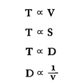
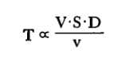
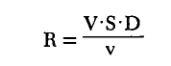

```
Created on  2019.05.20.22:40
patterns_in_nature_STEVENS
Patterns in Nature Author:PETER S.STEVENS
编译：Moly Chin
@author: molychin@qq.com
```


## 3 All Things Flow
Can anyone understand the spreading of the clouds. . . ?
- JOB 3 6 : 2 9

所有的物体都是流
任何人都可以理解云的飘动…？

ACCORDING to the ancient philosopher Heraclitus, the sole actuality of nature resides in change. All things are becoming. All things are flowing. At the same time, however, all things remain the same. The modern physicist wrestles with that paradox when he studies flow and turbulence. The new water chases out the old, but the pattern remains the same.

根据古代哲学家赫拉克利特的观点，自然的唯一现实存在于变化中。 一切都在变。 一切都在流淌。 然而，与此同时，所有事情都保持不变。 当研究流动和湍流时，现代物理学家正在与这个悖论搏斗。 新水追逐旧水，但模式保持不变。

Turbulence  
TURBULENCE forms the primordial pattern, the chaos that was "in the beginning." We are all familiar with turbulence. We have poured cream into coffee and watched the white marbled swirls as they curl and twist. We have watched the smoke from the fire stream upward and break into whirls and eddies. But the exact visual pattern is difficult to describe. Turbulence does not fit precisely any of the simple patterns that we generated in the last chapter. To some extent turbulence resembles the random meanders of Figures 23b and 29, and it happens that any particular particle within a turbulent flow does indeed describe an erratic and meandering path. But turbulent flows also have eddies and whirls like the configurations of Figures 23a and 30a. In fact, it is the eddies that distinguish turbulent from nonturbulent or laminar flow.

湍流  
湍流形成了原始模式，即“一开始”的混乱。 我们都熟悉湍流。 我们把奶油倒入咖啡中，看着白色大理石花纹卷曲和扭曲。 我们已经看到火焰中的烟雾向上滚动，并且变成漩涡和漩涡。 但确切的视觉模式很难描述。 湍流并不完全适合我们在上一章中生成的任何简单模式。 在某种程度上，湍流类似于图23b和29的随机曲折，并且发生湍流中的任何特定粒子确实描述了不稳定和曲折的路径。 但是湍流也具有类似于图23a和30a的配置的漩涡和旋转。 事实上，正是漩涡将湍流与非湍流或层流区分开来。


We will study spiral patterns more fully in the next chapter, but here let us observe that the spiral eddy comes into existence when a stream gets stalled against its boundaries or against another stream moving in the opposite direction. The stalled stream breaks into pieces that roll over on themselves. Right at the boundary, the flow of the stream has zero velocity - which is why little particles of dust can ride on the blade of a fan without being blown off, and why you cannot blow fine pieces of dust from the surface of a tableonly large pieces that stick up into the breeze. At increasing distances from the boundary, the flow moves with higher velocities, and the difference in rates of flow causes the stream to trip over itself, to curl around on itself, just as a wave curls when it stubs its toe rushing up the beach.

我们将在下一章中更全面地研究螺旋模式，但在这里让我们观察一下，当一股气流在其边界上或与另一条流向相反方向流动时，螺旋涡旋就会出现。 失速的溪流破裂成碎片滚滚而来。 在边界处，流的流动速度为零 - 这就是为什么小颗粒尘埃可以在风扇的叶片上飞行而不会被吹走，以及为什么你不能从一个大的表面吹出细小的灰尘，那些粘在微风中的碎片。 在离边界越来越远的地方，流动以更高的速度移动，并且流速的差异导致流自身跳动，自身卷曲，就像波浪在它的脚趾向上冲到海滩时卷曲一样。

Although we expect to find eddies in turbulent flow, we do not know when any specific eddy will come into being or die away . We cannot yet predict how eddies interact. Similarly, we know as a general rule that any particle within a turbulent flow gets knocked about in an aimless fashion by the swirls, so that it describes an erratic meandering path, but at any given moment we cannot predict the precise location or velocity of the particle. Our inability to predict details of turbulent flow hampers us in many fields. We find it difficult to forecast the weather, interpret sunspots, ascertain the flow of material beneath the earth's crust, or even to predict the exact pressure required to force a large volume of water through a long pipe. Much about turbulence, like the spreading of the clouds, remains beyond our understanding, But even if we cannot predict all the details, we can predict something about the average case. We can consider the unpredictable local velocities and pressures as chance or random occurrences and then, with the aid of probability theory, take the mean of those occurrences and obtain mathematical descriptions of average motions in average flows.

虽然我们期望在湍流中发现涡流，但我们不知道什么时候特定涡流会产生或消失。我们还不能预测涡旋是如何相互作用的。同样，我们知道，一般情况下，湍流中的任何粒子都会被漩涡以无目标的方式撞击，因此它描述了一条不规则的曲折路径，但在任何给定的时刻，我们都无法预测粒子的精确位置或速度。我们无法预测湍流的细节阻碍了我们在许多领域的发展。我们发现很难预测天气，解释太阳黑子，在地球地壳下面的物质流动，甚至预测迫使大量水通过长管道所需的精确压力。
很多关于湍流，像云层的扩散，超出了我们的理解，但是即使我们不能预测所有的细节，我们也可以预测一些关于平均情况的事情。我们可以把不可预测的局部速度和压力看作偶然或偶然的事件，然后借助概率论，取这些事件的平均值，求平均流中平均运动的数学描述。

Just because such an analysis treats the eddies as random occurrences, we should not be misled into believing that they really are random. An eddy is determined by other eddies, and those in turn are determined by still others, and so forth, back to certain specific initial conditions. But we cannot yet describe the initial conditions with enough accuracy to be able to predict all the resulting consequences. The initial conditions contain so many factors that compete with and countermand one another that we are forced to treat the resulting eddies as chance events. When we do, we get results that describe the average, that is to say, the most probable case.

正因为这种分析把漩涡当作随机事件，我们不应该被误导相信它们真的是随机的。涡流是由其它涡流决定的，而涡流又由其它涡流决定，等等，回到特定的初始条件。但是，我们还不能用足够的精度来描述初始条件，从而能够预测所有产生的后果。最初的条件包含了许多因素，它们相互竞争，相互抵消，迫使我们把产生的漩涡当作偶然事件来处理。当我们这样做时，我们得到描述平均值的结果，也就是说，最可能的情况。

The analysis of turbulence in terms of probability reveals several interesting things about eddies. For instance, the average eddy moves a distance about equal to its own diameter before it generates small eddies that move, more often than not, in the opposite direction. Those smaller eddies generate still smaller eddies and the process continues until all the energy dissipates as heat through molecular motion. In 1941, A. N. Kolmogoroff first set forth the idea that turbulence generates a hierarchy of eddies, thereby inspiring the beautifully apt verse of L. F. Richardson:

Big whirls have little whirls,
That feed on their velocity;
And little whirls have lesser whirls,
And so on to viscosity.

Through statistical analysis, Kolmogoroff also predicted that the velocity of an eddy is proportional to the cube root of its size, that, for example, an eddy moving twice as fast as another will usually be eight times as large, or that one moving ten times as fast will be a thousand times as large.

从概率的角度分析湍流揭示了涡旋的一些有趣的东西。例如，平均涡流在其产生小漩涡之前移动的距离等于其自身直径，在相反的方向上移动的漩涡更频繁。这些较小的漩涡产生更小的漩涡，并且过程继续，直到所有的能量通过分子运动作为热量消散。在1941，A. N. Kolmogoroff首先提出的想法，湍流产生一个层次的漩涡，从而激发了美丽的容易诗句L. F. Richardson：

大漩涡有很少的漩涡，
它们以它们的速度为食；
小漩涡有较小的漩涡，等等。

通过统计分析，Kolmogoroff还预言了涡流的速度与它的尺寸的立方根成正比，即，与另一个涡流相比，涡旋运动的速度是通常的八倍，或者移动十倍的速度将是一千倍大。

Reynolds Number
STILL ANOTHER WORK of a theoretical and statistical nature, this time by Werner Heisenberg, shows why density, viscosity, and the width of a stream all play a part in the visual appearance of turbulence - just as Osborne Reynolds observed (without being able to explain) about ninety years ago. Reynolds's discovery, as expressed by the concept of the Reynolds number, shows how things can change their shape in response to a change in scale, and yet, at the same time, and in seeming contradiction, have the same shape at different scales. Let us examine that idea.

雷诺兹数
另一个理论和统计性质的工作，这次由Werner Heisenberg，显示了为什么密度，粘度，和宽度的流都发挥了部分的视觉外观的湍流-正如Osborne Reynolds观察到（无法解释）约九十年前。雷诺兹的发现，正如雷诺兹数的概念所表达的，显示了事物如何响应于尺度的变化而改变其形状，然而，同时，在看似矛盾的情况下，在不同的尺度上也具有相同的形状。让我们来检验一下这个想法。

We can arrive at the concept of the Reynolds number by asking four simple questions:
1, Does turbulence increase or decrease with an increase in the velocity of the stream?
2, Does turbulence increase or decrease with an increase in the size of an obstacle in the stream?
3, Does turbulence increase or decrease with an increase in the density of material that makes up the stream?
4, Does turbulence increase or decrease with an increase in the viscosity of the material of the stream?

我们可以通过问四个简单的问题得出雷诺数的概念：
1.湍流是随着水流速度的增加而增加还是减少？
2.湍流是随着水流中障碍物大小的增加而增加还是减少？
3.湍流是随着组成水流的物质密度的增加而增加还是减少？
4.湍流是随着气流材料粘度的增加而增加还是减少？

The answers, for the most part, are casy.
1, Turbulence increases as the velocity increases. The flag flutters more in the gale than in the zephyr.
2, Turbulence increases as the size of the obstacle increases. The freighter creates more wake than the dinghy.
3, Turbulence increases as the density of the material increases. With greater density, more particles are present to get jostled about: more interaction can, and therefore will, take place.
4, Turbulence decreases with an increase in viscosity. Here we need to know that viscosity is a measure of the internal friction of the stream, the ability of the stream to stick together, to withstand shear. Realizing that air or water with low viscosity is easily made turbulent when it flows around an obstacle, while oil or molasses with high viscosity oozes smoothly around an obstacle without eddies and backwash, we conclude that turbulence is inversely proportional to viscosity: the greater the viscosity the less the turbulence.

在大多数情况下，答案很简单。
1.湍流随着速度的增加而增加。旗帜在大风中比在西风中飘扬得多。
2、湍流随着障碍物尺寸的增大而增大。货船比小艇产生更多的尾迹。
3.湍流随着材料密度的增加而增加。随着密度的增加，更多的粒子出现在周围：更多的相互作用可以发生，因此也将发生。
4、湍流随粘度的增加而减小。在这里，我们需要知道，粘度是一个衡量流的内耗，流粘在一起的能力，承受剪切力的度量。认识到低粘度的空气或水在障碍物周围流动时容易产生湍流，而高粘度的油或糖蜜在障碍物周围平稳地渗出，没有涡流和反洗，我们得出结论：湍流与粘度成反比：粘度越大，湍流越小。

We can write the answers to the four questions in mathematical shorthand by saying that turbulence, T, is directly proportional to velocity, obstacle size, and  density - V, S, and D - but it is inversely proportional to viscosity, v. Mathematically then:  
我们可以用数学速记法写出这四个问题的答案，即湍流t与速度、障碍物大小和密度（v、s和d）成正比，但它与粘度v成反比。那么数学上：



or, putting all the terms together,   
或者，把所有的术语放在一起，



We can also go a bit further, just as Reynolds did, for, if we choose our dimensional units in the right way, we can get them to cancel so that T becomes a dimensionless number, the so-called Reynolds number R, and we have

我们也可以再进一步，就像Reynolds做的那样，因为如果我们以正确的方式选择我们的尺寸单位，我们可以让它们消去，使t变成无量纲数，也就是所谓的Reynolds数r，我们有



Now, the beauty of that derivation lies in the fact that flows with the same Reynolds number look much the same, whereas flows with different Reynolds numbers look quite different. We can combine different velocities, obstacle sizes, densities, and viscosities in different ways, but if we get the same Reynolds number, we will get the same general appearance. Thus, for example, whether a fast-flowing stream is obstructed by a pebble or a slow-moving stream by a boulder, the same pattern of backwash is produced. A speck of dust falls through the air with as much difficulty as our bodies might experience in moving through molasses. Those cases of dynamic similarity are of great interest to the engineer who sets up tests of small models in order to predict the behavior of fullscale structures. The engineer plays the variables of velocity, size, density, and viscosity against one another in any number of ways, but if the variables balance out to the same result, to the same Reynolds number, to the same amount of turbulence, then the flows look roughly equivalent.

现在，这种推导的优点在于，具有相同雷诺兹数的流看起来大致相同，而具有不同雷诺兹数的流看起来完全不同。我们可以以不同的方式组合不同的速度、障碍物的大小、密度和粘度，但是如果我们得到相同的雷诺兹数，我们将得到相同的一般外观。因此，例如，快速流动的流是否被卵石阻碍，或由巨砾缓慢流动的流，产生相同的反冲洗模式。一团灰尘在空气中飘过，就像我们的身体在通过糖蜜运动时所经历的一样困难。动态相似性的情况是工程师感兴趣的，他们建立小模型的测试，以预测全尺度结构的行为。工程师以任意数量的方式相互作用速度、大小、密度和粘度的变量，但是如果变量平衡到相同的结果，对于相同的雷诺兹数，对于相同数量的湍流，则流动看起来大致相等。

Concentrating on obstacles for a moment, we can see that a change in size results in a change in pattern or form. The small object disturbs the stream but little, the large object creates a turbulent wake. Instead of considering the size of an obstruction, we can also consider the size of a pipe through which the stream might flow. Whereas the large rock directly disrupts the flow, the large pipe allows the flow to disrupt itself.
The large pipe has more room for turbulence and thus more turbulence arises. In fact, we can generate Reynolds numbers based on diameters of pipes exactly as we can for numbers based on diameters of obstructions. In both cases the pattern of flow changes with size.

一时关注障碍，我们可以看到规模的变化导致模式或形式的变化。 小物体扰乱了溪流但很少，大型物体产生湍流尾迹。 我们也可以考虑流可能流过的管道的大小，而不是考虑障碍物的大小。 虽然大型岩石直接破坏了流动，但大型管道允许流动自身破坏。
大管具有更大的湍流空间，因此产生更多的湍流。 事实上，我们可以根据管道直径生成雷诺数，就像我们根据障碍物直径的数字一样。 在这两种情况下，流动模式随大小而变化。

Remembering, however, that decreasing the velocity or density, or increasing the viscosity, can compensate for the effect of increasing size, we see why flows of different sizes can look much the same. Changing only one variable definitely alters the appearance, but changing two or more together may well leave the appearance unaffected. The principle of compensation among variables explains why we find similar patterns at vastly different scales.
One further point should be made about scale and turbulence. Turbulence, or its measure - Reynolds number - is itself an expression of quantity or size.
The Reynolds number is a measure of the amount of material that is present. Considering flow in a pipe, we can see that increasing the velocity of the flow, the size of the pipe, or the density of the material are simply three different ways to get a greater quantity of material to interact with itself.

然而，记住，降低速度或密度或增加粘度可以补偿增加尺寸的影响，我们看到为什么不同尺寸的流动看起来大致相同。 仅更改一个变量肯定会改变外观，但一起更改两个或更多可能会使外观不受影响。 变量之间的补偿原理解释了为什么我们在不同的尺度上找到相似的模式。
应该进一步说明规模和湍流。 湍流或其测量 - 雷诺数 - 本身就是数量或大小的表达。
雷诺数是对存在的材料量的量度。 考虑到管道中的流动，我们可以看到增加流速，管道尺寸或材料密度只是三种不同的方式来获得更多的材料与自身相互作用。


>continue....
