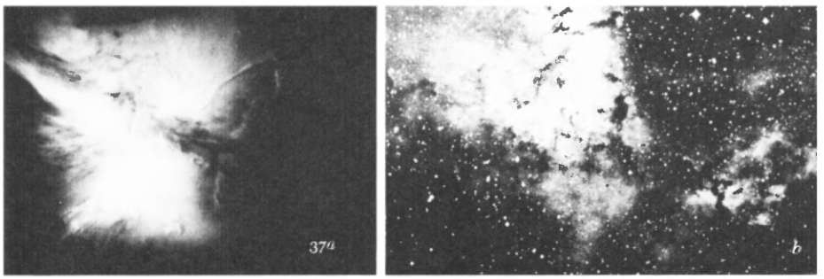
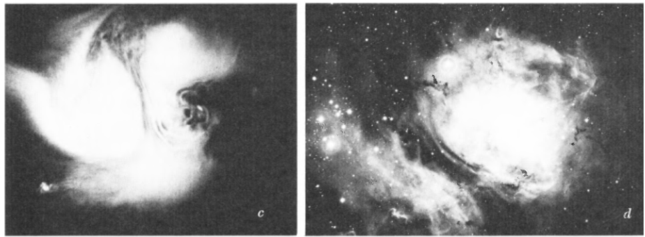
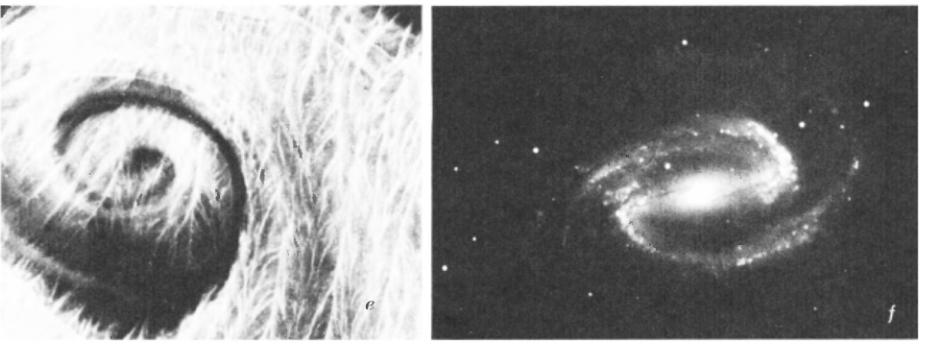
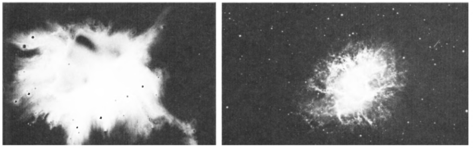
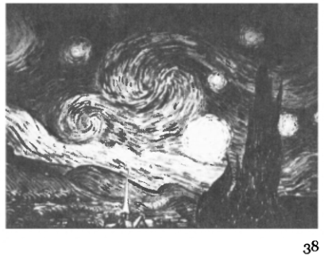
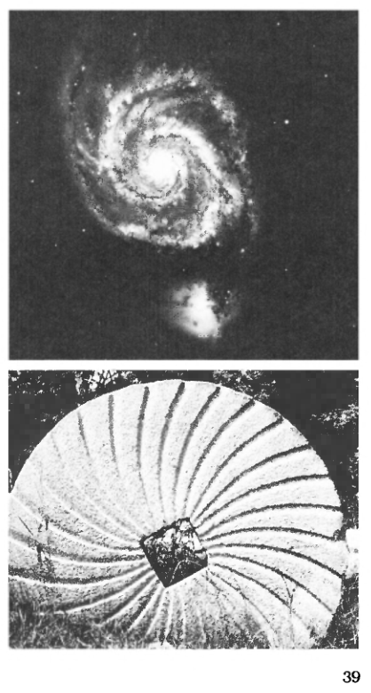

```
Created on  2019.05.20.22:40
patterns_in_nature_STEVENS
自然模式-原著：PETER S.STEVENS 改编：Moly Chin
@author: molychin@qq.com
```


The Turbulence of the Universe

IT IS NO COINCIDENCE that milk poured into a wet sink imitates the design of galaxies and clusters of galaxies in the sky (Figure 37). Differences in velocities, densities, and viscosities compensate for the enormous difference in size between the kitchen sink and the heavens, so that the milk and the Milky Way follow a similar plan.
By way of illustration, Figure 37 shows four pairs of pictures. With the exception of e, in which the swirling material is a mixture of glycerin, food coloring, and ink, the first frame of each pair shows milk that has been spilled in a black slate sink. The milk covers areas a few inches across, while the gas clouds, spiral galaxies, and exploding Crab Nebula with which the milk is compared cover areas in the order of ten quintillion (10 19 ) miles across.


宇宙的湍流
牛奶倒进湿的水池中模仿天空中星系和星系团的设计（图37）并非巧合。速度、密度和粘度的差异弥补了厨房水槽和天空之间巨大的差异，因此牛奶和银河也遵循类似的计划。
作为说明，图37示出了四对图片。除E之外，其中漩涡材料是甘油、食用色素和墨水的混合物，每一对的第一帧显示了溢出在黑色板岩沉淀物中的牛奶。牛奶覆盖了几英寸的区域，而气体云、螺旋星系和爆炸蟹状星云则与牛奶相比较，覆盖面积为十千之六次幂（10到19）英里。

||
|:---:|
||
||
||

Kant and Laplace first described the turbulence of stellar material; Van Gogh's painting, Starry Night, gave it visual expression (Figure 38); and Carl von Weizsacker and George Gamow have attempted to explain the physical facts.

康德和拉普拉斯首先描述了恒星材料的湍流; 梵高的绘画“星夜”给了它视觉表达（图38）; 并且Carl von Weizsacker和George Gamow试图解释物理事实。



At an early stage, the material of the universe was a gas of nuclear particles. The gas was necessarily turbulent, that is to say, its Reynolds number was necessarily high, because the "pipe" in which it flowed, the absolute size of the universe, was large and did not restrict its flow. The turbulence of the gas gave rise to local compressions and rarefactions. Once the particles of gas were compressed, the gravitational attraction between them increased - their attraction for one another being inversely related as d 2 , the square of their separation. It happened that many of the compressed clumps could not expand again: they were held in check by their own gravity. It is interesting to know that similar clumpings of gas take place in the turbulent air around us every day, but that those clumps are too small to hold together under the influence of their own gravitational pull. The clumps of primordial gas, however, were enonnously larger. They had a mass several million times the mass of the sun.

在早期，宇宙物质是由核粒子组成的气体。气体必然是湍流的，也就是说，它的雷诺数必然很高，因为它流动的“管道”（宇宙的绝对大小）很大，并不限制它的流动。气体的湍流引起局部的压缩和稀薄。一旦气体粒子被压缩，它们之间的引力就增加了它们彼此吸引的吸引力与D的平方成反比。碰巧，许多被压缩的团块不能再膨胀：它们被自身的重力控制住了。有趣的是，我们周围的湍流空气中每天都会发生类似的气体团块，但是这些团块太小，在它们自身的引力的影响下无法聚集在一起。然而，原始气体的团块却非常大。它们的质量是太阳质量的几百万倍。

In such a large clump, the increased gravitational attraction pulled the particles still closer together, increasing the strength of the attraction still more, which in turn pulled the particles closer again. Thus, once a large enough clump had fonned, it collapsed on itself in an ever-accelerating gravitational rush.
If the clump of gas was very large, the collapse might continue indefinitely - down to almost nothing.
At this very moment there may be billions of such collapsing clumps in the sky. They are the "black holes" that astronomers are looking for, so designated because their immense gravitational attraction makes it impossible for any material to get out, not even particles of light. Of course, they are not really holes.

在如此大的团块中，引力的增加将粒子拉得更近，从而使引力的强度更大，从而又将粒子拉得更近。因此，一旦一个足够大的团块形成，它就会在不断加速的引力波中自行坍塌。
如果气体的团块非常大，坍塌可能会无限期地持续下去——几乎没有。
就在这个时刻，天空中可能会有几十亿个这样的坍塌的团块。它们是天文学家正在寻找的“黑洞”，之所以被指定，是因为它们巨大的引力使得任何物质都不可能从中出来，甚至光的粒子也不可能。当然，它们不是真正的洞。

Just the opposite: they are immense concentrations of material that suck everything around them, including light itself, into their interiors. Since no light escapes, we have no way of seeing them directly. Consequently, they have the appearance of black emptinesses.
What happens in the hole, and how matter escapes from becoming inHnitely collapsed, remains one of the most pressing questions in physics. What happens in the hole may foretell what will happen to the entire universe, when and if it collapses on itself prior to its next round of expansion. Somehow, according to John Wheeler, material in the hole has the opportunity to take on new spatial properties. Somehow, a new cycle with a new spatial topology starts over again.

恰恰相反：它们是巨大的物质聚集体，将周围的一切，包括光本身，吸入它们的内部。既然没有光逃逸，我们就无法直接看到它们。因此，它们具有黑色空虚的外观。
在黑洞中发生了什么，以及物质如何从本质上的崩溃中逃逸，仍然是物理学中最紧迫的问题之一。在这个洞里发生的事情可能预示着整个宇宙将会发生什么，当它在下一轮膨胀之前，如果它自己崩溃的话。不知何故，据John Wheeler说，材料在洞有机会采取新的空间属性。不知何故，一个新的空间拓扑循环又重新开始了。

When the clumps of primordial nuclear gas are small, the contraction is stopped by centrifugal force before the stage of the black hole is reached. The random motions within the small clump inevitably cause it to rotate, to behave like an eddy, and the more it shrinks, the faster it spins, like a whirling skater when he pulls in his arms. That increase in rotation leads to an increase in centrifugal force that tends to throw material outward, and soon, in the plane of rotation, material gets flung away from the center in long spiral arms. Perpendicular to the plane of rotation, however, material still moves inward, collapse still goes on, and the whole system flattens into the familiar disk of a spiral galaxy.
The mechanism that keeps the spiral arms of the galaxy spread out, that prevents them from wrapping up, is still not completely understood. As an analogy though, you might consider a rotating water sprinkler that throws out spiral arms of water. Like that sprinkler, a galaxy flings out arms, and the material in the arms feeds into the system from above and below the rotating disk.

当原始核气体团较小时，在到达黑洞阶段之前，离心力阻止了收缩。小团块内的随机运动不可避免地会使它旋转，表现得像一个漩涡，而且它收缩得越多，它旋转得越快，就像一个旋转的滑冰者，当他拉入臂弯时。旋转的增加会导致离心力的增加，离心力倾向于向外抛掷材料，很快，在旋转平面上，材料就会从长螺旋臂的中心被抛出去。然而，垂直于旋转平面，物质仍然向内移动，崩塌仍在继续，整个系统扁平化为我们熟悉的螺旋星系圆盘。
保持银河系旋臂展开的机制，阻止旋臂缠绕，目前还不完全清楚。不过，作为一个类比，你可以考虑一个旋转的喷水器，它可以喷出螺旋形的水臂。像喷水器一样，星系伸出手臂，手臂中的物质从旋转盘的上方和下方进入系统。

Figure 39 shows another analogue of the spiral galaxy, an old millstone that has been cut with spiral tracks that carry ground grain outward from the center as the stone revolves.
When clumps of gas rotate slowly, they do not Bing themselves out into spiral arms; they remain smooth and their collapse results in elliptical galaxies.
A similar theory of turbulence and rotation accounts tor the formation of the solar system. Laplace assumed that the sun and planets condensed out of a great revolving gaseous cloud. Today we postulate that collections of dust as well as condensations of gas are at work. The particles of dust, incidentally, may have been driven together initially by the pressure of starlight - a force that once again varies inversely with d 2 , the square of the separation between particles.

图39显示了另一个类似螺旋星系的情况，这是一个旧的磨盘，它被切割成螺旋轨道，当石头旋转时，螺旋轨道将磨粒从中心向外运送。当气体的团块缓慢旋转时，它们不会自转成螺旋状的臂；它们保持平稳，而它们的坍塌导致椭圆星系。
类似的湍流和旋转理论解释了太阳系的形成。拉普拉斯假设太阳和行星是由一个巨大的旋转气体云凝结而成的。今天，我们假设尘埃的聚集和气体的冷凝正在起作用。顺便说一句，尘埃颗粒最初可能是由星光的压力驱动在一起的——这个力再次与d 2（颗粒间分离的平方）成反比。



According to modem theory, flows of gas and dust break up into turbulent eddies. Those eddies conHict with one another and kill each other off, except for the ones that stay clear of collisions. It happens, not unexpectedly, that the eddies that remain, those that avoid collisions, are spaced at regular intervals from one another. Those eddies condense further and give birth to planets, so that the planets too end up with a regular spacing. The particulars of the theory thus explain why each successive planet in the solar system is about twice as far from the sun as the previous one.
In that story of the creation of the planets we see a kind of evolutionary theory at work. We see the decimation of the unfit, the swirls that collide with one another, and the survival of the fit, the swirls that were originally positioned so as to avoid collision. The end result is an orderly arrangement that appears more a product of design than chance. Order is born out of chaos. It is interesting, however, that the chaos persists. In fact, considering the dissipated heat generated by the collisions of the eddies, and by the condensation of the dust and gas in forming the planets, the disorder or entropy of the system has actually increased. The order of the local events - the spacing of the planets - is more than recompensed by the disorder - the heat gain - in the rest of the universe.

根据现代理论，气体和灰尘的流动分解成湍流漩涡。那些漩涡彼此相撞，互相残杀，除了那些避开碰撞的人。它发生，而不是出乎意料的是，留下的漩涡，那些避免碰撞的漩涡，是以规则的间隔彼此间隔的。这些漩涡进一步凝结并产生行星，因此行星也以规则的间隔结束。这一理论的细节可以解释为什么太阳系中的每一颗行星都是太阳的两倍。
在创造飞机的故事中，我们看到了一种进化理论在起作用。我们看到不适的抽取，互相碰撞的漩涡，以及适合的生存，最初被定位的漩涡以避免碰撞。最终的结果是一种有序的安排，看起来更多的是设计而不是偶然的产物。秩序是从混乱中诞生的。然而，有趣的是，混乱依然存在。事实上，考虑到涡旋碰撞产生的耗散热，以及形成行星的尘埃和气体的凝结，系统的无序或熵实际上增加了。局部事件的顺序——行星的间距——不仅仅是由宇宙中的无序-热增益所补偿的。

根据现代理论，气流和尘埃分解成湍流涡流。那些漩涡互相连接，互相残杀，除了那些远离碰撞的漩涡。这种情况并非出乎意料地发生了，仍然存在的涡流，那些避免碰撞的涡流，彼此之间以规则的间隔间隔间隔间隔分布。这些漩涡进一步浓缩，并产生行星，因此行星也以规则的间距结束。因此，该理论的细节解释了为什么太阳系中每一个连续的行星距离太阳的距离是前一个行星的两倍。
在行星创造的故事中，我们看到一种进化论正在起作用。我们看到不适合的抽取，相互碰撞的漩涡，以及适合的生存，最初定位以避免碰撞的漩涡。最终的结果是一个有序的安排，看起来更像是设计的产物而不是偶然。秩序是从混乱中诞生的。然而，有趣的是，混乱依然存在。事实上，考虑到涡流的碰撞和尘埃和气体在行星形成过程中的凝结所产生的散热，系统的无序或熵实际上已经增加。局部事件的顺序-行星的间距-比宇宙其他部分的无序-热增益-所补偿的还要多。

Vortex Streets

WHEN WE CONSIDER flows with low Reynolds numbers, we see the production of large-scale order even more directly. At low Reynolds numbers, the eddies alternate with one another and form regular rows. Such flows are not really turbulent, nor are they steady; instead, they are «nearly steady" or periodic.
涡街
当我们考虑具有低雷诺兹数的流时，我们更直接地看到大规模订单的产生。在低雷诺兹数下，涡流相互交替并形成规则行。这种流动不是真正的动荡，也不是稳定的；相反，它们是“几乎稳定的”或周期性的。

Behind a rock in a stream or a moving canoe paddle, you often see two oppositely swirling eddies. Behind a larger obstruction such as a bridge abutment in a fastflowing river, you see those two eddies rhythmically peel off and flow downstream, first from one edge and then from the other. Figure 40 shows such an alternating stream of vortexes in a flow of air that has been filled with oil droplets from an aerosol spray. The air flows around a stationary cable to produce the periodic pattern called a vortex street. The vortex from one side of the cable grows until it draws material across its
wake from the opposite side of the cable. That flow of material from the opposite side, which twists in the opposite direction, grows until it in turn draws material from the opposite side. The growth takes place periodically, first on one side of the cable and then on the other. Note that the eddies in the bottom row curl counterclockwise, whereas those in the top row curl clockwise. Where they intenningle in the center, the eddies interlock like rotating gears in a machine.
在一条溪流中的岩石或一只划独木舟的桨后，你经常会看到两个相反的漩涡。在一个更大的障碍物后面，比如一条快速流动的河流中的桥台，你会看到这两个漩涡有节奏地脱落，并从一个边缘流向另一个边缘，然后从另一个边缘流出。图40显示了在空气流中的一个交替的涡流流，该空气流中充满了来自气溶胶喷雾的油滴。空气绕着固定的电缆流动，产生周期性的模式，称为涡街。从电缆一侧的涡流生长，直到它穿过它的材料。
从电缆的另一侧醒来。相反方向的物质流动，在相反的方向上生长，直到它反过来从相反的侧面汲取物质。生长周期性地发生，首先在电缆的一侧，然后在另一侧。注意，底排的旋涡是逆时针旋转的，而在上排的旋涡是顺时针的。当它们在中心活动时，涡流就像机器中的旋转齿轮联锁。

It has been suggested that swimming fish, which generate their own eddies, might take advantage of the rotations of those eddies and ride the meandering path between them like a moving belt riding between rollers (Figure 41a). Recently, however, Heinrich Hertel has detennined, at least for a swimming snake, that the two rows of vortexes are squeezed into a single line and that the body of the animal cuts through the center of each vortex rather than wrapping around it (Figure 41 b). The interesting point is that no new eddies fonn behind the snake, that is to say, there is no backwash.
Also, the eddies stay in position right where they are formed; they do not travel downstream. That lack of wake and eddy movement testifies to the efficiency of the snake's swimming motion.
有人建议，游泳鱼，产生自己的漩涡，可能会利用这些漩涡的旋转和骑在蜿蜒的道路之间，就像一个移动带之间的辊（图41A）。然而，最近，Heinrich Hertel至少已经为一条游动的蛇而沉溺于这两行漩涡被挤压成一条线，并且动物的身体通过每个漩涡的中心而不是围绕它旋转（图41 B）。有趣的是，蛇后面没有新的漩涡，也就是说，没有反冲。
此外，涡流保持在它们形成的位置上，它们不向下游流动。缺乏唤醒和涡流运动证明蛇的游泳运动的效率。

It has also been hypothesized that birds travel in a vee fonnation in order to take advantage of each other's eddies and wakes. The reaction of each bird pushing down on the air below it creates an updraft around it. If other birds crowd in close, they can use those updrafts to keep themselves aloft. If the whole group flies in a vee, all the birds share approximately the same amount of updraft - since each bird flies forward into the updraft of the bird in front. The lead bird enjoys a boost too, since it is aided on both sides by the birds behind. Each individual bird thus rides the wake of its neighbors, and calculations reveal that a group of twenty-five birds can fly in fonnation some 70 percent farther than one bird alone.
也有人推测，鸟类为了适应对方的涡流和尾迹而在一个VEE中旅行。每只鸟向下推它下面的空气的反应在它周围产生一个上升气流。如果其他鸟类靠近，他们可以使用那些上升气流保持自己的高度。如果整个群都飞在一个V形物中，所有的鸟都有大约相同数量的上升气流，因为每个鸟都向前飞到前面的鸟的上升气流中。领头鸟也很有助力，因为它的两侧都是鸟的后援。因此，每只单独的鸟都会乘坐它的邻居的踪迹，计算表明，一组二十五只鸟能比单独一只鸟飞得更远70%。
Human beings, as well as birds and snakes, make use of periodic patterns of flow - but in a rather unexpected way. We listen to them. If the vortexes in a vortex street peel away from the obstruction with a frequency between 50 and 20,000 hertz, or cycles per second, we hear melodious hums and whistles. Aeolian harps, tree limbs, telephone wires, flutes, organ pipes, and teakettles all produce sound by shedding vortexes within the audible range of frequencies.
人类，以及鸟类和蛇，利用周期性的流动模式——但以一种意想不到的方式。我们倾听他们的声音。如果涡街中的漩涡从障碍物中剥离，频率在50赫兹到20000赫兹之间，或每秒周期，我们会听到悠扬的嗡嗡声和口哨声。风琴、树枝、电话线、笛子、风琴管和茶壶都通过在可听见的频率范围内脱落漩涡而产生声音。
Weare occasionally affected by vortex streets at a much larger scale. We now know that regular vortexes caused the collapse of the Tacoma Narrows suspension bridge in 1940. With a steady wind of forty-two miles per hour blowing across a thirty-nine foot wide roadway, vortexes peeled off from one edge and then from the other and caused the bridge to twist on itself, first one way and then the other. After its collapse, the bridge was rebuilt with a box cross section rather than an H cross section so that it would better resist torsion or twisting, and all the surfaces of the box were made of open trusses in order to reduce the amount of material exposed to the wind - to reduce the area tenn in Reynolds's equation.
Weare偶尔会受到更大规模的涡街影响。我们现在知道，规则涡旋导致了塔科马变窄悬索桥在1940坍塌。随着四十二英里每小时的稳定风吹过三十九英尺宽的道路，涡旋从一个边缘剥离，然后从另一个边缘剥离，导致桥梁自身扭曲，首先是单向的，然后是另一个。坍塌后，该桥改建成一个箱形截面而不是H形截面，以便更好地抵抗扭转或扭曲，并且所有的箱体表面都被制成。
打开桁架，以减少暴露在风中的材料量，以减少雷诺兹方程中的面积。

Stress and Flow
AT A STILL LOWER Reynolds number, flow does not produce eddies at all; it oozes smoothly around any obstacle in its path. Figure 42 shows the pattern of low-speed flow around a cylinder.
Figure 42 is a remarkable picture. It actually represents three entirely different physical phenomena. In addition to low-speed flow around a cylinder, it shows an electric dipole in a unifonn electric field, and lines of tension and compression around a circular hole.
压力与Flow
在一个较低的雷诺兹数，流根本不产生漩涡；它绕着它的路径中的任何障碍物顺利地渗出。图42显示了气缸周围低速流动的模式。
图42是一个引人注目的画面。它实际上代表了三种完全不同的物理现象。除了绕圆柱体的低速流动外，它还显示了单子电场中的电偶极子，以及围绕圆孔的张力和压缩线。

Those three phenomena are basically different, but they have the same spatial configuration.
Interpreting the figure in terms of low-speed flow (or more correctly, irrotational flow, in which the fluid does not get stuck against the sides of the cylinder so as to produce eddies) the horizontal lines represent streamlines - paths of the water particles or paths of bits of dye that you might add to the water. Where the streamlines lie close together - above and below the cylinder in this particular figure - the velocity is high; and where they stand far apart - at the left and right in the figure - the velocity is low. The vertical lines at right angles to the streamlines are equipotentials. They are difficult to define in physical terms, but, analogous to electrical potentials, they are lines along which velocity potential does not change. In fluid flow, however, the important lines are the other ones, the streamlines.
这三种现象基本上是不同的，但它们具有相同的空间构型。
用低速流动（或更准确地说，无旋流动）来解释这个图形，其中流体不会被卡在圆柱体的侧面，从而产生涡流。水平线代表流线-水粒子的路径或染料的路径。加水。在这个特定的图形中，流线紧密地位于圆柱之上和下方-速度很高；而在它们远离的地方，在图的左右两侧，速度很低。与流线成直角的垂直线是等电位的。它们在物理上是难以定义的，但是，类似于电势，它们是沿着速度势不变的线。然而，在流体流动中，重要的线是另一条，流线。

One other fact about fluid flow that will help our understanding of the figure is that within a stream we can have a small source and a small sink - a place where additional fluid comes in and a place where it goes out - and if we move the source close to the sink, additional fluid will flow in and then out again without greatly disturbing the rest of the stream. If we choose the size of the source and the sink correctly, and set them the right distance apart, they will act exactly like a cylindrical obstruction in the stream. We can thus think of the shaded circle of our figure as containing a two-dimensional source and sink, around which flow the streamlines.
关于流体流动的另一个事实将帮助我们理解这个图形，在一个流中，我们可以有一个小的源和一个小的下沉-一个额外的流体进入的地方和一个流出的地方。如果我们将源移到水槽附近，额外的流体就会流入。然后又出来了，不太让其他人感到不安。如果我们正确地选择源和汇的大小，并将它们设置为正确的距离，它们将在流中完全像圆柱形障碍物。因此，我们可以认为我们的图形的阴影圆包含一个二维的源和汇，围绕着它流过流线。

Now let us look at the figure entirely differently, as a picture of electrical forces. Instead of locating a source and a sink in a uniform flow, let us place a small positive and a small negative charge (called an electric dipole) in a uniform two-dimensional electric field. We then obtain exactly the same picture. The horizontal lines are lines of electrical force. The closer they are together the stronger is the electrical field. The vertical lines are again equipotentials. The amount of work that is performed in moving an electric charge in the field is measured by the number of equipotentials that the charge crosses.
现在让我们把这个数字完全看成是一个电子力的图片。我们可以在均匀的二维电场中放置一个小的正电荷和一个小的负电荷（称为电偶极子），而不是在均匀的流中定位源和汇。然后我们得到完全相同的图片。水平线是电力线。它们越靠近，电场就越强。垂直线又是等电位的。在电场中移动电荷时所执行的功的量是由等电位的数目来测量的。
电荷交叉。

Jumping once again to a different phenomenon, let us now suppose that you have a steel plate that is held at the ends and stretched. If the plate has a circular hole in it, the stress trajectories within the plate will look like the lines in the figure. Those lines that run from left to right will be lines of equal tension, and those that run up and down will be lines of equal compression. Where the lines are close together, the forces of tension or compression will be high; and where they are far apart, the forces will be low. If the plate fails, it will tear across the center of the hole just where the lines are tightly bunched.
So why does the same drawing depict those different phenomena?
再跳一个不同的现象，让我们假设你有一个钢板，它被夹在两端并伸展。如果板中有一个圆孔，则板内的应力轨迹看起来像图中的线。从左到右运行的那些线将是等张力线，而上下运行的线将是等压缩线。当线紧密地连接在一起时，张力或压缩力会很高；而在它们相距很远的地方，力会很低。如果板失效，它将撕裂孔的中心，在那里直线被紧密地捆在一起。
那么为什么同样的画描绘了这些不同的现象呢？

Richard Feynman has supplied the answer. In discussing the "underlying unity" of nature, he cites the identity between the mathematical description of irrotational flow and the mathematical description of an electric dipole in a uniform field, and he also shows how those phenomena are thematically equivalent to problems involving the flow of heat, stretched membranes, the diffusion of neutrons, and the uniform lighting of a plane. Then he says:
Richard Feynman提供了答案。在讨论自然的“基本统一”时，他引用了无旋流动的数学描述与均匀电场中电偶极子的数学描述之间的恒等式，同时也说明了这些现象在本质上等同于涉及流动的问题。热量、拉伸膜、中子的扩散和平面的均匀照明。然后他说：

The "underlying unity" might mean that everything is made out of the same stuff, and therefore obeys the same equations. That sounds like a good explanation, but let us think. The electrostatic potential, the diffusion of neutrons, heat flow - are we really dealing with the same stuff? Can we really imagine that the electrostatic potential is physically identical to the temperature, or to the density of particles? . . . The displacement of a membrane is certainly not like a temperature.
“潜在的统一”可能意味着一切都是由相同的东西组成的，因此遵循相同的等式。这听起来是个不错的解释，但是让我们想想。静电势、中子扩散、热流——我们真的在处理同样的东西吗？我们真的可以想象静电势在物理上与温度或粒子密度相同吗？…A的位移
膜当然不像温度。

Why, then, is there "an underlying unity"? . . .
Is it possible that this is the clue? That the thing which is common to all the phenomena is the space, the framework into which the physics is put? As long as things are reasonably smooth in space, then the important things that will be involved will be the rates of change of quantities with position in space. That is why we always get an equation with a gradient. . . . What is common to all our problems is that they involve space. . . .
那么，为什么存在“潜在的统一”呢？….
这可能是线索吗？所有现象的共同点是空间，物理学的框架？只要事物在空间上是合理平滑的，那么所涉及的重要事物将是在空间中具有位置的数量变化率。这就是为什么我们总是得到一个带有梯度的方程。…我们所有问题的共同点是它们涉及空间。….

Returning then to our figure, we find that each phenomenon for which it stands has some property that changes in magnitude, or in magnitude and direction, at different points in space. In the example of fluid How, the streamlines change in magnitude and direction; in the example of the dipole in the electric field, the lines of force change in magnitude and direction; and in the case of the stretched plate, the trajectories of tension and compression change in magnitude.
The lines of flow, force, or stress are not the same, but their changes are. Those changes take place in the same smooth and continuous manner.
再回到我们的图形，我们发现它所代表的每个现象在空间的不同点都有某种性质在大小、大小和方向上发生变化。在流体的例子中，流线在大小和方向上如何变化；在电场中偶极子的例子中，力线在大小和方向上变化；并且在拉伸板的情况下，张力和压缩的轨迹在大小上变化。
流动、力或应力的线是不一样的，但它们的变化是。这些变化以相同的平滑和连续的方式发生。

Now consider how we show those smooth changes in our diagram. We divide the field or the space into separate pieces and draw lines that represent averages of the changes. It can be argued that by cutting up the field and taking averages we lose sight of the continuity of the phenomena - but we can make our slices as small as we want and the directness of our line drawing as a visual statement of change more than compensates for any losses introduced by subdividing the field.
The important point is that once we decide to represent a continuously changing gradient by means of "contour" lines, the question of how many different gradients can exist in space reduces to the question of how many different patterns of roughly parallel lines can we draw. The answer is, not many.
现在考虑一下我们如何在图表中显示这些平滑的变化。我们把场地或空间分成不同的部分，画出代表变化平均值的线。可以说，通过裁剪磁场和取平均值，我们忽略了现象的连续性，但是我们可以使我们的切片像我们所希望的那样小，我们的直线绘制的直观性作为改变的视觉陈述，而不是补偿由T的引入所带来的任何损失。他在场。
重要的一点是，一旦我们决定用“等高线”表示一个连续变化的梯度，那么在空间中存在多少不同梯度的问题减少到我们可以画出多少种不同的平行线模式的问题。答案是，不是很多。

Our figure shows a pattern of more-or-Iess parallel lines that have been separated. It is the pattern you get if you stab a linen handkerchief with an icepick. The fibers separate and "How" around the pick (The analogy does not hold exactly, because the vertical lines - the warp, let us say - would not stay at right angles to the horizontal woof. as shown in the figure, unless the two were directly connected to one another.)
A simpler pattern of roughly parallel lines is the fan pattern in the straw fibers .of a broom or, in the case of electrical phenomena, in the quipotentials at the ends of two parallel plates with opposite charge. Figure 43 is Clerk Maxwell's drawing of those equipotentials.
我们的图形显示了更多或平行的线已经分离的模式。如果你用冰块刺穿亚麻布手帕，你就会得到这种图案。纤维在镐头周围分离，“如何”（类比不能精确地保持），因为垂直线——翘曲，让我们说——不会与水平纬线保持直角。如图所示，除非两者直接相连。
粗略平行线的一种较简单的模式是稻草纤维中的风扇图案。在一个扫帚中，或者在电现象的情况下，在两个具有相反电荷的平行板端部的静电位。图43是店员麦斯威尔绘制的等电位图。

The lines of force end at right angles to the plates and the equipotentials run lengthwise and parallel to the plates. Note how similar the pattern looks to a molasseslike flow issuing from a tube.
The spreading of lines may be less regular, of course, as in a lock or curl of hair. An interesting example is shown in Figure 44 in which the bud of a peony has been sliced to reveal the first stages in the development of its petals. How does the turbulent tissue sort itself into a symmetrical arrangement of petals? What breaks down the initially solid bud to start the process of differentiation? Stress? Electrical forces? Chemical action? It could be any of those, or something else. The pattern, however, is one of irregular streamlines.
力线与板成直角，等电位与板平行并纵向延伸。请注意，图案看起来类似于从管子发出的类似摩尔的流动。
当然，线条的传播可能不那么规则，就像在一绺头发或一绺头发中一样。一个有趣的例子如图44所示，牡丹的花蕾已被切成薄片，以揭示其花瓣发育的第一阶段。湍流组织是如何排列成对称排列的花瓣？是什么打破了最初的固态芽开始分化的过程？强调？电力？化学作用？它可以是任何一种，或者别的什么。然而，这种模式是不规则的流线之一。

We might note that Maxwell's drawing of lines of force in Figure 43 is a little misleading since it shows the equipotentials ending on a line of force. Actually, the equipotentials and lines of force can only end at charges, stretch to infinity, or double back on themselves in closed loops. The closed-loop pattern is commonly found on the typical topographical contour map which uses roughly parallel lines to represent elevations of terrain. Lines that you sometimes see running at right angles to the contours are lines of maximum slope. The contour map is used to describe many other gradients besides those of altitude. The contours of Figure 45 are actually from a map that depicts variations in gravitational attraction. It could as well show variations III temperature, rainfall, the density of galaxies in the heavens, or some other phenomenon that varies in a continuous manner. Where the lines are close together. the slope or change in variable is steep; where far apart, the change is gradual. If the variable does not change continuously, if it changes abruptly, the lines join or cross one another.
我们可以注意到，在图43中，麦斯威尔绘制力线是有点误导的，因为它显示了等势在一条力线上结束。事实上，等势和力线只能以电荷结束，伸展到无穷远，或者在闭合回路中双回。在典型的地形等高线图上，通常使用近似平行线来表示地形的高程，通常会发现闭环模式。有时你看到的直线与轮廓线成直角的直线是最大斜率线。等高线图用于描述除海拔高度之外的许多其它梯度。图45的轮廓实际上是从描绘引力变化的地图中得出的。它也可以显示出III型温度、降雨、天空中星系的密度，或者其他一些以连续方式变化的现象。线条紧密相连的地方。变化的斜率或变化是陡峭的；在相距很远的地方，变化是渐进的。如果变量不连续变化，如果它突然改变，则这些线相互连接或交叉。

Except for the case of the hole in the plate, the "contours" in Figures 42 and 43 show changes in direction as well as magnitude (the gradients are vectors rather than scalars) but those figures, like Figure 45, represent spatial changes by means of roughly parallel lines. The interesting point is that slopes and gradients are constrained, just like the patterns of more-or-Iess parallel lines, so that the one mirrors the other.
除了图中的孔的情况，图42和图43中的“轮廓”示出了方向和幅度的变化（梯度是矢量而不是标量），但是这些图，如图45，通过大致平行线表示空间变化。有趣的是，斜率和梯度被限制，就像更多或平行平行线的图案一样，因此一个反射另一个。

Thus our bundles of lines can flow around obstructions, diverge or converge, extend to inHnity, and close on themselves in loops. And, of course, they can make all manner of variations on those arrangements, as modern artists have discovered. But the variations are limited to a few basic types, just like the patterns of force and the mathematical expressions that they describe.
因此，我们的一捆线可以围绕障碍物流动，发散或收敛，延伸到内在，并在回路中接近自身。当然，正如现代艺术家们所发现的那样，他们可以对这些安排做出各种各样的变化。但是这些变化仅限于几个基本类型，就像它们所描述的力的模式和数学表达式一样。

Stress in Wood and Bone
THE SIMILARITY between patterns of streamlines in flowing liquids and patterns of stress in solids explains one of those perplexing questions we frequently encounter in the study of natural form. Why does wood like that shown in the photographs of Figure 46 look turbulent? Does it flow like a liquid? Is it produced by streams and currents? The answer is no. The wood simply grows along lines of stress. It is the stress rather than the wood that "flows."
In this section, we will look at some patterns of stress, and then review what little is known of the mechanisms of growth that allow material to be laid down in those patterns.
木骨应力
流动液体流线模式与固体应力模式之间的相似性，是我们在自然形态研究中经常遇到的一个令人困惑的问题。为什么像图46所示的木头看起来很汹涌？它像液体一样流动吗？它是由水流和水流产生的吗？答案是否定的。木头只是沿着压力线生长。是“压力”而不是“流动”的木头。
在这一节中，我们将研究一些压力模式，然后回顾一下对那些允许材料在这些模式中形成的生长机制知之甚少。

To understand how stress is distributed, we should recal l the diagram of the beam in bending, shown in Figure 18. The bottom of the beam is stretched m tension while the top is squeezed in compression.
Figure 47 shows a similar beam except that instead of carrying a single load in the center, it carries a whole series of loads that are distributed unifonnly across its entire length. The figure shows the trajectories of stress within the beam itself. The dotted lines depict trajectories of tension, and the solid lines depict trajectories of compression. We see, at least in the center of the beam, how the lines of tension bunch together at the bottom and the lines of compression bunch together at the top, just as we would expect - the bottom being stretched and the top being compressed. The closeness of the lines in those bundles at the top and bottom indicate that the stresses are especially high in the center of the beam, again as we would expect, since a beam or column most often fails by bending and breaking in the middle.
为了理解应力是如何分布的，我们应该重新考虑梁的弯曲图，如图18所示。梁的底部被拉伸M张力，而顶部被压缩压缩。
图47示出了一个类似的梁，除了代替在中心承载单个载荷外，它承载了一系列在整个长度上均匀分布的载荷。该图显示了梁本身的应力轨迹。虚线描绘了张力的轨迹，实线描绘了压缩的轨迹。我们看到，至少在梁的中心，张力线在底部和压缩线是如何聚集在一起的，就像我们所期望的那样，底部被拉伸，顶部被压缩。在顶部和底部的这些束的线的紧密性表明，在梁的中心处的应力特别高，正如我们所期望的，因为梁或柱最经常在中间弯曲和断裂而失效。

In addition, the diagram discloses that the points where the tension and compression trajectories cross lie along a line that runs lengthwise down the center of the beam. Along that line, the so-called neutral axis, tension forces cancel compression forces so that no stress exists. Thus we see why a tubular structure can easily reduce its weight, as an adjunct to increasing its size, by giving up material from its center, from along its neutral axis. Consequently, the hollow quill, the reed, and the straw have about the same strength that they would have if they were solid.
此外，该图揭示了张力和压缩轨迹交叉的点沿着沿着梁中心纵向延伸的线。沿着这条线，所谓的中性轴，拉力消除压缩力，从而不存在应力。因此，我们看到为什么管状结构可以很容易地减轻其重量，作为增加其尺寸的辅助，通过从其中心放弃材料，沿着其中性轴。因此，中空的羽毛、芦苇和稻草的强度与它们结实时的强度相同。

Still, along with a hollow interior, we would expect to see a thickening of the side walls in the middle of the beam or tube where the stresses are most pronounced. As it happens, the human thighbone or femur exhibits just such a thickening. As shown in Figure 48, the femur is essentially a hollow tube. It flares at the top and bottom to receive loads from the pelvis and the knee, and it resists the tendency to buckle or bend by thickening its side walls in the center of its length, exactly where the trajectories of stress are closest together.
然而，随着中空的内部，我们预期看到在梁或管中间的侧壁增厚，其中应力最为明显。碰巧，人的大腿骨或股骨表现出这样的增厚。如图48所示，股骨基本上是空心管。它在顶部和底部闪烁，以接收来自骨盆和膝盖的载荷，并且通过在其长度中心的侧壁增厚来抵抗屈曲或弯曲的倾向，确切地说，应力的轨迹在最接近的地方。

Examination of the top of the femur confinns the fact that new bone actually grows along the stress trajectories. Figure 49 (from Thompson, 1942, after Culmann and Wolff) shows the well-known comparison of the head of the femur with the top of the mast of the Fairbairn crane. D'Arcy Thompson relates that when Karl Culmann, the great Cennan engineer, was busy desIgning such a crane, he happened to see a similar bone in Hennann Meyer's dissecting room and saw in a moment that the arrangement of the bony trabeculae was nothing more nor less than a diagram of the lines of stress, or directions of tension and compression, in the loaded structure:
对女性的顶部进行检查，将新骨干中的新骨头缩小到压力下。图49（Thompson，1942，After Culman and Wolff）Show-known of the head comparison of the Head of the Femury with the top of the mast of the Firbarn Crane .阿西·汤普森说，当凯尔曼卡曼，伟大的灰姑娘的时候，他很高兴地看到了一个相似的长骨在汉南梅耶的分节室里，在一段时间里，这是一个很好的安排，这是一个更重要的事情。Tress，or direct of电压and压缩，in the loaded structure：

in short, that Nature was strengthening the bone in precisely the manner and direction in which strength was required; and he is said to have cried out, "That's my crane I" From the figure it is clear that the pattern of stress is more complicated for the bone than for the crane, since the top of the bone contains a notch, but the similarity between the two patterns is obvious and both are only complex variations of the pattern of trajectories at the end of the simple beam in Figure 47. Note again in the bone how the solid walls at the sides pick up the lines of stress exactly where they are most consolidated.
简而言之，大自然的力量正是以强健的方式和方向来强化骨的。据说，他大声叫喊：“那是我的鹤I”，从图中可以看出，骨的压力模式比起重机更复杂，因为T的顶部。HE骨包含一个缺口，但两种模式之间的相似性是明显的，并且两者只是图47中简单梁末端的轨迹模式的复杂变化。再次在骨头中注意，侧壁的实心壁如何精确地将应力集中在最坚固的地方。

The design of bone appears to be beautifully appropriate to its task. It is thick where stress is high, and thin where stress is low. But how does the design come about? How is it actualized? The mechanism is not entirely clear, but presumably tensile and compressive stresses activate pressure-sensitive crystals within the growing material, and those crystals generate electrical fields that align electrically charged molecules and ions. Thus, the "coincidence" of lines of electrical force looking and behaving like lines of stress comes into h. play, and, through the agency of electrical forces, material gets laid down along lines of stress.
骨头的设计看起来很适合它的任务。应力很高，应力较低时薄。但是设计是如何产生的呢？它是如何实现的？该机制并不完全清楚，但推测拉伸和压缩应力在生长材料中激活压敏晶体，并且这些晶体产生电场，使电场与带电分子和离子对齐。因此，力线看起来和行为像应力线的“重合”进入H.PoT，并且通过电作用力，材料沿着应力线下沉。

The control of growth in plants and trees is less well understood, but electrical forces may again playa part. However they arise, "turbulent" fonns are often materializations of stress. In Figure 50 we see a few leafstalks still attached to the stem of a philodendron, and white scars show where others have fallen away. The dark spot just above the center of the scar marks the position of the central hollow of the leafstalk. The hollowness comes about when the stalk folds around on itself to make a tube. Because the spot is above the center of the scar, we realize that growing material is added to the bottom of the stalk, presumably in response to compressive stress, and that the material serves to prop up the stalk. We see in Figure 51 the bundles of fibers that bandage the trunk of the Indian palm (Wallichia disticha, photographed at Fairchild Tropical Gardens in Miami, Florida). We learn from D'Arcy Thompson that those fibers may also develop in response to stress. When the trunk bends to any side, the fibers on the opposite side tighten to hold the tree upright.
对植物和树木生长的控制还不太清楚，但电力可能再次发挥作用。然而，它们出现时，“动荡”的字体往往是压力的体现。在图50中，我们看到一些叶柄仍然附着在一个喜马拉登的茎上，白色的疤痕显示了其他地方已经脱落。位于疤痕中心上方的黑点标记着叶柄中央中空的位置。当茎绕着自己做管子时，空洞就出现了。因为斑点在疤痕的中心上方，我们意识到生长材料被添加到茎的底部，大概是响应于压缩应力，并且材料起支撑柄的作用。在图51中我们看到了包裹在印度棕榈树的树干上的纤维束（Wallichia disticha，摄于佛罗里达州迈阿密的仙境热带花园）。我们从D'ARCY汤普森那里了解到，这些纤维也可以响应于压力而发展。当躯干弯曲到任何一侧时，相对侧的纤维收紧以保持树直立。

Stress, Flow, and Engineering
GIVEN THAT STRUCTURAL STRESSES and fluid streamlines often have similar spatial arrangement, it is not surprising that the difficulties that arise in the mathematical analysis of complex engineering structures turn out to be similar to the difficulties of analyzing complicated, Le., turbulent, flows. Simple structures, like simple flows, are easily described. An eggshell, for example, is easy to analyze. The shell of a crab, however, is not.
A complex form like the shell of a crab has serrated edges, ribbed surfaces, and subtle gradations of thickness. Nature thickens areas of high stress, adds reinforcement between top and bottom plates (see again the horseshoe crab in Figure 1ge) and leaves other areas of low stress paper-thin. She responds directly to lines of force without blueprints and mathematics.
应力、流动与工程
由于结构应力和流体流线往往具有相似的空间排列，因此，复杂工程结构的数学分析中出现的困难与分析复杂、LE、湍流、流动的困难相似，这并不奇怪。简单的结构，如简单的流动，很容易描述。蛋壳，例如，很容易分析。然而，螃蟹的外壳却不是。
螃蟹壳的复杂形式有锯齿状边缘、肋状表面和细微的厚度梯度。自然增加了高应力的区域，在顶部和底部之间增加了加强（参见图1GE中的马蹄蟹），并使其他区域的低应力纸薄。她在没有蓝图和数学的情况下直接响应力线。

Man, by contrast, uses forethought: he predicts and quantifies before he builds, since his structures, for the most part, are static and unchanging. Once a manmade structure is erected, the builder or contractor walks away. He does not stay to make continuous modifications in response to changes of temperature, wind, and dynamic loading. Man must therefore make a model of the structure, perhaps with wood and metal, but more likely with mathematics; and that model must enable him to predict accurately whether or not the structure will stand. The difficulty, however, is that we have no general mathematical theory for structural shells. We can only predict the behavior of special shells - shells that are very thin with no abrupt changes in thickness, shells that follow a simple geometrical profile such as a circular dome or a hyperbolic paraboloid, shells with unllonn curvature and uniform loading. Because we must use mathematics, we cannot build as nature builds, freely modifying form and adding material where it is needed, with no attention to a preconceived geometry. Free forms remain, for the most part, beyond our reach. In only a few cases have the constraints of mathematical analysis been bypassed by engineers and architects working directly with models of wire and plaster. Antoni Caudi's work provides the classic example of building from physical models in an organic manner (Figure 27a above). So, of more recent vintage, does Eero Saarinen's T.W.A. Terminal at New York City's John F. Kennedy Airport (Figure 52).
相比之下，人类使用预先思考：他在构建之前预测和量化，因为他的结构在很大程度上是静态不变的。一旦建造了人工建筑，建筑商或承包商就走开了。他不停留在连续修改，以应对温度，风，和动态负荷的变化。因此，人类必须用木材和金属来构造结构模型，但更可能是数学模型，而该模型必须使他能够准确地预测结构是否能支撑。然而，困难是我们没有一般的结构壳数学理论。我们只能预测特殊壳的行为，这些壳是非常薄的，没有突然的厚度变化，壳遵循简单的几何轮廓，如圆形穹顶或双曲抛物面，具有非隆隆曲率和均匀载荷的壳。因为我们必须使用数学，我们不能建立自然建造，自由修改形式和添加材料，在需要的地方，没有注意到一个预先构思的几何。自由形式在很大程度上仍然超出我们的范围。只有少数情况下，数学分析的约束被工程师和建筑师直接绕过电线和石膏模型。安东尼科迪的作品提供了一个典型的例子，从物理模型建立有机的方式（图27A以上）。所以，更近的年份，E.沙里宁的T.W.A.终端在纽约的约翰·F·甘乃迪机场（图52）。

But our mathematical analysis is improving. That improvement leads to the replacement of simple spheres and cylinders with more complicated organic fonns. We note the development of oblate liquid storage tanks that look like drops of water or mercury distorted by gravity (Figure 53). A drop of water is enclosed by a skin of surface tension, and if it sits on a horizontal sheet of glass the water tends to slump within its skin like water in an ice bag. The skin keeps the water from spreading all over the glass, but the drop is changed from a spherical to an oblate form.
但是我们的数学分析正在改进。这种改进导致了更简单的球体和圆柱体的更换，而有机球的形状更为复杂。我们注意到扁圆液体储罐的发展，看起来像水滴或水银因重力而变形（图53）。一滴水被一个表面张力的皮肤包围着，如果它坐在一个水平的玻璃板上，水就会像冰袋里的水一样在皮肤中塌陷。皮肤保持水在玻璃上散布，但滴从球形变为扁形。

That squashed shape results in the skin's being stressed equally at all places. To keep the steel skin of a large storage tank stressed equally, it too must be shaped like an ice bag. Thus the engineer has given up the more easily analyzed and fabricated spherical tank in favor of an oblate tank which distributes stress uniformly. As our mathematical models and fabrication techniques improve, we can expect that man's structures will resemble natural forms even more closely.
这种压扁的形状导致皮肤在所有地方都受到同样的压力。为了保持一个大型储罐的钢皮受到同等的压力，它也必须被塑造成一个冰袋。因此，工程师已经放弃了更容易分析和制造的球罐，而有利于均匀分布应力的扁圆罐。随着我们的数学模型和制造技术的改进，我们可以预期人类的结构将更加接近自然形态。

4
Spirals, Meanders, and Explosions
Well- yes, the wind does get up and blowout here in West Texas sometimes. Most generally it comes from wherever it happens to be, but the real good hard winds out here come from the north or from the south unless, as happens every once in a while, it gets to going whirligig fashion, and when that happens you might say that things do move.
- FRANK NEFF
螺旋、蜿蜒和爆炸
嗯，是的，有时候德克萨斯西部的风会吹起来。通常情况下，它来自任何地方，但这里真正的好风来自北方或南部，除非偶尔发生一次，它会旋转，当发生这种情况时，你可能会说事情确实会发生变化。
- FRANK NEFF

Spirals
EDDIES AND WIllRLIGIGS are fascinating things. The eddy appears to be a prototypical model of spatial enclosure.
In wrapping around on itself it creates a sheltered and protective environment, a special withinness that is different from the withoutness of the moving stream. It often gets swirled uphill against the current - by the action of the rest of the stream rushing down. It exists by bleeding energy from the mainstream, much like a living thing, for living things also make their environment pay the price for their existence. Through digestion, living things break down the organization of other living things. They leave a trail of broken pieces and disorder in their wake. The universe deteriorates faster because of their existence. But temporarily, as a local organized event, they, like eddies, live and evolve by flowing against the tide.
螺旋线
艾迪和WIllRLIGIGS是迷人的东西。涡流似乎是一个典型的空间封闭模型。
在包裹自身的过程中，它创造了一个庇护和保护的环境，一个特殊的内在性，不同于流动的流动性。它经常在逆流上流着漩涡。它存在于主流的能量中，就像生物一样，生物也会让环境为其生存付出代价。通过消化，生物分解了其他生物的组织。他们留下了碎片和混乱的痕迹。宇宙因为它们的存在而恶化得更快。但作为一个地方性的组织活动，他们像海鸥一样，在逆流中生活和进化。

It is also interesting that eddies so often come in pairs. As we have seen, every stroke of your oar makes a pair of opposite-handed vortexes, and the Karman vortex street produced by every whistle is lined with both right- and left-handed swirls.
Horns, tusks, and antlers also come in pairs, and each is the mirror image of the other, as if two streams of a viscous fluid flowed in perfect symmetry from openings in the skull (see Figure 62 below). In violation of the rule of double and symmetrical horns are the single horn of the rhinoceros, which is centrally located but is agglutinated hair rather than true horn or bone, and the tusk of the male narwhal, which is an extreme development of the left front tooth and is asymmetrically placed. The narwhal's tooth grows into a spiral shaft up to nine feet long and may serve as a foil or rapier for ritualized combat during the narwhal's mating season, but it has no other sexual properties despite being peddled for several centuries as an aphrodisiac derived from the horn of the unicorn. In a few narwhals both front teeth elongate, but, strange to say, both spiral in the same direction, that is to say, they are not mirror images of one another. D'Arcy Thompson suggested that the swimming of the animal imparts a twist to its tusks, but he did not profess certainty in the matter, nor does anyone else.
有趣的是漩涡经常成对出现。正如我们所看到的，桨的每一次冲程都会形成一对相反的涡流，而每一个哨子产生的卡门涡街都有左右旋的漩涡。
角、獠牙和鹿角也成对出现，每一个都是另一面的镜像，好像两股粘性流体从头骨的开口处完全对称流动（见图62）。违反双对称角的规则是犀牛的单角，它位于中央，但是凝集的毛而不是真角或骨，而雄性独角鲸的獠牙，是左前牙的极端发育，不对称地放置。独角鲸的牙齿生长成一个长达九英尺的螺旋轴，可以作为独角鲸交配季节的仪式化的箔片或剑杆，但它却没有其他的性特征，尽管它被兜售了几个世纪，作为独角兽的角发出的催情剂。在几只独角鲸中，前牙都是长的，但奇怪的是，它们都是在同一个方向上旋转的，也就是说，它们不是彼此的镜像。汤普森说动物的游泳给它的獠牙带来了扭曲，但他并没有在这件事上表示肯定，也没有其他人说。

Except for the tusks of the narwhal, a counterclockwise spiral in horn and bone is usually balanced by a clockwise spiral. Even among leaves we occasionally see the same symmetry. The leaves that curl counterclockwise on the left side of the frond of the sago palm, shown in Figure 54, are opposed by clockwise curls on the right side. Stonns spiral counterclockwise above the equator and clockwise below, just as in a more abstract realm, negative numbers camp to the left of zero and positive numbers to the right.
除了独角鲸的獠牙外，角和骨的逆时针螺旋通常由顺时针螺旋平衡。即使在叶子中，我们偶尔也看到相同的对称性。在图54所示的西米棕榈叶的左侧逆时针方向卷曲的叶子，在右侧被顺时针卷曲反对。斯通螺旋逆时针在赤道上方，顺时针下方，就像在一个更抽象的领域，负数集中在零的左边，正数在右边。

The grasping tendrils of plants also show a balance between opposite curls. As shown in Figure 55a, the curl of the tendril moves outward from the stem toward the stick or string or whatever the tendril has grasped, and, at the same time, a curl moves backward from that point of attachment toward the stem. In the middle of the tendril those two oppositely moving curls cancel or neutralize each other in an uncoiled link of vine. As shown in Figure 55b, the same straight link can occur in the cord between your telephone and its receiver. To get rid of it, you can dangle the receive at the end of its cord until the entire length of cord unwinds, that is to say, until it all twists in the same direction.
植物的抓握卷须在相对的卷发之间也表现出平衡。如图5A所示，卷须的卷曲从茎向杆或弦向外移动，或者卷须已经抓住，同时卷曲从附着点向后移向柄。在卷须的中间，这两个相对运动的卷发在未缠绕的藤蔓植物中相互抵消或中和。如图55所示，在电话和接收器之间的绳索中会出现同样的直链。为了摆脱它，你可以把收条缠在绳子的末端，直到绳子的整个长度放松，也就是说，直到它在同一个方向上扭转。

In a similar sense, Siamese twins also cancel each other. If one twin is right-handed with a clockwise cowlick and has his heart on the left, the other will be left-handed with a counterclockwise cowlick and will have his heart on the right. Siamese twins are thus enantiomorphs, or mirror images of each other, like right-handed and left-handed crystals. DNA and amino acids come in right- and left-handed forms, and so does sugar (dextrose and levulose), and feeding on the enantiomorphic sugars are enantiomorphic bacteria, with the right-handed bacteria ingesting only the right-handed sugar and the left-handed bacteria eating only left-handed sugar - a little like Jack Sprat and his wife eating the lean and the fat.
在相似的意义上，暹罗双胞胎也互相抵消。如果一对双胞胎是右撇子，用顺时针的圆头，左边有他的心脏，另一个则是用逆时针旋转的左撇子，他的心脏就在右边。暹罗双胞胎因此是对映体，或镜像彼此，如右手和左手晶体。DNA和氨基酸以右旋和左旋的形式出现，糖（右旋糖和左旋糖）也是如此，而对映体糖的摄取是对映体细菌，右手的细菌只摄取右手糖，左手细菌只吃左旋糖。有点像Jack Sprat和他的妻子吃瘦肉和脂肪。

The faith that for every right-hand spiral there is a left raises an interesting cosmological question. Physicists have shown that every elementary particle has an enantiomorphic twin, an antiparticle of opposite charge. The neutron is matched by the antineutron, the proton by the antiproton, and the electron by the antielectron or positron. The antiparticles can, in theory, combine to make antielements, antiworlds, and even antilife. If we assume antiparticles to be as numerous as their enantiomorphs, the particles we know - a difficult assumption to avoid since the creation of one type always involves the creation of the other - then we must ask where all the antiparticles have gone. They do not reside with us on earth, since particles and antiparticles annihilate one another in a burst of energy when they come into contact. Have antiparticles made another universe we cannot see?
对于每一个右手螺旋有一个左边的信念提出了一个有趣的宇宙学问题。物理学家已经表明，每一个基本粒子都有一个对映孪生体，一个相反电荷的反粒子。中子与反中子、反质子质子和电子与正电子或正电子相匹配。从理论上说，反粒子可以组合成反元素，反物质，甚至反生命。如果我们假设反粒子和它们的对映体一样多，我们所知道的粒子——由于一种类型的创建而避免的困难的假设总是涉及到另一种类型的产生——那么我们必须问所有的反粒子在哪里消失了。它们不存在于地球上，因为粒子和反粒子在它们接触时在能量迸发中相互湮灭。反粒子产生了另一个我们看不到的宇宙吗？

Have they made other galaxies in this universe, or other stars in our own galaxy? Perhaps we see the annihilation of matter and antimatter in the exploding Crab Nebula of Figure 37h, or perhaps in the recently discovered and mysteriously energetic quasars.
Perhaps, however, matter and antimatter are not equally plentiful. Maybe the universe is asymmetrical.
他们在这个宇宙中制造了其他星系，还是我们自己星系中的其他恒星？也许我们看到了图37海里爆炸蟹状星云中物质和反物质的湮没，或者也许是在最近发现的和神秘的高能类星体中。
然而，物质和反物质可能不是相当丰富的。也许宇宙是不对称的。

Nature favors right-handed nucleic acids, alpha helixes, collagen fibers, cilia, and proteins. Those forms all curl clockwise when going away from you, like a conventional wood screw. Why is the clockwise spiral favored? No one knows. Perhaps it was only an evolutionary accident - the right-handed forms happened to make up the organisms that were more fit than their competitors. At a larger scale, forms of life spiral either way: the tendril of the morning glory to the right (opposite to the twist of its blossom, as shown in Figure 56) and the honeysuckle to the left. When they meet they flail about in a hapless tangle. The tendril of the hop turns opposite to the tendril of the vine, so that, as Clerk Maxwell observed, a mirror will transfonn a beer screw into a wine screw. The coconut palm comes either right or left-handed, although the left-handed variety slightly predominates and reportedly yields more coconuts. The ends of the split tendril of the grape can spiral in either direction. Figure 57 shows two right-handed helixes clutching a stalk of grass.
自然倾向于右手核酸、α螺旋、胶原纤维、纤毛和蛋白质。当离开你时，这些都是顺时针旋转的，就像传统的木螺钉。为什么顺时针螺旋偏爱？没有人知道。也许这只是一个进化性的意外——右手的形式是为了形成比竞争对手更适合的生物体。在一个更大的尺度上，生命的形式要么是螺旋形的，要么是向右的牵牛花（与图56所示的花朵相反），左边是金银花。当他们相遇时，他们在一场不幸的争吵中辗转反侧。酒花的蔓蔓与藤蔓相反，因此，正如店员麦斯威尔所观察到的，镜子会把一个啤酒螺丝转换成一个葡萄酒螺丝。椰子无论是右手还是左撇子，虽然左手品种稍有优势，据报道椰子产量更高。葡萄分裂的卷须末端可以在任何一个方向上螺旋形。图57显示了两个右手的螺旋夹着一根草。

Cenes detennine the curl of a snail's shell and either the sinistral or dextral fonn can occur, although in each species one fonn is more numerous than the other.
Figure 58 shows left-handed coiling in the shells of the Vermicularia spirata. As Stephen Could points out, environmental factors that detennine whether or not it is advantageous for that snail to reach higher above its holdfast govern the tightness but not the direction of its coiling.
Quite obviously then, not all spirals come in pairs.
一个蜗牛壳的卷曲，无论是左旋还是右旋，都能发生，尽管在每一个物种中，一个Pn比另一个多。
图58显示了蠕虫虫壳中的左旋卷曲。正如Stephen Could所指出的，环境因素决定了蜗牛是否有利于其在其上方达到更高的程度，而不是控制其卷曲的方向。
很显然，并非所有螺旋都成对出现。

Not every cyclone has its anticyclone. You get only one whirlpool when you pull the plug in the bathtub. Have you ever wondered why the center of the vortex in the tub does not fill with water? Interestingly enough, for the same reason that a galaxy has anns. Centrifugal force. The water increases its rotational velocity as it flows to the center of the vortex - just as, once again, the skater whirls faster when he pulls in his armsbecause the velocity must increase in order to keep constant the angular momentum. So, as the water flows toward the center of the eddy, it increases its velocity until it spins so fast that it throws itself outward, like a ball on the end of a whirling string. We see the result in Figure 59, where an inner column of air reaches down into the space vacated by the water swirling out of a glass funnel.
不是每一个旋风都有它的反气旋。当你把浴缸里的塞子拔下来的时候，你只有一个惠而浦。你有没有想过为什么浴缸里的漩涡中心不充满水？有趣的是，银河系也有同样的原因。离心力当水流到漩涡的中心时，水的旋转速度增加了，就像滑冰者再一次在他的手臂上旋转一样快，因为速度必须增加以保持角动量恒定。因此，当水流向漩涡中心时，它的速度增加，直到它旋转得如此之快以至于它向外抛出，就像一个球在旋转的绳子的末端。我们看到了图59中的结果，其中空气的内部柱向下延伸到由漏斗漏出的水腾空的空间。

Although all turbulence is characterized by vortexes or spirals, quite obviously, not all spirals are turbulent.
The line of Figure 23lL, shown earlier, is not a vortex.
It is, in its purest form, a simple spiral that maintains a constant distance between successive coils. Since such a spiral was first fully described by Archimedes, it is known by his name. It is the path described by a fly walking outward along the spoke of a revolving wheel.
虽然所有湍流都以涡旋或螺旋为特征，但很明显，并非所有螺旋都是湍流的。
前面所示的图2LL线不是涡旋。
它最纯粹的形式是一个简单的螺旋，它在连续线圈之间保持一个恒定的距离。因为这样的螺旋是阿基米德首先完全描述的，所以他的名字是众所周知的。这是一条沿着旋转轮的轮辐向外行走的路径。

It is the fonn of a coil of rope, a roll of paper, or in a more complicated version, a ball of string (Figure 60).
The same path is the trail left by the primitive sea slug Dictyodora. From studies of its fossil burrows, Adolf Seilacher infonns us that the Dictyodora once wandered about over the sediments in a haphazard manner, browsing wherever it chose -like a cow in a meadow. But then, through evolution, the Dictyodora changed its habits and it came to forage in a tightly wound spiral. The spiral feeding pattern enabled the slug to scour the whole of a giveu area. Its path was like that of a cow chained to a tree: as the cow wraps the chain around the tree it eats an ever tighter swath through the grass. In the final development of its feeding pattern, the Dictyodora moved vertically up and down as it spiraled through the layers of sediment so that its path became a three-dimensional helix or corkscrew.
它是一卷绳子，一卷纸，或者一个更复杂的版本，一个字符串的字符串（图60）。
同样的路径是原始海蛞蝓Dictyodora留下的痕迹。Adolf Seilacher研究了它的化石洞穴，告诉我们它曾经偶然地在沉积物上四处游荡，到处寻找它——就像在草地上的一头奶牛。但是，通过进化，DigTyoDoA改变了它的习性，并在紧密缠绕的螺旋上觅食。螺旋喂养模式使蛞蝓冲刷整个吉维地区。它的路径就像被拴在树上的母牛一样：当牛把链条缠绕在树上时，它会吃草穿过草。在其进食模式的最终发展中，盘旋体在螺旋状穿过沉积物层时垂直地上下移动，从而使其路径成为三维螺旋或螺旋。

Many s.eashells spiral so that the progressively larger domains of the creature wrap around its previous domains in a regular manner (Figure 61). Instead of maintaining the same width as in an Archimedean spiral, the coils of the seashell constantly increase in width to produce what is called a logarithmic or equiangular spiral. As the living creature grows, it extends and enlarges its domain to form a continuous rolled tube, if it is a whelk, or a partitioned tube, if it is the famous chambered nautilus, Nautilus pompilius.
许多S.EasHeles螺旋状，使得生物的逐渐增大的域以规则的方式环绕其先前的域（图61）。贝壳的线圈不是保持与阿基米德螺旋线相同的宽度，而是在宽度上不断增加以产生所谓的对数或等角螺旋。随着生物的生长，它延伸和扩大其结构域，形成一个连续的卷筒，如果它是一个青春痘，或者一个分隔管，如果它是著名的小屋鹦鹉螺，鹦鹉螺PoppILUS。

In both animals each new increment has a similar form and position as the last; it is only a little larger in size.
The key to maintaining the spiral growth of the shell is to allow the outer surface, the surface farthest from the axis around which the coiling takes place, to grow more than the inner surface. That difference in growth automatically causes the coiling to take place. Again, no gene need remember or plan the final shape of the shell: it need only facilitate a difference in growth between the inner and outer parts.
As D'Arcy Thompson points out, horns grow in a similar manner. If, at the base of the horn, the leading edge grows more than the trailing edge, the horn curls back. If, at the base, the inside surface which faces the other horn grows more than the outside surface, the horn curls outward. The combination of the two curls, the backward with the outward, results in the helix or corkscrew that we see in the horns of the mountain .
在这两种动物中，每一种新的增量都有与最后一样的形状和位置；它只是尺寸稍大一点。
保持壳层螺旋生长的关键是要允许外表面，即从绕卷发生的轴线最远的表面，以生长比内表面更多的表面。这种增长的差异会自动导致卷取发生。同样，没有基因需要记住或计划外壳的最终形状：它只需要促进内部和外部的生长差异。
正如汤普森所指出的，角以类似的方式生长。如果在喇叭的底部，前缘比后缘增长更多，喇叭就会卷曲回来。如果在底座上，面对另一个喇叭的内表面比外部表面生长得更多，喇叭向外弯曲。两个卷发的组合，向后和向外，导致我们看到在山的角上的螺旋或螺旋。

sheep (Figure 62).
The lesson of curvature is quite general and has nothing to do with what tissue or material is involved.
Forms curl so that the faster growing or longer surface lies outside and the slower growing or shorter surface lies inside, there being more room outside than inside.
Figure 63 affirms the rule. Rectangular blocks join to make a straight column, but if one of the joining faces of each block is beveled or cut at an angle, the column curls around on itself to make a circle. If the joining face is skewed, that is to say, if the block is cut obliquely, the column curls around on itself to make a three-dimensional helix. In a sense then, the straight column is only a special case of the helix. The straight column is simply a helix with no twist. Now that it has been discovered, we are not surprised to learn that deoxyribonucleic acid or DNA; the material of inheritance in chromosomes, is a combination of two simple helixes, a combination of two columns of sugar and phosphate molecules that twist around on themselves because their edge bonds are of unequal length. Just as the horn results from the deposition of bone in oblique layers, the double helix of the DNA results from the stacking of skewed molecular units.
羊（图62）。
曲率的教训是相当普遍的，与什么组织或物质无关。
形成卷曲，使生长更快或更长的表面位于外部，生长较慢或较短的表面位于内部，有更多的房间外面比内部。
图63肯定了规则。矩形块连接成一个直柱，但是如果每个块的接合面中的一个被斜切或切成一个角，则柱绕自身弯曲成圆形。如果接合面是倾斜的，也就是说，如果块被倾斜地切割，则柱绕自身弯曲以形成三维螺旋。从某种意义上说，直柱只是螺旋的特殊情况。直柱只是一个没有扭曲的螺旋。现在我们已经发现，我们并不惊讶地发现，脱氧核糖核酸或DNA是染色体中的遗传物质，是两个简单的螺旋体的组合，两个糖和磷酸盐分子的组合，因为它们的边缘键在自身上扭曲。S的长度不等。正如角在倾斜层中沉积的结果一样，DNA的双螺旋是由倾斜的分子单元堆积而成的。

That one principle, that the longer surface is outside the shorter surface, is common to all spirals. The longer streamline is outside of and curls around the shorter streamline, and the stretched lower surface of the loaded beam wraps around the compressed upper surface. Your automobile is equipped with differential gears which allow the rear wheel on the outside of the curve to rotate faster and cover more distance than the rear wheel on the inside of the curve.
这一原则，即较长的表面在较短的表面之外，是所有螺旋的共同点。较长的流线型是在外部和卷绕在较短的流线周围，并且被拉伸的梁的拉伸的下表面环绕压缩的上表面。你的汽车配备了差动齿轮，它允许曲线外的后轮旋转得更快，并比曲线内侧的后轮覆盖更多的距离。

Thermostats operate on the same principle. If, as shown in Figure 64, strips of brass and iron of the same length (top) are heated separately (middle), the brass (light-colored strip) expands more than the iron. If the strips are joined and then heated, the brass strip curls around the iron strip (bottom). The curling and uncurling of the two strips together turns your furnace off and on.
恒温器的工作原理相同。如图64所示，相同长度（顶部）的黄铜和铁条分别被加热（中间），黄铜（浅色带材）比铁膨胀得多。如果条被连接，然后加热，黄铜带绕铁条（底部）卷曲。卷曲和卷曲两条带子一起使你的炉子熄灭。

The general rule is clear. If the rates of growth or expansion of two surfaces are equal, the material lies straight. If the rates are unequal, the material curls so that the slower growing surface is inside the faster growing surface. We see manifestations of the rule everywhere we look. Figure 65 shows curls of peeling paint, modified leaves around the pistil of a water lily, a dried leaf from a poinsettia, and the warped surface of a dying leaf just before it falls from the tree. In all those examples the longer surface wraps around and encloses the shorter surface. The same is true in the turning outward of the human lip as the inner tissue grows faster than the outer tissue, and even in the bending of our arms and legs when the muscles on one side contract and the muscles on the other relax. All confirm that short surfaces are enclosed by long ones, that more space exists outside a given area than inside.
一般规则是明确的。如果两个表面的增长率或膨胀率相等，则材料是直的。如果速率不相等，材料卷曲，使得生长较慢的表面在生长较快的表面内。我们随处可见规则的表现。图65显示了剥落的油漆的卷曲，在睡莲的雌蕊周围的一片叶子，从一品红中晒干的叶子，以及在从树上掉下来之前的一片垂死的叶子翘曲的表面。在所有这些例子中，较长的表面环绕并包围较短的表面。当人的嘴唇向外转向时，内部组织比外部组织生长得更快，甚至在手臂一侧和腿部弯曲时，一侧肌肉收缩，另一侧肌肉放松。所有确认短表面被长的封闭，在给定区域之外存在比内部更多的空间。

Meanders
The way of a snake upon a rock is beyond understanding.
-Proverbs 30:19

THE MEANDER is closely related to the spiral. We have seen in a growing thing that if one surface is longer than another, the fonn curves around on itself. If the growth of two different surfaces varies in a periodic manner, the form weaves back and forth in a meander.
蜿蜒曲折
蛇在岩石上的方式是无法理解的。
箴言30:19
蜿蜒与螺旋关系密切。我们已经看到，在一个不断增长的事物中，如果一个表面比另一个表面长，那么它就在自身周围弯曲。如果两个不同表面的生长周期性地变化，则该形状在曲折中来回穿梭。

The muscles of a snake, for example, alternately tighten and relax in cycles along each side. Those alternating contractions and extensions force its body to undulate to and fro, just as our muscles control the variable shape of our backbones, and wires govern the shape of Frei Otto's flexible column (Figure 66). In Otto's design, mangular plates decreasing in size toward the top of the column carry compressional loads. They are like the vertebrae of our backbones. Tension WIres terminate at the different plates, and when those wires are shortened or lengthened by means of a control device at the base, the column quickly turns or bends in any direction. Whatever its shape, the flexible column, again like our backbones, can carry uperimposed loads.
例如，蛇的肌肉沿着两侧交替地收紧和放松。这些交替的收缩和伸展迫使它的身体起伏起伏，就像我们的肌肉控制着我们脊椎的可变形状，并且线束支配着弗雷·奥托的柔性柱的形状（图66）。在Otto的设计中，向柱顶部尺寸减小的巨大板承载压缩载荷。它们就像我们脊椎的脊椎骨。张力丝终止在不同的板上，当这些电线通过底座上的控制装置被缩短或延长时，柱在任何方向上快速转动或弯曲。无论它的形状如何，柔性柱又像我们的主干一样，可以承受额外的载荷。

In the same way that the Archimedean spiral wraps around itself to fill space, the random meander twists and turns and doubles back on itself so that it too fills space. Figure 23h in chapter 2 shows how. The brain coral and the magnetic domains of garnet in Figure 67 have the same pattern. In both fonns, close-packed meanders arise from competitive struggle. The coral polyps, the living creatures with tiny waving tentacles, line the valleys of the brain coral in soldierly rows.
They pile up their excrement on the ridges between the valleys like sandbags on a levee, and each row pushes and gets pushed by the neighboring rows through the intermediary of the ridges. Each row advances or retreats as the relentless pressure of the others dictates. The result is an equilibrium pattern of close-packed meanders. In the garnet, the rowS of north and south magnetic polarities similarly jockey for territory .
同样的，阿基米德螺旋缠绕在自己周围以填满空间，随机蜿蜒蜿蜒曲折，并加倍回到自身，以便它也填补空间。第2章中的图23 H显示了如何实现。图67中的石脑石和石榴石的磁畴具有相同的图案。在这两种字体中，紧密竞争的曲流来源于竞争性的斗争。珊瑚虫，有微微摆动的触须的生物，在士兵的行列中排列着珊瑚的山谷。
他们把粪便堆积在山谷之间的山脊上，就像堤坝上的沙袋一样，每一排都被相邻的排推着穿过山脊的中间。每一行前进或撤退，因为其他人的无情压力。结果是密闭蜿蜒的平衡模式。在石榴石中，一排排南北极磁极类似于赛马场。

But then, what about the single meandering line, the line of the river, for instance, whose form is not a product of the pushing and pulling of neighboring streams?
Why does the river flow in its chosen pattern?
At first we might suppose that the river follows the terrain, that it twists and bends in direct response to peaks and dips in the landscape. Extreme slopes, of course, do dictate the direction of flow of a river, but on a smooth and gentle slope, we find that water does not flow straight downhill; it wanders back and forth like a skier running a slalom. It winds and turns in a quiet but seemingly desperate manner to avoid the straight schuss to the bottom. Furthermore, the windings turn out to be surprisingly regular, quite independent of subtle changes in topography. The bends are predictable. They are not circular arcs, parabolic arcs, or sine curves; they are elliptic integrals and they have the exceptional characteristic of being the smoothest of curves, of having the least change in the direction of their curvature.
但是，那么，那条蜿蜒的河流，比如河流的那条河，它的形式不是推动和拉动邻近河流的产物吗？
为什么河流在其选择的模式中流动？
起初，我们可以假设河流沿着地形，它蜿蜒曲折，直接响应山峰和峡谷的景观。当然，极端的坡度决定了河流的流向，但是在一个平滑而柔和的斜坡上，我们发现水不会直接流下坡，它像一个滑雪运动员一样来回地游荡。它以一种安静但似乎绝望的方式蜿蜒曲折，以避免直接陷入困境。此外，绕组是出乎意料的规则，非常独立于地形的细微变化。弯曲是可以预测的。它们不是圆弧、抛物线弧或正弦曲线；它们是椭圆积分，它们具有曲线最平滑的特殊特性，其曲率方向的变化最小。

Those regular curves occur in big rivers and in small. For instance, Figure 68 (redrawn from Leopold, 1960), shows three streams: Duck Creek near Cora, Wyoming, the New Fork River near Pinedale, Wyoming, and the Mississippi River at Point Breeze, Louisiana, with widths of eight feet, sixty feet and thirty-four hundred feet. Despite variations in width of over four hundred to one, all three streams flow in the same meander pattern. All three streams have the same proportions.
这些规则曲线出现在大河和小河流中。例如，图68（从利奥波德，1960重新绘制），显示三个溪流：鸭溪附近Cora，怀俄明，派恩代尔附近的新叉河，怀俄明和密西西比河在点风，路易斯安那，宽度为八英尺，六十英尺和三十四英尺。尽管宽度在四百到三之间变化，但是所有的三股流以相同的曲折模式流动。所有三个流具有相同的比例。

From studies of over fifty rivers, the hydrologist Luna B. Leopold reports that no river, whatever its size, runs straight for more than ten times its width.
Moreover, the radius of a bend is nearly always two to three times the width, and the wavelength - the distance between analogous points of analogous bendsis seven to ten times the width. Thus, despite dramatic variations in size and bed conditions, rivers run a strikingly unifonn course. Figure 6g shows similar meanders in a river in Alaska and the Snake River in Wyoming.
从五十多条河流的研究，水文学家Luna B. Leopold报告说，没有河流，无论大小，直接运行超过其宽度的十倍。
此外，弯曲的半径几乎总是宽度的两到三倍，并且波长-类似弯曲的类似点之间的距离是宽度的七到十倍。因此，尽管巨大的大小和床条件的变化，河流运行惊人的UNIFON课程。图6G显示了类似的蜿蜒在一条河流在阿拉斯加和斯内克里弗的怀俄明。

We have three different explanations for the occurrence of the regular meander pattern. We have three different models to explain why nearly all rivers and streams wind in the same wayThe first is the mechanical model, and interestingly enough, it was nicely described by Albert Einstein.
我们有三种不同的解释发生的规则曲折模式。我们有三种不同的模型来解释为什么几乎所有的河流和河流都以同样的方式风向，首先是机械模型，有趣的是，它被阿尔伯特·爱因斯坦描述得很好。

Einstein's explanation involves once again the effect of centrifugal force. If we assume that a small bend of a river comes into being owing to some mmor irregularity of terrain, the centrifugal force that arises as the water goes around the bend tends to fling the water outward toward the concave banle (To counteract an analogous outward movement, racetracks are designed with banked turns.) Because the water at the top surface of a river is slowed less by the friction of the banks, it moves across the stream toward the concave bank and is replaced from below by water that moves across the bottom of the stream in the opposite direction.
爱因斯坦的解释再次涉及离心力的作用。如果我们假设一个小河弯道是由于地形的某些不规则性而产生的，当水绕弯道时产生的离心力倾向于将水向外冲向凹面的板条（以抵消类似的向外运动），设计跑道。由于河岸顶部的水被河岸的摩擦力减慢，所以水流越过河岸向凹河岸移动，并从下方被水流从相反的方向穿过河流底部的水所取代。

Consequently, as diagrammed in Figure 70, a circular current is established that, at the surface, drives toward the concave bank, dives at and scours the bank, then reverses direction and slowly rises, retarded by friction along the bottom. The cross section of the stream becomes asymmetrical, as shown in the figure, and, more importantly, the concave bank is eroded so as to increase the curvature or sharpness of the bend. Increasing the curvature of the bend throws the river into a path that traverses the hill rather than coursing straight down. Eventually, however, gravity pulls the river around into a downhill path, creating another bend and another circulation in cross section, but this time a bend and a circulation that are opposite in direction to the first. The new bend increases its curvature as a result of its centrifugal force and the stream, instead of continuing to flow straight down the hill, traverses the hill in the other direction. Thus the process continues. Scour increases the curvature of each bend so that the stream must continually correct itself like a driver steering a little to the left and then to the right and back again to the left as he travels down the highway.
因此，如图70所示，圆形电流被建立，在表面上，向着凹岸方向行驶，潜入并冲刷堤岸，然后反转方向并缓慢上升，沿底部摩擦而延迟。流的横截面变得不对称，如图所示，更重要的是，凹坑被侵蚀，从而增加弯曲的曲率或锐度。增加弯道的曲率使河流进入一条横越山丘的路径，而不是直接往下走。然而，最终，重力将河流拖入下坡路径，在横截面中产生另一弯曲和另一环流，但这次是与第一方向相反的弯曲和环流。新的弯道由于其离心力而增加了曲率，而不是继续沿着山向下流动，而是从另一个方向穿过小山。因此，这个过程继续下去。冲刷增加了每个弯道的曲率，这样，当他沿着公路行驶时，小溪必须像驾驶员向左，然后向右，再向左转向一样不断地纠正自身。

It is of interest to note that owing to the general forward flow of the water, the point of maximum scour is just a little forward or a little downhill of the apex of the bend. The scour thus leads the bend further downstream. In fact, all the bends, more or less in unison, move downstream. The farmer with land at the bend of the river sees over the years only his local bend and thinks of it as fickle, turning one way and then the other, depositing fresh soil and then eating soil away.
The more correct view, however, is that he inherits his neighbor's bend from up the river and then still other bends beyond that.
值得注意的是，由于水的总正向流动，最大冲刷点仅是弯曲的顶点的向前或稍下坡。因此，冲刷导致弯道进一步向下游倾斜。事实上，所有的弯曲或多或少一致地向下游移动。在河边的土地上的农民只看到他在当地的弯道，认为它是变化无常的，一路转来转去，然后把新鲜的土存起来，然后吃掉土壤。
然而，更正确的观点是，他从河边继承了邻居的弯道，然后又继承了其他弯道。

The second way to describe meanders IS in terms of a uniform expenditure of energy. The scour makes the bends smooth and uniform with no sharp changes in direction. That smoothness minimizes erosion so that the river does as little work or gives up as little energy going around the bends as is possible. A flexible metal strip like the shutter-release cable of Figure 71 also avoids concentrated bends, and its uniform curves imitate quite well the meanders of rivers. So does JI.
fireman's hose, a boa constrictor, the path of a pedestrian (as well as a skier), and so should our highways if we are to avoid lurches, skids, and sudden braking.
第二种描述蜿蜒的方法是用均匀的能量消耗。冲刷使弯头光滑均匀，方向无明显变化。这种平滑性使侵蚀最小化，使得河流尽可能少的工作，或者放弃尽可能少的能量绕过弯道。像图71中的快门释放电缆一样的柔性金属条也避免了集中弯曲，其均匀曲线模仿河流蜿蜒相当好。姬也一样。
消防队员的软管，蟒蛇，行人的路径（以及滑雪者），我们的高速公路也应该这样，如果我们要避免摇晃，打滑，突然刹车。

The river then seems interested in giving up its energy in as uniform a manner as possible. In the straight shallow reaches it gives up energy by generating heat in ripples and rapids. In the deep and quiet pools, where the going is easy, it twists itself into a bend, as if to expend the same energy there that it does in the reaches. Thus, a river seems to pace itself in its work. It bends or goes out of its way in order to keep its work uniform, to expend the same amount of energy everywhere, in the quiet deeps as well as in the rippling shallows.
然后，河流似乎有兴趣以尽可能统一的方式放弃它的能量。在直浅的河段，它通过在涟漪和急流中产生热量而放弃能量。在深沉而安静的水池里，那里很容易，它会扭曲成一个弯道，好像消耗同样的能量。因此，一条河似乎在它自己的工作中前进。它弯曲或离开它的方式，以保持它的工作均匀，消耗同样数量的能量无处不在，在安静的深处，以及在涟漪浅滩。

The third model for meanders comes from analyzing the lines of a river in terms of randomness and probability. Hermann von Schelling of the General Electric Company has proved the general rule that any line of fixed length that stretches between two fixed points is likely to follow a meander. He mathematically generated random walks or paths in which a moving point can strike off in any direction as it journeys between two fixed appointments, as long as the total length of its trip comes out right. He found that the most probable path for such a moving point is a serpentine pattern with proportions similar to those found for rivers.
蜿蜒的第三个模型来自于河流的随机性和概率的分析。通用电器公司的Hermann von Schelling已经证明了在两个固定点之间延伸的任何固定长度的直线可能遵循曲折的一般规则。他在数学上产生随机游走或路径，其中移动点可以在任意两个固定的约会之间来回移动，只要其行程的总长度是正确的。他发现，这种移动点最有可能的路径是蛇形图案，其比例与河流所见的相似。

In order to describe meanders, then, we can invoke a model involving scour and centrifugal force, a model that describes the uniform expenditure of energy, or a model based on probability theory. All three models describe the same phenomenon. As far as meanders are concerned, all three models happen to be interrelated - but not out of any fundamental necessity. That is to say, the cross circulation induced by centrifugal force need not necessarily result in a uniform distribution of effort or produce a path that is especially probable. In a world of limited patterns, however, the meander answers several entirely different sets of specifications, so that scour, uniform effort, and probability produce the same design.
为了描述弯道，我们可以调用一个涉及冲刷和离心力的模型，一个描述能量均匀消耗的模型，或者一个基于概率理论的模型。这三种模型都描述了同样的现象。就蜿蜒而言，这三种模式都是相互关联的，但并非出于根本的必要性。也就是说，由离心力引起的交叉循环不一定必然导致努力的均匀分布或产生特别可能的路径。然而，在一个有限模式的世界中，蜿蜒曲折的回答了几个完全不同的规范集合，因此冲刷、统一的努力和概率产生了相同的设计。

Explosions
ANOTHER PATIERN, in some ways related to flow, is the explosion. It is especially easy to identify and understand As was shown in Figure 24, the pattern is characterized by direct paths from the center to every outlying point, so that the density of the paths falls off with distance from the origin -like the intensity of sound and light.
In Figure 72 we see the pattern in the crater of Tycho on the moon where material has been splashed fifteen hundred miles in all directions. The farther you go from the central crater, the fewer and more spreadout are the rays. In Figure 73 we observe the pattern in three-dimensional space in a bursting firecracker, and again the density of material decreases at increasing distances from the burst.
爆炸
另一个与流动有关的问题是爆炸。特别容易识别和理解如图24所示，图案的特征是从中心到每个离群点的直接路径，使得路径的密度与原点的距离（如声音和光的强度）下降。
在图72中，我们看到了月球上第谷陨石坑中的物质，物质在十五个方向飞溅了100英里。离中央火山口越远，射线就越少。在图73中，我们观察爆竹爆竹中的三维空间中的图案，并且材料的密度随着爆裂距离的增加而减小。

When the explosive pattern is used in man-made structures, the concentration of material at the center often results in overdesign. Less material can be used in the design of a dome, for example, when the ribs are distributed in a geodesic rather than an explosive pattern. Figure 74 shows how the ribs of a conventional dome radiate outward and downward in an explosive pattern. The greatest concentration of material is in the center and at the top of the dome - Just where the loads are the lightest. By way of contrast, the geodesic dome (b) has a unifonn distribution of ribs with no excessive concentrations of material. With only a little strengthening of the ribs at the bottom of the dome, as described preViously, the geodesic pattern nicely fits the distribution of stress.
当爆炸图案用于人造结构时，材料在中心的浓度常常导致过度设计。例如，当肋被分布在测地线而不是爆炸图案时，在穹顶的设计中可以使用较少的材料。图74显示了传统圆顶的肋骨是如何以爆炸的形式向外和向下辐射的。最大的材料集中在圆顶和圆顶的顶部，正好是负载最轻的地方。相比之下，测地线穹顶（B）具有独立的肋骨分布，没有过多的材料浓度。如前所述，只有圆顶底部的肋稍微加强，测地线图案很好地符合应力分布。

Figure 75 shows a linear explosion in which an inksoaked string is pinned at its ends and snapped in its middle against a piece of paper so that it leaves a long linear splatter. The pattern is a linear variation of the circular splashes of Figure 77 below and it reminds us of the spiky bottlebrush flower of Figure 76. Such a spattering of ink reveals much about the formation of the explosion pattern, particularly the way in which the pattern is affected by scale.
By way of explanation, Figure 77 shows the spatter of drops of ink released from four different heights.
图75显示了一个线性爆炸，其中一个墨水浸泡的字符串被钉在其两端，并在它的中间折断一张纸，使它留下一个长长的线性飞溅。图案是下面的图77的圆形飞溅的线性变化，它提醒我们图76的尖尖的刷毛花。这种溅出的墨水揭示了爆炸模式的形成，特别是模式受到尺度影响的方式。
通过解释，图77显示了从四个不同高度释放的墨滴的飞溅。

Reading from the top, we see imprints of drops that have been released from an eyedropper at heights of three inches, six inches, twelve inches, and twenty-four inches - each height being double the preceding one.
The diameter of the splash does not double or even increase by V2 as we would expect if the linear dimensions or areas of one splash were twice those of another. Instead, the diameters increase more slowly and the splashes generate regular spikes, first as slight undulations in the perimeter, then as small bumps and knobs, and finally as developed spines. As a response to being dropped with different velocities, the splashes change their form.
从顶部看，我们看到滴在三英寸、六英寸、十二英寸和二十四英寸高度的滴眼剂的印迹，每个高度是前一个的两倍。
飞溅的直径不增加一倍或甚至增加V2，如我们预期的，如果一个飞溅的线性尺寸或面积是另一个的两倍。相反，直径增加得更慢，飞溅产生规则的尖峰，首先是周长的轻微波动，然后是小的凸起和旋钮，最后是发达的棘。作为对不同速度下降的反应，飞溅改变了它们的形状。

Dropping the ink from a still greater height does not appreciably increase the length of the trajectories, since the drop cannot overcome air resistance and fall faster. An ink-soaked tissue, moving at higher velocity, produces very long streaks when it splashes (Figure 7 8 ).
For another example, observe Figure 79. Taken at 1/10.000 of a second, that photograph by Harold E. Edgerton shows a drop of milk as it splashes from a height of about seven inches onto a plate covered with a thin layer of milk. Note the beautiful regularity of the spikes.
从更大的高度滴下墨水不会明显增加轨迹的长度，因为跌落不能克服空气阻力并更快地下降。一个浸透墨水的组织，以更高的速度运动，在溅起时产生很长的条纹（图7 8）。
另一个例子，观察图79。在1秒10秒的时候，Harold E. Edgerton的照片显示了一滴牛奶从一个大约七英寸的高度溅到一层被一层薄薄的牛奶覆盖的盘子上。注意尖峰的优美规律性。

The biologist Paul Weiss has made some far-reaching observations on the shapes of those drops and splashes.
A spike originates at a weak point in the perimeter of the splash and liquid flowing up a spike sucks more liquid into its stream, so that new spikes cannot get started in the vicinity of one already existing. Here, Weiss points out, lies an important principle: an area of existing growth prevents areas of new growth from starting nearby, and, even more comprehensively, a general stimulant to growth favors areas that grow fast, like the spikes, at the expense of those that grow slow, like the areas between the spikes. Weiss reports that just as dropping the ink from a greater height stimulates the growth of spikes at the expense of the rest of the perimeter, "higher temperature promotes the growth of limbs, tails, gills, etc., more than that of the bulk of the body; the snout, legs, and tails of rats and mice raised in warmth are not only absolutely but also relatively longer in proportion to the body than those of specimens raised in the cold."
生物学家Paul Weiss对这些水滴和飞溅的形状进行了一些深远的观察。
穗状物起源于飞溅物周边的薄弱点，而穗上流动的液体将更多的液体吸入到其流中，使得新的尖峰不能在已经存在的附近开始。在这里，Weiss指出，一个重要的原则是：一个现有的增长区域阻止了新增长的区域从附近开始，更全面地说，一个总体的生长刺激物有利于生长迅速的区域，比如尖峰，而那些生长缓慢的区域，比如BEWE区域。钉钉子。Weiss报告说，就像把墨水从一个更高的高度上滴下来，以牺牲周长的其余部分来刺激钉子的生长一样，“更高的温度促进了四肢、尾巴、鳃等的生长，超过了身体的大部分；老鼠和老鼠的鼻子、腿和尾巴。在温暖的条件下，不仅比身体在寒冷中生长的物体绝对比例更大，而且比例也相对较长。

Thus, as the inkblot increases its size in response to an increase in the velocity of its fall, it changes its form: it adds spikes around its perimeter in a regular manner. So too with living forms. As they increase their size in response to their environment, they also change their form: they also increase their perimeters or surfaces in a regular manner.
The pattern of the explosion is really the first of our branching patterns. It represents a form of branching that is efficient in the sense that it is direct, but is inefficient in its failure to minimize the total length of network. A simple explosive fonn is seen in the thistle of Figure 80 in which a unifonn distribution of little spikes increases the surface area.
因此，当墨迹增加其大小以响应其下降速度的增加时，它改变了它的形状：它以规则的方式在它的周长周围增加了尖峰。生活形态也是如此。当它们随着环境的变化而增大它们的尺寸时，它们也会改变它们的形状：它们也以规则的方式增加它们的周长或表面。
爆炸的模式确实是我们的分支模式中的第一个。它代表了一种分支的形式，它在直接意义上是有效的，但在使网络总长度最小化的效率方面是低效的。在图80的蓟中可以看到一种简单的爆炸物，其中单峰的分布增加了表面积。

Figure 81 shows more complex examples. In Figure 8 la, ink dropped into glycerin diffuses outward to fonn wavy tentacles. The shape of the drop comes about through the formation of an interface between the ink and the glycerin that is stable, at least temporarily. The small difference in density between the ink and the glycerin behaves like that between the sea anemone in b (which is composed mostly of water) and the water itself. The interface between the anemone and the water is brought about genetically or by some other means - not necessarily by diffusion as with the ink. Consequently the sea anemone and inkdrop are similar in form because they are expressions of equilibrium between two "fluids" of slightly different density - not because they necessarily arise from a similar mechanism of growth.
图81显示了更复杂的例子。在图8 LA中，滴入甘油中的墨水向外扩散到有波纹的触须上。滴的形状是通过形成墨水和甘油之间的界面而形成的，至少是暂时的。墨水和甘油之间密度的微小差异表现在B（主要由水组成）和水本身之间的海葵之间。银莲花和水之间的界面是通过基因或其他方式产生的，不一定像墨水一样扩散。因此，海葵和墨滴在形式上是相似的，因为它们是两种不同密度的“流体”之间的平衡表达，而不是因为它们必然来自类似的生长机制。

The trajectories of the explosion may tenninate in explosions of their own, the way streamers of the rocket burst on the fourth of July end in a barrage of smaller bursts, or material ejected from a large crater Hies across the surface of the moon to make secondary craters. The prototype of that compound explosion is Figure 25a and, as we have seen, although it is a little indirect in comparison with the single explosive burst - although some of the paths to some of the points are longer than in the simple pattern - it has appreciably less total path; it uses significantly less length of line to join its parts.
As Figures 82, 83, and 84 indicate, many plants and flowers grow in the pattern of the compound explosion.
爆炸的轨迹可能会在自身爆炸中加速，火箭在七月四日爆发的流光以小的爆发爆发结束，或者从一个大陨石坑喷出的物质穿过月球表面形成二次陨石坑。复合爆炸的原型是图25A，正如我们所看到的，虽然它与单一爆炸爆发相比有点间接，虽然有些点的路径比简单的模式长一些，但它的总路径明显要小一些，它使用标志性的。线的长度要少。
如图82, 83和84所示，许多植物和花在复合爆炸的模式下生长。

Figure 82 shows the head of an aralia (Aralia hispida) that looks like a succession of rocket bursts. Each branch in each cluster breaks into a cluster of its own.
We see the same design in the spiraea, where each branch ramifies to fonn a calix and petals. Those ramifications are particularly apparent when we view the cluster from the rear.
In the Bismarckia nobilis of Figure 83 (photographed at the Fairchild Tropical Gardens in Miami, Florida), the leaflets of the frond spring from a common center, as do the fronds themselves.
图82显示了阿拉利亚（Aralia hispida）的头部，看起来像一连串的火箭爆发。每个簇中的每个分支都分成它自己的簇。
我们看到了同样的设计在绣线菊，其中每一分支分支到方恩杯和花瓣。当我们从后面看集群时，这些后果尤其明显。
在图83的BiMckia NOBIIS（在佛罗里达州迈阿密的仙境热带花园拍摄）中，从一个共同的中心开始的叶脉的小叶，叶本身也是如此。

The dandelion has the same design. In frame a of Figure 84 we see an open flower and a bud Frame b shows a cross section through the bud with all the petals stacked in readiness for the grand opening.
Next we see the flower after the petals have withered and died c. Their remains are visible at the top. Below the petals are the developing tufts of seeds. When fully open, the tufts fonn a delicate sphere ready for a child to blow (d, e). In the last frame we see a single attached seed, the rest having been blown away. The seed repeats the design of the whole: it branches into a tuft of down just as the entire stem branches into a tuft of petals.
蒲公英具有相同的设计。在图84的框架A中，我们看到一个开放的花朵，一个芽框B显示了一个穿过芽的横截面，所有的花瓣堆叠在准备好的盛大开幕式上。
接下来，我们看到花瓣凋谢后凋谢了。它们的遗骸在山顶是可见的。花瓣下面是种子发育的簇。当完全打开时，塔夫茨方程式是一个精致的球体，准备给孩子吹（D，E）。在最后一帧中，我们看到了一个单独的种子，其余的都被吹走了。种子重复着整个设计：它就像一束花瓣一样，分叉成一簇绒毛。

5
Models of Branching
I N CHAPTER 2 we found that geometrical properties in abstract patterns of lines and dots frequently aid our understanding of natural form. In this chapter we will develop a few more abstract patterns. Some readers may find the study of generalized patterns tedious and will want to push on to the examples from nature described in the next chapter, but the idea behind the abstract models is an exciting one. The idea is this: abstract patterns, whether developed through doodles, fine art, or mathematical analysis, are those that nature develops through the interaction of physical systems. All patterns, whether drawn by artists, calculated by mathematicians, or produced by natural forces are shaped by the same spatial environment. All are subject to the tyranny of space. Synthetic patterns of lines and dots are engaging in their own right but, more importantly, they speak eloquently of the order that all things inevitably share.
分支模型
在第2章中，我们发现线和点的抽象图案的几何性质经常帮助我们理解自然形式。在这一章中，我们将开发一些更抽象的模式。一些读者可能会发现对广义模式的研究乏味，并希望推到下一章中描述的自然实例，但是抽象模型背后的想法是令人兴奋的。这个想法是：抽象模式，无论是通过涂鸦发展，美术，还是数学分析，是大自然通过物理系统相互作用而发展的模式。所有的图案，无论是艺术家画的，由数学家计算出来的，还是由自然力产生的，都是由同一个空间环境塑造的。所有人都受太空暴政的支配。线条和点的合成模式是他们自己的权利，但更重要的是，他们雄辩地说出所有事物不可避免地共享的顺序。

Here are some questions that our models can answer.
Trees have a few large branches that split into many small ones: what is the order of those branches? How big are the limbs and boughs in relation to the sprigs and twigs? And why do streams and discharges of lightning branch like trees? Why do so many systems extend themselves by adding smaller and smaller parts?
以下是我们的模型可以回答的一些问题。
树上有几根大树枝，分成许多小树枝：这些树枝的排列顺序是什么？四肢和树枝与枝梢有多大？为什么溪流和闪电像树枝一样支流？为什么这么多系统通过增加越来越小的部件来扩展自己？


Random Branching of Rivers and Trees
HERE IS ANOTHER QUESTION. When rain falls uniformly on gently sloping terrain, what kind of a network of streams will emerge?
That question cannot be given a precise answer because many factors influence the direction of flow within a stream network - topography, vegetation, variation in rainfall, lithology, centrifugal force at the bends of streams - and those factors interact with one another in a complicated fashion. But although we cannot predict the exact network that will develop, we are not entirely frustrated. If we assume that the direction of flow at different points is randomly determined - just as we did for velocities in a turbulent flowwe can describe the general characteristics of the network. Even more to the point, we can obtain general descriptions of stream networks by generating artificial patterns of flow.
河流和树木的随机分枝
这是另外一个问题。当降雨在平缓的坡地上均匀降落时，会出现什么样的河网？
这个问题不能得到精确的答案，因为许多因素影响流网络内的流动方向-地形，植被，降雨的变化，岩性，离心力在弯道流-这些因素相互作用，以一种复杂的方式。但是，虽然我们无法预测发展的确切网络，但我们并不完全沮丧。如果我们假设在不同点的流动方向是随机确定的——就像我们在湍流中的速度一样，我们可以描述网络的一般特性。更重要的是，我们可以通过生成人工流模式来获得流网络的一般描述。

For example, if we draw a mosaic of equal hexagons and then use a set of random numbers (such as the digits of pi) to determine the directions of flow inside the hexagons, most of those randomly determined flows will link up automatically to form a branched network.
Figure 85 shows networks generated in that manner.
例如，如果我们画一个等值六边形的镶嵌图，然后使用一组随机数（如π的数字）来确定六边形内的流动方向，那么这些随机确定的流中的大部分将自动链接起来形成分支网络。
图85显示了以这种方式生成的网络。

Actually, for the sake of clarity, the figure shows only a few of the hexagonal cells and only the first few digits of pi. Other cells and digits are used to generate the complete pattern, however, and all cells are interconnected with branching lines according to the following rule: if the digit within a cell is evcn, the center of the cell joins the center of the cell below and to the right; if the digit is odd, the centcr joins the cell below and to the left. The resulting branching pattern can be extended indefinitely in any direction by using more digits in a larger array. Although details within the larger pattern would differ from those shown in the figure, the general appearance would be about the same. Figure 86 shows the largest unified network or tree that is embedded in the pattern of Figure 85.

Figure 87 shows a slightly different interconnection of the cells. The digits are placed as before and the same rule is used, but the connecting lines run along the perimeters of the cells rather than through their centers. Again, Figure 88 shows the largest tree that can be extracted from the pattern. Topologically, with regard to numbers of points, lines, and junctions, that tree is identical to the tree in Figure 86, although visually, since angles and lengths of lines are different, it looks quite different.
When Luna B. Leopold generated branching patterns from random numbers, he found that the patterns resembled natural river systems. Although our patterns have not been generated in exactly the same manner as his, let us see if they too are similar to rivers. In order to make the comparison, we will perform a "Horton analysis" of the patterns - the classic method of analyzing river systems, first used by the engineer Robert E. Horton (and subsequently modified by A. N. Strahler).

实际上，为了清楚起见，图中只显示了六边形单元中的几个，并且只有PI的前几个数字。然而，其他单元和数字被用来生成完整的模式，并且所有的单元都按照以下规则与分支行互连：如果一个单元中的数字是EVCN，则该单元的中心连接到下面的单元的中心和右边；如果数字是奇数，则CCECK连接下面和左边的单元。所得到的分支模式可以通过在较大的阵列中使用更多的数字来无限地在任何方向上扩展。虽然较大图案中的细节与图中所示的不同，但一般外观将大致相同。图86显示了嵌入在图85的模式中的最大的统一网络或树。图87显示了细胞的稍微不同的互连。这些数字与以前一样放置，使用相同的规则，但是连接线沿着单元的周界而不是通过它们的中心运行。同样，图88显示了可以从模式中提取的最大树。拓扑上，关于点、线和结的数目，该树与图86中的树相同，尽管在视觉上，由于线的角度和长度不同，它看起来完全不同。
当Luna B. Leopold从随机数产生分支模式时，他发现这些模式类似于天然河流系统。虽然我们的模式并没有像他那样产生，但让我们看看它们是否与河流相似。为了进行比较，我们将对模式进行“霍顿分析”——分析河流系统的经典方法，首先由工程师Robert E. Horton使用（随后由A. N. Strahler修改）。

The analysis splits a stream system into first-, secondo, third-, etc., order streams according to the rule that a higher-order stream can be fed only by lowerorder streams. Thus, a first-order stream, which originates at a source, receives no other streams, a second-order stream, which originates at the junction of two first-order streams, receives only first-order streams, a third-order stream, which originates at the junction of two second-order streams, receives only second- and first-order streams, and so forth. In actual river basins, streams of one order turn out to be three to five times as numerous as streams of the next higher order. In other words, in a given network, first-order streams are about four times as common as second-order streams which in turn are about four times as common as thirdorder streams. How do our randomly generated patterns compare with those statistics?
根据高阶流只能由低阶流馈送的规则，将流系统拆分为第一流、第二流、第三流等。因此，源于源的一阶流不接收其他流，二阶流起源于两个一阶流的交界处，只接收一阶流，该三阶流起源于两个二阶流的交界处，接收到第二流和一级流等等。在实际的流域中，一级河流的流量是下一级河流的三倍至五倍。换句话说，在一个给定的网络中，一阶流大约是二阶流的四倍，而二阶流大约是三阶流的四倍。我们随机生成的模式如何与这些统计数据相比较？

If in Figure 89 we redraw Figure 86 and represent first-order branches, which have no tributaries, by lines marked with a single dot, second-order branches, which start at the junction of two first-order branches, by lines marked with two dots, and so forth, we find twenty-four first-order branches, six second-order branches, and two third-order branches, showing, just as Horton observed for natural streams, that the branches of each order are three to five times as numerous as the branches of the next higher order. An analysis of the network or tree in Figure 88 gives the same bifurcation ratios since it forks in the same manner.
We recognize another formal tendency in the pattern of Figure 89: streams of higher order tend to be longer than those of lower order. That tendency is also found in rivers. It allows hydrologists to estimate the total lengths of all streams in a basin once they have determined the number of orders in the basin. Based on such an estimate, they posit the existence of 3,250,000 miles of river channel in the United States.
Horton found that drainage area too is related to stream order, and that the length of a river's main channel L is, on the average, 1.4 times the drainage area A raised to a power. The exponent runs around two-thirds. As a formula, then,
如果在图89中，我们画出图86并代表一个没有支流的一阶分支，用单点标记的线，二阶分支，在两个一阶分支的交界处开始，用两个点标记的线，等等，我们发现二十四个一阶分支。六个二阶分支和两个三阶分支，正如Horton观察到的自然流一样，每个阶的分支是下一个高阶分支的三倍到五倍。图88中的网络或树的分析给出了相同的分叉比，因为它以相同的方式分叉。
我们认识到图89中的另一种形式趋势：高阶流往往比低阶流长。这种趋势也存在于河流中。它允许水文学家估计盆地中所有河流的总长度，一旦它们确定了盆地中的订单数量。基于这样的估计，他们断定美国境内有3250000英里的河道。
Horton发现排水面积也与河流顺序有关，河流的主河道L的长度平均是排水面积A的1.4倍。指数约为三分之二。作为一个公式，那么，

In actual river basins, the factor 1.4 varies between 1 and 2.5 and the exponent varies between 0.6 and 0.7.
Within those limits, the branching pattern of Figure 89 also follows the formula.
The exponent two-thirds in the empirical fonnula reveals still more about the shape of rivers. If the exponent was one-half, that is to say, if the length of the river system was proportional to the square root of the drainage area, the shape of river basins would be the same for both large and small rivers. An exponent larger than one-half, such as two-thirds, indicates instead that the basin of a large river tends to be long and narrow while the basin of a small river tends to be short and fat. Thus we find that a change in size is accompanied by a change in shape. Interestingly, the irrigation systems in leaves show a similar tendency, namely, the larger leaves tend to be more elongated.
The large elongated leaf of the banana stands in contrast to the small rounded leaf of the blueberry.

If we were to make very large arrays of hexagons and interconnect them according to our rule, the bifurcation ratios and relations between length and area would not precisely imitate natural streams. Synthetic patterns, in which flow has only two choices (to move downward at a constant angle either to the right or to the left), grow too long and narrow; they do not spread enough in width. Real streams in real networks are confronted by more than two choices. Nevertheless, we still find it true that the pattern of Figure 8g looks superficially and acts statistically like a small river basin.
在实际的河盆地的因子1（4），1和2.5之间的不同需求和不同需求指数在0.6和0.7。
在这些限制，分支模式（图89也是“问题奶粉。
该指数的二维经验模式thirds在reveals动更多的关于形部的河流。如果指数是一个半，这是说，如果长度的河流系统是比例的平方根的排水区，河盆地型大学会为维持同样的大和小的河流。西安指数超过一个半larger，如双thirds indicates吧，那是一个大盆地的河流tends是长和狭窄的盆地在一个小的河tends是短和桶。因此，我们发现这一改变记录的小型冰村的变化伴随着分型。interestingly，灌溉系统在叶展A相似的倾向，namely，larger叶被更多的照顾，护理elongated。
《大elongated香蕉叶部有小到级差的rounded叶的蓝莓。
如果我们是对丈夫的六角形阵列的超大型银行和互连他们根据我们的规则，分叉的比值和关系之间的长度和面积会标注precisely imitate自然流。合成型，在这两个流程：只选择（To move at a constant向下指的角到左或右），成长太长和狭窄；他们不要扩展到足够的宽度。实时流的实时网络的输入是confronted比双村更多的选择。然而，我们仍然发现它真的是“形（图8 superficially和行为看起来像一个小statistically河盆地。

Figure 90 is a tracing of a photograph of a stroke of lightning. The actual stroke is, of course, three-dimensional, but a "Horton analysis" of its two-dimensional projection in the figure reveals the same bifurcation ratios we find in a river system. Specifically, we find in the lightning 33 first-order branches, 10 second-order branches, and 2 third-order branches. The ratio between first and second orders and the ratio between second and third orders are thus 3.3 and 5.0 - within the expected range of 3 to 5. Our sample is too small to enable us to make a definitive statement about the similarity of patterns in lightning and rivers; however, investigators like Michael Woldenberg are extending that kind of analysis.
图90是对一道闪电的照片的追踪。当然，实际的笔划是三维的，但是在图中的二维投影的“HORTN分析”揭示了我们在河流系统中发现的相同的分叉比。特别地，我们发现闪电中有33个一阶分支，10个二阶分支，2个三阶分支。第一和第二订单之间的比率和第二和第三订单之间的比率因此是3.3和5 -在预期范围内的3至5。我们的样本太小，无法让我们对闪电和河流中的模式的相似性做出明确的陈述；然而，像Michael Woldenberg这样的研究人员正在扩展这种分析。

Woldenberg has determined bifurcation ratios and other statistical parameters in human lungs, cows' livers, economic market areas, streams, and electrical discharges (like those in Figure 91). In all those diverse systems he finds similar hierarchies of stream orders.
The lichtenberg figures of Figure 91 are formed when blocks of plastic are charged with static electricity and their surface ruptured at one point. The electricity flows out with a rush and leaves behind beautiful branched networks. The pattern in a was obtained by pricking the bottom edge of the plastic block; the pattern in b by pricking the front surface. Statistically, with regard to stream orders, those patterns are similar to networks of rivers.
Woldenberg已经确定了人肺、牛肝脏、经济市场区、溪流和电放电的分叉比和其他统计参数（如图91所示）。在所有这些不同的系统中，他发现了相似的层级顺序。
图91的LigtHigBigt图是在塑料块被静电充电而表面在一点破裂时形成的。电力急速流出，留下美丽的分支网络。在A中的图案是通过刺穿塑料块的底部边缘；B的图案通过刺入前表面。统计上，关于流订单，这些模式类似于河流的网络。

Without going into analytical detail, we thus discover that many very different things branch in similar fashion. Again and again, branches of low order turn out to be shorter and more numerous than branches of high order.
We begin to suspect, then, that Horton's statistical findings depend more on the general properties of space than on the mechanism of flow in actual streams.
Similar patterns in tributaries, lungs, lightning discharges, and randomly generated networks do not arise because of similarities of materials or forces - water is not the same as lung tissue, nor is electricity the same as liver. The resemblances arise because in each of those systems the field of action, the spatial arena, is the same.
在没有分析细节的情况下，我们发现许多非常不同的事物以相似的方式分支。一次又一次地，低阶分支比高阶分支更短和更多。
于是，我们开始怀疑，Horton的统计结果更多地取决于空间的一般性质而不是实际流中的流动机制。
类似的模式在支流、肺、闪电放电和随机产生的网络中不会因为材料或力的相似性而产生——水与肺组织不一样，电也与肝脏相同。相似之处在于，在每个系统中，作用场，空间竞技场是相同的。

If any network is to be distributed uniformly in space, it must fan out at the periphery - in direct response to the way space itself fans out. In a branching network, that fanning out manifests itself in the development of a large number of little streams. The network grows by the extension of some of those small streams, but those extended streams also fan or feather out to develop streams of their own. Thus a hierarchy of branches develops in which the small ones always outnumber the large ones.
如果任何一个网络在空间上均匀分布，它必须在外围扇出——直接响应空间本身扇出的方式。在分支网络中，扇出在大量的小流的发展中表现出来。网络通过一些小流的扩展而增长，但是那些扩展的流也扇出或羽毛球来开发它们自己的流。因此，分支的层次发展，其中小的总是超过大的。

Topology of Random Branching
THE TOPOLOGICAL RELATIONS in branching patterns also show how the spatial environment determines the pattern. At the end of Chapter 2 we discovered that many different patterns can be described by the formula

where J1, J2, . . ., are the number of one-way, two-way, etc., junctions. We can use the same fonnula to describe random branching patterns. That description is made easy by two facts: forks or junctions seldom exist at which more than three lines meet; and two-way junctions do not change the total value of the formula.
Thus, for patterns of random branching, we need consider only the number of one-and three-way junctions.
Accordingly, our formula reduces to

随机分支拓扑
分支模式中的拓扑关系也显示了空间环境如何确定模式。在第2章的末尾，我们发现许多不同的模式可以用公式来描述。
其中J1、J2、...是单向、双向等的连接点数。我们可以使用相同的Funnula来描述随机分支模式。两个事实很容易描述：叉或结很少存在，超过三条线相遇；双向结不改变公式的总值。
因此，对于随机分支的模式，我们只需要考虑一个和三个路口的数目。
因此，我们的公式减少到

The number of one-way joints J 1 is simply the number of sources plus the exit; thus it is equal to the number of first-order streams plus one. The number of threeway joints h is the number of triple junctions in the interior of the network.
单向关节J 1的数目仅仅是源加上出口的数目，因此它等于一阶流的数目加上一个。三路接头H的数目是在网络内部的三结的数目。

Now, in order to see the consequence of the fonnula, let us imagine a stream fed by five sources. What possible configurations can it have? We know it will have five first-order streams, and since J1 = 5 + 1 = J3 + 2, the number of triple junctions J3 equals 4. Similarly, if we had a tributary system with 100 sources, we would inevitably find 100 first-order streams and 99 triple junctions.
But how are the triple junctions distributed? How many second-order, third-order, etc., streams exist in a given network? In a classic paper published in 1966, Ronald L. Shreve discovered the answer.
现在，为了看到Funnula的后果，让我们想象一个由五个来源提供的流。它有什么可能的配置？我们知道它将有五个一级流，并且由于J1＝5＋1＝J3+ 2，三结J3的数目等于4。同样，如果我们有100个来源的支流系统，我们将不可避免地发现100个一级流和99个三重结。
但是三重结是如何分布的呢？在给定的网络中存在多少个二阶、三阶等流？在1966出版的一篇经典论文中，Ronald L. Shreve找到了答案。

From Shreve's analysis we can describe the simple case of a stream system that has five sources. As Figure 92 shows, the sources can be distributed in fourteen different ways. Each of the fourteen networks is distinct in the sense that no amount of stretching or twisting will transform one into another. Each of the configurations has four three-way joints as predicted by our fonnula. Now Shreve's insight was to say that each of the fourteen possible networks has an equal chance of being adopted by an actual five-source stream that flows across unHonn terrain. Of the fourteen possibilities, the eight at the top of the figure have 5 first-order streams and 1 second-order stream, whereas the six at the bottom have 5 first-order streams, 2 second-order streams, and 1 third-order stream.
从Shreve的分析，我们可以描述一个简单的情况下，有五个来源的流系统。如图92所示，源可以以十四种不同的方式分布。十四个网络中的每一个都是不同的，因为没有任何拉伸或扭曲会使一个网络变成另一个网络。每个配置有四个三通关节，如我们的预测。现在，Shreve的洞察力是说，十四个可能的网络中的每一个都有一个相等的机会被一个实际的五个源源不绝的流通过。在这十四种可能性中，图顶部的八个有5个一级流和1个二级流，而底部的六个有5个一级流、2个二级流和1个三级流。

 Since, according to Shreve, each distinct network is equally possible in the natural landscape, we should find that, in eight out of fourteen cases, five-source streams have 5 and 1 firstand second-order streams, and that, in six out of fourteen cases, they have 5, 2, and 1 first-, second-, and third-order streams. Networks of actual five-source streams bear out the prediction.
The number of possible networks increases rapidly with an increase in the number of sources. There are 2,275 X 10 116 different networks for a stream with one hundred sources I But whatever the number of sources, the number of different networks is finite, and when all the possibilities are considered (as can be done with a computer) the ratio of stream orders that is most likely to occur seems to be the one that we find in nature. Horton's empirical discovery that the streams of one order are three to five times as numerous as those of the next higher order describes the bifurcation ratios of streams in the vast majority of possible networks. Specific forces in the landscape interact with one another in such a multitude of ways that the properties of stream networks in nature turn out to be just those of the average case; natural networks have exactly those features that are shared by the majority of all possible networks.
根据Shreve，在自然景观中，每个不同的网络同样是可能的，我们应该发现，在十四个案例中有八个，五个源流有5个和1个第一级的第二级流，并且在十四个案例中六个有5, 2个，1个第一、第二个和THI。RD订单流。实际的五个源流的网络承担了预测。
可能的网络的数量随着源的数量的增加而迅速增加。对于具有一百个源I的流，有2275×10个116个不同的网络，但是无论源的数目，不同的网络的数量是有限的，并且当考虑到所有可能的可能性（如可以用计算机完成）时，最容易发生的流命令的比率。似乎是我们在自然界找到的。Horton的经验发现，一个流的流量是下一个高阶的三到五倍，描述了绝大多数可能的网络中的流的分叉比。景观中的特定力以这样多种方式相互作用，自然界中的流网络的性质原来是平均情况下的；自然网络具有完全由所有可能的网络所共享的那些特征。

Least Work and Angles of Branching
DESPITE STATISTICAL PROOF of the correspondence between our branching patterns and rivers, Figure 86 does not really look like a river, nor does Figure 88 come much closer. The forks in those patterns are too abrupt and regular. The branches do not flow gracefully into one another.
In order to determine the proper angle at each fork or intersection, we must now concern ourselves with the actual forces of flow. In particular, we will do well to review the work of Cecil D. Murray who showed how considerations of least effort describe the branching angles of arteries.
最小功和分支角
尽管统计证明了我们的分支模式和河流之间的对应关系，但图86看起来并不像河流，图88也不太接近。这些图案中的叉子太突然而规则。树枝不优雅地彼此流动。
为了确定每个叉或交叉点的适当角度，我们现在必须关注流的实际力。特别是，我们将很好地回顾Cecil D. Murray的工作，他展示了如何用最少的努力来描述动脉的分支角。

Forewarned that the principle of least work involves some mathematical reasoning, since, in the last analysis, work is a mathematical concept, let us suppose in Figure 93 that blood travels in a main artery from A to point D. Now, suppose that some blood also reaches point P through a side branch. If blood flows directly from B to P, it travels within a small artery with its large frictional loss over a long distance. The work of the blood traversing that route is F BP X BP that is to say, the force FIJI' required to drive blood through the narrow side branch times the length of that branch BP. Alternatively, the blood could proceed from B to C in the large artery with its small frictional loss and then cross over to point P. In that alternate route the total work is (F BC X BC) + (F Cl , X CP)
that is to say, the force F BC required to drive blood through the main artery times the length of the main artery BC, plus the force F CP required to drive blood through the branch artery times the length of that branch CPo
Which of those two routes involves less work?
预先警告最小工作原理涉及一些数学推理，因为在最后的分析中，工作是一个数学概念，让我们假设在图93中，血液从一个动脉到一个点D.现在行进，假设一些血液也通过侧枝到达P点。如果血液从B直接流向P，它会在很长的距离内摩擦大的小动脉内运动。穿越这条路线的血液的工作是FBXX BP，也就是说，斐济需要通过狭窄的支路来驱动血液，使其分支到BP分支的长度。另一种情况是，血液可以从大动脉中的B到C，其摩擦损失小，然后在该替代路线中越过点P.，总功为（F BC×BC）+（F CL，X CP）。
也就是说，驱动血液通过主动脉所需的力BC乘以主动脉BC的长度，再加上驱动分支动脉所需血液的F CP乘以分支CPO的长度。
这两条路线中哪一条涉及较少的工作？

 It is difficult to say, for the answer depends on the relative sizes of the main and branch arteries. The first route is shorter, but the blood travels a longer distance in the constricted branch where the going is difficult; the second route is longer but the blood travels a shorter distance in the constricted branch. Perhaps an intermediate route, with a branch striking off somewhere between points Band C, would involve less work than either of the others. Perhaps some intennediate route would involve the least possible work, that is to say, would minimize the sum of the products of forces and lengths. If so, blood will travel that route.
很难说，因为答案取决于主要动脉和分支动脉的相对大小。第一条路线较短，但血液在狭窄的分支中行进的距离较长，行走困难，第二条路径较长，但血液在狭窄的分支中传播较短的距离。也许一条中间路线，在分支点C之间有一条支路，它的工作比其他任何一条都要少。也许一些潜在的路线会牵涉到最不可能的工作，也就是说，将最小化力量和长度的乘积之和。如果是这样的话，血液会走这条路。

Thinking about the choice of routes for a moment, we would expect, as Wilhelm Roux observed, that if the main artery is very large in comparison with the branch artery, blood will flow with less effort if it travels primarily in the large artery and minimizes its journey in the small, that is, if the small artery splits off from the main artery at close to a go-degree angle. On the other hand, if the main and branch arteries are close to the same size, blood will, with no increase in effort, switch over to the branch, and, as Roux again observed, large branches will strike off from main arteries at angles considerably narrower than go degrees. We can thus frame a general rule: the smaller the branch, the closer to 90 degrees will be its angle of divergence from the trunk.
Let us see how Murray made Roux's observations quantitative. From considerations of least work, Murray developed a system, shown in Figure 94 and the graph of Figure 95 which makes straightforward the whole business of determining angles of branching.
考虑到一段时间的路线选择，我们预期，如Wilhelm Roux所观察到的，如果主动脉与分支动脉相比非常大，如果血液主要在大动脉中运动，并使其在小范围内的行程最小化，则血液将以较少的努力流动，也就是说，如果T小动脉从主动脉分裂成接近度角。另一方面，如果主动脉和分支动脉接近相同的大小，血液将在不增加努力的情况下切换到分支，并且，正如鲁镇再次观察到的，大的分支将从主动脉处以比GO程度窄得多的角度跳动。因此，我们可以制定一个普遍的规则：越小的分支，越接近90度将是它从躯干发散的角度。
让我们来看看Murray是如何使鲁克斯的观测结果定量化的。从最小工作的考虑，Murray开发了一个系统，如图94和图95所示，这使得确定分支角度的整个业务变得简单明了。

To use the graph, simply enter the ratio between the diameters of two branches and note the angle listed at the left. Use the top curve for angle A between the branch and the extension of the trunk, the bottom curve for angle B for the deflection of the trunk, and the middle curve for angle C between either of two equal branches and the extension of the trunk. Figure 94 shows those angles.
Note that two equal branches that diverge from the main artery or trunk directly opposite one another do not deflect the trunk, whereas one branch deflects the trunk through an angle B - in agreement with Leonardo da Vinci's observation:
使用图，简单地输入两个分支的直径之间的比率，并注意左边列出的角度。在树干的分支和延伸之间使用顶曲线，用于躯干偏转的角度B的底部曲线，和在两个相等分支中的任一个之间的夹角C和躯干的延伸。图94显示了这些角度。
注意，从主动脉或躯干彼此直接背离的两个相等分支不偏离躯干，而一个分支通过与达·芬奇的观察一致的角度B-偏转躯干：

The branches of plants are found in two different positions: either opposite to each other or not opposite. If they are opposite to each other the center stem is not bent; if they are not opposite the center stem is bent.
Examining some more implications of Murray's graph, we see that the curve that describes angle A between the trunk and a branch is relatively flat, that is to say, the angle between two adjacent branches shows little variation for branches of different size. If a trunk bifurcates into two equal branches, with the ratio between their diameters equal to one, they diverge by about 75°. If the bifurcation produces small branches - with a ratio of diameter of branch to the 0.0 0.1 0.2 0,3 0.4 0,5 0,6 0,7 0,8 0.9 1.0 RATIO diameter of extension of trunk approaching zero - the divergence is close to goo. Branching angles thus vary within the narrow range of 75° to goo. However, angle B, the deflection of the trunk, varies from 0° for small branches to goO for large branches. Those relations are just what Roux observed: the small branch diverges from the trunk at close to goO and disturbs the line of the trunk but little; the large branch diverges less from the line of the trunk but disturbs the trunk more.
植物的分枝在两个不同的位置：彼此对立或不对立。如果它们彼此相对，则中心阀杆不弯曲；如果它们不是相反的，则中心阀杆弯曲。
检查Murray图的一些含义，我们可以看到，在树干和树枝之间描述角度A的曲线是相对平坦的，也就是说，两个相邻分支之间的角度对于不同大小的分支几乎没有变化。如果树干分叉成两个相等的分支，它们的直径之比等于1，它们分叉约75°。如果分岔产生小分支，分支直径与0、0.1、0.2、0、3、0.4、0、0、6、0、7、8、0.9、1、1的扩径率接近，则接近于GOO。分支角度因此在75°到GO的窄范围内变化。然而，B的角度，躯干的偏转，从0°变化到小分支到大分支的GOO。这些关系正是鲁镇所观察到的：小树枝在树干附近偏离树干，扰乱躯干的线条，但很少；大枝从躯干的线条上发散，但更多地干扰躯干。

Another observation made by Leonardo da Vinci turns out not to be confirmed by Murray's finding.
Leonardo said:
All the branches of trees at every stage of their height, united together, are equal to the thickness of their trunk.
Mathematically then, we might expect the cross-sectional area of the trunk to equal the cross-sectional area of the branches, so that when a trunk with diameter do splits into two branches with diameters d 1 and d 2 ,
2 = d 1 2 + d22
In the derivation of his fonnulas, however, Murray assumed something quite different. He supposed that volumes rather than cross-sectional areas are equal, that
€lo 3 = d 1 8 + d 2 8
达·芬奇的另一个观察结果并没有被Murray的发现所证实。
列奥纳多说：
树的每一个枝条在其高度的每一个阶段，都在一起，等于树干的厚度。
从数学上讲，我们可以预计树干的横截面积等于枝条的横截面积，因此当直径为1的树干分成直径为D和D 2的两个分支时，
2＝D 1＋2＋22
然而，在Murray的Funnulas的推导中，他假设了一些完全不同的东西。他认为体积而不是横截面积是相等的。
LO 3＝D 1＋8＋D 2 8

Murray's supposition is that the cross-sectional area of the branches is larger than that of the trunk, that the branches have more room for the passage of fluid than the trunk that feeds them. D' AIcy Thompson makes clear the reason for Murray's assumption. Thompson tells us to consider resistance to flow rather than capacity for flow, and since the branches offer more resistance to flow than the trunk, their cross-sectional area must be increased if they are to transport the same amount of fluid.
Murray的假设是，枝条的横截面积大于树干的横截面积，即枝条比喂饲的树干有更多的流通空间。D'Asiy汤普森明确了Murray假设的原因。汤普森告诉我们考虑流动阻力而不是流动能力，因为树枝比树干提供更多的阻力，如果它们要输送相同量的流体，它们的横截面积必须增加。

By how much should the area of the branches exceed the area of the trunk? Murray assumed that for equality of transport the diameters of trunk and branches should be cubed, that their exponent should be three; but later, when he measured weights of tree limbs and observed their branching angles, he found an exponent of about 2.5. That lower exponent correlates with the finding that the angle between two equal branches in a tree is closer to 60° than the 75° found in an artery.
We might assume that the narrow forks of trees make the limbs easier to support against the forces of gravity.
分支的面积应该超过躯干的面积？默里假设运输相等时，树干和枝条的直径应该是立方形的，它们的指数应该是三，但是后来，当他测量树干的重量并观察它们的分支角度时，他发现指数大约为2.5。较低的指数与树中两个相等分支之间的夹角比在动脉中发现的75°更接近60°。
我们可以假设，窄叉的树木使四肢更容易抵抗重力的作用。

Still, even in trees, the exponent is larger than two. Hence, Leonardo's observation must be modified, for all branches united together exceed rather than equal the thickness of the trunk. Just as trees branch with angles slightly different from arteries, so too, most probably, do rivers and strokes of lightning. But in all such systems of flow, be the vehicle blood, water, or electrons, Roux's observations still hold: small branches make large angles with the trunk and deflect it a small amount; large branches make small angles with the trunk but deflect it greatly.
尽管如此，即使在树上，指数也大于2。因此，列奥纳多的观察必须被修改，因为所有的分支结合在一起而不是躯干的厚度超过。正如树木的枝条有不同于动脉的角度一样，最有可能的是河流和闪电。但是在所有这样的流动系统中，车辆的血液、水或电子，鲁镇的观测仍然成立：小树枝与躯干成大的角度并使其偏转少量；大的树枝与躯干成小的角度，但是使它偏斜。

Let us see what happens if we use Murray's graph to establish the angles of the branches in the pattern of Figure 86, We can assume that the lines of the pattern represent channels of flow and that the greater the number of hexagonal cells a channel connects, that is to say, the larger the area that it "drains," the greater will be its width. In order to compensate for the proportionately greater frictional losses that occur in small channels, we will use Murray's assumption of a cube exponent and set the cube of the diameter of each branch proportional to the number of hexagonal cells it traverses. We can thus determine the diameters of the branches, enter their ratios in the graph of Figure 95, and obtain the pattern of Figure 96.
That tree is topologically identical to the tree of Figure 86 from which it is derived. Both trees have 24 first-order branches and 23 triple junctions arranged in precisely the same hierarchical sequence. Note, however, that the modification of the pattern on the basis of least effort - on the basis of the forces involved in flow - creates a pattern that looks a good deal like the branch of a real tree.
让我们看看如果使用Murray的图来建立图86中的分支的角度会发生什么，我们可以假设模式的线代表流动的通道，并且通道连接的六边形细胞的数量越大，也就是说，THA区域越大。如果它“排水”，它的宽度就越大。为了补偿在小通道中发生的更大的摩擦损失，我们将使用Murray的立方体指数假设，并将每个分支的直径的立方体与它遍历的六边形单元的数量成正比。因此，我们可以确定分支的直径，在图95的图表中输入它们的比率，并获得图96的图案。
这棵树在拓扑上与它所衍生的图86的树相同。这两个树有24个一级分支和23个三重结排列在完全相同的层次序列。然而，要注意的是，在最小的努力的基础上修改模式——基于流动中的力量——创建一个看起来像真实树的分支的很好的模式。

It is especially interesting that Figure 96 was drawn with no concern for the appearance of a real tree. The lengths of its branches and its topological characteristics were generated from random numbers whereas the angles and thicknesses of its branches were generated from a theoretical model of least work. The angles between branches may be a little large (we assumed an exponent of 3 rather than 2.5) and the branches may seem a little stiff and straight, but using only mathe matical models we have made a form that is surprisingly organic in appearance.
特别有趣的是，图96被绘制出来，不关心真实树的外观。其分支的长度及其拓扑特征是由随机数生成的，而其分支的角度和厚度是由最小功理论模型生成的。分支之间的角度可能有点大（我们假设指数是3而不是2.5），树枝看起来有点僵硬和直，但只用数学模型，我们就形成了一种外形惊人的有机形式。

Figure 97 shows another pattern developed with the aid of Murray's graph. That figure is a transformation of Figure 26, the branching pattern that connects points in a hexagonal array with the least length of line. The transformation, Figure 97, looks like an aerial view of a tree in winter. The minimum network with its angles of 120° becomes a network with angles that vary from 75° to 90°, as dictated by the relative lengths of its branches. The generalized network of minimum length becomes, through considerations of the specific forces at each junction, a network of minimum work in which frictional resistance as well as length plays a part.
图97显示了借助于Murray图开发的另一种模式。该图是图26的变换，该分支模式将六边形阵列中的点与最小长度的线连接起来。图97的变化，看起来像是一棵树在冬天的鸟瞰图。最小角度为120°的网络，由其分支的相对长度决定，其角度从75°到90°不等。最小长度的广义网络通过考虑在每个结处的特定力，成为最小工作的网络，其中摩擦阻力和长度起部分作用。

We should take special note of the intimate relations among the branches of the patterns in Figures 96 and 97. For example, if any branch is doubled in length, its diameter becomes {r2 or 1.26 times as large. That increase in diameter affects the ratio of the diameters at the nearest fork, and, to a lesser cxtent, the ratios at all the other forks down to the roots. The angles of all those forks make small compensatory adjustments in accordance with Murray's graph, so that, like a living tree, the artificial tree responds to subtle changes in its parts, or, in the words of Viollet-Ie-Duc, "every detail bears a defined relation to the general composition."
我们应该特别注意图96和97中的模式分支之间的密切关系。例如，如果任何分支的长度加倍，其直径就变为{R2或1.26倍大。直径的增加会影响最近叉上直径的比率，而在较小的Cx帐篷中，所有其它叉的比值都下降到根部。所有这些叉的角度根据Murray的图表进行小的补偿性调整，这样，像活生生的树一样，人造树对其部分的细微变化作出反应，或者用Viollet Ie Duc的话说，“每一个细节都与一般的成分有着明确的关系。”

This section calls for a parenthetical remark about the difference between the model and the thing that is modeled. The principle of least work can easily mislead us into supposing that nature builds trees or blood vessels according to teleologic principle, according to an overall scheme of far-sighted economy. We have assumed in our example of the artery that nature decides to move blood from a trunk to some specific point P and then chooses the best route to accomplish the task. In reality, however, no blood need ever arrive at point P; that it does arrive there is because the angle of divergence between the artery and the branch allowed it to, that angle being determined by the play of forces at the point of divergence. Nature does not calculate work or effort; she allows each fork to take care of itself and the blood goes where the fork allows. The reasons that forks occur in the first place may be various - because of obstructions, abrasion of cell walls, electrical dissociations, and so on - but again, those are specific forces acting at specific locations without regard for overall plan. Nature does not premeditate; she does not use mathematics; she does not deliberately produce whole patterns, she lets whole patterns produce themselves. Nature does what nature demands; she is beyond blame and responsibility.
本节需要一个关于模型和被建模的事物之间的区别的括号注释。根据最远见的经济的总体方案，最小工作原理很容易误导我们假设自然根据真理原理建造树木或血管。我们假设在动脉的例子中，自然决定将血液从躯干移到某个特定的点P，然后选择最佳的路径来完成任务。然而，实际上，没有血液需要到达P点；它确实到达那里是因为动脉和分支之间的发散角允许它，这个角度是由发散点上的作用力决定的。大自然不计算工作或努力；她允许每一个叉子照顾自己，血液流向叉子允许的地方。首先，叉子发生的原因可能是多种多样的，因为障碍物、细胞壁的磨损、电离解等等——但是，这些都是在特定位置作用的特定力，而不考虑总体计划。大自然并不预谋，她不使用数学，她不故意产生整体模式，她让整个模式产生自己。自然是自然所需要的，她不受责备和责任。

Modular Trees
WITH RANDOM NUMBERS and calculations of least effort we have generated some patterns that look like real trees. Real trees, however, do not grow in a random or irregular fashion like a random network. Real trees generate their parts in a regular and uncompromising manner and only end up looking random after disease and competitive struggle have taken their toll. Trees grow in a repetitive or modular manner. In any particular species, every bud is like every other bud and at the time of its propagation every bud is related to its neighbors in the same way. We will see specific examples of the growth of trees in the next chapter. Here, however, let us investigate some general patterns of repetitive growth.
If we start with a unit, say the largest "Y" in Figure g8a which has a branching angle of 75°, and we add similar but smaller units to the tip of each branch, and then add to the branches of those units similar but still smaller units, continuing the additive process three times, we will use the four types of units in frame a to generate the tree in frame b. (The stems of the units are dotted to indicate that when they join the next larger unit they overlap its branches.) A "Horton analysis" of the tree in frame b reveals a bifurcation ratio of exactly 2, the first-order branches being twice as numerous as the second-order branches. That bifurcation ratio follows, of course, from the way the tree is generated, each unit in frame a being twice as numerous as its predecessor.
模块化树
通过随机数和最小努力的计算，我们已经生成了一些看起来像真实树的模式。然而，真实的树木不会像随机网络那样以随机或不规则的方式生长。真实的树木以一种规则的、不妥协的方式产生它们的部分，在疾病和竞争性斗争之后，它们最终只会看起来是随机的。树木以重复或模块化的方式生长。在任何一个特定的物种中，每一个芽都像其他的芽一样，在每一个芽的传播过程中，每一个芽都以相同的方式与它的邻居相关。我们将在下一章中看到树木生长的具体例子。然而，在这里，让我们研究一些重复增长的一般模式。
如果我们从一个单元开始，比如图75中的最大分支“Gy”，它有一个分支角为75°，并且在每个分支的尖端添加相似但更小的单元，然后添加到那些类似但更小的单元的分支中，继续加法处理三次，我们将使用F。我们在框架A中的单元类型在框架B中生成树（单位的支点是点状的，表明当它们加入下一个较大的单元时，它们重叠其分支。）B帧中的树的“HORTN分析”揭示了一个分叉比正好等于2，一阶分支是TWIC。E和二阶分支一样多。当然，这种分叉比从树的生成方式来看，框架A中的每一个单位都是其前身的两倍。

In a similar fashion, using the asymmetrical units of Figure 9ga) we can generate the tree of frame b with a bifurcation ratio of exactly 3. At first glance, the regularity of that tree is not apparent, but a little study reveals that analogous parts of analogous branches fork in an identical fashion.
Proceeding as before, we can generate from the units displayed in Figure 1000 the tree of frame b with a bifurcation ratio of exactly 4. Despite the appearance of irregularity, a strict repetition of parts occurs within the pattern.
以类似的方式，使用图9GA的非对称单元，我们可以生成具有精确为3的分叉比的帧B树。乍一看，这棵树的规律性并不明显，但一项小研究表明类似分支的相似部分以相同的方式叉开。
如前所述，我们可以从图1000所示的单元生成框架B的树，其分叉比正好为4。尽管出现了不规则现象，但在图案内出现了严格重复的部分。

Now, instead of adding smaller and smaller units, let us keep them all the same size but add units that have both long and short branches. Figure lOW shows two "Y's" with unequal branches - the longer branch having twice the length of the shorter. Let us start with the left-hand unit and add to its short branch a unit like itself, while to its long branch let us add a unit similar to the right-hand unit. If we continue adding units in that manner for four generations, we will obtain the tree of frame b.
That tree contains only two lengths of line. All lines are drawn with equal thickness. All forks have equal angles. All forks have both a long and a short branch, with the long branch growing to the right from a long limb, and to the left from a short limb. If you travel directly from the root to the extreme tip of any branch you will always encounter four forks. In short, no arbitrary growth occurs. And although simple rules are rigidly followed, note how pleasing and graceful is the overall shape. The tree grows from the regular combination of a module with its mirror image, but appears neither so regular that it is dull nor so irregular that it is completely amorphous. It falls in the narrow range between order and diversity that we find beautiful.
现在，不要增加更小和更小的单位，让我们保持它们的大小相同，但增加单位既有长又短的分支。图低显示两个“Y”的分支不相等-较长的分支有两倍的长度较短。让我们从左手单元开始，在它的短分支中加入一个类似它自己的单元，而在它的长分支上，让我们添加一个类似于右边单元的单元。如果我们继续以四代的方式添加单元，我们将得到框架B的树。
那棵树只包含两行长度。所有线条画的厚度相等。所有叉子都有相等的角度。所有的叉都有一个长的和一个短的分支，长的分支从一个长的肢体向右生长，从一个短的肢体向左生长。如果你直接从根部到任何分支的尖端，你总会遇到四个叉子。总之，不存在任意的增长。虽然简单的规则是严格遵循，注意多么优雅和优雅的整体形状。树是由一个模块与它的镜像的规则组合而生长的，但看起来既不规则，也不规则，也不规则，完全是无定形的。它在我们发现美丽的秩序和多样性之间的狭隘范围内。

The tree of Figure 101 has a bifurcation ratio of exactly 2; yet it appears far more attractive and natural than the symmetrical tree of Figure 98, which has precisely the same bifurcation ratio and precisely the same number of forks. Can we describe the difference between the two trees quantitatively? Some of the difference undoubtedly lies in the lengths of the branches, but the rest must lie in their arrangement.
Figure lOW shows the tree of Figure 98 with lines or "growth contours" that connect centers of branches of equal length. The number on each contour indicates how many branches it connects. Since each branch splits into two branches that in turn split into two more branches, each growth contour intersects twice as many branches as its predecessor. In other words, the number of branches grows in the geometric progression: 1, 2, 4, 8, 16 . . . The trees of Figures 99 and 100 branch with the same geometric progression.
图101的树的分叉比恰好为2，但它比图98的对称树更具有吸引力和自然性，它具有精确的相同分叉比和精确相同的叉数。我们能定量地描述这两棵树的区别吗？其中的一些差异无疑在于枝条的长度，但其余的必须放在它们的排列上。
图低示出图98的树，其线条或“生长轮廓”连接等长分支的中心。每个轮廓上的数字表示它连接多少分支。由于每个分支分裂成两个分支，然后又分成两个分支，每个生长轮廓相交于其前身的两倍。换句话说，分支的数量在几何级数中增长：1, 2, 4，8, 16。…图99和100的树具有相同的几何级数。

In Figure lOW we see a different progression. Here, if we split long branches into two sections, on the assumption that they take twice as long to grow as short branches, contours of equal growth connect branches according to the progression 1, 1, 2, 3, 5, 8 . . .
That number series, in which each term is the sum of the two preceding terms, constitutes the famous Fibonacci series, and, as the progression continues, the ratio between any term and its successor approaches the ratio of the golden section, 1 to 1.61803 . . . (The ratio is noteworthy or "golden" because two dimensions in that ratio bear the unique relation to one another that the smaller is to the larger as the larger is to the sum of them both.)
在图低处，我们看到了不同的进程。在这里，如果我们把长的树枝分成两个部分，假设它们需要长两倍长的短支路，等长的等高线根据级数1, 1, 2、3, 5, 8连接分支。…
该数列，其中每个术语是前两个项的总和，构成了著名的斐波那契数列，并且随着级数的继续，任何项及其继承者之间的比率接近黄金区间的比率，从1到1.61803。…（这个比率是值得注意的或是黄金的，因为这个比率中的两个维度彼此之间有着独特的关系，越小越大，两者越大，两者就越大。）

The Fibonacci series has long served to describe patterns of branching and we shall meet it again in still other contexts. We should note, however, that the series is only one of many number sequences that might be used to describe branching. The tree of Figure 100 whose branches follow a regular geometric progression is as convincing a description of a natural tree as Figure lOzb based on the Fibonacci progression. The two progressions simply describe different "species" of tree.
斐波那契序列长期以来用来描述分支的模式，我们将在其他上下文中再次遇到它。然而，我们应该注意的是，该系列只是许多用于描述分支的数字序列中的一个。图100的树的分支遵循规则的几何级数，这是一个基于斐波那契级数的自然树如图LoZB的有说服力的描述。这两个进展简单地描述了树的不同“物种”。

Although some of our modular trees look superficially like real trees, their branches overlap, and so they do not look like rivers. We can accept overlapping in two-dimensional portrayals of three-dimensional trees since we can imagine one branch passing in front of another. In a river basin, however, competition between branches occurs in the same plane, and one branch eliminates the other by capturing all its water.
Our modular trees lack another mark of competitive struggle. They exhibit no false starts, no suckers, no branches that start off from the trunk and go nowhere.
In contrast, the patterns generated by random numbers grow competitively. As we have seen, some branches lengthen and ramify and others do not, depending upon other branches nearby.
Perhaps we can introduce competition and still generate artificial trees according to simple rules. To that end let us borrow from the work of the mathematician Stanislaw Ulam.
虽然我们的一些模块化的树木看起来像真实的树木，它们的枝条重叠，所以它们看起来不像河流。我们可以接受三维树的二维描绘中的重叠，因为我们可以想象一个分支在另一个分支前面通过。然而，在流域中，分支之间的竞争发生在同一平面上，而一个分支通过捕获其所有的水来消除另一个分支。
我们的模块化树缺乏竞争斗争的另一个标志。它们没有错误的开始，没有吸盘，没有从树干开始的分支，没有任何地方。
相反，由随机数生成的模式竞争性增长。正如我们所看到的，一些分支延长和分枝，而其他分支则不依赖于附近的其他分支。
也许我们可以引入竞争，仍然按照简单的规则产生人工树。为此，让我们借用数学家Stanislaw Ulam的著作。

Trees from Rules
DLAM HAS GENERATED PATTERNS of growth by filling or coloring cells within a regular mosaic according to strict rules. Similar to his patterns is that of Figures 103 and 104, made by coloring successive generations of triangles within a continuous triangular array. The rule used is to start with a single triangle and color all subsequent triangles that touch one and only one vertex of a triangle of a preceding generation. Figure 103 shows the first five generations built up one after the other in accordance with the rule. (The guiding triangular grid is omitted after the third generation.)
规则树
DLAM通过按照严格的规则在常规镶嵌图中填充或着色细胞来产生增长模式。与他的图案相似的是图103和图104，通过在连续三角形阵列中着色连续的一系列三角形而制成。所使用的规则是从一个三角形开始，并将所有后续三角形触摸前一代三角形的一个顶点和一个顶点。图103显示了按照规则一个接一个地建立的前五代。（导引三角网格在第三代后被省略）。

Figure 104 shows the pattern obtained after fifteen generations and Figure 105 shows the pattern made by linearly connecting the centers of those fifteen generations of triangles.
Figure 105 reveals some interesting regularities. Like a snowflake, the pattern contains six anns. Looking closer, however, we see that the entire pattern is built from a repetition of only one arm that alternates with its mirror image. Figure 106 shows two adjacent arms and we observe that a mirror placed along the dotted line would indeed reflect one arm into the other.
Figure 107 shows one of the six arms after twentyeight generations. It contains a definite central trunk, but its orderliness and the simplicity of the rule that gives it birth are not at all obvious.
图104显示了十五代后得到的图案，图105显示了通过线性连接十五代三角形的中心所形成的图案。
图105揭示了一些有趣的规律。像雪花一样，图案包含六个人工神经网络。然而，仔细看，我们看到，整个模式是由重复的只有一个臂，交替与它的镜像。图106显示了两个相邻的臂，我们观察到沿着虚线放置的反射镜确实反射了一个臂到另一个臂。
图107显示了二十八代后的六个臂中的一个。它包含一个明确的中央干线，但它的有序性和简单的规则，使它出生并不明显。

Like rivers and the patterns generated by random numbers, the tree of Figure 107 has bifurcation ratios between three and five, and its highest-order branches are longer than the others. We also see the telltales of competitive struggle that we missed in the modular trees - the branches that do not bear fruit, that end before they have hardly begun. Statistically then, and visually too, the tree of Figure 107 generated by a strict rule is similar to those generated by random numbers, and we observe that profoundly different models can portray the same phenomena equally well.
Randomness can appear regular and regularity random.
像河流和由随机数产生的模式，图107的树具有三和五之间的分叉比，并且它的最高阶分支比其他的长。我们也看到了我们在模块化树中错过的竞争斗争的故事——那些没有结果的分支，在他们还没开始之前就结束了。从统计上看，在视觉上，由严格规则生成的图107的树类似于由随机数生成的树，并且我们观察到，不同的模型可以同样地描绘相同的现象。
随机性可表现为规则性和规律性随机性。

When we use Murray's graph to determine branching angles of the tree in Figure 107, we obtain the handsome tree of Figure 108. The pattern is similar to Figure 107 in that it has the same number of lines meeting at the same number of junctions. The organic and lifelike appearance of the tree comes about by changing only the angles and widths of the branches.
Note again how the tree of Figure 108 with its overlapping branches looks more likc a tree than a river in contrast to Figure 107. Ideally, of course, we would like to set the branches of Figure 107 at angles appropriate to describe a river and still obtain a pattern whose tributaries do not overlap, but Murray's model for determining angles is independent of Ulam's model of generating branching, and we cannot use the two together.
At this point we have explored a variety of methods to generate branching patterns. Whether random or in obedience to strict rules, most of the patterns look superficially like real trees. Most of them have many little branches affixed to a small number of big ones.
Most of them fan out in space with the bifurcation ratios that are found in a wide variety of natural phenomena. Let us see now how nature, blind and without mathematical forethought, actually makes a tree.
当我们使用Murray的图来确定图107中树的分支角时，我们得到图108的英俊树。该模式类似于图107，因为它具有在相同数量的交汇处相遇的相同行数。树的有机和栩栩如生的外观是通过改变枝条的角度和宽度来实现的。
再次注意，图108的树与其重叠的树枝相比图107更像是一棵树而不是河流。理想情况下，当然，我们希望将图107的分支设置成适合描述河流的角度，并且仍然得到其支流不重叠的模式，但是Murray的确定角度的模型与乌拉姆生成分支的模型无关，并且我们不能使用这两个集合。疗法。
在这一点上，我们已经探索了各种方法来产生分支模式。无论是随机的还是服从严格的规则，大多数图案看起来都像真实的树木。他们中的大多数都有许多小树枝贴在少数大的树枝上。
他们中的大多数扇出空间与分岔比率，发现在各种各样的自然现象。现在让我们来看看自然，盲目的和没有数学预想的，实际上是如何造出一棵树。

6
Trees
We must study phyllotaxis which is the bugbear of botany, so simple, yet so profound as to be incomprehensible.
- E. J. CORNER
树
我们必须研究植物学，它是植物学的难题，如此简单却又如此深奥以至于难以理解。
- E. J. CORNER
IN ACCORD with Robert E. Horton's observation, we might expect a tree to spread in space so that branches of any given order are three to five times as numerous as branches of the next higher order. Thus, in the typical case, we might expect a tree to look like the lichtenberg figures shown in Figure 91. Although natural trees look superficially like those patterns, they differ in at least one respect: branches of lichtenberg figures uniformly connect interior as well as exterior points, whereas branches of trees, in seeking dense coverage around the periphery in order to soak up sunlight, make contact with relatively few interior points. In the shady interior of the tree, the small branches die, twigs and new leaves fail to develop, and the trunk and major limbs remain smooth and bare.
根据Robert E. Horton的观察，我们可以期望一棵树在空间中传播，使得任何给定的顺序的分支是下一个高阶分支的三到五倍。因此，在典型的情况下，我们可能期望一棵树看起来像图91所示的利希滕伯格图。虽然天然树木看起来像这些图案，但它们至少在一个方面有所不同：LigtnBigg图的分支均匀地连接内部和外部点，而树枝则在周围寻求密集的覆盖物，以吸收阳光，使CON相对较少的内部点。在树荫的内部，小枝枯死，树枝和新叶不能发育，躯干和主要肢体保持平滑和裸露。

If we think of the tree as a transportation network for food and water, as a three-dimensional pattern of flow, we would expect it to respect Murray's laws of least work, so that small branches would stick out at right angles from big ones and big branches would stick out at smaller angles from each other. That seems to be the case. Even though the tree is not a hollow conduit like an artery, even though a good deal of it is "solid" structure infiltrated with small and widely dispersed channels, Murray's observations hold. Actually, in view of the pronounced differences between arteries and trees, we should be surprised that the two systems look so much alike.
如果我们认为树是一个食物和水的运输网络，作为一个三维的流动模式，我们期望它尊重Murray的最小工作法则，这样小的树枝会从大的角度直立，大的分支会从EAC的小角度伸出。其他的。情况似乎是这样。尽管这棵树不是一个像动脉一样的中空导管，尽管大量的“固体”结构被小而广泛分散的通道所渗透，但Murray的观察仍然存在。事实上，鉴于动脉和树木之间的显著差异，我们应该感到惊讶的是，这两个系统看起来非常相似。
The Plumbing of Trees
MOST TREFS have two transportation networks, one for water, called the xylem, and one for food, called the phloem. Both systems occasionally work under positive pressure, with the roots acting as a pump. It is the root pressure that allows us to tap the xylem of the sugar maple in order to make syrup, much as the aphid taps the phloem of the linden tree. More often, however, the water flows upward under negative pressure: it is pulled rather than pushed.
树木的管道
大多数TRAFs有两个运输网络，一个用于水，称为木质部，一个用于食物，称为韧皮部。这两种系统偶尔都在正压下工作，根作为泵工作。正是根部的压力使得我们可以利用糖槭的木质部来制造糖浆，就像蚜虫轻敲菩提树的韧皮部一样。然而，更多的是，水在负压下向上流动：它被拉而不是被推。

The pull comes from evaporation in the topmost leaves which drags the water up the tree like a long chain. We can readily determine that the water is not sucked up under a vacuum since water under a vacuum can rise only thirty-three feet, whereas water in a tree often rises ten times as high. In order to be dragged like a chain, the water column must be continuous. No bubbles, air spaces, or partitions can be allowed to interrupt the flow. Winter freezing inevitably causes bubbles to form in the xylem conduits and those bubbles must be absorbed or new conduits grown before flow can start again in the spring. Cell walls can also block the flow of water; consequently the cells of the conduit must die and the intermediate walls dissolve before a continuous channel is formed. The conduit must also be strengthened with lignin, and the resulting structure, comparable to reinforced concrete, prevents collapse of the cells when the water is pulled through them. Thus the xylem serves a dual function: it not only conducts water but also provides the plant with structural rigidity.
It is as though the plumbing system of a house were used as its structural framework as well.
- Zimmermann
这种拉力来自最上层树叶的蒸发，把水拖到树上就像长链一样。我们可以很容易地确定水不是在真空下吸出的，因为真空下的水只能上升三十三英尺，而树中的水通常上升十倍。为了像链条一样被拖拽，水柱必须是连续的。不允许气泡、空气空间或隔板中断流动。冬季冻结不可避免地导致木质部导管中形成气泡，必须吸收这些气泡或在流动之前在春季重新开始流动的新管道。细胞壁也可以阻止水的流动；因此，在形成连续通道之前，管道的细胞必须死亡，中间壁溶解。管道也必须用木质素加固，由此产生的结构与钢筋混凝土相当，防止了当水通过它们时细胞的塌陷。因此木质部具有双重功能：它不仅传导水分，而且为植物提供结构刚性。
就像房子的管道系统也被用作它的结构框架一样。
-齐默尔曼

The plumbing system, when complete, holds a large volume of water. You can, according to the botanist E. J. Corner, obtain about a quart of "cool, clear, if somewhat earthy-tasting" water from only a ten-foot section of rattan vine.
To a very real extent, the overall shape of the tree is detennined by its system of conduits, just as, on a smaller scale, the shape of the leaf is determined by its network of interlocking veins - a fact realized by the artist Paul Klee. (See Figure 109.) In Klee's words,
管道系统一旦完好，就可以容纳大量的水。根据植物学家E. J. Corner的说法，你可以从一个十英尺长的藤藤上得到一夸脱的“清凉的，如果有点泥土味”的水。
在一个非常真实的程度上，树的整体形状被它的导管系统所束缚，就像在较小的尺度上，叶子的形状是由它的联锁脉网决定的——艺术家保罗·克利实现了这个事实。（参见图109）在Klee的话中，

The plane fonn that comes into being is dependent on the interlocking lines. And where the power of the line ends, the contour, the limit of the plane fonn, arises. 
Corner makes a further observation about the veins of leaves:
Patterns of veins diHer greatly according to the kinds of plant and, if they were properly understood and could be described accurately, they would be found as characteristic of plant species as fingerprints of human beings.
产生的平面字体取决于互锁线。当线的力量结束时，轮廓，平面字体的极限就出现了。
拐角进一步观察叶脉：
植物的纹样很大程度上取决于植物的种类，如果它们被正确地理解和准确地描述，它们将被发现是植物物种作为人类指纹的特征。

perlonn a "Horton analysis" of the venous network of leaves and derive a statistical system of leaf identificatIon. We mIght even automate the analysis of veins by means of computer scanning techniques and, through statistical correlation, trace the evolution of leaves in considerable detail.
But again we should remember the differences between veins of leaves and networks of rivers. Leaf veins divide the leaf into separate areas or cells - not microscopic independently nucleated cells, but macroscopic independently irrigated cells. Those cells show clearly in Figure 110. The river system does not fonn closed cells, nor do rivers flow outward away from the center of the drainage area to fonn a peripheral vein like the vein in the leaf of Figure lUG, or, to jump to the animal world, in the wing of the dragonfly of Figure lub.
Perlono a“Horton analysis”of the venuos network of leaves and Deriveid a Statistical System of Leafe Caper .我们甚至可以自动分析静脉by means of计算机扫描技术和统计相关性，通过跟踪的演变，落叶的细节。
我们应该记住了目的论和网络叶静脉of of河流。叶静脉divide the areas金色叶为单独的细胞不nucleated细胞显微独立，但独立的灌溉宏观细胞。那些Cells show clearly in见图110 .这条河系统不是一个封闭的细胞，也不是从排水的中心，还是从一个外围静脉中的一个外围静脉中的一个。

Evolution of Trees
THE IRRlGA nON SYSTEM of a tree differs in an even more fundamental way from a stream network or a lichtenberg figure. The tree inherits its branching pattern. The tree does not flow automatically from a higher to a lower elevation. By making use of the genetic infonnation contained in the seed, it grows upward against the pull of gravity. If that information is not appropriate to a particular environment, the seed does not sprout, or its issue withers and dies. If the information is miscoded, the issue fails again, except in those rare cases when the mistake turns out to be an asset and inadvertently ushers in a new species that is stronger and more luxuriant than the one before. The surprising part of the story of evolution is that, despite the difficulty of coding infonnation, despite the trial and error and the hit or miss of selective survival, the branching of the tree still resembles the branching of the river. Trees and rivers have no eyes to see each other's patterns. They blindly evolve in their own darkness; and yet they look strikingly similar.
树木进化
树的RiLGA非系统以更基本的方式与流网络或LijtnBigg图不同。树继承了它的分支模式。树不会自动从较高的高度流向较低的高度。通过利用种子中包含的遗传信息，它在重力的作用下向上生长。如果该信息不适合于特定环境，种子不会发芽，或者它的问题会枯萎和死亡。如果信息被错误编码，这个问题再次失败，除非在那些罕见的情况下，当错误被证明是一种资产时，不经意地引导一个比以前更强大和更华丽的新物种。进化史上令人惊讶的部分是，尽管编码信息很困难，尽管尝试和错误以及选择性生存的命中或缺失，树的分支仍然类似于河流的分支。树木和河流没有眼睛可以看到彼此的图案。他们盲目地在自己的黑暗中进化，然而它们看起来惊人地相似。

Branching occurs in all parts of the tree, even though the parts differ greatly in function. The trunk and limbs work as structural columns and beams, the roots make a three-dimensional net in which the smallest veins, the root hairs which are protected by dirt, strike off directly from the roots. The smallest veins at the top of the tree are gathered into protective sheaths or leaves that flatten out so as to expose large surfaces to the sun. Each part, although different from the others, branches so that little pieces are added around the periphery to big ones in the center. That is the one directive that has survived countless evolutionary changes and modifications.
分支发生在树的所有部分，即使部分在功能上差别很大。躯干和四肢作为结构柱和横梁工作，根部形成一个三维网，其中最小的静脉，被污垢所保护的根毛，直接从根部脱落。树顶最小的脉被聚集成保护性的护套或叶子，从而使大的表面暴露在阳光下。每个部分，虽然不同于其他，分支，使小块周围添加到大的中心。这是一个经历了无数次进化和修改的指令。

With regard to those modifications, it is interesting to observe that evolution has proceeded simultaneously in two different directions - toward simplicity as well as toward complexity. Thus, unlike the jackass that could not decide which of two equally distant haystacks to approach, nature moves effortlessly in two opposite directions. She solidifies small leaves into large clusters in one species of plant and in another species breaks a large cluster into fragments. Her right hand does not know the action of her left, so that when one system is about as good as another, she develops both, With regard to the consolidation of leaves, we observe in Figure 112 (from Corner, 1964) how the stems of leaflets become the veins of larger leaves and how those leaves in turn web together to fonn a single undivided blade. Many trees have lobed leaves, such as oak and maple, or better still, sycamore and mulberry. Those leaves display an intennediate stage of leaf condensation in which the primitive leaves are only partially fused. Figure 113, for instance, shows three leaves from the same mulberry tree in different stages of evolutionary consolidation.
关于这些修改，有趣的是，进化已经在两个不同的方向上同时进行——朝着简单化和走向复杂化。因此，不同于驴子无法决定两个同样遥远的干草垛中的哪一个接近，大自然在两个相反的方向上毫不费力地移动。她将小叶子固化成一种植物中的大团簇，而在另一物种中，将小团分裂成碎片。她的右手不知道她左边的动作，所以当一个系统与另一个系统一样好时，她就发展了这两个方面，关于叶子的巩固，我们在图112中观察到（从角落，1964）小叶的茎如何变成更大叶子的叶脉，以及叶中的叶子是如何形成的。瓮网合在一起，一个不可分割的刀片。许多树的叶子都是叶子，如橡树和枫树，或者更好的是，梧桐树和桑树。这些叶子显示出叶的浓缩阶段，其中原始叶仅部分融合。例如，图113显示了在进化巩固的不同阶段来自同一桑树的三片叶子。

Although such consolidation simplifies the outline of the leaf, it complicates the veins, for the veins mirror the original branching of the primitive leaflets. The veins, then, record the history of the leafs evolution.
Note the variety of evolutionary histories revealed by the simple veins of the Sea Grape, Coccoloba umfera, of Figure 1140, the three major veins in the Miconia magnifica of frame b, the complex venous networks of the Alcocasia watsoniana in frame c, and the leaf of the begonia in frame d. (The first three photographs were taken at the Fairchild Tropical Gardens in Miami, Florida.)
虽然这种固结简化了叶的轮廓，但它使静脉复杂化，因为静脉反射原始小叶的原始分支。然后，叶脉记录叶进化的历史。
注意到进化史的多样性，如图1140所示的海葡萄的简单脉，Coccoloba umfera，三个大脉，在框架B的MICION壮族中，框架C中的AlcCasiaWaStangiaa的复杂静脉网，和D D的秋海棠叶（杉木）。第三张照片是在佛罗里达州迈阿密的仙童热带花园拍摄的。

On the other side of the ledger, a single large leaf may break up into a multitude of small ones. The advantages of small leaves are obvious: they fonn a closer mosaic than large leaves, are less easily damaged, and are more easily replaced. Figure llsa shows a large philodendron leaf in the process of breaking up into small units. The simplicity of the veins tells us that the leaf is fragmenting rather than consolidating like the mulberry leaf. The leaf of the philodendron may be evolving into a mosaic of small leaves like those of the beech, the willow, or the brittle maidenhair (Adiantum tenerum) of frame b (photographed at Fairchild Tropical Gardens).
在帐簿的另一面，一片大叶可以分裂成许多小叶子。小叶子的优点是明显的：它们比大叶子更接近马赛克，不易损坏，更容易被替换。图LLSA显示在分裂成小单元的过程中，一个大型的金钱蕨叶。血管的简单性告诉我们叶子是碎裂的，而不是像桑叶那样巩固。喜马拉雅的叶可能演变成镶嵌的小叶子，如山毛榉，柳树，或脆性的金缕梅（铁线蕨）的框架B（在仙境热带花园拍摄）。

Another benefit of small leaves is that they enable the tree to adopt different patterns of growth in different environments. The giant fronds of the palm grow with a strict spiraling symmetry, the same on the north side as on the south, the same to windward as to leeward. Compare the palms of Figure 121 below, which have a strict geometrical leaf development, with the small leaves that the elm puts forth from freely flowing branches like those pictured in Figure 116. The elm fills each chink of its environment with a specially tailored structure, while the palm builds the same edifice for every occasion.
小叶子的另一个好处是它们能使树木在不同的环境中采用不同的生长方式。棕榈叶的巨大叶长具有严格的螺旋对称性，北侧与南方相同，向风向风一样。比较下面的图121的手掌，它们具有严格的几何叶发育，榆树从自由流动的枝条中伸出的小叶，如图116所示。榆树用一种特别定制的结构来填充它的环境中的每一个缝隙，而棕榈为每一个场合建造相同的大厦。

Meristems
OBVIOUSLY EITHER TREND, the consolidation of leaves or their multiplication, is a modification of leaves that already exist. The tree does not suddenly decide to make a large leaf or a number of small leaves where none have lived; it can only modify an existing arrangement.
The most important parts of a growing tree, the parts that must be acted upon if change in form is to arise, are the buds or meristems. The tree cannot put out new growth at any point it chooses, it can grow only at meristems that have been specially prepared in advance. Meristematic growth, growth at only a few points, has developed in trees because new tissue is so delicate that it cannot support itself physically; it must be supported by tough parts that have already grown.
And those tough parts cannot themselves reproduce.
分生组织
显然，无论是趋势，巩固叶片或其增殖，是一个修改的叶子已经存在。树不突然决定做一个大叶子或一些小叶子，在那里没有人居住，它只能修改现有的安排。
生长树的最重要的部分，如果形态发生变化必须作用的部分是芽或分生组织。这棵树在它选择的任何一点上都不能生长，它只能在预先准备好的分生组织中生长。分生组织的生长，只有几点的生长，在树木中发展，因为新的组织是如此的脆弱以至于它不能在身体上支撑自己，它必须由已经生长的坚硬的部分支撑。
而这些棘手的部分本身无法重现。

Specialization in the tree has thus taken place much like specialization in the beehive; the reproductive meristem, like the queen bee, is supported by special sized offspring that have themselves relinquished the power of reproduction.
A similar specialization occurred in the ink spots discussed in Chapter 4. There growth took place primarily at the tips of the spikes, with surface tension holding the rest of the spot together so as to prevent new areas of growth from getting started. Many plants exhibit similar apical growth in which cell division takes place only at the tips or apexes of the branches.
However, in contrast to the spikes of the splash which inhiit indirectly the growth of neighboring parts, the apical meristem produces honnones that inhibit directly the growth of other parts. Thus if an apical bud is removed, areas slightly lower on the stem that are no longer inhibited put forth new buds, whereas, if the apical bud remains intact, lower areas remain donnant. In the palms, a strange development 1fkes place in the apical meristem. Instead of growing the way fire spreads, by the steady advance of its most forward parts, the leaf grows the way toothpaste squirts from the tube, by being pushed from the bottom. Consequently, the apical meristem becomes a basal meristem.
因此，在树上的特化非常类似蜂箱中的专业化；生殖分生组织，如蜂王，由特殊大小的后代支撑，它们放弃了繁殖的能力。
在第4章讨论的墨点中也出现了类似的特殊化。生长主要发生在尖峰的尖端处，表面张力将其余部分保持在一起，以防止新的生长区域从开始。许多植物表现出类似的顶端生长，其中细胞分裂只发生在分枝的顶端或顶端。
然而，相比于HIHI的飞溅，它间接地促进了相邻部分的生长，顶端分生组织产生了直接抑制其他部分生长的HunNOES。因此，如果根尖芽被除去，在茎上稍低的不再被抑制的区域产生新芽，而如果顶端芽保持完整，下部区域仍然保持原状。在掌心中，在顶端分生组织中有一个奇怪的发育。而不是火蔓延的方式，通过它的最前部分稳步推进，叶增长的方式牙膏从管喷射，从底部推。因此，顶端分生组织成为基部分生组织。

Growth from the base has come to characterize all the palms and their derivatives, with grass and corn, lilies and onions, and hyacinth and crocuses all growing from the bottom and wrapping their sensitive basal meristems in protective sheaths of thick leaves. (See Figures 117 and 51.) With basal growth, of course, you can cut off the top or apex and not destroy the plant.
Thus, you can mow the grass or clip your hair with the assurance that it will not die or put out branches.
从根部生长出来的所有棕榈和它们的衍生物都是以草和玉米、百合和洋葱、葫芦和番红花为特征的，它们都从底部生长，并将其敏感的基分生组织包裹在厚叶的保护鞘中。（见图117和51）当然，基础生长，你可以切断顶部或顶端，而不是破坏植物。
因此，你可以割草或剪掉你的头发，保证它不会死或是拔出树枝。

In addition to pushing the leaf out from the growing point, the basal meristem of the palm extends the trunk above the ground. In a sense, then, it generates new growth in two directions, just as squeezing the center of the tube squirts toothpaste in two directions.
An extraordinary double-ended meristem is found in the giant kelp, which grows hundreds of feet in two directions out of a single joint between the stem and the frond.
Another refinement of the meristem occurs in the cambium of a tree, the green layer of new growth just under the bark. The cambium allows living cells distributed around the circumference of the trunk to divide indefinitely (or at least for some forty-six hundred years in the case of the bristlecone pine of California) and it allows the interior tissues of the trunk to harden and support a lofty croWD. The tree without a cambium layer, with a soft homogeneous trunk like the palm, supports a less developed crown.
The Xanthorrhoea tree of Australia takes an opposite tack. It keeps its delicate growing parts on the inside of the trunk and pushes sap to the outside where it solidifies to form a solid self-supporting stallc .
除了将叶子从生长点推开，手掌的基分生组织将躯干延伸到地面之上。从某种意义上说，它会在两个方向上产生新的生长，就像挤压管的中心在两个方向上喷射牙膏一样。
在巨大的海带中发现了一个非凡的双端分生组织，它在茎和叶面之间的一个关节中从两个方向生长数百英尺。
分生组织的另一个细化发生在树的形成层，即树皮下新生长的绿色层。形成层允许分布在躯干周围的活细胞无限期地分裂（或至少在加利福尼亚布里斯松松树的情况下大约四十六年），它允许躯干的内部组织硬化并支撑一个高大的人群。没有形成层的树，有一个像棕榈一样柔软的均质树干，支撑着较不发达的树冠。
澳大利亚的黄蜀树采取相反的方式。它保持其脆弱的生长部分在躯干内部，并推动SAP到外面，在那里凝固，形成一个坚实的自支撑STARC。

Whether growing points are on the inside, the outside, at the tips of branches, or at the base, they have become specialized, as in fact have all the parts of the tree. Each part has adapted to its specific task.
The specialization of meristems produces a specialization and limitation of the possible patterns of growth. A tree cannot adopt with equal probability each one of Shreve's distinctly different networks. A tree is conHned to the pattern that the distribution of its growing points dictates, and, even more inhibiting, it is confined to the pattern that the individual meristem is able to produce. The meristems are circumscribed, not only in their spatial arrangement but, more especially, in the varieties of growth they can put forth.
生长点是在内部，外部，在树枝顶端，还是在底部，它们已经变得专业化了，因为事实上树的所有部分都有。每个部分都适应了它的特定任务。
分生组织的专业化产生了可能的生长模式的专业化和局限性。一棵树不能以同样的概率采用Shreve的每一个截然不同的网络。一棵树被认为是其生长点的分布决定的模式，并且，甚至更为抑制，它仅局限于个体分生组织能够产生的模式。分生组织不仅局限于它们的空间排列，而且更特别地，在它们能生长的各种生长中。

Basic Patterns of Growth
THE MOST PRIMITIVE PA'ITERN of growth in plants is illustrated in Figures uSa and 98. It is called dichotomous branching: in it the apical meristem of each branch puts out two equal branches, each of which then splits into two more branches. A few plants still branch in the dichotomous manner, chief among them the common club mosses and some of the seaweeds.
It has been suggested that all the palms descended from a dichotomous ancestor, although today only the Hyphaene palms show the true dichotomous habit.
If the doubled branches grow unequally, with the growth of one member exceeding that of the other, a zigzag or overtopping pattern results, as shown in Figure 118b - a pattern characteristic of the coral bells in Figure 119.
It is easy to imagine the undeveloped stubs of the overtopping pattern growing leaves and dividing further to become true lateral branches set in the socalled alternate arrangement shown in Figure u8c.
Figure 120 shows leaves of false Solomon's seal, leaflets of the frond of a coconut palm, and fronds of the traveler's palm, all growmg up two sides of the stem in alternating steps.
增长的基本模式
植物生长最原始的部位是美国和98。它被称为二分分枝：每个分枝顶端的分生组织都有两个相等的分支，每个分支又分成两个分支。一些植物仍以二分法分支，其中主要有普通的苔藓和一些海藻。
有人认为，所有的棕榈都源于二分祖先，尽管今天只有仙人掌才显示出真正的二分习性。
如果双枝不均匀地生长，随着一个构件的生长超过另一个，则形成锯齿形或越顶型，如图118B所示——图119中的珊瑚钟的图案特征。
很容易想象出未发育的树梢发育的叶子，并进一步分化成真正的侧枝，在图8C中所示的交错排列。
图120显示了假所罗门海豹的叶子、椰子叶的小叶和旅行者手掌的叶面，它们都以交替的方式生长在茎的两面。

The next evolutionary step appears to have occurred when the lateral branches took advantage of the third dimension to grow in spiral succession around the stem.
Until that time, plants, like our diagrams, were essentially two dimensional.
Palms, probably the oldest of all flowering plants, provide the most dramatic examples of the spiral succession of leaves. Recently a cartoon in a northern city newspaper showed two men stranded on a deserted tropical island, one of whom was sweeping up palm fronds and remarking to his friend, "You know, Carl, I really hate fall." The cartoon would only make sense to a northerner. People familiar with palms know that those trees do not drop their leaves in the fall but, rather, they drop them throughout the year, usually at the rate of one leaf each month. When a new frond breaks out at the top of the spiral column, an old one dies and falls away at the bottom. Thus the crown of the palm always contains the same number of leaves - about thirty on the coconut palm. (See Figure 12M.)
下一个进化步骤似乎发生在侧枝利用第三维度在茎周围螺旋递增中生长时。
直到那时，植物，就像我们的图表，本质上是二维的。
棕榈，可能是所有开花植物中最古老的一种，提供了螺旋状叶片的最具戏剧性的例子。最近，一份北方城市报纸的漫画显示，两名男子被困在一个荒芜的热带岛屿上，其中一人在扫棕榈叶，并对他的朋友说：“你知道，卡尔，我真的讨厌摔跤。”这幅漫画只对北方人来说是有意义的。熟悉棕榈树的人知道，这些树在秋天不掉叶子，相反，它们一年四季都会落叶，通常每个月一片叶子。当一个新的凸出物出现在螺旋柱的顶部时，旧的一个就会死，并在底部脱落。因此，棕榈树的树冠总是含有相同数量的叶子——椰子树上大约有三十片叶子。（见图12m）

And since the leaves drop off at monthly intervals, each leaf of the coconut palm is functional for about thirty months. A similar spiral succession and time interval controls the development of the leaf within the bud, so that the total life of the leaf, from inception within the bud until it falls from the tree, is 2 X 30 months, or about five years.
The sequential growth of fronds makes it possible to detennine the age of a palm tree by adding the age of its fronds to the age of its trunk, the age of the trunk being detennined by the number of leaf scars that it bears. The leaf scar of the coconut palm is the crescentshaped mark that remains on the trunk after the frond falls away. In some palms the scars are actually leaf stalks that protrude like tusks, as, for example, in the Corypha elata in Figure 121b (photographed at Fairchild Tropical Gardens). Multiplying the number of leaf scars on a palm trunk by the time interval between successive leaves gives the age of the trunk. Then if you add the age of the fronds, plus the amount of time the tree grows before the trunk develops (about five years for the coconut palm), you can determine the total age of the tree. That is the only method you can use to ascertain the age of a palm since its trunk has no annual rings to count. Its xylem and phloem conduits are not confined to a circumferential layer of cambium that alternately grows and rests. The conduits are used continuously and are distributed unifonnly through the pulpy stem like the strings in a piece of celery.
由于叶子每月间隔脱落，椰子叶的每一叶都有三十个月的功能。类似的螺旋演替和时间间隔控制芽内叶的发育，因此叶的总寿命，从萌芽开始直到从树上落下，是2×30个月，或大约五年。
叶状体的连续生长有可能通过将棕榈叶的年龄加到树干的年龄上，从而使棕榈树的树龄变老，树干的年龄被它所留下的叶子疤痕的数量所决定。椰子叶的疤痕是在叶子脱落后留在躯干上的新月形痕迹。在一些手掌中，疤痕实际上是像象牙一样突出的叶茎，例如图121b中的棒状体（在仙境热带花园拍摄）。通过连续的叶子之间的时间间隔乘以棕榈树干上的叶痕的数量给出躯干的年龄。然后，如果你加上叶子的年龄，再加上树干发育的时间（椰子树的大约五年），你就可以确定树的总年龄。这是唯一的方法来确定棕榈的年龄，因为它的树干没有年轮计数。木质部和韧皮部导管不局限于交替生长和休眠的形成层的周向层。导管连续使用，并均匀地分布在一片芹菜中，像一根细绳一样穿过浆状茎。

E. J. Corner reports still another consequence of the sequential development of palm fronds.
A more complicated deduction enables us to understand the differences in stature among palms.
If, for simplicity, all palm-leaves are assumed to grow at the same rate, a big leaf will take longer than a small leaf and it will have a longer working life equal to its growing time. But a big leaf needs a thick stem to support it and a big food supply to develop it. A thick stem in palms means a stout stem-apex and, other things being equal, a stout stem-apex will develop more leaves around it than a small apex. Therefore, palms with stout trunks should have large crowns of many large and long-lived leaves whereas those with slender trunks should have small crowns of few, small, and relatively short-lived leaves. This is exactly what is found. . . .
E. J. Corner报道棕榈树的连续发育的另一个结果。
一个更复杂的推论使我们能够了解手掌之间的身高差异。
简单地说，如果所有棕榈叶都以同样的速度生长，那么一片大叶子比一片小叶要长，它的工作寿命也长于它的生长时间。但是一片大叶需要一根粗茎来支撑它，还有一个巨大的食物供应来发展它。棕榈树的粗茎意味着粗壮的茎尖，在其它条件相同的情况下，结实的茎尖会在其周围形成比小的顶端更多的叶子。因此，有结实的树干的棕榈应该有许多大的和长寿命的叶子的大冠，而那些有细长的树干应该有少数的小的冠，小的和相对短的叶子。这正是我们所发现的。….

The spiral habit of phyllotaxis or leaf arrangement is common to many other plants and trees besides palms and we shall shortly study it in more detail. Out of the spiral or helical pattern of growth, however, comes a quite different pattern, one that develops when the axis of the helix compresses like a spring so that the plant, instead of putting out leaves one after the other, puts out a whorl of leaves or branches that completely encircles the stem. Figure 122 shows the Norfolk Island pine which puts out whorls of branches at successive intervals along its trunk. Whorls may be succeeded by other whorls further up the stem and each whorl may be rotated relative to its neighbors.
叶柄或叶排列的螺旋习性是除了棕榈之外的许多其他植物和树木的共同特征，我们将对其进行更详细的研究。然而，从螺旋状或螺旋状的生长模式中，有一种完全不同的模式，一种是当螺旋轴压缩成一个弹簧的时候形成的，这样，植物不是一个接一个地把叶子放出来，而是发出一圈叶子或树枝，它们完全包围着。茎。图122显示了诺福克岛松树，它沿着树干连续地发出分枝的螺旋状物。轮子可以通过其它的螺旋桨进一步上升到茎上，每一个轮子可以相对于它的邻居旋转。

The petals of flowers make whorls and, interestingly enough, the number of petals in a flower is often one of the tenns of the Fibonacci series. For example, there are 3 petals in the iris, 5 in the primrose, 13 in the ragwort, 21 in the marigold, and 34,55, and 89 in different kinds of daisies.
Whorls of two leaves in which the leaves grow directly opposite one another are also common. Those.
double-bladed whorls may rotate as they climb the stem as in baby's breath, lantana, and spearmint, or they may lie instead in the same plane as diagrammed in Figure u8d, the pattern of walnut, ash, and sumac.
Africa produces a Welwitschia tree that has only one double-leafed whorl. The tree grows to about a foot in height but the trunk can have a three-foot diameter and the two leaves grow continuously for thousands of years, piling up on the ground in a tangled mass like a heap of trash.
花的花瓣是轮生的，有趣的是，花瓣的数量通常是斐波那契数列的一个名词。例如，虹膜中有3个花瓣，5个在报春花中，13个在菊苣中，21在万寿菊中，34，55和89在不同种类的雏菊中。
两片叶子的螺旋状，叶子彼此直接生长也是很普遍的。那些。
双叶螺可以随着茎的上升而旋转，如婴儿呼吸、兰塔纳和留兰香，或者它们可以躺在同一平面中，如图88D所示，核桃、灰烬和漆树的图案。
非洲产一种只有一个双叶螺的Welwitsia树。这棵树长到大约一英尺高，但是树干可以有三英尺的直径，两片叶子连续地生长了几千年，堆积在一堆乱七八糟的垃圾堆里。

----------------------------------------------------------
The interesting point about those patterns is that they are directly detennined by cell division in the meristem. Furthermore, since all the meristems in a given plant are the same, the pattern of growth is the same throughout all parts of the plant. The only variation is whether the pattern of growth will develop fully, whether each bud will produce leaves. The pattern of possibilities is fixed; only the realization varies.
对这些模式的有趣的一点是，他们是直接的形式通过细胞分裂在分生组织。此外，由于在一个给定的植物的分生组织相同，增长模式在植物的各个部位都是相同的。唯一的变化是增长模式将充分发展，每一芽叶是否会产生。可能的模式是固定的；只有实现变化。

Furthennore, since, as Leonardo da Vinci observed, "the branches always start above the leaf," that is, in the fork between the leafstalk and the stem, it is phyllotaxis - or the arrangement of leaves on the stem - that fixes the arrangement of twigs on a branch and, as growth continues, the arrangement of branches on a limb. Phyllotaxis also determines the shapes of the flowers and even the arrangement of the reproductive parts within the flowers.
Take the lilac for example.
进而，以来，达·芬奇观察到，“树枝开始总是高于叶，“那是，在叶柄和茎之间的叉，这是叶序或在干固定在树枝上的树枝和树叶的布置安排，为持续增长的安排，树枝在四肢上的活动。叶序也决定了花的形状，甚至安排的生殖器官内的花。
以丁香为例。

Frame a of Figure 123 shows a cross section through the bud of the lilac and we see the compressed young leaves stacked in pairs that are set at right angles to one another. Frames band c show typical pairs of vegetative and floral branches, and frame c shows a less typical mixed pair in which one branch has developed leaves and the other has developed flowers. In that frame we can see that the crossed or decussate arrangement first visible in the bud is maintained by both the leaves and the groups of flower buds, that is to say, both the leaves and buds are set on the stem in pairs so that each pair crosses at right angles the pair immediately above and below. The leaves thus grow on the stem in the same way that they pack in the bud.
图123的框架A显示了通过丁香花的一个横截面，我们看到被压缩成对的成对的幼叶成对地设置成直角。框架带C显示典型的营养和花枝对，框架C示出了一个不典型的混合对，其中一个分枝已经发育出叶子，另一个已经发育成花。在这一框架中，我们可以看到，在芽中首先可见的交叉或交叉排列是由叶和花蕾组维持的，也就是说，叶和芽都成对地设置在茎上，使得每对都直立地交叉在上面的一对上。下面。因此，叶子在茎上生长的方式与它们在芽中的包装方式相同。

The only change is an elongation of the stem. In frame e we see that the flower is a modification of the same plan. The two pairs of petals unite to form a four-lobed flower. When one of the petals is removed, as in the last frame, we can see that the two stamens which carry pollen are attached directly to one pair of petals, while below and aligned at right angles to them sits the double-lobed stigma tc which the pollen adheres. Thus the buds, leaves, branches, petals, and reproductive parts of the flower are variations on the same decussate arrangement.
It is that structural consistency in organic forms that so impressed Frank Lloyd Wright.
唯一的变化是茎的伸长。在框架E中，我们看到花是对同一计划的修改。这两对花瓣联合形成一个四瓣的花。当一个花瓣被移除时，如在最后一帧中，我们可以看到，携带花粉的两个雄蕊直接附着在一对花瓣上，而在它们下面直角排列，花粉附着的双叶柱头Tc。因此，花朵的芽、叶、枝、花瓣和生殖部分在相同的交叉排列上是不同的。
正是有机形式的结构一致性给兰克·劳埃德·赖特留下了深刻的印象。

Along the wayside some blossom, with unusually glowing color or prettiness of form attracts us; we accept gratefully its perfect loveliness; but, seeking to discover the secret of its charm, we find the blossom, whose more obvious claim first arrests our attention, intimately related to the texture and shape of its foliage; we discover a strange sympathy between the form of the flower and the systern upon which the leaves are arranged about the stallc From this we are led to observe a characteristic habit of growth, and resultant nature of structure. . . .
在路边，有些花以异常鲜艳的色彩或美丽的形式吸引着我们；我们感激地接受它完美的可爱；但是，为了发现它的魅力的秘密，我们发现花，它更明显的主张首先引起我们的注意，与纹理密切相关。和它的叶子的形状，我们发现一种奇怪的同情，在花的形式和制度的叶子安排在STALC，从这一点，我们被引导观察到一个独特的生长习惯，以及合成的结构性质。….

Another architect, Le Corbusier, whose sketch is reproduced in Figure 124, was similarly impressed with the consistency of growth in plants and trees.
I am in the mountains, drawing an old fir tree that stands in the pasture. I discover a law. "Look," I say to my master, "you can tell the age of the tree from its oldest branch." Here are the three growths of the year, each with its three buds; (a) will provide next year's growth; (b) and (c) will angle off, each in turn yielding three growths with three buds apiece. The law is enunciated. The oldest branch, the one closest to the ground, almost surely initiates a series of growths.
另一位建筑师，勒·柯布西耶，他的草图在图124中被复制，同样对植物和树木生长的一致性印象深刻。
我在山上，在牧场上画一棵老枞树。我发现了一条定律。”看，“我对我的主人说，”你可以从最老的树枝上看出树的年龄。“这是一年中的三个生长，每一个都有三个芽；（a）将提供下一年的生长；（b）和（c）将脱落，每一个依次产生三个芽，每个芽有三个芽。法律被阐明了。最古老的分支，最靠近地面的分支，几乎肯定会引发一系列的生长。

And the entire tree is a pure mathematical function. (This is not an assertion of fact; I have never had the opportunity to prove it.)
If the tree always branches the same way, how regular is its overall shape? Is it true, as Le Corbusier suspected, that the tree is a mathematical function?
For an answer, let us look at another example of growth, the maple tree, which has the same decussate pattern of branching found in the lilac.
整个树是一个纯粹的数学函数。（这不是事实的断言；我从来没有机会证明这一点。）
如果树总是以相同的方式分支，那么它的整体形状有多规律呢？正如勒·柯布西耶猜想的那样，这棵树是一个数学函数吗？
为了回答，让我们来看看另一个生长例子，枫树，在丁香中有着同样的交叉分支。

Figure 125a shows the typical pair of flowers at the end of the divided branch. Frames band c illustrate the decussate arrangement of leaf stems in which each pair sits at right angles to the pair immediately above and below. Frame d shows a typical pair of pistils and frame e a close-up of one of the pistils which is composed of two winged seeds surmounted by a divided stigma. Like the lilac then, the parts of the maple come in pairs and the pairs grow at right angles to one another.
The last two frames of Figure 125 show the trunk and branches of mature maple trees. Where is the decussate arrangement? Where is the structural sistency? The tree in the frame t has an overall order to it, but, rather than fonning regular repetitive pairs, the branches flow like lines in a lichtenberg figure. How did the decussate pattern become random?
图125A显示了典型的一对花在分支的末端。框架带C示出了叶柄的交叉排列，其中每一对都与上下的直角成直角。框架D显示了一对典型的雌蕊和框架E，一个雌蕊的特写，由两个由一个分开的柱头所覆盖的有翅种子组成。然后像丁香一样，枫树的部分成对成对，彼此成对直立。
图125的最后两帧显示成熟枫树的树干和树枝。交叉交叉安排在哪里？结构友好在哪里？框架T中的树有一个整体的顺序，但是，不是在规则的重复对中，分支像Ligtnnigigigigt图中的线一样流动。交叉的模式是如何变得随机的？

Incredible as it may seem, every branch in the tree grew out of a fork between a stem and a leafstalk, and every leaf was opposed by another leaf or a bud that could generate leaves. At the time of their inception, all the buds held primitive leaves in the decussate arrangement. The randomness came about because some of the buds received no light or were broken off so they did not elongate into stems, or, if they did develop, the stems twisted and turned in response to sun, shade, wind, and snow. Consequently, the reason the mature maple looks random is because some of its parts did not develop fully or developed in a twisted or misshapen manner.
The branches of the forsythia in Figure 126 provide a clear example of how sunlight modifies the inherited pattern of decussate branching. In frame a we see paIrs of shoots working their way up the stem with each pair crossing adjacent pairs at right angles.
这似乎不可思议，在树的每个分支长出茎和叶柄之间的叉，和每一片叶子是由另一个叶或芽叶能产生反对。在一开始的时候，所有的花蕾在交叉安排举行原始叶。随机性是因为一些芽没有收到光或折断所以他们没有细长的茎，或者，如果他们有了发展，茎扭曲，在阳光，阴影，风转向，和雪。因此，理性成熟的枫树看起来随机是因为它的一些部分没有充分发展或扭曲或畸形发展。
图126中的连翘树枝提供怎样的阳光对交互对生分枝的遗传模式的一个明显的例子。在框架的我们看到拍摄他们的工作方式与每对相邻的双交叉成直角的干对。

Frame b shows a bifurcated branch from the same bush, but one that grows horizontally instead of vertically. On the horizontal branch only the buds at the top which are exposed to sunlight develop shoots. If buds on the lower side of the branch develop, they twist around until they also face upward. Thus all the shoots stick straight up.
Thinking about the decussate pattern for a moment, we realize how fortunate it is that the pattern can be modified. The pattern, if rigidly adhered to, would inevitably lead to conflict. Leaves and branches would grow into one another. We see the beginnings of that conflict in frame c of Figure 125 where the lower leafstalks of the maple have put forth additional pairs of leaves that would hit the stalks of the leaves above if one or the other pairs did not twist out of the way. As a theoretical model then, the decussate pattern is not a good configuration for branching. It contains inherent conflicts and works only because it can be modified. Thus, to the extent that he did not consider environmental modifications, Le Corbusier missed the mark with his hypothesis: as well as being a pure mathematical function, the tree responds directly to its environment.
框架B显示了来自同一个布什的分叉分支，但是一个水平增长而不是垂直增长。在水平分枝上，只有顶部暴露在阳光下的芽形成芽。如果枝条下侧的芽发育，它们会扭动直到它们向上。因此，所有的枝条都笔直地向上生长。
思考一下交叉的模式，我们意识到这种模式是多么的幸运。这种模式，如果严格遵守，必然会导致冲突。树叶和树枝会长成一体。我们在图125的框架C中看到了这一冲突的开始，在那里，枫叶的下层叶柄已经伸出了一对额外的叶子，如果一对或另一对没有扭曲，它们会撞击上面的叶子的茎。作为一个理论模型，交叉的模式不是一个好的分支结构。它包含固有的冲突和工作，只是因为它可以被修改。因此，在他没有考虑到环境变化的情况下，勒·柯布西耶用他的假说错过了这个标志：这是一个纯粹的数学函数，树直接响应它的环境。

Spiral Phyllotaxis
IN REVIEWING different types of phyllotaxis or leaf arrangements, we learned that the alternate pattern of branching depicted in Figure lIBc, in which the leaves grow on opposite sides of the stem but at different heights, may have evolved into the spiral or helical pattern, in which the leaves circle around the stem.
螺旋叶序
在回顾不同叶序和叶的安排，我们了解到，分支图libc描绘的交替模式，其中叶片生长在茎的两侧，但在不同的高度，有可能演变成螺旋状的图案，其中叶CIR围绕茎旋转。

Evolution may have moved in the opposite direction as well, that is to say, the helical pattern may have produced the alternate pattern. In any case, let us look now at the meristem of the helical pattern, for the pattern grows in accord with terms of the Fibonacci series and has therefore aroused lively interest.
Figure 127 shows a cross section of a bunch of celery just above its mcristem (the conical mound of solid tissue at the base of the plant), and we see how the stalks pack together and overlap one another in a swirling pattern. As analyzed in Figure 128, a single counterclockwise spiral (a) and a double spiral (b) are superimposed (c) to outline the stalks of the celery.
进化可能在相反的方向移动为好，也就是说，螺旋模式可能产生的替代模式。在任何情况下，让我们看看现在的螺旋图案的分生组织，对于模式的发展与斐波那契数列的条件一致，因此引起了浓厚的兴趣。
图127显示了一堆芹菜的横截面的正上方mcristem（在植物基固体组织的锥形土堆），我们看到秸秆包和重叠在一起在一个旋转模式。如图128的分析，一个逆时针螺旋（A）和双螺旋（B）叠加（C）概述芹菜梗。

In the figure, the spirals fall between the stalks, but they could as well run through the centers of the stalks.
In either case, we would find one spiral superimposed upon two.
Figure 129 IS a diagram ofthe celery with the stalks labeled in the order in which they develop. Frame b of the figure shows how the stalks join the meristem in oval attachments, rather like the leafstalks of the philodendron shown in Figure 50. In both examples, the stalks spiral up the stem, except that in the celery the stem is a Hat cone rather than a long cylinder.
在图中，螺旋落在茎秆之间，但它们也可以穿过茎的中心。
在任何一种情况下，我们都会发现一个螺旋叠加在两个上面。
图129是芹菜的示意图，其茎以其发育的顺序标记。图B的框架示出了茎如何在卵形附着体中接合分生组织，而类似于图50所示的喜马拉登的叶柄。在这两个例子中，茎秆盘旋在茎上，除了在芹菜中茎是帽锥而不是长筒。

The helical pattern arises because the leaves develop one at a time - in contrast to the opposite and decussate patterns where they develop two at a time - and each leaf grows in the largest available gap between existing leaves. Checking the plan view of the celery stalks, we see that stalk 3 fits in the gap between stalks 1 and 2, stalk 5 fits between stalks 2 and 3, stalk 8 between stalks 5 and 6, etc., so that each new stalk grows where it has the most room.
A less obvious observation, but one that is borne out again by the photograph and the figure is that, in nesting against a pair of stalks, the new stalk rides over the older of the pair so that, in plan view, its center is closer to the center of the older rather than the younger stallc In the top of Figure 129, for instance, we see that stalk 3 is closer to stalk 1 than to stalk 2, stalk 6 is closer to stalk 4 than stalk 3, and so forth.
螺旋形出现是因为叶子一次一个地发展，而相反的是在一个时间内形成两个相反的和交叉的模式，并且每一片叶子在现存叶子之间的最大可用间隙中生长。检查芹菜茎的平面图，我们看到茎秆3适合于茎秆1和2之间的间隙，茎秆5适合于茎2和3之间，茎秆5和6之间的茎秆8等，使得每个新的茎生长在其空间最多的地方。
一个不太明显的观察结果，但照片和图中再次证实的是，在一对秸秆的嵌套中，新的茎秆骑在一对老的上，这样，在平面视图中，它的中心更靠近老年人的中心，而不是顶部的年轻的STARC。例如，图129中，我们看到柄3比柄2更靠近柄1，柄6比柄3更靠近柄4，等等。

That positioning happens automatically; the older of the pair of stalks sits lower on the stem so that the new stalk rides over it.
Now, depending on the size of the leaf bases and how fast they diminish in size as they climb the cone of the meristem, different variations of the helix come into existence. We can see that if the leaves diminish rapidly in size, stalk 4 starts lower in the gap between stalks 1 and 2 and leaves room at the sides between stalks 3 and 5 for stalks 6 and 7. In that event, the whorls of the spiral compress so that the stalks in one whorl squeeze through the gaps between the stalks in the preceding whorl to contact stalks of a still earlier whorl. If the leaf bases diminish at a still faster rate, the whorls compress further so that the leaf bases of one whorl touch those two, three, or four whorls away.
这种定位是自动发生的，一对茎秆越老，茎就越低，这样新的茎秆就可以骑在上面。
现在，取决于叶基的大小和它们在分生组织的锥体上攀爬的速度有多快，螺旋的不同变化就开始了。我们可以看到，如果叶的尺寸迅速减小，茎秆4开始在茎秆1和2之间的间隙中降低，并在茎秆6和7的茎秆3和5之间的侧部留下空间。在这种情况下，螺旋压缩的螺纹，使得一个轮子中的茎秆挤过前一轮中的茎秆之间的间隙，以接触较早的螺纹的茎秆。如果叶基以较快的速度减少，则螺纹进一步压缩，使得一个螺纹的叶基部接触这两个、三个或四个螺纹。

In a real sense, those compressed patterns of helical growth are only variations on the basic pattern of Figure 129. In any of the more compressed fonns, for example, stalk 6 sits between stalks 3 and 4 just as in our diagram, but stalks 3 and 4 are small enough to allow stalk 6 to sneak between them and make contact with stalk 1. Whether or not the stalks in one whorl interpenetrate the stalks in another, they always grow in each other's gaps, so that, except for displacements that arise from compression of the whorls, they keep the same position relative to one another.
We have thus discovered two important facts about spiral phyllotaxis: (1), when leaf bases develop in succession around the stem apex, they fit between each other so as to align themselves in a helical pattern in which each new stalk rides above the older member of a pair of stalks in the preceding whorl; (2), variations of the helical pattern can develop in which stalks of one whorl interpenetrate and make contact with stalks in previous whorls. Let us see how natural examples fit those facts.
从实际意义上讲，这些压缩螺旋生长模式仅是图129基本模式的变化。例如，在任何较压缩的字体中，茎秆6坐在茎秆3和4之间，正如我们的图示一样，但是柄3和4足够小，以允许柄6在它们之间潜行并与柄1接触。无论一个螺旋桨中的茎与另一个柄中的茎相互渗透，它们总是在彼此的间隙中生长，因此，除了由于螺纹的压缩而产生的位移，它们彼此保持相同的位置。
我们因此发现了螺旋叶序两个重要的事实：（一），当叶基地发展在茎尖的继承，他们之间的配合对方，使自己在每一个新的秸秆骑在前面的一对秸秆的老成员以上的螺旋模式螺纹；（2）、螺旋状结构的变化发展在这一轮从茎与茎上轮生的接触。让我们看看自然的例子是如何符合这些事实的。

Figure 130 shows the helix of thorns that develops on a young hawthorn tree. If you spiral upwards, passing twice around the stem, you pass through five thorns and come to a thorn almost directly above the one at which you started. That particular phyllotaxis is commonly represented by the fraction %, the numerator describing the number of times you circle the stem and the denominator describing the number of leaves, branches, or thorns you pass through. Apple, oak, and apricot have the same % pattern of phyllotaxis; sedges, beech, and hazel have a phyllotaxis of Y:I; plantain, poplar, and pear have a phyllotaxis of %; and leeks, willow, and almond have a phyllotaxis of o/t 3' The numerators and denominators of those fractions are terms in the Fibonacci series: 1, 2, 3, 5, 8, 13, . . . .
Although examination of the meristems reveal that the designated leaves or branches do not line up exactly with one another, they come close enough for the Fibonacci fractions to prove useful in the description of growth patterns in plants and trees.
图130显示了在山楂树上生长的荆棘螺旋线。如果你向上盘旋，通过两个围绕茎，你通过五个刺，来到一个荆棘几乎直接在你开始的那一个。这种特殊的叶序通常由分数%表示，分子描述了你围绕茎的次数，分母描述了你通过的叶子、树枝或刺的数量。苹果、橡树和杏的叶序都是相同的；莎草、山毛榉和榛子的叶序为：I；车前草、波普勒和梨的叶序为%；韭葱、柳树和杏树的叶序为O／T 3’，这些片段的分子和分母是FIBOO中的术语。NACCI系列：1, 2, 3，5, 8, 13，。….
虽然分生组织检查显示指定的树叶或树枝不完全与另一个人，他们是足够接近斐波那契分数在植物和树木的生长模式的描述是有用的。

The Fibonacci numbers occur in an even more dramatic and precise manner in the compound spirals of Figure 131. In those examples, the numerator and denominator of the fraction give the number of clockwise and counterclockwise spirals. Accordingly, the celery of Figure 127 has a phyllotaxis of Y2 and the pineapple of Figure 13Ia, as well as the pinecone shown in Figure 131b, both of which have 8 rows of florets or scales spiraling one way and 13 spiraling the other, have a phyllotaxis of %3' Other species of pinecone have a phyllotaxis of %, %, or %. The daisy of frame c has a phyllotaxis of 2Ya4, exactly the same as the sunflower of frame d, although 5%!1 and 8%44 are also common in sunflowers, and Daniel T. O'Connell reports growing a granddaddy sunflower with a phyllotaxis of 14%33' .
The reason that all those fractions are made from successive terms of the Fibonacci series is that they are all variations of the same helical pattern of growth; they are all variations on the celery.
斐波那契数在图131的复数螺旋中以更戏剧性和精确的方式出现。在这些例子中，分数的分子和分母给出顺时针和逆时针螺旋的数目。因此，图127的芹菜具有图13A的Y2和菠萝的叶序，以及图131B所示的松果体，两者都有8行小花或鳞片，一条螺旋形，13条螺旋状，叶序为% 3’，其它种类的松果有叶状体。趋化性为%、%或%。框架C的雏菊具有2YA4的叶序，与D D的向日葵完全相同，虽然5%。1和8%和44在向日葵中也是常见的，丹尼尔T O'CONNELL报道了一个具有14%个33’的叶序的向日葵向日葵。
所有这些分数是由斐波那契数列的连续术语构成的，它们都是相同的螺旋生长模式的变异，它们都是芹菜上的变异。

In order to prove the point, let us consider a diagram that shows the distribution of celery stalks. It will also show the distribution of florets in pinecones, daisies, and sunflowers. That is to say, one diagram will depict all the Fibonacci fractions.
That diagram is Figure 1320. It is an array of points laid out in succession along the spiral shown in frame b. In a however, the generating spiral is omitted. The points bear a special relation to one another as you can ascertain by drawing a line that connects any point with the center and observing how it sits relative to the pair of points just beyond it. Assuming that the points grow from the periphery of the spiral inward toward the center, you find in every case that the line through the chosen point makes less of an angle with the "older" of the two distant points, that is to say, it falls closer to the point laid down earlier than to the point laid down later. That relation is just what we observed in the celery stalks. In plan view, the line through the center of each stalk makes a small angle with the center of the older stalk and a large angle with the center of the younger stalk.
为了证明这一点，让我们考虑一个图表明芹菜茎的分布。它也将显示小花在松果，分布的雏菊和向日葵。也就是说，一个图描绘所有的斐波那契分数。
这个图是图1320。这是放在一起的框架在然而如螺旋连续点阵列，产生螺旋省略。熊一点特殊关系可以确定通过画线，连接点与中心和观察它如何坐相对于点超越它对。假设点从螺旋的外围向中心生长，在每一种情况下，线路通过选择点不与“老”两个远点的角度找到你，也就是说，它属于接近点奠定下来比点后来放下。这种关系正是我们在观察芹菜茎。在平面视图中，通过线每个茎的中心作一小角与老茎的中心，与年轻的茎的中心大角度。

The points of Figure 1320 are laid out along the spiral in b so that the circular arc between any two consecutive points is 137.5°, or, to be more precise, 137° 30' 28". Why that special angle? Because it has something to do with plant tissues? No. The angle only sets the points in the proper relation to one another, so that each point makes a small angle with the older point in the previous whorl and a large angle with the younger point. That relation comes about quite naturally in the meristem of the plant as a direct result of each stalk's fitting the gaps of other stalks; but to draw the relation in a two-dimensional diagram, we have to use some mathematics. It happens that the special angle of nearly 137.5° is 360° times (3 - v'S) / 2 and that in terms of the golden section, cp or .618 . . . , it is 360° times cp2. In tenns of the Fibonacci series it approximates 360° times one term in the series divided by the tenn directly after the next succeeding one. Thus the angle has a definite meaning in tenns of the golden section and the Fibonacci series, but, of course, the growing plant does not care about such matters. The plant uses no mathematics, it simply
grows the stalks where they have the most room; we introduce the mathematics in order to describe the three-dimensional pattern of growth with a two-dimensional diagram.
图1320的点沿B的螺旋线排列，使得两个连续点之间的圆弧是137.5°，或者更精确地说，137°30’28’。为什么那个特殊的角度？因为它与植物组织有关？不，角度只在适当的关系中设置点，因此每个点与前一个轮回中的旧点成小的角度，并且与年轻点成大的角度。这种关系在植物的分生组织中很自然地发生，这是每个茎秆适合其他茎的间隙的直接结果，但是为了在二维图中绘制关系，我们必须使用一些数学。近137.5°的特殊角为360°（3～V）/ 2，而在黄金分割、CP或618。…，它是CP2的360°倍。在斐波那契数列中，它的级数约为360°乘以一个级数，由下一个后一个直接由Tyn除以。因此，角在黄金分割和斐波那契数列，从一定的意义，当然，植物生长不关心这样的问题。植物不使用数学，它简单。
在他们房间的秸秆；引入数学以二维图描述生长的三维模式。

After the points are laid out, the other frames in Figure 132 show what we can do with them. All in all, as shown in frames b through ;, we can draw groups of 1, 2, 3, 5, 7, 8, 11, 12, and 13 spirals through them. It is interesting to observe that we cannot draw regular groups of 4, 6, 9, and 10 spirals through the points.
They do not fit.
在设置了点之后，图132中的其他帧显示了我们可以用它们做什么。总而言之，如在帧B中所示，我们可以通过它们绘制1, 2, 3、5, 7, 8、11, 12和13个螺旋群。有趣的是，我们不能通过点画4, 6, 9个规则的组，10个螺旋。
它们不适合。

Then, after we have drawn the spirals, Figure 133 shows how we can superimpose them. The single spiral overlaps the double spiral in a, just as in the diagram of the celery in Figure 128, the group of 2 spirals overlaps the group of 3 in b, the group of 3 fits with the group of 5 in c, the 5 work with 8 in d, and 8 go with 13 in e. Thus, through the same array of points, we have drawn compound spirals with Fibonacci fractions of lh, 213, 31s, Sfs, and 0/13. We could draw other Fibonacci fractions as well, since we can draw 21 spirals through the array that nicely overlap with the 13, and we can draw 34 spirals that will go with the 21, etc.
然后，在我们画了螺旋之后，图133显示了我们如何叠加它们。单螺旋在A中重叠双螺旋，就像图128中的芹菜图一样，2个螺旋组重叠在B中的3个组中，3个组与C中的5个组相匹配，5个工作在D中为8个，8个为13个在E中。因此，通过相同的点阵列，我们具有DR。芒复合螺旋与Fibonacci馏分的LH，213，31秒，SFS，和0/13。我们也可以画出其他斐波那契分数，因为我们可以画出21个螺旋线，它们与13个很好地重叠，我们可以画出34个与21个相匹配的螺旋。

Furthermore, and this is quite surprising, if the two groups of spirals that we superimpose spiral in opposite directions, and if they cross only at the points in the original array, we get only Fibonacci fractions.
Since we cannot draw certain sets of spirals through the given points, and since some of those that we can draw we cannot superimpose on others because they either spiral the wrong way or overlap the others so as to generate additional points, it turns out that our array not only generates all Fibonacci fractions, it generates only Fibonacci fractions.
此外，这是相当令人惊讶的，如果两组螺旋，我们叠加螺旋相反方向，如果他们只交叉在原来的数组中的点，我们只得到斐波那契分数。
因为我们不能通过给定的点画出一定的螺旋线，因为我们能画出的一些螺旋，我们不能叠加在其他上，因为它们要么螺旋式地错了，要么重叠于其他的，以产生额外的点，结果证明我们的阵列不仅产生了全Fibo。NACCI分数，它只产生斐波那契分数。

Just as the pattern of compound spirals with a phyllotaxis of lh in Figure 133a looks a good deal like the pattern of the celery, we could modify the pattern of spirals with a phyllotaxis of 0/13 depicted in Figure 133e to look like the pattern of the pinecone of Figure 131b simply by compressing the whorls, that is to say, by laying out the original points of the array on a more tightly wound spiral than that of Figure 132b.
The important idea is that the points in Figure 132a (or some slightly more compressed variation of points), which are generated through the use of the "Fibonacci angle" of 137.5°, mark the intersection of spirals that we find in many growing plants. Although the special angle 137.5° is important to laying out the two-dimensional array of points, and although the relations of that angle to terms in the Fibonacci series give rise to 1, 2, 3, 5, 8, 13, etc., groups of spirals, the plant itself makes no use of the angle or the precision of growth implied by the angle, it simply grows its stalks or florets in succession around the apex of the stem so that each fits the gaps of the others. The plant is not in love with the Fibonacci series; it does not seek beauty through the use of the golden section; it does not even count its stalks; it just puts out stalks where they will have the most room. All the beauty and all the mathematics are the natural by-products of a simple system of growth interacting with its spatial environment.
正如图133a中具有LH叶序的复式螺旋状图案看起来很像芹菜的花样，我们可以用图133E所描绘的0/13个叶序来修改螺旋的图案，以简单地通过压缩T来观察图131b的松果图案。他旋涡，也就是说，把阵列的原始点放在比图132B更紧密的螺旋线上。
重要的想法是，图132a中的点（或一些稍微压缩的点变化）通过使用137.5°的“斐波那契角”产生，标志着我们在许多生长的植物中发现的螺旋的交点。虽然特殊角度137.5°对于二维点列的排列是很重要的，尽管该角度与Fibonacci级数中的项的关系产生了1, 2, 3组、5, 8, 13组等螺旋组，但植物本身不使用角度或生长精度。由角度暗示，它只生长在茎或花的茎尖的演替使每个适合别人的差距。植物是不会爱上Fibonacci数列；它不通过黄金分割的使用追求美；它甚至不算其茎；它只是提出了秸秆在那里他们将有最多的房间。所有的美和所有的数学是自然的副产品的一个简单的系统的增长与空间环境相互作用。

SOAP Fll.MS ARRANGE THEMSELVES in the mmlmum network shown earlier in Figure 26, the network characterized by triple junctions and an angle between partitions of 120°. Like other patterns we have investigated, the minimum network exists in a large variety of different systems, but here, in films of soap and water, it manifests its purest fonn.
SOAP FLL.MS安排在图26所示的MMLMAM网络中，该网络的特征是三结点和120°分区之间的夹角。像我们研究的其他模式一样，最小的网络存在于各种各样的不同系统中，但是在这里，在肥皂和水的电影中，它表现出最纯净的字体。

Soap Films
THAT SOAP Fll.MS fonn minimum surfaces is proved by the simple experiment illustrated in Figure 134, in which a small loop of thread is supported on a soap film stretched across a metal ring. Pricking the film in the center of the loop causes the film around the outside to pull the loop open to make a perfect circle. The hole inside the loop of thread becomes as large as possible, and therefore circular, because the film around the outside becomes as small as possible.
皂膜
通过图134所示的简单实验证明了FAN最小表面，其中一个小的螺纹环支撑在一个跨金属环的肥皂膜上。在环的中心点刺胶片会使胶片周围的线圈拉开线圈，形成一个完美的圆圈。螺纹环内的孔变得尽可能大，因此是圆形的，因为外面的薄膜变得尽可能小。

Without disrupting the film, you can easily push the open loop of thread here and there within the metal ring. That pushing and pulling does not change the area of the film outside the loop. But you cannot deform the loop. Any deformation increases the area of the film on the outside. When you force the loop to close, the film automatically pulls it open again.
The soap film holds open the loop just as firemen hold open a net - by pulling outward in all directions.
Why does the film pull outward? Why does it seek to minimize its area? Because particles of soap and water on the top and bottom surfaces of the film are more strongly attracted to particles of soap and water inside the film than to particles of air outside. The particles seek closer proximity with themselves than with their exterior surroundings. Consequently, on the molecular level, the peaceful film is a scene of frenzied activity.
在不破坏胶片的情况下，您可以轻松地在金属环内推动螺纹的开环。推和拉不会改变电影圈外的区域。但是你不能变形回路。任何变形都会增加薄膜在外面的面积。当你迫使线圈关闭时，胶片会自动把它拉开。
肥皂膜打开循环就像消防队员打开网——向四面八方向外拉动。
电影为什么外向？为什么它要尽量缩小它的面积？因为膜的顶部和底部表面的肥皂和水的颗粒更强烈地吸引到膜内的肥皂和水的颗粒，而不是外面的空气颗粒。粒子比周围环境更接近自身。因此，在分子层面上，和平电影是一个疯狂的场景。

The surface particles are continually getting pulled inside and displacing particles already there, particles which then are themselves pulled inside.
表面颗粒不断地被拉入内部并取代已经存在的颗粒，颗粒本身就被拉入内部。

Partitions
Now, by means of another demonstration, we can see how the tendency of soap and water to fonn minimum surfaces produces minimum networks with regular three-way junctions. Figure 135 shows three thumbtacks sitting points upward between two sheets of glass. When the entire sandwich of glass and thumbtacks is dipped into a soap solution and then withdrawn, soap films clinging to the tacks join in a threeway corner. The diagram at the top of Figure 136 shows the triple junction: the three dots represent the vertical shanks of the tacks and the three lines meeting at 120 0 represent cross sections of the three vertical films.
隔板
现在，在另一个演示，我们可以看到肥皂和水形成的最小曲面的趋势产生最小的网络与常规的三路路口。图135显示了三个图钉坐点上两片玻璃之间。当玻璃和图钉整个三明治蘸肥皂溶液，然后撤回，肥皂膜紧贴钉加入三角。在图136的上方的图显示了三结：三点代表的钉、三线120点开会0垂直杆代表三垂直薄膜截面。

The interesting fact is that, when the three films meet at 1200; they use less material than they would if they came together in any other way. With a little plane geometry, you can easily prove that in the diagram at the top of Figure 136 the films have 58% of the length they would have if they traveled directly from tack to tack around the perimeter, as in the middle diagram, and 87% of the material they would have if they connected the tacks with only two lengths of film, as shown at the bottom. Thus, of the three systems of partitions shown in the figure, the three-way 120 0 junction uses the least material. In the early nineteenth century, Jakob Steiner generalized those results and proved that systems of partitions with three-way corners use less material than any other system.
有趣的事实是，当三部电影在1200相遇时，他们使用的材料比他们以任何其他方式聚集在一起的材料要少。用一个小的平面几何图形，你可以很容易地证明，在图136的顶部的图示中，如果它们直接从圆锥体直接绕圆周运动，那么它们的长度就有58%，就像中间图示一样，如果它们连接的话，它们将有87%的材料。只有两个长度的胶片，如底部所示。因此，在图中所示的三个分区系统中，三路120 - 0结使用最少的材料。在十九世纪初，斯坦纳推广了这些结果，并证明三角转角的系统使用的材料比任何其他系统都要少。

Let us experiment further with the thumbtack sandwich. In the top diagram of Figure 136 the tacks are arranged at the vertexes of an equiangular triangle, whereas in Figure 137 the tacks sit at the vertexes of triangles with unequal angles. With regard to the formation of the triple junction, we now observe a general rule: the junction moves toward the tack that sits at the vertex commanding the largest angle. Furthennore, as a special case of the rule, we observe that when the triangle outlined by the tacks has a vertex with an angle of 120 0 or more, the triple junction degenerates and joins the tack that marks that vertex.
Now let us add a fourth thumbtack to the sandwich.
让我们用拇指夹三明治做进一步的实验。在图136的顶部图中，图钉被布置在等角三角形的顶点处，而在图137中，图钉位于三角形的顶点上，角度不相等。关于三重结的形成，我们现在观察到一个普遍的规则：接合点朝向位于顶点的最大的角度。Furthnor，作为规则的一个特例，我们观察到，当图钉所勾画的三角形具有120个0或更多的角时，三结点退化并连接标记顶点的粘性。
现在让我们把第四个图钉加在三明治上。

If the four tacks sit at the vertexes of a square, we might expect the partition to meet at a central fourway junction, as depicted in the middle diagram of Figure 138. Indeed, that system of partitions uses 94% of the material that would be used to enclose the square on three sides, as shown at the right. However, if we withdraw the four-tack sandwich from the soap solution, the films adopt the still more economical system of partitions pictured in the diagram at the left. That system, with two triple junctions, uses 91% of the material that would be used to enclose the square on three sides. The double three-way junction and the single four-way junction are thus not very different, representing 91% and 94% of three sides of a square, and yet the soap films unerringly choose the one and not the other.
如果四个塔架坐在正方形的顶点，我们可以预期该分区在中心四路交叉处相遇，如图138的中间图所示。事实上，这个分区系统使用94%的材料来包围三方的正方形，如右边所示。然而，如果我们从肥皂溶液中取出四个粘性夹层，则薄膜在左边的图中采用更为经济的隔膜系统。该系统有两个三重结，使用91%的材料来包围三方的正方形。双三路结和单四通结并不是非常不同，代表正方形的三个边的91%和94%，然而肥皂膜无误地选择了一个而不是另一个。

Does the four-way junction ever occur in soap films? Momentarily, yes. By gently blowing through the glass tube of an eyedropper on the central segment of film, you can distort the partitions so that four films come together at a point, but then, when you stop blowing, the films will immediately separate, regrow the central segment, and return to form the original pattern in its original position, or in a position obtained by rotating the original through 900. Figure 139 shows the pattern in its two positions. One configuration is the other one turned on its side.
这四通过肥皂膜发生？暂时，是的。通过在薄膜的中心片上轻轻地吹过滴眼器的玻璃管，可以扭曲隔膜，使四个膜在一个点聚集在一起，但是，当停止吹气时，膜立即分离，重新卷绕中心段，并返回原来的PAT。燕鸥在原来的位置，或在一个位置获得通过旋转原来通过900。图139显示在两个位置模式。一个配置是另一个倒向一边。

In the same way the triple junction moves toward the largest angle of the triangle, it moves toward the largest angle of the quadrilateral. Figure 140 makes clear the movement and degeneration of the two triple junctions as the four thumbtacks are moved. As with the triangle, the degeneration of a triple junction occurs at a corner with an angle of 120 0 or more.
Suppose you blow on films that interconnect the vertexes of an irregular quadrilateral like the one shown in Figure 141. You may be able to get them to make a four-way junction, but this time when they separate, they will adopt either of two different configurations. And now you will observe a curious fact.
以同样的方式，三结点向三角形的最大角度移动，它向四边形的最大角度移动。图140清楚了四个图钉被移动时两个三结点的运动和退化。与三角形一样，三结点的退化发生在角为120×0或更多的角处。
假设你在连接一个不规则四边形顶点的电影上像图141所示。你也许可以让他们做一个四通路口，但这次他们分开时，他们会采用两种不同的配置。现在你会看到一个奇怪的事实。

The partition system on the left in Figure 141 is shorter than the one on the right. Both configurations are minimum systems of partitions, but one is more minimum than the otherl In fonning the network of films on the right, the soap particles apparently make a tactical error. They extend themselves more than if they had made the other network.
The tactical error made by the soap particles in choosing a not-so-minimum arrangement is the same sort of error that raindrops make when they fall in the mountains. They all roll downhill, but some get trapped in mountain lakes and some flow into streams that eventually reach the sea. The drop that rolls to the sea reaches a lower altitude or potential energy than the one in the mountain lake, but for the given terrain both find positions of least energy. In exactly the same way, the particles of soap and water move toward a configuration of minimum energy, and, depending on how the thumbtack sandwich is withdrawn from the soap solution, the films may take one configuration or another. Blowing on the films to transform them from one pattern to another is like rolling the raindrop back up the hill. At the top of the hill the drop may well elect to roll down the other side.
在图141左分区系统比右边的。两种配置分区的最小系统，而是一个比形成对电影的网络otherl最小，肥皂颗粒明显使得战术错误。他们将自己比他们如果让其他网络。
用粒子在选择不那么至少安排战术错误是错误的同样的雨滴，当他们落在山。他们都滚下坡，但一些被困在高山湖泊和一些流成流，最终到达大海。下降，卷海到达海拔较低的或潜在的能量比在高山湖泊之一，但对于给定的地形都找到能量最低的位置。同样的，肥皂和水走向一个最小能量，结构和颗粒，这取决于如何图钉三明治退出肥皂溶液，膜可以作为一种结构或另一个。吹在电影把它们从一个模式到另一个像滚动的雨滴回到了山上。在山顶上的下降很可能选择滚下来的另一边。

Similarly, after the films are forced to meet four at a time, they may elect, when they separate, to take up the other configuration.
We have used four tacks in the sandwich. Suppose we add more. A regular arrangement of five tacks gives rise to three triple junctions, and the network of films can adopt any of the five positions shown in Figure 142. Six thumbtacks produce four triple junctions in either of the positions shown in Figure 143, even though those configurations have 4% more length than the configuration that joins five of the tacks directly.
Which of the patterns in Figure 143 that gets adopted depends on how you draw the sandwich from the soap solution. Each configuration lies at the lowest point in a separate energy sink, and you can get from one to another only by blowing the junction of films back up the hill.
同样，在电影被迫一次满足四后，他们可以选择，当他们分开，采取其他配置。
我们在三明治里用了四个钉。假设我们添加更多。五个排列的规则排列会产生三个三重结，并且网络的网络可以采用图142所示的五个位置中的任何一个。六个图钉在图143所示的任一位置产生四个三重结点，尽管这些配置比直接连接五个插槽的配置长4%。
图143中所采用的模式中的哪一个取决于如何从SOAP溶液中提取三明治。每个配置是在一个单独的能量最低点，你可以从一个到另一个吹电影回到了山上的路口只。

Suppose we add a whole batch of tacks to our sandwich, say, thirty. We might get a configuration of films like that shown in Figure 144. The topological fonnula that we have already used several times tells us that we will have 28 triple junctions if none of them degenerate. The fonnula is

Jl-Ja=2

that is to say, the number of points (or one-way junctions), less the number of three-way junctions, equals two. We used the formula to describe the branching of rivers in Chapter 5, but observe now how neatly it describes the topological properties of soap films in Figures 136 to 144.
假设我们给我们的三明治加上一整批薯条，比如说三十。我们可能会得到像图144所示的电影结构。我们已经使用过的拓扑Funnula告诉我们，如果没有退化，我们将有28个三重结。芬努拉群岛
JL JA＝2
也就是说，点（或单向结点）的数目，较少的三路路口的数目，等于二。在第5章中，我们使用公式来描述河流的分支，但是现在观察它如何清晰地描述图136到144中的肥皂膜的拓扑性质。

SUPPOSE YOU REMOVE all the thumbtacks, press the glass plates together within the soap solution, withdraw them, and then separate them. You will get a pattern like that in Figure 145. Note how that photograph resembles Figure 144, which shows a minimum network of films.
Instead of soap solution between the glass plates, try a drop of poster paint. Figure 146 shows the branching pattern made by the drop of paint after the glass sheets are pulled apart. Again you see a network of interconnected films, but this time the pattern is much more complicated than anything generated with thumbtack sandwiches.
假设你移除所有的图钉，在肥皂溶液中把玻璃板压在一起，取出它们，然后分开。在图145中，您将得到一个类似的模式。注意这张照片与图144相似，显示了最小的电影网络。
在玻璃板之间代替肥皂溶液，尝试一滴海报油漆。图146显示了玻璃板拉开后由油漆滴形成的分支图案。你再次看到一个相互连接的电影网络，但这次的模式比用图钉三明治产生的复杂得多。

Complications enter because more than a single force is involved. The material flows as well as shrinks.
It minimizes work as well as area.
If you pull the plates apart slowly, you will see that the solution flows to the place where the gap between the plates is the narrowest. The solution flows away from where the sheets are the most separated to where they are the least separated. Knowing that, you would be correct to sunnise that the sheets must have separated first in the upper right-hand portion of Figure 145 and at the bottom of Figure 146. The material flowed in ever.thickening branches away from those places of initial disengagement.
并发症进入，因为不止一个力涉及。材料既流动又收缩。
它最大限度地减少工作和面积。
如果你慢慢地把盘子拉开，你会发现溶液流动到板之间的间隙最窄的地方。溶液从纸张最分散的地方流到最小分离的地方。知道这一点，你应该是正确的，因为床单必须先在图145的右上部分和图146的底部分开。材料不断地流入，从最初脱离的地方变粗。

The process of flow cuts down on the 120 0 angles that would arise if only surface tension was present.
We recall that Murray predicted angles of 75 0 to represent the minimum separation of two equal branches under conditions of "pure flow," and 120 0 to represent the separation of equal branches under conditions of "pure surface tension." Accordingly. in a situation in which both flow and surface tension are present, as when we separate two sheets of glass, we would expect to find angles between 75 0 and 120 0 . The angles in the poster paint fall within that range.
如果只有表面张力，流动的过程会降低120个0个角度。
我们记得，Murray预测75×0的角度代表两个等分支路在“纯流”条件下的最小分离，而120（0）表示在“纯表面张力”条件下等分支路的分离。在流动和表面张力都存在的情况下，当我们分离两片玻璃时，我们期望找到75到0和120之间的夹角0。海报涂料的角度落在那个范围内。

It is also instructive to look between the glass plates when they are only partially separated. Figure 147a shows such a view. You can see the telltale 120 0 joints.
For a more viscous material, like rubber cement, separation of the sheets of glass produces the pattern in frame b in which the 120 0 joints are much modi.
fied. We are reminded of the reinforcement between the top and bottom shells of the horseshoe crab in Figure 1ge. Perhaps that reinforcement arises through the agency of surface tension as the shells separate during growth.
We can easily observe other examples of shrinking surfaces. One in which the three.way junctions are particularly well defined is the scalded milk of Figure 148a, where a residue remains in a minimum configuration after the rest of the milk has boiled away. In frames band c we see that melting snow on grass and froth on an ocean wave cling to themselves to minimize their surfaces.
在玻璃板只有部分分离时，在玻璃板之间进行观察也是有益的。图147A显示了这样的视图。你可以看到120个0个关节。
对于更粘稠的材料，如橡胶水泥，玻璃板的分离产生了框架B中的图案，其中120个0个接头是多莫代尔。
被证实的我们想起了图1GE中鲎顶壳和底壳之间的强化。也许这种增强是由于壳在生长过程中分离而产生的表面张力的作用。
我们可以很容易地观察到收缩表面的其他例子。其中三个路口特别明确界定的是烫伤牛奶的图148A，其中残留物保持在最低配置后，其余的牛奶煮沸了。在框架带C中，我们看到草地上的积雪和海浪上的泡沫附着在自己身上，使它们的表面最小化。

Shrinkage of surfaces allows us to understand the dramatic coincidence of form in Figure 149: why the shell of the box turtle looks like a regular cluster of bubbles. We know that the films between the bubbles minimize their area so as to join one another at 120 0 .
The same holds for the lines between the plates of the shell. New cells grow along those lines and gravitate outward to join the edges of the plates. Consequently, as the plates increase in size, the lines between them keep to a minimum.
表面收缩使我们能够理解图149中形式的戏剧性巧合：为什么箱龟的壳看起来像一个规则的气泡群。我们知道气泡之间的薄膜使它们的面积最小，以便彼此结合在120×0之间。
同样适用于壳板之间的线。新的细胞沿着这些线生长并向外吸引以连接板块的边缘。因此，随着板的尺寸增大，它们之间的线保持最小。

Crystal Grains
WE NOW UNDERSTAND a quite general kind of growth, for it turns out that the deposition of cells to make the plates of a turtle's shell is much like the deposition of atoms and molecules to make the grains of a crystal.
A crystal grain consists of a group of atoms or molecules stacked in orderly rows and layers like grapefruit on a shelf. Each molecule nests comfortably with its neighbors. When other molecules of a similar kind fall into the gaps along the surface of the grain, the grain grows. It continues to grow until it meets another grain. If the two grains have different orientations, a squabble breaks out regarding control of the atoms or molecules in between. Those molecules in the middle do not know which way to turn and they scamper about in a state of excited indecision. However, since the temptation to join with a grain is always present, the number of molecules in the no man's land between the grains is always a minimum.
晶粒
我们现在了解的增长相当普遍的一种，它表明细胞使海龟的壳板的沉积就像原子和分子的沉积使晶粒。
晶粒由一组原子或分子的有序排列和叠层像架子上的葡萄。每个分子与邻居舒适地窝在一起。当其他的分子类似落入沿颗粒表面的空隙，晶粒长大。它继续生长直到它遇到另一粒。如果两晶粒有不同的取向，一场争吵爆发有关的原子或分子之间的控制。那些在中间分子不知道走哪条路，他们蹦蹦跳跳的兴奋状态中犹豫不决。然而，由于诱惑与一粒加入总是存在的，在没有人的土地，颗粒之间的分子数是最低的。

In other words, the boundary between grains is minimized, just like the boundary between the plates of the shell and the boundary between bubbles. And thus it is that the crystal grains in the micrograph of Figure 150 look like bubbles, Figure 151 shows a crystal with two types of grains.
Apparently the surface of the black grains exerts a little more pull or attraction than the surface of the white grains. That extra pull enables the black grains to isolate themselves from the white grains, just as the melting snow isolates itself from the grass and air. Note that the boundaries of the black grains are not much distorted by the boundaries between white grains. The boundaries between white grains join the boundaries of the black grains at less than 120 0 , whereas they join each other at exactly 120 0 .
换句话说，晶粒间的边界被最小化，就像外壳的板与气泡之间的边界一样。因此，图150的显微照片中的晶粒看起来像气泡，图151示出了具有两种类型的晶粒的晶体。
显然，黑色颗粒的表面比白色颗粒的表面具有更大的拉力或吸引力。这种额外的拉力使得黑色颗粒能够从白色颗粒中分离出来，就像融化的雪与草和空气隔离开来一样。注意，黑色晶粒的边界没有被白色晶粒间的边界扭曲。白色颗粒之间的边界在小于120 0的范围内连接黑色颗粒的边界，而它们彼此精确地连接在120×0之间。

The pattern in Figure 152 also looks like two types of crystal grains. Here, however, the "grains" are the scales of an armadillo. It is not clear whether the scales grow like the plates in the shell of the tortoise or whether they are directly influenced by the effects of surface tension. It is clear, however, that the interface or boundary between the scales is minimized and only triple Junctions occur. And like the black grains in the crystal, the white scales of the armadillo seem to exert a greater pull on those boundaries. The white scales are round and isolated and the boundaries between the black scales join them at less than 120°.
图152中的图案也看起来像两种类型的晶粒。然而，在这里，“谷物”是犰狳的鳞片。目前还不清楚鳞片是否像龟壳中的板一样生长，或者它们是否直接受到表面张力的影响。然而，很明显，尺度之间的界面或边界被最小化，并且只有三个结出现。就像水晶中的黑色颗粒一样，犰狳的白色鳞片似乎对这些边界施加了更大的吸引力。白色的鳞片是圆形的和孤立的，黑色鳞片之间的界限在120°以内。

Froth
So FAR we have concerned ourselves primarily with two-dimensional patterns of three-way joints; we have looked at lines that make angles of 120°. In actuality, of course, all our patterns are three-dimensional, that is to say, the lines are partitions that join one another at 120°.
To see those partitions in their three dimensions, examine the froth of bubbles in the dishpan, in a stein of beer, or on an ocean wave. You see chunks of space, miniature rooms, each one different from its neighbors and yet perfectly interlocked with those neighbors in an incredibly complex three-dimensional jigsaw puzzle.
泡沫
到目前为止，我们主要关心的是三向节理的二维模式；我们已经观察了120°角的线。实际上，我们所有的图案都是三维的，也就是说，线条是在120°之间相互连接的隔板。
要从三个维度看这些分区，检查盘子里的泡沫泡沫，喝啤酒，或海浪。你可以看到大量的空间，微型房间，每一个都不同于它的邻居，但却与那些邻居在一个极其复杂的三维拼图游戏中完美地联锁。

If you look closely, you see that each line in the froth is the junction of three films that meet one another at 120 ° and that each line joins three other lines to make a corner that unites six films. Wherever you look, the format is the same: every line is the meeting of three films, and every point is the meeting of four lines. All that endless variety is based on one plan.
如果你仔细观察，你会发现泡沫中的每一条线是三个在120°相遇的薄膜的连接，每一条线连接三条其他的线，构成一个角落，使六部电影合在一起。无论你看哪里，格式都是一样的：每一行都是三部电影的相遇，每一点都是四行的相遇。所有这些无穷无尽的变化都是基于一个计划。

Figure 153 is a photograph of froth. In order to isolate one junction from the others and examine it in detail, you can make a wire tetrahedron like that in Figure 154a and dip it in the soap solution. When you withdraw it, the films automatically run from the wires inward to the center of the frame where they come together at a single point. That is the constant junction in the froth. That arrangement of films around a center point uses the smallest amount of material to interconnect the wires. You can easily calculate, for example, that the arrangement uses only 82% of the material that would be used to enclose three out of the four exterior faces of the frame.
图153是一张泡沫照片。为了将一个结与其他结隔离并详细检查，可以在图154a中制作一个类似于金属丝的四面体，并将其浸在SOAP溶液中。当你取出它时，胶片自动地从金属丝向内移动到框架的中心，它们在一个点汇聚在一起。那是泡沫中不变的交汇处。围绕中心点的薄膜排列使用最小的材料来连接导线。例如，您可以很容易地计算出，该结构仅使用82%的材料来包围框架的四个外表面中的三个。

Close to the corners of the wire frame, three films join one another at 120° to fonn a straight line. But what happens at the center where four lines meet?
With a little trigonometry, you can verify that the angle between any two lines at the center has a cosine of -¥3. Consequently the angle is lOgO 28' 16".
What a strange anglel lOgO 28' 16". It is as incommensurable as the angle of 137° 30' 28" that we used to layout the points in the array of Figure 132ll to describe phyllotaxis. We found, however, that the plant need never align stalks at that angle; we ourselves introduce the angle in order to make a twodimensional diagram describe a three-dimensional pattern of growth. Here in the soap films, the situation is different. The angle of lOgO 28' 16" really does occur at the center of the tetrahedral frame. Not only that, the angle has occurred at every four-way corner in every froth since the world began.
靠近线框的角，三个胶片在120°处相互连接成直线。但是在四线相遇的中心会发生什么呢？
用一个小三角函数，你可以验证在中心的任何两条线之间的夹角都有余弦3的余弦。因此，角度是标识28’16。
多么奇怪的天使标志28“16”。它与137°30’28’的角度是不可通约的，我们用它来布局图132LL中的点来描述叶序。然而，我们发现，植物不需要在那个角度对准秸秆；我们自己引入角度，以便使二维图描述三维生长模式。在肥皂电影里，情况是不同的。标志28’16的角度确实发生在四面体框架的中心。不仅如此，从世界开始以来，每一个泡沫中的每一个角落都出现了这个角度。

You may be disturbed by the materialization of such a queer and incommensurable angle. Certainly the ancient Pythagoreans would have been. They felt, for instance, that the diagonal of a square, being incommensurate with its edge, was a sin committed by the Great Architect and they swore themselves to secrecy regarding the fault lest His wrath be visited upon them. The Platonist philosopher Proclus repeats the story.
你可能会被这种奇怪的和不可通约的角度的具体化所困扰。当然，古代毕达哥拉斯人一定会这样。例如，他们觉得广场的对角线与它的边缘不相称，这是一个伟大建筑师犯下的罪行，他们发誓要对这一过失保密，免得他受到愤怒。柏拉图主义哲学家普罗克鲁斯重复这个故事。

The people who first divulged the secret of the irrational numbers perished in a shipwreck to the last man, because the inexpressible, the fonnless, must be kept absolutely secret; those who divulged it and depicted this image of life perished instantaneously and will be tossed about by the waves for all eternity.
那些第一次透露无理数的秘密在海难中丧生的人，因为难以形容的，这fonnless，绝对保密；那些泄露和描绘形象和生活毁灭瞬间将被波F或是永恒。

An interesting parallel to Pythagorean ideas about incommensurability is found in the latter-day words of Buckminster Fuller describing nature's use of pi:
I wondered "to how many decimal places does nature carry out pi before she decides that the computation can't be concluded?" Next I won.
dered, "to how many arbitrary decimal places does nature carry out the transcendental irrational before she decides to say if s a bad job and call it off?" If nature used pi she has to do what we call fudging of her design which means improvising, compromisingly. I thought sympathetically of nature's having to make all those myriad frustrated decisions each time she made a bubble. I didn't see how she managed to fonnulate the wake of every ship while managing the rest of the universe if she had to make all those decisions.
一个有趣的平行于毕达哥拉斯的关于不可通约性的思想在Buckminster Fuller的现代语言中被发现，它描述了自然界对π的使用：
我想知道，在她决定计算不能结束之前，自然界到底有多少小数位数？接下来我赢了。
她说：“在她决定说一个坏的工作并取消它之前，自然有多少个小数的小数点来执行先验的非理性？”如果自然使用π，她必须做我们称之为捏造她的设计，这意味着即兴，妥协。我同情地认为大自然在每次制造泡沫时都不得不做出那些无数的令人沮丧的决定。我不知道她是如何设法管理每艘飞船的，如果她必须做出所有的决定的话，她就可以管理宇宙的其余部分。

Fortunately for nature, the Pythagorean nightmare never materializes. Nature never compares the diagonal of a square with its edge to discover irration ality; she never compares the circumference of a circle with its diameter to learn of the transcendental nature of pi; and she certainly does not compute the cosine of -% to get an angle of lOgO 28' 16", Nature simply lets the molecules play however they may, and three films pulling equally against one another so they meet at 120° is not different from four lines of films pulling equally against one another so they meet at lOgO 28' 16". For nature, one of those angles is as easy to make as the other.
对于大自然来说，幸运的是毕达哥拉斯的噩梦从未实现。自然界从不把正方形的对角线与它的边缘进行比较，发现它是不合理的；她从不把圆周与其直径相比较来学习π的先验性质；当然，她不计算-%的余弦来获得一个标志28’16’的角，自然是简单的。让分子不管它们如何发挥作用，三个薄膜在120°相遇时彼此均匀地拉拽，与四个相互平等的薄膜线不同，所以它们在徽标28’16相遇。对于自然界来说，其中一个角度和另一个角度一样容易。

Let us see how that incommensurable angle arises in other situations. Suppose you dip the wire frame with its films once again into the soap solution. This time, when you withdraw it, a spherical tetrahedron sits in the middle, as shown in Figure 154b. Again, all the films meet three by three at 120°, and the lines they form meet four by four at about 109.5°. The films are the minimum that can interconnect the wires and contain the central bubble.
让我们看看在其他情况下，这种不可通约的角度是如何产生的。假设你将金属线框架再次浸入肥皂溶液中。这一次，当你取出它时，一个球形四面体位于中间，如图154b所示。再次，所有膜在120°时满足三×三，并且它们形成的线在109.5°处满足四×四。薄膜是最小的，可以互连导线并包含中心气泡。

If you dip a wire cube into the solution, the films do not join in a single point at the center. Instead, they make a square partition with slightly curved edges, as revealed in Figure 1550, When you dip and withdraw the cubical frame a second time, additional films join the square at the center to make the spherical cube shown in frame b. Once again, the films join in lines three at a time and the lines join at points four at a time, so that the films meet the frame and support the central bubble with the least possible material.
如果你把一个金属立方体蘸到溶液中，薄膜就不会在中心点连接起来。相反，他们制作了一个略微弯曲的正方形分区，如图1550所示，当你第二次倾斜和撤回立方体框架时，额外的胶片加入中心的正方形，使帧立方体显示在B帧中。d，这些线一次连接在点四上，使得薄膜满足框架并以最少可能的材料支撑中心气泡。

It is especially interesting to observe that the regular four-way corner of 109.5°, which the films spontaneously produce, precludes the making of a regular froth of regular cells. If you examine the regular and semiregular polyhedrons of Figures 5 and 6, you find none with face angles of 109.5°. None of them is isomorphic with cells in a froth. The one that comes closest to having the correct angle is the regular dodecahedron with its twelve pentagonal faces depicted at the bottom of Figure 5. It has face angles of 108°, and Edwin B. Matzke, who examined with a binocular dissecting microscope six hundred bubbles in the center of the most unifonn froth he could make, found that 8% of them were irregular pentagonal dodecahedrons. As we learned in Chapter 1, however, no packing of polyhedrons with pentagonal faces can unifonnly fill all of space, and consequently we can never hope to find a froth made solely of pentagonal dodecahedrons.
特别令人感兴趣的是，109.5°的规则四向角，这是膜自发产生的，阻止了规则细胞的规则泡沫的形成。如果检查图5和6的规则和半规则多面体，则没有发现面角为109.5°。它们中没有一个与泡沫中的细胞是同构的。最接近正确角度的是正十二面体，它的十二个五边形面描绘在图5的底部。它有108°的面角，Edwin B. Matzke用双目解剖显微镜检查了六百个气泡，在他能制造的最单一泡沫的中心，发现其中8%个是不规则的五角十二面体。然而，正如我们在第1章中所学到的，没有五面体的多面体的填充可以完全填充所有的空间，因此我们永远不可能找到一个完全由五边形十二面体构成的泡沫。

Thinking about nature's difficulty in making a regular froth, Lord Kelvin came up with a most attractive suggestion. He saw that the truncated octahedron shown in Figure 6 (the second polyhedron from the left in the top row), which has eight hexagonal faces and six square faces, has at each vertex two angles of 120° and one angle of goO, so that thc average angle at a vertex is 110° - very close to the required 109.5°. Furthermore, as illustrated in Figure 7, truncated octahedrons, unlike entagonal dodecahedrons, pack with themselves to unifonnly fill space. Kelvin reasoned that by distorting the basic form slightly, he could make the angles exact. The polyhedron could then serve as the repetitive cell of a perfectly uniform froth. Apparcntly, however, nature has never heeded his suggestion. In the six hundred cells that Matzke examined, he found no truncated octahedrons.
考虑到大自然在制造规则泡沫方面的困难，Lord Kelvin提出了一个非常有吸引力的建议。他看到图6所示的截头八面体（顶行左边的第二多面体），它有八个六边形面和六个正方形面，在每个顶点上有两个120°角和一个GOO角，使得顶点的平均角为110°-非常接近所需。109.5°。此外，如图7所示，截断八面体，不像entagonal面，收拾自己unifonnly填补空间。欧凯文认为，通过扭曲的基本形式咯，他能使角度精确。多面体可以作为一个完美的均匀的泡沫细胞的重复。apparcntly，然而，自然没有听从他的建议。在600细胞Matzke检查，他发现没有截断八面体。

Part of the problem was that Matzke could not get the bubbles to stack in the same way that truncated octahedrons stack. Each new bubble that is added to a froth immediately takes up the most advantageous position; it does not wait until other bubbles are in place so that they can all adjust together. Conceivably, if bubbles stayed where they are first formed, we would find truncated octahedrons in the dishpan, but for now, nature's creation is far from Kelvin's ideal.
A more rewarding approach to the description of the cell in a froth can be found in statistical averages.
问题的一部分是，MasZek无法获得气泡，以同样的方式截断八面体叠加。每一个新的泡沫，加入泡沫马上占据最有利的位置；它不等到其他泡沫到位，使他们能够调整在一起。可以想象，如果气泡停留在他们第一次形成的，我们会发现截断八面体在转盘，但现在，自然的创造是远离欧凯文的理想。
在泡沫细胞的描述一个更有价值的方法可以发现在统计平均值。

As explained more fully in the notes to this chapter, a polygon that has face angles of 109° 28' 16" must have 5.104 edges and, in order to make a polyhedron, 13.394 of those polygons must join at 22.789 corners.
Those relations are the mathematical manifestation of spatial constraints. They follow from the fact that the films link up with one another in space to form continuous three-dimensional networks.
Of course, a single cell with those average properties is impossible to realize; you cannot make a polygon that has .104 parts of an edge or a polyhedron with .789 parts of a corner. Unlike the angles or the value of pi with which we were earlier concerned, edges, polygons, and corners come in integral amounts:
you either have an edge or a corner or you do not.
正如在本章的注释中更充分地解释的，具有109°28’16’的面角的多边形必须有5.104个边，为了形成多面体，这些多边形中的13.394个必须在22.789个角处连接。
这些关系是空间约束的数学表现。他们遵循的事实是，电影在空间上相互连接，形成连续的三维网络。
当然，一个具有这些平均属性的单元格是不可能实现的，你不能做一个多边形，有边的104个部分，或者有角的789个角的多面体。与我们较早关注的角度或PI值不同，边缘、多边形和拐角成整数：
你要么有优势，要么有角隅，要么就没有。

Statistically, however, as an average of many bubbles in many froths, the "typical" cell can be realized. And in fact it is. If, like Matzke, you examine a few hundred bubbles in a froth, you will indeed find that they have, on the average, 5 to 6 edges per face, 13 to 14 faces, and 22 to 23 corners.
The lesson is that the regular corners, which inevitably result from the molecules pulling themselves together as closely as possible, preclude the making of a uniform froth in which all the cells are identical.
然而，统计上，作为许多泡沫中的许多气泡的平均值，可以实现“典型”的电池。事实上是这样。如果像马茨克一样，在泡沫中检查几百个气泡，你会发现它们平均每面有5到6个边，13到14个面，22到23个角。
教训是，规则角，这不可避免地导致分子将自己拉在一起尽可能紧密，阻止了一个统一的泡沫，其中所有的细胞是相同的。

Since the constraints of space prohibit the existence of a single cell with all the right properties, nature combines many cells with many different properties and gets the average to come out right. In the end, the blind molecules achieve a regular order.
由于空间约束限制了一个具有所有正确性质的单细胞的存在，自然界将许多细胞组合成许多不同的性质，并使其平均出来。最后，盲分子达到正常的顺序。
------------------------------------------------------------
The Mathematics of Bubbles
UNliKE BUBBLES enmeshed in a froth, free-floating bubbles are spherical. That is not surprising because a sphere has the smallest amount of surface of any enclosure.

The shrinking of the film to form a sphere is like the shrinking of the film to form a three-way junction between three thumbtacks: both configurations use the least material in the given situation.
气泡数学
与泡在泡沫中的气泡不同，自由漂浮的气泡是球形的。这并不奇怪，因为一个球体具有最小的任何外壳表面的数量。
薄膜收缩成球体就像缩小薄膜，形成三个图钉之间的三路连接：两种构型在给定的情况下使用最少的材料。

When a spherical bubble falls on a flat surface, such as a wet sheet of glass, it transforms itself into a hemisphere. Under those conditions, when the bubble can take advantage of the glass to help enclose its air, the hemisphere rather than the sphere has the least surface in relation to its volume. Let us look closely at what happens when the sphere is transformed into a hemisphere. In particular, let us examine the relations of the volumes, radii, pressures, and areas in those two enclosures. Such a comparison involves some mathematics, but the simplicity of the relations among the mathematical symbols underlines the simple way that surface tension produces different geometric configurations.
当一个球形气泡落在平坦的表面，如湿的玻璃片，它转变为一个半球。在这种情况下，当泡沫可以利用玻璃来包围它的空气，半球而不是球就其体积最小的表面。让我们仔细看看会发生什么当球转化为一个半球。特别是，我们检查该卷，关系半径，压力，并在这两个围栏区。这样的比较，涉及到一些数学，但数学符号之间的关系，单纯强调表面张力产生不同的几何构型的简单方法。

When the spherical bubble changes to a hemisphere on landing on a sheet of glass, it neither increases nor decreases its supply of air. In other words, the volume of the original sphere equals the volume of the hemisphere, so that where rs and rH are the radii of the sphere and the hemisphere. That formula reduces to which states that the radius of the sphere is 79% (= 100 X (lh) %) of the radius of the hemisphere.
Next we need to know that the pressure in a soap bubble is inversely proportional to its radius. That proportionality means that greater pressure exists in a small bubble than in a large one. Think about that statement for a moment. Is it not obviously wrong?
当球形气泡变成一个半球上的玻璃片落地，它既不增加也不减少其供应的空气。换句话说，原来的球的体积等于半球的体积，所以在RS和RH是球体的半径和半球。这个公式减少即球体的半径是79%（= 100 x（LH）%）的半球半径。
接下来我们需要知道在一个肥皂泡的压力是其半径成反比。这个比例意味着更大的压力存在一个小的泡沫比在大。考虑一下那句话。这不是明显的错误吗？

Everyone knows, for example, that if you put air into an automobile tire, the tire expands and the pressure increases. In contrast, though, when you put air into a bubble, the bubble expands and the pressure decreases. Can both statements be correct?
Yes. Tires behave differently from bubbles; they do not expand as much. The rubber is not as elastic as the soap film and so it allows stresses to build up. In contrast, the soap film never exerts itself beyond the force of six-thousandths of an ounce per inch. That force is the same for thin skins and thick skins, for big bubbles and small bubbles. A bubble simply expands until the force exerted by the air inside exactly balances the pull within the skin of six-thousandths of an ounce per inch.
大家都知道，例如，如果你把空气放入汽车轮胎，轮胎膨胀，压力增加。相反，当你把空气放入气泡中时，气泡膨胀，压力降低。两种说法都能正确吗？
对。轮胎的性能不同于气泡，它们不会膨胀得那么大。橡胶不像肥皂膜那么有弹性，所以它可以产生应力。相比之下，肥皂膜从不施加超过六千分之一盎司每英寸的力。这种力量对于薄皮和厚皮来说是一样的，对于大气泡和小气泡来说是一样的。气泡只是膨胀，直到空气所施加的力正好平衡六千分之一的皮肤内的拉力每盎司一盎司。

The idea that there is low pressure in big bubbles makes sense when you experiment with a segment of film. Figure 1500 shows that when the pressure on the two sides of a film is the same, the film runs straight. Frame b reveals that if you blow with a light pressure on the straight film, it deflects slightly and has a radius of curvature of r2. In frame c you learn that blowing with more pressure bends the film more sharply so that it has a radius of curvature of rl' Bubbles are shaped by internal pressure in exactly the same way, so that the smaller the bubble, that is to say, the smaller the radius of curvature, the greater is the internal pressure. We have already found that the ratio of the radius of the sphere to the hemisphere is (lh)'A., that is to say, Since the pressure is inversely proportional to the radius, we now know that where PH is the pressure in the hemisphere and Ps is the pressure in the sphere.
当你对一段电影进行实验时，认为大气泡中有低气压是有意义的。图1500显示，当薄膜两侧的压力相同时，胶片运行直线。框架B显示，如果你在直膜上用轻的压力吹气，它会稍微偏转并且具有曲率半径R2。在框架C中，你可以看到，随着压力的增加，薄膜的弯曲程度会更大，从而使RL’s气泡的曲率半径以完全相同的方式被内部压力所塑造，因此气泡越小，也就是说曲率半径越小，则越大。内压我们已经发现，球的半径与半球的比率是（LH）a，也就是说，由于压力与半径成反比，我们现在知道，PH是半球中的压力，而PS是球体中的压力。

We can also calculate the ratio between AH, the area of the film in the hemisphere, and As, the area of the film in the sphere. We find that As Thus the area of the film in the hemisphere is less than the area of the film in the sphere in the same proportion as the pressure in the hemisphere is less than the pressure in the sphere.
The summary of that juggling of symbols is given by the elegant statement showing the relations of radii, pressures, and areas.
Even those who find mathematics difficult can enjoy deriving such a result, for the mathematics describes far better than words the unequivocal relations among geometry and forces in the transformation of a bubble.
我们也可以计算AH，半球的面积，以及球的面积。我们发现，由于半球中的膜面积小于半球中的膜面积，因为半球中的压力小于球体中的压力。
对符号的杂凑的总结是通过圆弧、压力和区域的关系的优美陈述给出的。
即使是那些发现数学困难的人也能从中得到这样的结果，因为数学描述的远胜于单词——在气泡的转化过程中几何和力之间的明确关系。

Let us look at some other transformations. If part of the hemispherical bubble rests upon an inclined plane, it will ascend the plane, dragging the rest of the bubble behind it like a wooden leg, until the center of curvature lies at the joint between the inclined plane and the horizontal surface. Figure 157 shows cross sections of bubbles that have dragged themselves into progressively narrower corners. All the bubbles in the figure have the same volume and
their cross sections are drawn to scale. We discover that their radii become longer as the corners become more cramped. At the same time, the surface areas of the bubbles and their pressures decrease.
让我们来看一些其他的转变。如果半球状气泡的一部分位于倾斜平面上，它将上升平面，拖动气泡后面的其余部分，如木腿，直到曲率中心位于倾斜平面和水平表面之间的接合处。图157显示了气泡的截面，这些气泡已经拖动到逐渐变窄的角落。图中的所有气泡具有相同的体积和
它们的截面是按比例绘制的。我们发现随着角落变得越来越狭窄，它们的半径也变长了。同时，气泡的表面面积和它们的压力减小。

When a hemisphere is compared to its parent sphere, we have seen that the radii, pressures, and surfaces are related as (Jh)%. When one-third of a sphere, as in frame b, is compared to the same parent sphere, those ratios are as (¥3)%, whereas the ratios for a quadrant of a sphere and the sixth part of a sphere, as shown in frames c and d, are as (¥4)% and (¥6)%. Thus the radii, pressures, and areas are related in a very simple manner: as the cube root of whatever fraction the part of the sphere bears to the whole.
当半球与它的母球比较时，我们已经看到半径、压力和表面与（JH）%相关。当三分之一的球体，如在框架B中，与相同的母球相比，这些比率为（3）%，而球体的象限和球体的第六部分的比率，如帧C和D所示，为（4）%和（6）%。因此，半径、压力和面积以一种非常简单的方式联系起来：作为球体的任何部分的立方根，都是整体的。

The driving force behind the regular changes in radii, pressures, and areas is still the play of particles getting sucked into and squeezed out of the interior of the film. It seems most remarkable that such orderly mathematical transformations are created by aggregations of agitated particles. But since none of the particles want to stay on the surfaces of the film, the surfaces shrink and the curvature straightens out.

The straightening of curvature results in a lengthening of the radius of curvature and a corresponding reduction in pressure. The big picture is determined by the interactions of the tiny pieces. Form is born of the formless struggle of molecules.
在半径、压力，经常变化的驱动力和地区仍是颗粒卷入和挤压出膜的内部比赛。这似乎是最显著的，这种有序的数学变换是由搅拌颗粒聚集了。但由于颗粒的不想呆在薄膜的表面，表面收缩和弯曲变直了。
矫直曲率的结果在一个延长的曲率半径和压力相应减少。大图片是由微小的相互作用决定的。形式是由分子无定形的斗争产生的。

Now if you set two hemispherical bubbles on wet glass, they will draw close together and simultaneously build a wall between themselves. Figure 158 shows, in cross section, how the wall develops. We see that the films of the two hemispheres in the top of the figure are not in equilibrium with each other; they touch tangentially instead of making a full-fledged 120° junction. But observe what happens at the point of tangency. When the two films with their four surfaces meet (remember that each film has both an inside and outside surface), the molecules jump into a single film with two surfaces and bring into existence the intermediate partition. Two films become one; four surfaces become two, and as the single film grows, the other films sidle over to join it at 120°.
现在，如果你在湿玻璃上设置两个半球形气泡，它们会紧密地结合在一起，同时在它们之间形成一堵墙。图158在横截面上显示了墙是如何发展的。我们看到，图中两个半球的膜不平衡，它们相切而不是形成一个完整的120°结。但是观察在切点上发生了什么。当两个膜的四个表面相遇（记住每个膜都有内表面和外表面）时，分子跃进两个表面的单一膜并使中间隔板存在。两个薄膜变成一个，四个表面变成两个，并且当单个薄膜生长时，其他薄膜在120°处侧向连接。

Even with an intermediate partition, the film area in the double bubble is less than the film area in the two separate hemispheres. If such a reduction in area did not occur, the bubbles would not coalesce. As well as finding less film area in the double bubble, we find less pressure, and, quite naturally, a longer radius of curvature. A little calculation reveals how the surfaces, pressures, and radii in the isolated hemisphere compare with those in the single lobe of the double bubble. We find that where rH, PH, and A H are the radius, pressure, and area of the hemisphere, and rD, P D , and AD are the radius, pressure, and area of one lobe of the double bubble. If you remember to include the area of the intermediate partition, you will see the fraction 2%2 come about quite naturally.
即使有中间隔板，双泡中的膜面积也小于两个分离半球中的膜面积。如果这样的面积减少没有发生，气泡就不会聚结。除了在双气泡中找到较少的膜面积外，我们还发现较少的压力，而且很自然地，曲率半径较长。一个小的计算揭示了如何在孤立半球的表面，压力和半径与单泡双泡相比。我们发现，在相对湿度，pH值，和H是半径、压力和面积的半球，和RD，P D，和AD的半径，压力，和叶面积的双泡。如果你记得包括中间的分区，你会看到分数2% 2是很自然的。

The top diagram of Figure 159 shows a view of the top of the double bubble. Since the radii of the two lobes are equal, the pressures are equal, and the intermediate partition runs straight. The figure jibes with the photograph of the double bubble in Figure 160.
However, if two unequal bubbles join, the intermediate partition blows into the large bubble where the pressure is less. We can see in the three lower diagrams of Figure 159 that the deformation of the intermediate partition increases as the inequality between the lobes increases.
图159的顶部图显示了双泡顶部的视图。由于两个裂片的半径相等，压力相等，中间隔板直行。这个图形与图160中双气泡的照片相吻合。
然而，如果两个不相等的气泡结合，则中间隔板吹入压力较低的大气泡中。我们可以在图159的三个下图中看到中间分区的变形随着叶之间的不均匀性的增加而增加。

The deformation of the intermediate partition takes place in a most logical manner. Like most of what we know about soap bubbles, the laws regarding that deformation were discovered by the Belgian physicist J. A. F. Plateau, whose great work, Statique Experimentale et Theorique des Liquides, was published thirty years after he became permanently blind, so that during those many years he saw his experiments only through the eyes of others.
Figure 159, adapted from Plateau's work, shows a remarkable fact about the geometry of bubble clusters.
中间隔板的变形以最合乎逻辑的方式发生。正如我们所知道的关于肥皂泡的大多数，关于变形的定律是由比利时物理学家J.A.F.高原发现的，他伟大的作品《斯图克实验》和《泰晤士报》都是在他永久失明后三十年出版的，所以在许多人中。他只是通过别人的眼睛才看到他的实验。
图159，从高原的工作适应，显示了一个显着的事实，几何形状的气泡簇。

In each frame two 60° angles are marked by small solid triangles. Their existence is necessitated by the fact that the films meet at 120°. Observe the locations of the 60° angles; one marks the position of the triple junction relative to the centers of curvature of the two lobes, and the other marks the position of the triple junction relative to the center of curvature of the smaller lobe and the center of curvaturc of the partition. It is obvious from the figure that the three centers of curvature lie on the same straight line. Knowing those geometrical facts, you can easily spell out the relations among the radii. You can determine, for example, that the square of the distance between the centers of the bubbles is equal to the sum of the two radii squared, less their product; that is to say,
在每一帧中，两个60°角用小的立体三角形标记。它们的存在是由于电影在120°相遇的必要性。观察60°角的位置；一个标记三个结点相对于两个裂片的曲率中心的位置，另一个标记三个结相对于小的叶的曲率中心和分区的曲率中心的位置。从图中可以看出，三个曲率中心位于同一直线上。知道这些几何事实，你可以很容易地说出半径之间的关系。例如，你可以确定气泡中心之间距离的平方等于两个半径平方之和，而不是它们的乘积；也就是说，

d 2 = r1 2 + r2 2 - rlr2

To prove that relation, all you need to know is a little plane geometry. You may also be able to prove that the radius of curvature of the intermediate partition is thc product of the radii of the lobes divided by their difference; that is,

or, even more simply, that

You can thus see algebraically, as well as geometrically, that nothing is left to chance in the joining of the bubbles. Every junction, every curvature, and the length of every partition is determined absolutely by the random motions of the molecules elbowing their way into the centers of the films.
Plateau discovered that the geometrical relations in the double bubble hold for larger clusters as well.
为了证明这种关系，你只需要知道一点平面几何。你也可以证明中间分区的曲率半径是裂片半径除以它们的差值的THC乘积；也就是说，
或者，更简单地说，
因此，你可以在代数上以及几何上看到，在气泡的连接中没有任何机会。每个结、每一个曲率和每个分区的长度都是由分子的随机运动决定的，这些分子的运动都会进入到薄膜的中心。
高原发现双泡中的几何关系也适用于更大的团簇。

Figure 161 shows a triple bubble. The 60° angles are again marked with solid triangles and again we see that the radius of curvature of the partition between any two of the lobes lies on the line through the centers of those lobes. Furthennore, the three radii of curvature of the three intennediate partitions lie on a straight line of their own. As in the double bubble, we can detennine distances between the centers of the lobes, we can observe that the higher pressures in the small lobes push the partitions into the largest lobe, and we can calculate that the total area of the skin of the cluster is the minimum necessary to enclose and separate the three quantities of air. All elements are fully specified. We can check the curvatures and dimensions algebraically or, more simply, we can lay a sheet of glass holding a real bubble cluster over the diagram of the bubble cluster and see that the real cluster and the diagram match in all respects. Figure 162 shows a three-lobed cluster that is similar to the diagram of Figure 161.
图161显示了三重气泡。六十°角度又有坚实的三角形，我们再次看到，对叶两隔板间的曲率半径取决于线路通过那些叶的中心。进而，3半径的中间隔板弯曲趴在一条直线上的自己。在双泡沫，我们可以确定叶的中心之间的距离，我们可以观察到，在小裂片较高的压力推动分区成最大的叶，我们可以计算出集群的皮肤总面积所需的最小包围和硒划分三个空气量。所有元素都被完全指定。我们可以检查曲率和尺寸的代数和，更简单地说，我们可以把玻璃片拿着真正的气泡群的气泡群的图，看到真正的集群，在所有方面的图匹配。图162显示13浅裂的集群，类似于图161的图。

In larger clusters too, algebraic descriptions accompany the geometric configurations. Just as the average cell of the froth approaches a regular and definable fonn - although any particular cell can take a variety of shapes - so too the average action of the molecules produces well-defined fonns - although the path of any particular molecule is unpredictable.
Among molecules, collective action swamps the indeterminacy of the individual and produces both visual and mathematical beauty.
在较大的聚类中，代数描述也伴随着几何构型。正如泡沫的平均细胞接近一个规则的和可定义的Funn——尽管任何特定的细胞都可以有多种形状——因此，分子的平均作用产生了明确定义的字体——尽管任何特定分子的路径都是不可预测的。
在分子中，集体行动淹没了个体的不确定性，产生了视觉和数学美。

8
Packing and Cracking
HAVE SEEN that three-way 120 0 joints occur when boundaries or interfaces are minimized as in the turtle's shell, in froth, or in grains of a crystal. The same pattern emerges when groups of similar objects pack together as closely as possible and when a homogeneous material splits into separate pieces.

SPHERICAL OBJECTS like marbles or billiard balls can pack together on a flat surface to form several regular arrangements. In particular, they can join in the square and the triangular arrays shown in Figure 163.
The square array in frames a and c describes the packing of bottles in a rack or eggs in a carton; the triangular or close-packed array in frame c describes the packing of billiard balls illustrated in Figure 164.
包装开裂
看到三120 0个关节发生在边界或界面最小化，在泡沫中的龟壳，，或在一个晶粒。同样的情况也发生在同类的东西包在一起，尽可能地当一个均质材料分成独立的部分。
球形物体像大理石或台球可以收拾在一起放在一个平面上形成几个定期安排。特别是，他们可以参加在广场上，如图163所示的三角阵列。
在帧A和C中描述一纸箱鸡蛋架或瓶包装的方形阵列；三角形或紧密排列在框架描述了台球图164包装。

Balls packed in the square array group less closely than in the triangular array. We realize that fact if we mentally slide a row in the square array one-half the diameter of a ball to the right or left. The balls that are moved slip into the gaps between the balls in the adjacent rows. Interlocking all the rows in this fashion necessarily brings all the balls closer together - in a close-packed or triangular arrangement. Molecules join each other in that close-packed arrangement to make crystals, just as round leafstalks fill each other's gaps to produce spiral phyllotaxis.
球装在方形组更少比三角阵。我们认识到，事实上如果我们精神上滑行在方阵半个球的直径或左右。这是移动在相邻的行为之间的间隙滑球球。联锁以这种方式行必然带来所有的球更紧密地联系在一起，在密集或三角形排列。分子相互衔接，紧密排列形成晶体，如圆形叶柄注满彼此的差距产生螺旋叶序。

You can compare the closeness of the arrays in Figure 163 by comparing the sizes of the boxes necessary to enclose exactly one sphere. Because all the spheres are the same size, you might suppose that regardless of how they are arranged each sphere would fit the same box. That is not at all the case - especially if you enforce the rule that the boxes must stack neatly with each other without any waste of space.

The boxes you can use are known to crystallographers as unit cells, and the unit cell for the square array turns out to be a cube, the cross section of which is the shaded square of Figure 163fl. Other cubes can be joined with the one shown so that each cube encloses exactly one sphere and all the cubes together cover the whole plane with no space left over. That is all quite clear for the unit cell as drawn in frame a.
你可以比较图163中数组的紧密性，通过比较包围一个球所需的框的大小。因为所有的球体都是相同的大小，你可能会认为，不管它们是如何排列的，每个球体都适合同一个盒子。这根本不是这样的，特别是如果你执行的规则，盒子必须堆叠整齐彼此没有任何浪费空间。
你可以使用的方框是作为单位晶胞的晶体学者知道的，方阵的单位单元原来是立方体，立方体的横截面是图163FL的阴影方块。其他立方体可以与所示的立方体连接，这样每个立方体正好包围一个球体和所有的立方体。立方体一起覆盖整个平面，没有剩余的空间。对于帧A中绘制的单元单元来说，这是完全清楚的。

But now look at frame c. Here the same unit cell is drawn, but it is located differently. It cuts four pieces from four different spheres. Those pieces can be reassembled, however, as shown in frame d, to make one sphere, and thus the definition of the unit cell is preserved: it is still the "box" that encloses one sphere.
The unit cell for the close-packed or triangular array is a parallelepiped whose cross section (a parallelogram crossed with a dotted diagonal line to show that it is composed of two triangles) is shown in frame e.
We see again that the four pieces of the four different spheres can be rearranged to make exactly one sphere and that the parallelepiped can be reproduced and stacked with itself to enclose all the spheres.
但是现在看看帧C。这里绘制了相同的单位单元，但是它的位置不同。它从四个不同的球体上切下四块。然而，这些部件可以重新组装，如D帧所示，形成一个球体，因此单元单元的定义被保留：它仍然是包围一个球体的“盒子”。
密集单元或三角形阵列的单位单元是平行六面体，其横截面（平行四边形与虚线对角线相交以表示它由两个三角形组成）在框架E中示出。
我们再次看到，这四个不同的球体中的四块可以被重新排列成一个球面，平行六面体可以被复制和堆叠起来，以包围所有的球体。

Now, the interesting point is that the volume of the unit cell in the square array is 8i1, where r is the radius of a sphere, whereas the volume of the unit cell in the dose-packed array is only 4{3r3. Thus, spheres in the dose-packed array fit into a space that is 87% [=100 x (4'.{3/8)] of the space needed to house spheres in the square array. Accordingly, we have described the greater closeness of the close-packed array with a definite number.
If you make real arrangements with marbles, you find it quite difficult to get them to stack in a square array. They persist in rolling into the valleys between their neighbors. They persist in packing more closely.
现在，有趣的是，方形阵列中的单位单元的体积是8I1，其中R是球体的半径，而剂量填充阵列中的单位单元的体积仅为4 {3R3。因此，剂量填充阵列中的球体适合于在方阵中容纳球体所需的空间为87%（＝100×（4）{ 3/8）的空间。因此，我们已经描述了具有一定数量的密排阵列的更大的封闭性。
如果你用大理石做真正的安排，你会发现很难让它们堆成方形数组。他们坚持滚动到他们邻居之间的山谷里。他们坚持更紧密地包装。

We can describe the propensity of marbles to roll into valleys in terms of energy, for just as we say that raindrops have less potential energy when they sit in the valleys rather than on the tops of mountains, we can say that marbles have less potential energy when they sit in the valleys rather than on the tops of other marbles. Consequently, if the marbles are free to move, they will automatically adopt a pattern of minimum energy.
And the three-way junctions - how do they arise?
我们可以描述的弹珠滚到了在能源方面的山谷的倾向，就像我们说的雨点少势当他们坐在山谷里而不是在山顶上，我们可以说，大理石有更少的潜在能量时，他们坐在山谷，而T汉在其他大理石的顶端。因此，如果大理石是自由移动的，它们会自动采用最小能量模式。
三个路口——它们是如何产生的？

Note how three marbles in the close-packed array surround every leftover space or interstice (Figure 163e). If those marbles have soft or deformable walls like balloons or lumps of clay or plant cells, and they all expand simultaneously (or the entire array is squeezed), each of the three will fill a third of the interstice, so that in the center of every interstice, the three will meet at a single point. Thus the expansion of close-packed units automatically produces a network of triple junctions.
You can see how a similar expansion of units in the square array produces four-wa)' junctions. But any slippage, any movement of those units into a configuration with less energy, makes triple corners.
注意，三个弹丸在密集阵列中围绕每一个剩余空间或空隙（图163e）。如果这些大理石有柔软或可变形的壁，如气球或粘土或植物细胞块，它们都同时膨胀（或整个阵列被挤压），三者中的每一个将填充第三的空隙，因此在每个空隙的中心，三个将在一个点相遇。因此，紧密堆积单元的扩展自动产生三结的网络。
你可以看到方形阵列中单元的相似扩展如何产生四个WA）结。但是，任何滑动，这些单位的任何运动进入一个配置较少的能量，使三角。

We see the deformation of units and the development of triple junctions in Figure 165 in kernels of sweet corn (a), in the cob of the Zamia skinneri, (b) (photographed at Fairchild Tropical Gardens in Miami, Florida), barnacles (c), yeast rolls fresh from the pan (d), segments of onion (e), domains of coral polyps (t), and cells in the nest of a wasp (g). All those cells push and get pushed by their neighbors so that they pack together three by three as closely as possible.
It is interesting to observe how much the junctions of the onion in frame e look like partitions in a froth of bubbles. For example, the smaller lobe of the double kernel in the lower left presses into the larger lobe, just as the smaller lobe presses into the larger lobe of a double bubble.
In three dimensions, too, forms arising from close packing resemble those brought about by the entirely different force of surface tension. If you interlock two balloons by crimping their centers and twisting them around one another, they spontaneously make a threedimensional four-way tetrahedral joint, as shown in Figure 166 - the same joint made by the soap films in the tetrahedral frame of Figure 154a.
我们看到单位的变形和三合点的发展在甜玉米（A）的籽粒中，在Zamia skinneri的COB，（B）（在佛罗里达州迈阿密的仙童热带花园拍摄），藤壶（C），从盘（D）新鲜的酵母卷，洋葱（E）片段，域。珊瑚虫（T）和蜂巢（G）巢中的细胞。所有这些细胞都被邻居推挤，让它们尽可能紧密地聚集在一起三到三。
有趣的是，观察在框架E中洋葱的结点在泡沫的泡沫中看起来像隔板。例如，在左下角的双内核的较小的波瓣压入较大的波瓣，正如较小的波瓣压入双泡的较大的波瓣中一样。
在三维度，也因紧密堆积相似的表面张力完全不同的力量带来的形式。如果你联锁两个气球的卷曲和扭曲他们的中心围绕彼此，他们自发产生的三维四向四面体连接，如图166中的图154a四面体框架的肥皂电影相同的关节表现。

In the photograph of the balloons, we look through three of the arms to see the fourth extending beyond.
The junction of balloons does not come about because their surfaces flow together to form a system of partitions with a minimum of material. Instead, each half of each balloon presses equally against the others and they all stand at angles of 109.5° to one another. In the same vein, note how the kernels in the plastic foam (polystyrene) of Figure 167 look like bubbles in a froth. Again we see that close packing and surface tension produce similar forms
在气球的照片中，我们看了三的手臂，看到第四伸展。
气球的结点不会出现，因为它们的表面一起流动，形成最小材料的隔板系统。相反，每一个气球的每一半都压在另一个气球上，它们都以109.5°的角度站立。同样，请注意图167中的泡沫塑料（聚苯乙烯）中的核在泡沫中看起来像气泡。我们再次看到紧密堆积和表面张力产生相似的形式。

Cracking

Now, CONSIDER an entirely different phenomenon, cracking. Observe the rock in Figure 16& that has split into three pieces. Assuming that the rock is homogeneous throughout - that it did not crack where it did because of inherent weaknesses - we can suppose that as the stress built up, the molecular bonds within the stone stretched like elastic bands pulling this way and that in a continually adjusting balance of strain, and that, finally, when the stress got too great, the rock shattered around a triple node. For an elastic material (like rockl) rupture occurs suddenly and proceeds out of 120 0 joints. Figure 168b shows similar three-way cracks in mud.
开裂
现在，考虑一个完全不同的现象，开裂。观察图16，岩石裂成三块。假设是均质岩石遍布，没有裂纹的地方却因为固有的弱点，我们可以假设为应力建立，分子键内的石头像橡皮筋伸拉而且在这样一个不断调整平衡应变，和，最后，当压力太大，岩石破碎的三节点周围。对于弹性材料（如rockl）断裂突然发生的收益120 0节。图168B显示了泥中类似的三向裂缝。

Let us compare that cracking with the cracking of an inelastic material such as the glaze on a piece of pottery. (See Figure 16g.) In the glaze the molecular -.,..' -. bonds do not yield and make adjustments as the stress builds up. The rupture occurs right where the stress arises, first in one section and then in another. By observing the lengths of the cracks and noting which ones pass through others and which are interrupted, you can, to a large extent, determine the order in which the fissures occurred.
让我们把裂纹与一块陶器上的非弹性材料如釉料的开裂进行比较。（见图16g）釉中的分子，…，…当压力增大时，债券不会屈服并作出调整。破裂发生在应力发生的地方，首先在一个部分，然后在另一个部分。通过观察裂缝的长度，并指出哪些通过别人的打断，你可以在很大程度上决定其裂缝发生的顺序。

That sequential pattern of cracking in the glaze is characterized by right-angle joints. The explanation for the occurrence of right angles is quite simple: because the cracks release all the stress in one directionparallel to themselves - they can only be joined by cracks that run in the opposite direction - perpendicularly.
Close inspection of the photograph shows that some 120 0 joints also occur in the glaze. Usually they occur in portions that have been previously isolated by cracks on all sides. That isolation frees the glaze so that its stresses can make elastic adjustments and the cracks can join in threes. Thus the rule stands: cracking in elastic materials occurs suddenly, around 120 0 joints; cracking in inelastic material occurs sequentially, and new cracks join old ones at goo.
釉中裂纹的顺序图案以直角接头为特征。为直角的发生原因很简单：因为裂缝释放所有的压力在一个directionparallel自己-他们只能通过在相反的方向运行，加入了垂直裂缝。
关闭照片检查显示部分120 0关节也发生在釉。他们通常发生在先前已由各方裂纹孤立的部分。这种隔离使釉，其应力可使弹性调整和裂缝可以加入三。因此，规则是：在弹性材料开裂发生突然，大约120 0连接；在非弹性材料的开裂和裂缝发生顺序，新加入旧的好。

Consequently, films and cracks have a great deal in common. Films that are elastic, like films of soap and water, shift in relation to one another to meet at 120 0 - just like cracks; films that cannot deform their boundaries meet those boundaries at goO - just like cracks. The overall pattern made by films is one of minimum energy or exposure of surface, and again the same is true of cracks. By way of contrast, however, the film is thc material between the voids and is formed by particles getting pulled into it, whereas the crack is the void within the material and is formed by particles getting pulled out of it. The interesting point is that although the film and the crack are formed by entirely different mechanisms, they frequently look the same.
Let us now consider some more complicated patterns of cracks.
因此，薄膜和裂纹有很多共同点。有弹性的薄膜，如肥皂和水的薄膜，相互转换成120∶0，就像裂纹一样；不能变形边界的薄膜在GOO上的边界就像裂纹一样。由膜制成的整体图案是表面的最小能量或暴露之一，并且裂纹同样也是如此。然而，通过对比，薄膜是空隙之间的材料，是由被拉入其中的粒子形成的，而裂纹是材料内部的空隙，是由粒子从其上拉出而形成的。有趣的是，虽然膜和裂纹是由完全不同的机制形成的，但它们常常看起来是相同的。
现在让我们考虑一些更复杂的裂纹模式。

Figure 170 shows the cracking of the bark of trees.
In frame a we see the trunk of a Washington palm (Washington robusta) that splits into longitudinal fissures as the inner core expands. In the Melaleuca of frame b the bark "explodes," whereas in the live oak (Quercus virginiana) and the yellow pine of frames c and d the bark splits into separate cells or scales. The molecular forces within the bark of trees is different for each species so that the forced expansion <If that bark produces different patterns. In addition to splitting the existing bark, the growth of the tree adds new bark, and that piling up of new material also affects the final appearance. Nature seldom sticks to simple one-force systems. Her forms usually represent the equilibrium of several forces, the balance of several compulsions.
To analyze the effects of one force is easy; to analyze the interplay of two or more forces is next to impossible. But nature, oblivious to our analytical difficulties, freely mixes her compulsions to create the whole spectrum of form and pattern.
图170显示了树皮开裂。
在框架A中，我们看到了华盛顿棕榈（华盛顿罗布塔）的树干，当内核膨胀时，它分裂成纵向裂缝。在框架B的千层，树皮“爆炸”，而在活橡木（Quercus virginiana）和黄松的框架C和D，树皮分裂成单独的细胞或鳞片。树皮中的分子作用力对于每个物种来说是不同的，因此，如果树皮产生不同的图案，则强迫膨胀。除了分裂现有的树皮之外，树的生长还增加了新树皮，堆积新材料也影响了最终的外观。自然界很少坚持简单的一个力系。她的形式通常代表几个力量的平衡，几个强迫的平衡。
分析一种力的影响是容易的；分析两种或更多种力的相互作用几乎是不可能的。但是，大自然忽略了我们分析的困难，自由地混合了她的冲动，创造了整个形式和模式的光谱。

Geologic Analogies
A GOOD EXAMPLE of the complexity of form that arises from the interaction of simple forces is the pattern of cracks that develops in poster paint that has been spread on glass. Because the interior of the paint dries more slowly than the exterior, the simple patterns of goO and 120 0 joints are distorted. It turns out, however, that many of the patterns that arise in a layer of paint are similar to those that arise in the earth's crust - despite the enormous difference in their sizes.
We need not be surprised at the analogy of paint and the earth's crust when we remember that if the earth with its liquid core was reduced to the size of a bubble or a drop, its crust - the hard rock surface that we know - would have the thickness of a thin film. If the earth were reduced to the size of an orange, it would not feel like an orange at all; it would feel soft and squishy like a tomato.
地质类比
由简单力的相互作用产生的复杂形式的一个很好的例子是在玻璃上传播的海报涂料中出现的裂纹的图案。因为油漆内部比外部干燥得慢，所以GOO和120个0个关节的简单图案变形。然而，在一层油漆中出现的许多图案与地球地壳中出现的图案相似，尽管它们的大小存在巨大差异。
我们不必惊讶于油漆和地球地壳的类比，当我们记得，如果它的液体内核被缩小到气泡或滴的大小，它的地壳——我们所知道的坚硬岩石表面——将有一层薄膜的厚度。如果地球缩小到橙色大小，它就不会感觉像一个橙子，它会感觉像番茄一样柔软和潮湿。

Figure 171 shows different stages in the drying of poster paint. Frame a shows how the drying starts at the extreme edge of the blob where the paint meets the glass. The drying at the edge sets a firm boundary and, as drying continues, that boundary cannot shrink further: it can only crack. In frame b we see how the progressive drying of the surface of the paint pushes a roll of wet material away from the boundary toward the center of the blob. As depicted in frame c, however, the drying often leaps over the roll to form an interior plateau, Note also that fissures can develop along the tops of the rolls. Those fissures come about when the wet material inside the roll gets sucked back toward the edges that have already dried. Frame d shows a central fissure with secondary cracks running perpendicularly between it and the boundaries. We also see the central collapse of individual drops of paint. Again, the already dry perimeter of the drop draws wetness to it away from the center, so that a dimple develops in the center - much like the dimple in a kernel of dried corn. If you turn the glass upside down as the paint dries, you can verify that the dimples and fissures do not come about because of gravitational collapse; you will see the same holes and crevices, even though the force of gravity works directly against their development. Frame d shows some pits that are formed as bubbles in the hardened surface release their gas. Those pits differ from the dimples: the pits are like volcanic vents; the dimples are like sink holes.
图171显示了海报涂料干燥过程中的不同阶段。框架A显示了干燥是如何开始的，在边缘的边缘，油漆碰到玻璃。边缘的干燥设置了牢固的边界，随着干燥的继续，边界不能进一步收缩：它只能裂开。在框架B中，我们看到油漆表面的逐渐干燥是如何将湿物质的卷材从边界向着中心的方向推走的。然而，正如在框架C中所描绘的，干燥常常在辊上飞跃，形成内部高原，也注意到裂缝可以沿着辊的顶部发展。当滚筒内的湿物料被吸回到已经干燥的边缘时，这些裂缝就会出现。框架D显示了一个中心裂纹，其间有垂直的二次裂纹。我们也看到了个别油漆滴的中心坍塌。再一次，滴落的已经干燥的周界将湿气从中心移走，从而在中心形成一个凹坑-很像干燥玉米的内核中的凹坑。如果在油漆干燥时把玻璃倒过来，你可以确认凹坑和裂缝不是由于重力坍塌而产生的；即使重力作用直接作用于它们的发展，你也会看到同样的洞和裂缝。框架D显示了在硬化表面中气泡形成的一些凹坑，释放它们的气体。那些坑与酒窝不同：坑像火山口，酒窝像沉坑。

Frame e illustrates still another geological event.
The drying and collapse of the plateaus force the wet material below the surface up and out of the central cleft, just as hot lava gets forced out of vents in the earth's crust. The last frame shows the folding of the skin when lateral forces operate - when, for example, the glass is held vertically while the paint dries.
Consequently, we find that a difference in shrinkage between the skin and the interior of a blob of paint no longer leads to simple patterns of goO and 120 0 cracks, but produces instead many of the complicated patterns that we find in geological processes. Both the skin of the paint and the skin of the earth are fixed in absolute size. Both skins crack and deform because of the movement of liquid below their surfaces.
框架E说明了另一个地质事件。
高原的干燥和塌陷迫使地表以下的湿物质向上和流出中央裂缝，就像热熔岩被迫从地球地壳的排气口中排出一样。最后一帧显示当横向力作用时皮肤的折叠——例如，当油漆干燥时，玻璃垂直地保持。
因此，我们发现，皮肤和一滴油漆不再导致咕120 0裂缝简单模式内部之间的差异而产生收缩，而许多复杂的图案，在地质过程中找到我们。无论是皮肤的油漆和地球的皮肤是固定的绝对规模。皮肤开裂、变形因为液体在其表面的运动。

The geologist A. J. Bull used an interesting analogy to demonstrate that the earth's crust was fixed in size, that it had not shrunk overly much. He coated an inflated rubber balloon with gelatin and observed how the gelatin puckered when the balloon contracted. In the dried peas of Figure 172 we see the same threeway puckered joints that Bull observed in the gelatin on his balloon. Like the gelatin, the skin of the pea shrinks as much as possible, that is, it withdraws and leaves puckered ridges that are as small in area as possible. Those ridges that get left behind join in a network of three-way junctions, just like the residue of scalded milk in Figure 148a. From the absence of triple junctions in the main mountain chains of the world, Bull concluded that "the structures of the earth's crust have nqt been produced by a general contraction. "
地质学家A. J. Bull用一个有趣的比喻来说明地球的地壳是固定大小的，它没有缩水太多。他涂充气橡胶气囊与明胶和观察明胶皱起当气球收缩。在图172的干豌豆的我们看到相同的三折叠关节，公牛在他的气球明胶的观察。如明胶、豌豆的皮肤萎缩的可能，尽可能多的是，将叶皱脊，在尽可能小的面积。山脊，留下参加三通连接网络，如图148a烫伤牛奶残留。来自世界主要山脉的三联点的情况下，多头认为“地壳的结构是由一个通用生产的Au“收缩”。

Twelve years prior to Bull's balloon experiment, Alfred Wegener proposed a radically different theory about the earth's history. Wegener believed that the earth had remained about the same size, but he supposed that the continents had floated across its surface like the scum on boiling soup. At one time in the earth's history, all the continents fitted together to form a supercontinent, Pangea, or "all land," and Pangea floated in the middle of a superocean, Panthalassa, or "all sea."
After years of neglect, Wegener's theory has found wide acceptance. Figure 173 (redrawn from Dietz, 1970) is a modern interpretation of how Pangea looked 200 million years ago. Fragments of that supercontinent are the continents we know today: a, North America; b, Asia; c, South America; d, Africa; e, India; f, Antarctica; and g, Australia.
在公牛气球实验之前的十二年，Alfred Wegener提出了一个完全不同的关于地球历史的理论。韦格纳相信地球一直保持着同样的大小，但他认为大陆就像漂浮在沸腾的汤上的浮渣一样漂浮在表面上。在地球历史上的一段时间里，所有大陆都聚集在一起形成一个超级大陆，泛大陆，或“所有陆地”，泛大陆漂浮在一个超海洋，Paulasasa，或“全海”的中间。
经过多年的忽视，韦格纳的理论已被广泛接受。图173（由迪茨，1970重新绘制）是对泛希腊2亿年前的样子的现代解释。那个超级大陆的碎片是我们今天知道的大陆：A、北美洲、B、亚洲、C、南美洲、D、非洲、E、印度、F、南极洲和G、澳大利亚。

At the beginning of the age of the dinosaurs, chunks of the earth's crust converged to form Pangea. At the end of the reign of the dinosaurs and the beginning of the reign of mammals, that single continent fragmented, and its chunks drifted across the surface of the earth on plates or crustal rafts, forty to sixty miles thick - the relative thickness of a tomato skin on a tomato.
The plates and continents are still moving. They may be driven by swirling turbulence of material within the earth and by the rotation of the earth, for like the atmosphere, the plates do not keep pace with the earth's rotation; they drift steadily backwards, that is to say, to the west. Within your lifetime, for example, the entire North American continent will drift westward the length of your body.
在恐龙时代开始的时候，地壳的地壳汇聚成盘古大陆。在恐龙统治时期和哺乳动物统治开始的时候，这个单一的大陆是分裂的，它的块在地球表面上漂流，在板块或地壳筏上，厚四十到六十英里——番茄上的番茄皮的相对厚度。
板块和大陆仍在运动。它们可能是由地球内部物质的漩涡和地球的旋转所驱动的，就像大气一样，板块不跟上地球的旋转，它们稳步地向后漂移，也就是说，向西漂移。例如，在你的一生中，整个北美大陆将向西漂移你的身体长度。

Although we do not understand fully the mechanisms that drive the plates, we can appreciate the enormous distances some of them have traveled. In Pangea, as depicted in Figure 173, India and Australia adhered directly to Antarctica. India broke loose first and migrated northward to crash into Asia and thrust up the Himalaya Mountains. Australia engages now in a similar northward trek. The movement of North and South America away from Asia and Africa created the entire Atlantic Ocean. New sea floor oozed up out of the rift between those continental plates like the poster paint out of the crack depicted in Fig. 171e. It is estimated that each year 50 billion tons of new land push up from the rifts in the earth's crust. Iceland, for example, increases steadily in size as new land flows out of the rift in the middle of the Atlantic Ocean. The fresh material joins the edges of the separating plates so that they increase in size like the plates in the turtle's shell shown in Figure 14gb.
虽然我们并不完全理解驱动这些板块的机制，但我们可以理解它们中的一些已经走过的巨大距离。如图173所示，印度和澳大利亚直接连接南极。印度首先松动，向北迁移，坠入亚洲，并推上喜马拉雅山脉。澳大利亚现在正经历类似的北方跋涉。美国北部和南部远离亚洲和非洲的运动造就了整个大西洋。新海底渗出出裂谷的大陆板块之间的海报画出图中的171e描述裂缝。据估计，每年新增土地50亿吨推从地球的地壳裂缝。冰岛，例如，尺寸不断增加新的土地流出的裂谷在中东大西洋。新鲜的材料加入边缘的分离板使他们增加尺寸像龟壳图14gb显示板。

Figure 173 holds special interest for us because the cracks of Pangea join in the triple junctions that typify a homogeneous material that is uniformly stressed.
Furthermore, because we can assume that all the plates meet three at a time to form a sphere, we can make use of the topological formulas that describe the spatial relations among the parts of the polyhedrons pictured in Figures 5 and 6. We learn thereby that 1, the number of triple nodes that define the pattern of the plates can be related to N, the number of plates, by the formula 2(N - 2) 2, the edges of all the plates add up to 3(N - 2) and 3, the edges of the average plate add up to 6(N - 2) N
图173对我们特别感兴趣，因为泛珠三角的裂缝连接在代表均匀应力的均质材料的三重结处。
此外，因为我们可以假设所有的板一次满足三个以形成球体，所以我们可以利用描述图5和图6中所示的多面体的部分之间的空间关系的拓扑公式。我们由此得知，1，定义板的图案的三重节点的数目可以与n、板的数目有关，由公式2（n－2）2，所有板的边缘加起来3（n－2）和3，平均板的边缘加起来6（n- 2）n。

Consequently, through the use of those fonnulas, that is to say, through knowledge of the limitations of spatial arrangements, we can reconstruct the entire pattern of plates from only a few bits and pieces.
Returning for a moment to Bull's junctions of gelatin on the balloon, it is interesting to learn that, although they did not depict patterns of mountain chains, the biologist W. E. Le Gros Clark found that they recalled "in a striking way" the wrinkles on the surface of the human brain. The analogy that failed to fit the earth's crust fitted man's brain instead.
因此，通过使用这些纸币，可以说，通过了解空间安排的限制，我们可以重新建设一个只从一个比特和比特的平台上的全部平台。
在一段时间里，在Balloon上的冷冻剂的结晶过程中，这是一个很好的办法，可以理解，虽然它们不是山顶上的一种独特的模式，但生物学家W . E . E . E . E . E . E . E . E . E . E . E . E . E . E . E . E . E . E . E . E . E . E . E . E . E . E . E . E . E . A .这是一种类比，使地球的洪水泛滥。

Of course, the wrinkles in the gelatin or on the skin of the pea come about because the surface contracts. Has man's brain contracted and wrinkled? No, the wrinkles on the surface of the brain face inward like valleys rather than outward like ridges. The surface of the brain has not shrunk. It has expanded, and forced the valleys, the parts that have been left behind during that expansion, into a pattern of three-way junctions. Man's brain is like a pea turned inside out.
As another example, Figure 174 shows the scars of three-way wrinkles on the shell of the horseshoe crab.
当然，豌豆的明胶或皮上的皱纹是因为表面收缩而产生的。人的大脑收缩和皱缩了吗？不，大脑表面的皱纹像山谷一样向内，而不是像脊一样向外。大脑的表面没有萎缩。它扩张了，迫使在扩张期间遗留下来的山谷变成了三个路口的模式。人的大脑就像豌豆翻滚。
作为另一个例子，图174显示了马蹄蟹外壳上的三重皱纹的疤痕。

Before the crab molts, its new shell, underneath its old shell, is wrinkled, like the skin of a water-soaked finger. After the shedding of the old shell, the new shell fills out and stiffens, and only the scars remain to tell of its wrinkled state. In the tail shown in frame b, we see that the wrinkles, although arising from threeway junctions in the center, join the relatively stiff boundary at goo. No strain is present parallel to the boundary so the wrinkles join it perpendicularly.
在螃蟹蜕皮之前，它的新外壳，在它的旧外壳下面，像水浸泡的手指的皮肤一样皱了起来。旧壳脱落后，新的壳层填充并变硬，只有疤痕留下来说明其皱褶状态。在框架B所示的尾部，我们看到褶皱，虽然从中心处的三个路口产生，但是在GOO中加入了相对刚性的边界。不存在与边界平行的应变，因此皱纹垂直连接。

Many Causes
HERE IN REVIEW are the agencies that give rise to the pattern of three-way joints: surface tension as with soap bubbles, close packing as with buns in a pan, cracking as in mud, and wrinkling as in the human brain. With so many different mechanisms producing the same pattern, it is obviously impossible, n the basis of the pattern alone, to detennine how it comes into existence. In Figure 175, for example, it is impossible to say why the fissures of the starfish line up three by three in the center of the body and perpendicularly at the boundary. Is cracking involved? The close packing of cells? Surface tension? Perhaps. all those forces are at work. A similar pattern occurs in the starfish in frame b. And observe the pinecones and the fruit of the screw pine in the last two frames. Threeway corners again and again.
许多原因
这里介绍的是引起三向关节模式的机构：表面张力与肥皂泡一样，紧密的包装，如锅中的馒头，像泥一样开裂，像人脑一样起皱。有这么多不同的机制产生相同的模式，显然，不可能仅仅在模式的基础上，去阻止它是如何存在的。例如，在图175中，不可能说为什么海星的裂缝在身体的中心直线上升三到三，并且垂直于边界。是否开裂？细胞的紧密堆积？表面张力？也许。所有这些力量都在起作用。在网架B的海星中也出现了类似的模式，在最后两个框架中观察了松树的松果和果实。三弯道一次又一次。

As another example of the difficulty of detennining the origins of the pattern, look at Figure 176, which shows six examples of scales: a, the skin of a snake; b, the skin of a fish (a lobe-finned coelacanth photo- graphed at the Harvard University Museum); c, the foot of a tortoise; d, the fused hairs of the ant-eating pangolin (photographed at the Harvard University Museum); e, seeds of milkweed; and f, feathers of the Java peacock (also photographed at the Harvard University Museum). Each scale, group of fused hairs, seed, or feather overlaps the joint between two others so that their edges meet in threes. All those "scales" serve different functions, and yet all are variations of the same triradiate theme.
作为图解起源的困难的另一个例子，请看图176，它显示了六个鳞片的例子：A，蛇的皮肤；B，鱼的皮肤（在哈佛大学博物馆绘制的一个瓣鳍腔棘鱼照片）；C，龟的脚；D，融合的H。蚂蚁吃穿山甲（在哈佛大学博物馆拍摄）；E，种子马利筋；和F，爪哇孔雀羽毛（也在哈佛大学博物馆拍摄）。每一个鳞片、一组融合的毛、种子或羽毛重叠两个关节之间的连接，使得它们的边缘相交于三个。所有这些“尺度”服务于不同的功能，但都是同一个三重主题的变体。

But surface tension, close packing, cracking, and wrinkling - do they not have something in common that explains why they all produce the same pattern?
In a sense, yes. The common element is that they all produce minimum surfaces. The particles of soap and water shrink into themselves, the expanding buns push one another into each other's gaps so that they minimize surface contacts, the cracks lay open the smallest amount of material, and the wrinkles are the minimum residue left behind after the rest has shrunk or expanded, The technical description for all those processes is the minimization of work or energy.
但表面张力，紧密堆积，开裂、起皱-他们没有共同点，解释了为什么他们都产生相同的模式呢？
从某种意义上说，是的。共同的一点是，他们都产生最小的表面。肥皂和水变成自己的颗粒，扩大包子相互推动，为彼此的差距使他们减少表面接触，裂缝打开材料最小的数量，和皱纹的最低残留后留下其余的收缩或膨胀，所有这些过程的技术描述工作或能量最小化。

We thus see that the specific mechanism that brings a pattern or form into being is not as important to its overall appearance as how its constituent parts relate in space: if the parts are free to adjust and find equilibrium, they arrange themselves in a configuration of minimum energy. A slice or plane section through that configuration will reveal 120° junctions - not because nature is driven by a mysterious passion to create triradiate corners, but because three lines are the fewest that can be brought together at each point in the subdivision of a plane.
In those examples of nllDlmUm energy, the partitions, surfaces, cracks, and wrinkles push and pull against one another until they find equilibrium in triple junctions. That pattern of junctions can come about even more directly, however, without any interaction among the parts; the pattern can arise simply because it is the most likely pattern to arise.
因此，我们看到，将一个模式或形式带入到特定的机制中并不像它的组成部分在空间中的整体外观那样重要：如果这些部分可以自由调节和找到平衡，它们就安排在最小能量的配置中。通过这一配置的切片或平面剖面将揭示120°结，而不是因为自然是由神秘的激情驱使产生三角的角，而是因为三条线是在平面细分的每个点可以聚集在一起的最少的线。
在NLLDLAMEN能量的例子中，隔板、表面、裂纹和皱纹互相推拉，直到它们在三结中找到平衡。然而，这种连接模式可以更直接地发生，而在部件之间没有任何相互作用；这种模式可以简单地出现，因为它是最有可能出现的模式。

By way of example, Figure 177a shows how a sphere of chalk develops flat faces as it wears against the blackboard. The edges of those faces meet three at a time at each corner. Seldom will you find a four-way corner. Frame b explains why. It shows a piece of clay with portions sliced away so that five edges meet in two triple junctions. To get the edge in the middle to disappear so that four edges join in one junction, the slices have to be positioned precisely so that the two triple junctions coincide. If you take a shallow slice from the slope at the left or right, the two triple junctions move closer together and the intermediate edge shortens. If you take a deeper slice, the triple junctions will, in effect, pass through one another to generate another intermediate edge that runs at right angles to the existing one. The chances are that you will not be able to get the right depth of cut to make the two triple junctions meet precisely. And nature cannot do better. If a four-way junction occurs on the surface of the chalk, it degenerates quickly into two three-way junctions. Figure 178 indicates the precision with which three-way junctions must meet in order for fouror six-way junctions to occur. Two three-way junctions must meet precisely to make a four-way junction and three three-way junctions must meet precisely to make a six-way junction.
举例来说，图177A显示了粉笔球在黑板上磨损时如何形成平面。这些面孔的边缘在每一个角落一次碰到三个。你很少能找到一个四角的拐角。框架B解释了原因。它显示了一块粘土，切成部分，使五个边在两个三个结处相遇。为了使中间的边缘消失，使四个边连接在一个结中，则必须精确地定位两个三结点的重合点。如果从左边或右边从斜坡上取一个浅层，这两个三结点移动得更近，中间边缘缩短。如果你取一个较深的切片，三结点实际上会互相传递，从而产生另一个与现有的直角相交的中间边缘。你可能无法获得正确的切割深度，使两个三重结精确地相遇。自然不能做得更好。如果粉笔表面出现四通结，它会迅速退化成两个三通结。图178表示三路路口必须满足四个六路路口发生的精度。两个三通结必须精确地接合以形成四通结和三个三通结必须精确地接合以形成六通结。

Figure 179 shows that water in a pie plate that is vibrated at 510 cycles per second (a), the wind-rippled surface of a lake as reflected on the sandy bottom (b), and ripples in sand (c) are more likely to generate three-way than four-, five-, or six-way corners.
The schematic ripples in Figure 180 make the point even more clearly. When ridges, as represented by the dark lines, break at random locations as shown at the top, the valleys between them meet three at a time. To get four-way junctions of valleys, all the ridges must break along the same line, as shown at the bottom.
图179显示饼状板中的水以每秒510个周期（A）振动，在沙质底部（B）上反射的湖的风涟漪表面和砂（C）中的波纹更可能产生比四个、五个或六个拐角的三条道路。
图180中的示意涟漪更清楚地说明了这一点。当以黑线表示的脊状物在顶部显示出随机位置时，它们之间的山谷一次相交三个。为了得到山谷的四通路口，所有的山脊必须沿着同一条线折断，如底部所示。

Consequently, we must add probability to our list of explanations for the occurrence of triple junctions. And in view of the variations of scales and feathers pictured in Figure 176, we had better consider evolution as an explanation as well. After all, is it not advantageous to have scales overlap so as to cover each other's joints?
Is that not an adequate explanation for the similarity in appearance between the scales of the boa constrictor and the feathers of the sparrow?
Which explanation do we invoke to describe the markings of the zebra and the giraffes in Figure 181?
因此，我们必须增加概率，我们的解释三联结的发生。鉴于图176所示的鳞片和羽毛的变化，我们最好把进化看作是一种解释。毕竟，鳞片重叠是不是有利的，以覆盖彼此的关节？
这不是对蟒蛇鳞片与麻雀羽毛外观的相似性的充分解释吗？
我们用什么解释来描述图181中斑马和长颈鹿的标记？

Certainly those patterns must have had some kind of evolutionary advantage, but what specific physical mechanism brings them into existence? The junctions in the markings of the zebra look like ripples in sand.
Perhaps they arise by chance. But the markings of the giraffe in frame b seem much too regular to attribute to chance. They look like a product of surface tension.
But then again, how could surface tension produce the pattern on the giraffe in frame c? Are the mechanisms that produce the patterns necessarily the same for the two varieties of giraffe? We do not know. One of the great unsolved biological mysteries is how such patterns arise. They can have any number of different origins.
当然，这些模式一定有某种进化优势，但是具体的物理机制使它们存在吗？斑马斑纹的交界处看起来像沙子中的涟漪。
也许它们是偶然出现的。但是在框架B中长颈鹿的标记似乎过于规则而不能归因于机会。它们看起来像表面张力的产物。
但是，在框架C中长颈鹿怎么会产生表面张力呢？对于两种长颈鹿来说，产生图案的机制是否相同？我们不知道。其中一个尚未解决的生物奥秘是这种模式是如何产生的。他们可以有任何不同的起源。

Anyone of the three general explanations for the appearance and form of things - minimum energy, probability, and selective evolution - is sufficient to show why triple corners come into existence. Each of those explanations establishes independently the same pattern. Consequently, the pattern is overdetermined.
为外表的东西-最小能量，形成概率的一般解释三人，和选择性进化-足以表明为什么三角出现。每个人的解释建立独立模式相同。因此，该模式是超定的。

Ve see it again and again, so that, as Leonardo da Vinci observed, nature appears finite.
Her finiteness arises because space prohibits so much and permits so little. In the same way that if nature requires direct flow to or from a central point, she must adopt the pattern of the explosion, and if she requires overall shortness as well as directness she must introduce branching, so, if she requires an economical network, she must use three-way joints. Again we find that nature cannot build anything she pleases in any way that she pleases. She must use patterns of hexagons, that is to say, three-way corners, in order to save material, and she must use other modules with those hexagons in order to enclose space. As we have seen before, she can never make a pentagonal snowflake. She can never make a regular icosahedral crystal.
She cannot join a new crack with an old crack at any angle other than goo. She must increase the surface area of a large organism if it is to function like a small organism. Growth of one part must affect growth of all parts.
我已经一次又一次地看到它，因此，正如达·芬奇所观察到的，自然界似乎是有限的。
她的有限性之所以出现，是因为空间禁锢得太多，许可太少。以同样的方式，如果自然需要直接流向或从中心点，她必须采用爆炸的模式，如果她需要整体的短促性和直接性，她必须引入分支，所以，如果她需要一个经济的网络，她必须使用三通关节。我们再次发现，大自然不能以她喜欢的任何方式建造任何她喜欢的东西。她必须使用六边形的图案，也就是说，三角，以节省材料，她必须使用其他六角形的模块，以便包围空间。正如我们以前看到的，她永远不会变成五边形雪花。她永远不能制成一个规则的二十面体晶体。
她不能参加一个新的裂缝与旧裂缝在任何角度以外的GOO。她必须增加一个大型生物的表面积，如果它的功能像一个小有机体。一部分的生长必须影响所有部分的生长。

The rules are rigorous, but within those rules variety abounds, and the rules show through the variations to portray a relatedness of parts that is aesthetically pleasing and a constancy of purpose that provides an eternal model for all of man's creations.
这些规则是严格的，但在这些规则中，种类繁多，而且规则通过变化来表现出部分的关联性，这些部分是审美愉悦的，并且是一种恒定的目的，为所有人类创造提供了永恒的模式。

----------------------------------------------------------------------------------
Chapter Notes
1
Space and Size
The Nature of Space
For a brief history of man's changing conceptions of space, see Sir Edward Whittaker, From Euclid to Eddington (New York: Dover, 1958). A description of the differing characteristics of Euclidean and non-Euclidean spaces is contained in Charles P. Steinmetz, Four Lectures on Relntivity and Space (New York: Dover, 1967.)
For Wheeler's views, see John A. Wheeler, "Geometrodynamics," in Cecile M. DeWitt and John A. Wheeler, editors, 1967 Lectures in Mathematics and Physics, Battelle Rencontres (New York: W. A. Benjamin, Inc., 1968); "Our Universe: The Known and the Unknown," American Scientist 56, no. 1 (1968): 1-20; the New York Times, February 5, 1967, p. E5; and April 4, 1971, p. E7.

Polyhedrons and Mosaics
Descriptions of the regular and semiregular mosaics and polyhedrons can be found in W. W. R. Ball, Mathematical Recreations and Essays, 11th ed, (Macmillan, London: 1959); and A. F. Wells, The Third Dimension in Chemistry (New York: Oxford University Press, 1956).
The fourteen semiregular polyhedrons of Figure 6 are the thirteen Archimedean polyhedrons, plus the pseudorhombicuboctahedron" discovered by C. P. Miller and more recently described by V. G. A kimuze.
The clustering of polyhedrons is described in Angelo Andreini's classic work, "Sulle reti di poliedri regolari e semiregolari e sull corispondenti reti correlative," Memorie di Matematica e di Fisica delln Societa ltaliana Delle Scienze, (Rome: 1907), 14, ser. 3, 75-129.

The Effect of Scale
The most complete description of the effect of scale is still the second chapter of D'Arcy Thompson, On Growth and Form, 2nd ed. (Cambridge, England: At the University Press, 1942). The interested reader should also consult Bonner's work in John T. Bonner, Morphogenesis (New York: Atheneum, 1963); and "The Size of Life," Natural History 78, no. 1 (January 1969): 40-45.
Several references are made to F. W. Went, "The Size of Man," American Scientist 56, no. 4 19 68 ), 4 0 0-4 1 3. Additional material with valuable references can be found in Stephen J. Gould, "Allometry and Size in Ontogeny and Phylogeny," Biological Review 41 (1966): 587- 6 4 0 .
Calileo's work is the well known Two New Sciences, translated by Henry Crew and Alfonso de Salvio (New York: Dover, 1954).
J. B. S. Haldane's words are found in "On Being the Right Size," in James R. Newman, The World of Mathematics, vol. 2, pp. 952-957 (New York: Simon and Schuster, 1956).
A good article on the growth of roots is Emanuel Epstein, "Roots," Scientific American 227, 5 (May 1973).
The data on heartbeats were compiled from a display at Boston's Museum of Science, the data on wingbeats from various sources, including David S. Smith, "The Flight Muscles of Insects," Scientific American 212, no. 6 (June 1965): 76-88; and A. V. Hill, "The Dimensions of Animals and Their Muscular Dynamics," Science Progress 38 (London, 1950): 20g-230,
The latex casting of the human lung in Figure 13a was supplied by Michael Woldenberg of the Laboratory for omputer Graphics at Harvard University. The plastic cast of the arteries of the dog in Figure 13c is from a display at the Museum of Science in Boston, Massachusetts.
The photograph of the human tibia in Figure 199 taken by Carl Struve is reproduced by permission of Prestel-Verlag of Munich, Gennany. The model of the space frame in Figure 19h is reproduced through the courtesy of Frei Otto of the Atelier Warmbronn, Warmbronn, Gennany, Ranko Bon's analysis of building shapes can be found in "Allometry in Micro-Environmental Morphology" (Harvard University, Laboratory of Computer Graphics: 1971),

Basic Patterns
The introductory quote is from Francis Bacon, "Of the Advancement of Learning," The Works of Francis Bacon, vol. 1, p. 104 (London: H. Bryer, 1803).
How branching patterns minimize overall length has been described by Luna B. Leopold, "Trees and Streams: The Efficiency of Branching Patterns," Journal of Theoretical Biology 31 (197 1 ): 33g- 354.
For a more complete account of the mathematical analysis of branched networks, see A. Shimbel, "Structural Parameters of Communication Networks," Bulletin of Mathematical Biophysics 15 (1953): 5 01 -5 0 7.
A new and rigorous presentation of the limited one- and two-dimensional symmetry groups can be found in Arthur L. Loeb, Color and Symmetry (New York: Wiley, 1971).
The photograph of the model of Antoni Gaudi's Sagrada Familia in Figure 27a is reproduced through the courtesy of Verlag Gerd Hatje of Stuttgart, Gennany. The photograph of Frei Otto's structural model in Figure 27b is reproduced through the courtesy of Frei Otto of the Atelier Wannbronn, Wannbronn, Germany.

3
All Things Flow
Reynolds Number
For a good introduction to the concept of Reynolds number, see Ascher H. Shapiro, Shape and Flow (New York: Anchor Books, 1961). A more comprehensive treahnent is the excellent book by G. K. Batchelor, Introduction to Fluid Dynamics (New York: Cambridge University Press, 1967).
Reynolds's original work appears in Osborne Reynolds, "An Experimental Investigation of the Circumstances Which Detennine Whether the Motion of Water Shall Be Direct or Sinuous, and of the Laws of Resistance in Parallel Channels," Philosophical Transactions of the Royal Society of London, 174 (1883): 935-98z.

Turbulence of the Universe
The role of turbulence in the large-scale universe is set forth in George Gamow, The Creation of the Universe (New York; Viking, 1961), as well as in Gamow's articles for the Scientific American:
"Modern Cosmology," "Turbulence in Space," and "The Evolutionary Universe." The first two articles are reprinted in The New Astronomy, a Scientific American book (New York: Simon and Schuster, 1955). For the third article, see The Universe (New York: Simon and Schuster, 195 6 , 1957).
Figure 37b is a photograph of the Rosette Nebula in the constellation Monoceros (N6C ZZ37-9), taken and reproduced by permission of the Harvard College Observatory. Figure 37d shows the 36 NGC 65Z3 nebula in Sagittarius, Messier 8, Lagoon Nebula; 37f shows the 5 NGC 1300 barred spiral galaxy in Eridanus; 37h shows the 7 NGC 195Z Crab Nebula in Taurus, Messier 1; and 3ga shows the NGC 5194 spiral galaxy in Canes Venatici, Messier 51, with satellite galaxy NGC 5195.

Vortex Streets
A fine article on whistles and vortex streets is by Robert C. Chanaud, "Aerodynamic Whistles," Scientific American ZZZ (January 1970): 40ff, The striking photograph of the vortex street in Figure 40 was taken by Owen Griffin and
Steven Ramberg of the U,S. Naval Research Laboratory in Washington, D,C., and is reprinted with their pennission. See O. M, Griffin and C, W. Votaw, "The Use of Aerosols for the Visualization of Flow Phenomena," International Journal of Heat Mass Transfer 16 (Pergamon Press; 1973): z17- 219, as well as "The Vortex Street in the Wake of a Vibrating Cylinder," Journal of Fluid Mechanics 55 (197 Z ): 3 1 -4 8 .
Heinrich Hertel's outstanding work on swimming snakes, fish propulsion, insect flight, and natural and man-made structures is Structure, Form and Movement (New York: Reinhold, 1966).
For a recent study on the vee formation of birds, see P. B. S. Lissaman, and Carl A. Shollenberger, "Fonnation Flight of Birds," Science 168 (zz May 1970): 10°3-10°5.

Stress and Flow
Feynman's illuminating discussion of the "underlying unity of nature" is in Richard p, Feynman, Robert B. Leighton, and Matthew Sands, The Feynman Lectures on Physics, vol. z, p. lZ (Reading, Mass.: Addison-Wesley, 1964).

Stress in Wood and Bone
The pattern of stress in a beam shown in Figure 47 is redrawn from S. Timoshenko and Gleason H. MacCullough, Elements of Strength of Materials (Princeton, N, J.: Van Nostrand, 1949).
An excellent summary of the trajectory theory of stress in the development of bone can be found in Patrick D. F. Murray, Bones (Cambridge: At the University Press, 1936), Figure 48 was redrawn from p. IOZ of that book. The Thompson reference cited for Figure 7z is, of course, D'Arcy Thompson, On Growth and Form, znd ed" (Cambridge: At the University Press, 194Z). Another good treahnent of the growth of bone is Andrew C, Bassett, "Electrical Effects in Bone," Scientific American Z13 (October 1965): 18-z5.

For a review of the little that is known about the effects of electrical currents on the growth of plants, see Bruce I. H. Scott, "Electricity in Plants," Scientific American 207 (October 1962); 10 7- 11 7.
Figure 43, which shows lines of electrical force, is taken from Clerk Maxwell, A Treatise on Electricity and Magnetism, vol. 1, Figure 12 (Oxford: Clarendon Press, 1892).

Stress, Flow, and Engineering
A good discussion of the design of architectural shells and the relations between aesthetics and engineering is Curt Siegel, Structure and Form in Modem Architecture (New York; Reinhold, 1962).
The Hortonspheroid storage tanks shown in Figure 53a were constructed by the Chicago Bridge and Iron Company, They are used for the storage of volatile liquids such as gasoline, The photograph of the drop of water in Figure 53b was taken by Dr. Rolf Schaal of Zurich, Switzerland, and is reproduced with his pennission.

4
Spirals, Meanders, and Explosions
Spirals
The West Texas quote about the whirligig wind is from a story by Frank Neff and William Henry in B. A. Botkin, editor, Folk-Say: A Regional Miscellany (Nonnan, Oklahoma: University of Oklahoma Press, 1930).
A marvelous book about spirals, especially their right- and left-handedness, is Martin Gardner's The Ambidextrous Universe (New York: Basic Books, 1964).
Environmental effects on the coiling of shells are discussed by Stephen J. Gould in "EcologX and Functional Significance of Uncoiling in Vermicularia spirata: An Essay on Gastropod Fonn, , Bulletin of Marine Science 19 (June 19 60 ): 432-445, The evolutionary development of the feeding habits of the Dictyodora, from random movements
to a spiral and then to a helix, are described in Adolf Seilacher, "Fossil Behavior," Scientific American 216 (August 1967): 72-80.
For more about the spiraling of shells and horns, see D'Arcy Thompson, On Growth and Form, 2nd ed. (Cambridge: At the University Press, 1942).
The photograph of the mountain sheep in Figure 62 is reproduced through the courtesy of L. L, Rue Enterprises of Blairstown, New Jersey.

Meanders
The photograph of the flexible column in Figure 66 is reproduced with the pennission of Frei Otto of the Atelier Warmbronn, Wannbronn, Gennany.
The photograph of the magnetic domains in garnet shown in Figure 67b is reproduced with the pennission of Dr. Andrew H. Bobeck of the Bell Telephone Laboratories, Luna Leopold has written a good deal about river meanders. See Luna Leopold and W. B. Langbein, "River Meanders," Scientific American 214 (June 1966): 60-70; for further references, see the more comprehensive Luna B. Leopold, M. G. Wolman and John P. Miller, Fluvial Processes in
Geomorphology (San Francisco: Freeman, 1964). Also see Luna B. Leopold and M. Gordan Wolman, "River Meanders," Bulletin of the Geological Society of America 71 (1960): 769-794.
Albert Einstein's essay on river meanders is "The Cause of the Formation of Meanders in the Courses of Rivers and of the So-Called Beer's Law" in Essays in Science (New York: Wisdom Library, 1933, 1934).
The photograph of the Alaskan river in Figure 69 is reproduced through the courtesy of Georg Gerster.
The movement of snakes is nicely described by Carl Gans, "Locomotion without Limbs," Natural History 75 (February 1966): 10-16; and "How Snakes Move," Scientific American zzz (June 1970) 8z-g6.

Explosions
The photograph of the crater Tycho in Figure 7z was taken by the Lick Observatory and is reproduced with its pennission, The handsome photograph of the milk splash in Figure 79 is reproduced with the pennission of Dr. Harold E. Edgerton of the Massachusetts Institute of Technology, A comparison of the growth of ink spots with the growth of biological forms is contained in Paul Weiss, Principles of Development (New York: Henry Holt, 1939).

5
Models of Branching
Important papers in the analysis of branching networks, especially streams, include; Luna B, Leopold and W. B. Langbein, "The Concept of Entropy in Landscape Evolution," V,S, Geological Survey, Professional Paper 5ooA, AI-Azo, 196z.
Robert E. Horton, "Erosional Development of Streams and Their Drainage Basins: Hydrophysical Approach to Quantitative Morphology," Bulletin of the Geological Society of America 56 (1945): z75-37°.
A. N. Strahler, "Hypsometric (Area-Altitude) Analysis of Erosional Topology," Bulletin of the Geological Society of America 63 (195z): 1117-114z, Michael J. Wolden berg, "A Structural Taxonomy of Spatial Hierarchies," Colston Papers, vol. zz (London: Buttersworths Scientific Publishers, 1970); and "Spatial Order in Fluvial Systems: Horton's Laws Derived from Mixed Hexagonal Hierarchies of Drainage Basin Areas," Bulletin of the Geo.
logical Society of America 80 (1969): 97-111.
Ronald L. Shreve, "Statistical Law of Stream Numbers," Journal of Geology 74 (1966): 17-37, The lightning stroke from which Figure 90 is drawn was originally photographed by Ed Holbert and appeared, by courtesy of Thompson Lightning Protection Inc., in the book Time (New York: Time-Life Books, 1966), p. 117.

Least Work and Angles of Branching
Cecil D. Murray's work on the branching angles of arteries and trees is contained in "The Physiological Principle of Minimum Work Applied to the Angle of Branching of Arteries," Journal of General Physiology 9 (19Z6): 835-841; and "A Relationship between Circumference and Weight in Trees and its Bearing on Branching Angles," Journal of General Physiology 10 (19 Z 7): 7z5-739'
D'Arcy Thompson discusses Murray's work as well as the observations of W. Roux in On Growth and Form, znd ed. (Cambridge: At the University Press, 194Z), pp. 948-957.
The two quotations by Leonardo da Vinci can be found in Edward MacCurdy, The Notebooks of Leonardo da Vinci (New York: Braziller, 1955), pp. 299 and 306.

Trees from Rules
For Ulam's work, see Stanislaw Ulam, "Patterns of Growth of Figures: Mathematical Aspects," in Gyorgy Kepes, editor, Module, Proportion, Symmetry, Rhythm (New York: Braziller, 1966), pp. 64-74.

6
Trees
The Plumbing of Trees
See, for example, Martin H. Zimmermann, "How Sap Moves in Trees," Scientific American 208, 3 (March 1963)'

Evolution of Trees
A short discussion of evolution is contained in E. J. H, Comer, The Life of Plants (New York: World Publishing Co" 1964), from which Figure 112 is reproduced, Klee's drawing of leaves is from Paul Klee, The Thinking Eye, edited by Jurg Spiller (New York: George Wittenborn, 1961).
For remarks about the Xanthorrhea, Welu;itschia, and other exotic trees, see Edwin A. Menninger, Fantastic Trees (New York: Viking, 1967).

Basic Patterns of Growth
For an excellent description of the growth of palms, see E. J. H. Corner, The Natural History of Palms (Berkeley: University of California Press, 1966).
Le Corbusier's sketch, in slightly modified form, is from F. Le Lionnais, editor, Great Currents of Mathematical Thought, vol. 2, p. 178 (New York: Dover, 1971),

Spiral Phyllotaxis
Two very good articles on phyllotaxis are F. J. Richards, "The Geometry of Phyllotaxis and its Origin," in Growth in Relation to Differentiation and Morphogenesis, Symposium of the Society for Experimental Biology, NO.2 (New York: Academic Press, 1948); and R. Snow, "Problems of Phyllotaxis and Leaf Determination," Endeavor, October 1955, p. 190.
Daniel T, O'Connell described his giant sunflower in a letter to the editor, Scientific Monthly 73, 5 (November 195 1 ).
7
Soap Bubbles
The best and most readily available book on soap bubbles is by C. V. Boys, Soap-Bubbles, Their Colours and the Forces Which Mold Them (New York: Dover, 1911/1959).
The classic work is, of course, J. A. F. Plateau, Statique Experimentale et Theorique des Liquides (Paris: Gauthier-Villars, 1873).
For further discussion of experiments with thumbtack sandwiches, see Richard Courant and Herbert Robbins, What is Mathematics? (New York: Oxford University Press, 1941), 386-397.
A very sophisticated sandwich is described in Frei Otto, Information of the Institute for Lightweight Structures (IL-l) (University of Stuttgart, 1969, distributed by George Wittenborn, New York).
The crystal micrograph in Figure 150 is A120a. That micrograph and the micrograph in Figure 151 are reproduced through the courtesy of Dr. Kent Bowen of the Massachusetts Institute of Technology.
Excellent material on the mathematics of bubbles can be found in D' Arey Thompson, On Growth and Form, znd ed., (Cambridge: At the University Press, 194Z), Lord Kelvin's work regarding froth is in Sir William Thompson, "On the Division of Space with Minimum Partitional Area," Philosophical Magazine z4, 5 (December 1887): 503-514. Matzke's
bubble counts can be found in Edwin B. Matzke, "The Three-Dimensional Shape of Bubbles in Foam," American Journal of Botany 33,58 (1946).
The quotation from Fuller regarding the incommensurability of pi is from R. Buckminster Fuller, "Conceptuality of Fundamental Structures," in Gyorgy Kepes, editor, Structure in Art and Science (New York: Braziller, 1965), p. 71.
We can derive the properties of the average cell in a froth as follows: to detennine the number of edges n of the polygon with face angles of 109.47°, divide the polygon into triangles by drawing lines from its center to each comer. Then, the sum of the angles in the triangles less the face angles of the polygon equals the 360° angle at the center; i.e., 180n - I09,47n = 360. Consequently n, the number of edges, is 5,104, Applying Descartes' rule that the number of degrees at a polyhedral comer equals the amount the face angles at the comer differ from flatness or 360°, we find that 7Z0/C = 360 - A, where 7z0 is the number of degrees in a sphere, and A is the sum of the face angles at a comer (3 X 109.47°), Solving for c, the number of comers of the polyhedron, we get zz.789. Next we apply Euler's fonnula that the comers c, less the edges e, plus the faces f, equals z, i.e., c - e + f = z. Knowing that each edge connects two faces, we can write ZZ.789 - 5,I04f!z + f = z, so that the number of faces f equals 13.394. Consequently, as described in the text, the average cell of a froth has 22.789 comers and 13.394 faces with 5.104 edges.

8
Packing and Cracking
A mOre complete discussion of the phenomena of packing, cracking, and surface tension is "The Fonns of Tissues or Cell-Aggregates," chapter 7, in D'Arcy Thompson, On Growth and Form, znd ed. (Cambridge: At the University Press, 194Z).
For an excellent introduction to unit cells and other elementary aspects of crystallography, see the programmed course of instruction by Bruce Chalmers, James G. Holland, Kenneth A. Jackson, and Brady R. Williamson, Crystallography: A Programmed Course in Three Dimensions (New York: Meredith Publishing Co., 1965).
The triradiate pattern of gelatin on a shrinking balloon is described by A. J. Bull in Geological Magazine 6g (1932): 73-75. The same pattern in the human brain is described in the first article by Le Gros Clark in W. E. Le Gros Clark and p, B. Medawar, editors, Essays on Growth and Form (New York: Oxford University Press, 1945).
Wegener's description of continental drift has been reprinted in Alfred Wegener, The Origin of Continents and Oceans (New York: Dover, 1966). For more infonnation about sea-floor spreading, see Robert S. Dietz and John C. Holden, "The Breakup of Pangea," Scientific American, October 1970, 223, 30-41.
An interesting book on the markings of animals is Adolf Pomnann's Animal Forms and Patterns: A Study of the Appearance of Animals (Schocken Books, New York, 1967).
